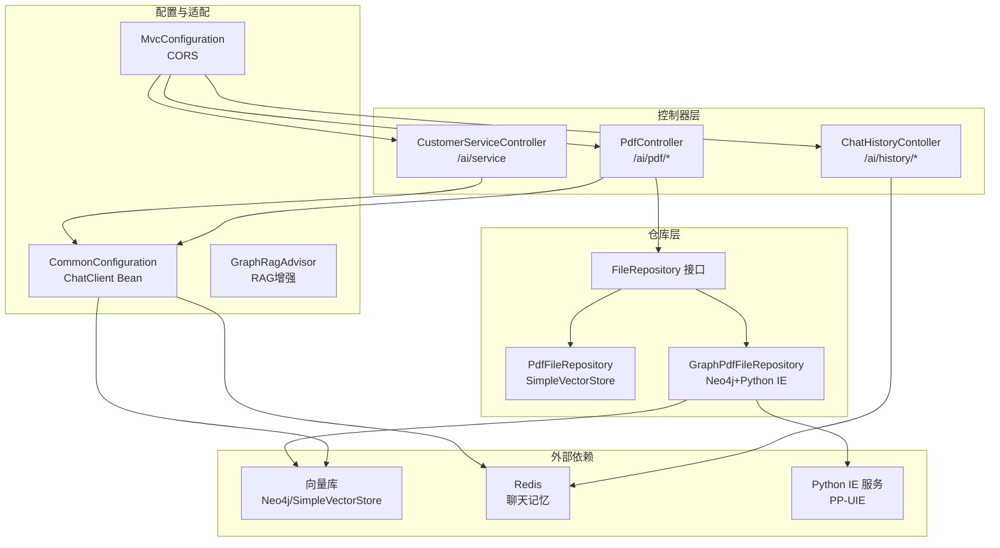
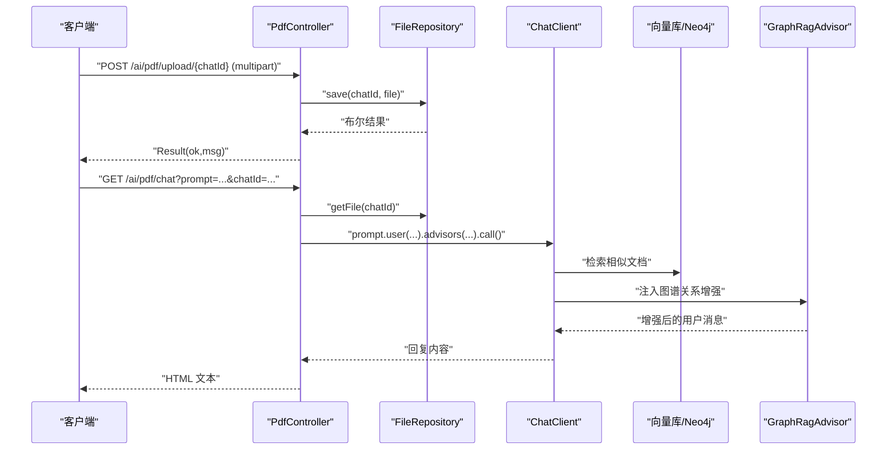
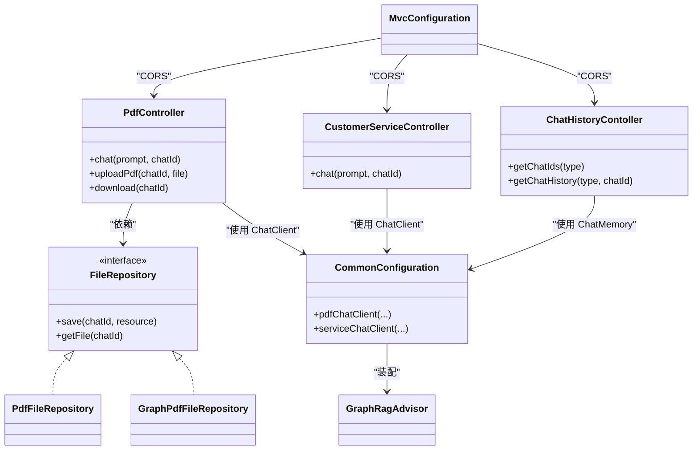

# API接口文档

<cite>
**本文引用的文件**
- [PdfController.java](file://src/main/java/com/xdu/aibot/controller/PdfController.java)
- [CustomerServiceController.java](file://src/main/java/com/xdu/aibot/controller/CustomerServiceController.java)
- [ChatHistoryContoller.java](file://src/main/java/com/xdu/aibot/controller/ChatHistoryContoller.java)
- [Result.java](file://src/main/java/com/xdu/aibot/pojo/vo/Result.java)
- [MessageVO.java](file://src/main/java/com/xdu/aibot/pojo/vo/MessageVO.java)
- [FileRepository.java](file://src/main/java/com/xdu/aibot/repository/FileRepository.java)
- [PdfFileRepository.java](file://src/main/java/com/xdu/aibot/repository/Impl/PdfFileRepository.java)
- [GraphPdfFileRepository.java](file://src/main/java/com/xdu/aibot/repository/Impl/GraphPdfFileRepository.java)
- [CommonConfiguration.java](file://src/main/java/com/xdu/aibot/config/CommonConfiguration.java)
- [MvcConfiguration.java](file://src/main/java/com/xdu/aibot/config/MvcConfiguration.java)
- [ChatType.java](file://src/main/java/com/xdu/aibot/constant/ChatType.java)
- [SystemConstants.java](file://src/main/java/com/xdu/aibot/constant/SystemConstants.java)
- [GraphRagAdvisor.java](file://src/main/java/com/xdu/aibot/advisor/GraphRagAdvisor.java)
- [application.yaml](file://src/main/resources/application.yaml)
- [pom.xml](file://pom.xml)
</cite>

## 目录
1. [简介](#简介)
2. [项目结构](#项目结构)
3. [核心组件](#核心组件)
4. [架构总览](#架构总览)
5. [详细组件分析](#详细组件分析)
6. [依赖分析](#依赖分析)
7. [性能考虑](#性能考虑)
8. [故障排查指南](#故障排查指南)
9. [结论](#结论)
10. [附录](#附录)

## 简介
本文件为 AIbot 系统的完整 API 接口文档，覆盖以下能力：
- PDF 文档上传与检索问答接口
- 文件下载接口
- 客服对话接口（基于工具与记忆的智能问答）
- 历史会话查询接口

文档包含各接口的 HTTP 方法、URL 模式、请求/响应格式、认证方式、错误码与状态码、请求示例、客户端实现要点、性能优化建议、版本与安全注意事项，以及测试与调试方法。

## 项目结构
系统采用 Spring Boot + Spring AI 的分层架构，控制器负责对外暴露 REST API，配置类负责构建聊天客户端与向量存储，仓库层负责文件与向量存取，适配器负责 RAG 增强与图谱扩展。

图表来源
- [PdfController.java:29-96](file://src/main/java/com/xdu/aibot/controller/PdfController.java#L29-L96)
- [CustomerServiceController.java:15-34](file://src/main/java/com/xdu/aibot/controller/CustomerServiceController.java#L15-L34)
- [ChatHistoryContoller.java:15-38](file://src/main/java/com/xdu/aibot/controller/ChatHistoryContoller.java#L15-L38)
- [CommonConfiguration.java:47-127](file://src/main/java/com/xdu/aibot/config/CommonConfiguration.java#L47-L127)
- [GraphRagAdvisor.java:19-136](file://src/main/java/com/xdu/aibot/advisor/GraphRagAdvisor.java#L19-L136)
- [MvcConfiguration.java:9-18](file://src/main/java/com/xdu/aibot/config/MvcConfiguration.java#L9-L18)
- [FileRepository.java:6-21](file://src/main/java/com/xdu/aibot/repository/FileRepository.java#L6-L21)
- [PdfFileRepository.java:31-108](file://src/main/java/com/xdu/aibot/repository/Impl/PdfFileRepository.java#L31-L108)
- [GraphPdfFileRepository.java:27-261](file://src/main/java/com/xdu/aibot/repository/Impl/GraphPdfFileRepository.java#L27-L261)

章节来源
- [application.yaml:1-59](file://src/main/resources/application.yaml#L1-L59)
- [pom.xml:33-116](file://pom.xml#L33-L116)

## 核心组件
- 控制器
  - PdfController：提供 PDF 上传、问答、文件下载
  - CustomerServiceController：提供客服对话接口
  - ChatHistoryContoller：提供历史会话 ID 与消息查询
- 配置与适配
  - CommonConfiguration：构建 ChatClient、向量存储、RAG 增强链路
  - GraphRagAdvisor：基于知识图谱的关系增强
  - MvcConfiguration：跨域与响应头暴露
- 仓库与存储
  - FileRepository 及其实现：文件持久化与向量写入
  - GraphPdfFileRepository：结合 Neo4j 与 Python IE 服务构建知识图谱
- 响应模型
  - Result：统一返回体（ok/msg）
  - MessageVO：消息 VO（role/content）

章节来源
- [PdfController.java:29-96](file://src/main/java/com/xdu/aibot/controller/PdfController.java#L29-L96)
- [CustomerServiceController.java:15-34](file://src/main/java/com/xdu/aibot/controller/CustomerServiceController.java#L15-L34)
- [ChatHistoryContoller.java:15-38](file://src/main/java/com/xdu/aibot/controller/ChatHistoryContoller.java#L15-L38)
- [CommonConfiguration.java:47-127](file://src/main/java/com/xdu/aibot/config/CommonConfiguration.java#L47-L127)
- [GraphRagAdvisor.java:19-136](file://src/main/java/com/xdu/aibot/advisor/GraphRagAdvisor.java#L19-L136)
- [MvcConfiguration.java:9-18](file://src/main/java/com/xdu/aibot/config/MvcConfiguration.java#L9-L18)
- [FileRepository.java:6-21](file://src/main/java/com/xdu/aibot/repository/FileRepository.java#L6-L21)
- [GraphPdfFileRepository.java:27-261](file://src/main/java/com/xdu/aibot/repository/Impl/GraphPdfFileRepository.java#L27-L261)
- [Result.java:8-24](file://src/main/java/com/xdu/aibot/pojo/vo/Result.java#L8-L24)
- [MessageVO.java:9-28](file://src/main/java/com/xdu/aibot/pojo/vo/MessageVO.java#L9-L28)

## 架构总览
AIbot 的 API 通过控制器接收请求，利用 ChatClient 发起大模型对话，结合向量检索与知识图谱增强，最终返回自然语言回复。文件相关能力通过仓库层将 PDF 内容写入向量库或 Neo4j，并在问答时按会话 ID 过滤文档。

图表来源
- [PdfController.java:42-55](file://src/main/java/com/xdu/aibot/controller/PdfController.java#L42-L55)
- [PdfController.java:60-77](file://src/main/java/com/xdu/aibot/controller/PdfController.java#L60-L77)
- [CommonConfiguration.java:90-127](file://src/main/java/com/xdu/aibot/config/CommonConfiguration.java#L90-L127)
- [GraphRagAdvisor.java:39-136](file://src/main/java/com/xdu/aibot/advisor/GraphRagAdvisor.java#L39-L136)

## 详细组件分析

### PDF 文档上传接口
- 功能：将 PDF 文件保存至本地并写入向量库，建立 chatId 与文件的映射
- HTTP 方法与 URL
  - POST /ai/pdf/upload/{chatId}
- 请求参数
  - 路径参数
    - chatId: 会话标识（字符串）
  - 表单参数
    - file: PDF 文件（multipart/form-data）
- 响应格式
  - Result：包含 ok 与 msg 字段
- 错误与状态码
  - 仅当内部异常时返回失败 Result
  - 未捕获异常将导致服务器错误
- 示例
  - curl
    - curl -X POST "{host}/ai/pdf/upload/{chatId}" -F "file=@/path/to/book.pdf"
- 安全与限制
  - 仅接受 application/pdf 类型
  - 服务端限制了最大文件大小与请求大小

章节来源
- [PdfController.java:60-77](file://src/main/java/com/xdu/aibot/controller/PdfController.java#L60-L77)
- [application.yaml:47-49](file://src/main/resources/application.yaml#L47-L49)

### PDF 智能问答接口
- 功能：基于已上传 PDF 的内容进行问答，支持向量检索与知识图谱增强
- HTTP 方法与 URL
  - GET /ai/pdf/chat
- 请求参数
  - query 参数
    - prompt: 用户问题（字符串）
    - chatId: 会话标识（字符串）
- 响应格式
  - HTML 文本（text/html;charset=utf-8）
- 错误与状态码
  - 若未上传文件，抛出运行时异常（由控制器捕获并转换为错误响应）
  - 未捕获异常将导致服务器错误
- 示例
  - curl
    - curl "{host}/ai/pdf/chat?prompt=...&chatId=..."

章节来源
- [PdfController.java:42-55](file://src/main/java/com/xdu/aibot/controller/PdfController.java#L42-L55)
- [CommonConfiguration.java:90-127](file://src/main/java/com/xdu/aibot/config/CommonConfiguration.java#L90-L127)
- [GraphRagAdvisor.java:39-136](file://src/main/java/com/xdu/aibot/advisor/GraphRagAdvisor.java#L39-L136)

### PDF 文件下载接口
- 功能：根据 chatId 返回已上传的 PDF 文件
- HTTP 方法与 URL
  - GET /ai/pdf/file/{chatId}
- 响应格式
  - application/octet-stream（二进制流）
  - Content-Disposition: attachment; filename="..."
- 错误与状态码
  - 未找到文件：404 Not Found
  - 成功：200 OK
- 示例
  - curl
    - curl -OJ "{host}/ai/pdf/file/{chatId}"

章节来源
- [PdfController.java:82-96](file://src/main/java/com/xdu/aibot/controller/PdfController.java#L82-L96)

### 客服对话接口
- 功能：面向图书馆借阅场景的智能问答，内置系统提示与工具调用
- HTTP 方法与 URL
  - GET /ai/service
- 请求参数
  - query 参数
    - prompt: 用户问题（字符串）
    - chatId: 会话标识（字符串）
- 响应格式
  - HTML 文本（text/html;charset=utf-8）
- 系统提示与工具
  - 默认系统提示：面向图书馆借阅助手的角色与规则
  - 可调用工具：图书查询与预约相关工具
- 示例
  - curl
    - curl "{host}/ai/service?prompt=...&chatId=..."

章节来源
- [CustomerServiceController.java:25-33](file://src/main/java/com/xdu/aibot/controller/CustomerServiceController.java#L25-L33)
- [SystemConstants.java:4-30](file://src/main/java/com/xdu/aibot/constant/SystemConstants.java#L4-L30)
- [CommonConfiguration.java:74-88](file://src/main/java/com/xdu/aibot/config/CommonConfiguration.java#L74-L88)

### 历史会话查询接口
- 功能：查询指定类型的会话 ID 列表，以及某个会话的历史消息
- HTTP 方法与 URL
  - GET /ai/history/{type}
  - GET /ai/history/{type}/{chatId}
- 请求参数
  - 路径参数
    - type: 会话类型（"pdf" 或 "service"）
    - chatId: 会话标识（字符串）
- 响应格式
  - GET /ai/history/{type}: 字符串数组（chatId 列表）
  - GET /ai/history/{type}/{chatId}: MessageVO 数组（role/content）
- 示例
  - curl
    - curl "{host}/ai/history/pdf"
    - curl "{host}/ai/history/pdf/{chatId}"

章节来源
- [ChatHistoryContoller.java:25-37](file://src/main/java/com/xdu/aibot/controller/ChatHistoryContoller.java#L25-L37)
- [MessageVO.java:9-28](file://src/main/java/com/xdu/aibot/pojo/vo/MessageVO.java#L9-L28)
- [ChatType.java:3-16](file://src/main/java/com/xdu/aibot/constant/ChatType.java#L3-L16)

## 依赖分析
- 控制器依赖
  - PdfController 依赖 ChatClient、FileRepository、ChatHistoryRepository
  - CustomerServiceController 依赖 ChatClient、ChatHistoryRepository
  - ChatHistoryContoller 依赖 ChatHistoryRepository、ChatMemory
- 配置与适配
  - CommonConfiguration 构建 ChatClient Bean，装配 QuestionAnswerAdvisor、MessageChatMemoryAdvisor、GraphRagAdvisor
  - GraphRagAdvisor 从上下文文档中提取 chatId，使用 HanLP 关键词抽取，查询 Neo4j 获取关系并注入增强提示
- 仓库层
  - PdfFileRepository：SimpleVectorStore + 本地文件持久化
  - GraphPdfFileRepository：Neo4jVectorStore + Python IE 服务（PP-UIE）构建知识图谱
- 外部依赖
  - 向量库：Neo4j 或 SimpleVectorStore
  - 记忆存储：Redis
  - 大模型：DashScope/OpenAI 兼容模式

图表来源
- [PdfController.java:29-96](file://src/main/java/com/xdu/aibot/controller/PdfController.java#L29-L96)
- [CustomerServiceController.java:15-34](file://src/main/java/com/xdu/aibot/controller/CustomerServiceController.java#L15-L34)
- [ChatHistoryContoller.java:15-38](file://src/main/java/com/xdu/aibot/controller/ChatHistoryContoller.java#L15-L38)
- [FileRepository.java:6-21](file://src/main/java/com/xdu/aibot/repository/FileRepository.java#L6-L21)
- [PdfFileRepository.java:31-108](file://src/main/java/com/xdu/aibot/repository/Impl/PdfFileRepository.java#L31-L108)
- [GraphPdfFileRepository.java:27-261](file://src/main/java/com/xdu/aibot/repository/Impl/GraphPdfFileRepository.java#L27-L261)
- [CommonConfiguration.java:47-127](file://src/main/java/com/xdu/aibot/config/CommonConfiguration.java#L47-L127)
- [GraphRagAdvisor.java:19-136](file://src/main/java/com/xdu/aibot/advisor/GraphRagAdvisor.java#L19-L136)
- [MvcConfiguration.java:9-18](file://src/main/java/com/xdu/aibot/config/MvcConfiguration.java#L9-L18)

## 性能考虑
- 向量检索参数
  - topK、相似度阈值等可在配置中调整，影响召回数量与质量
- 文档切分与嵌入
  - PDF 按页切分，建议控制每页文本长度，避免超长文本导致嵌入与检索效率下降
- 知识图谱构建
  - 调用 Python IE 服务存在网络延迟，建议缓存与批处理策略
- 记忆窗口
  - ChatMemory 最大消息数限制在配置中设置，避免会话过长导致上下文膨胀
- 文件大小限制
  - 服务端限制了最大文件与请求大小，避免内存与 IO 压力过大

章节来源
- [CommonConfiguration.java:102-108](file://src/main/java/com/xdu/aibot/config/CommonConfiguration.java#L102-L108)
- [application.yaml:47-49](file://src/main/resources/application.yaml#L47-L49)

## 故障排查指南
- 上传失败
  - 检查文件类型是否为 PDF
  - 查看服务端日志，确认文件复制与向量写入是否成功
- 问答异常
  - 确认是否已上传对应 chatId 的文件
  - 检查向量库初始化与索引是否存在
  - 关注 GraphRagAdvisor 是否正确注入图谱关系
- 下载 404
  - 确认 chatId 是否正确，文件是否已保存
- 跨域问题
  - 确认浏览器端是否正确携带 Cookie 与自定义头
- 日志级别
  - application.yaml 中已开启 Spring AI 与 Neo4j 相关日志，便于定位问题

章节来源
- [PdfController.java:64-66](file://src/main/java/com/xdu/aibot/controller/PdfController.java#L64-L66)
- [PdfController.java:45-47](file://src/main/java/com/xdu/aibot/controller/PdfController.java#L45-L47)
- [application.yaml:52-59](file://src/main/resources/application.yaml#L52-L59)

## 结论
AIbot 提供了从 PDF 上传、向量化、检索问答到知识图谱增强的完整链路，同时具备客服对话与历史会话管理能力。通过统一的响应模型与跨域配置，客户端可稳定集成。建议在生产环境关注文件大小限制、向量检索参数与图谱构建的性能与可靠性。

## 附录

### 统一响应模型
- Result
  - 字段：ok（整数，1 表示成功）、msg（字符串）
  - 示例：{"ok":1,"msg":"ok"}

章节来源
- [Result.java:8-24](file://src/main/java/com/xdu/aibot/pojo/vo/Result.java#L8-L24)

### API 一览表
- PDF 文档上传
  - 方法：POST
  - 路径：/ai/pdf/upload/{chatId}
  - 参数：multipart/form-data（file）
  - 响应：Result
- PDF 智能问答
  - 方法：GET
  - 路径：/ai/pdf/chat
  - 参数：prompt、chatId
  - 响应：text/html
- PDF 文件下载
  - 方法：GET
  - 路径：/ai/pdf/file/{chatId}
  - 响应：application/octet-stream（含 Content-Disposition）
- 客服对话
  - 方法：GET
  - 路径：/ai/service
  - 参数：prompt、chatId
  - 响应：text/html
- 历史会话查询
  - 方法：GET
  - 路径：/ai/history/{type}
  - 响应：字符串数组
  - 方法：GET
  - 路径：/ai/history/{type}/{chatId}
  - 响应：MessageVO 数组

章节来源
- [PdfController.java:60-96](file://src/main/java/com/xdu/aibot/controller/PdfController.java#L60-L96)
- [CustomerServiceController.java:25-33](file://src/main/java/com/xdu/aibot/controller/CustomerServiceController.java#L25-L33)
- [ChatHistoryContoller.java:25-37](file://src/main/java/com/xdu/aibot/controller/ChatHistoryContoller.java#L25-L37)
- [MessageVO.java:9-28](file://src/main/java/com/xdu/aibot/pojo/vo/MessageVO.java#L9-L28)

### 客户端实现要点
- 会话管理
  - 使用 chatId 维持同一会话的上下文与文件关联
- 文件上传
  - 使用 multipart/form-data，确保 Content-Type 为 application/pdf
- 跨域与认证
  - 服务端已开放 CORS，允许任意来源与方法
  - 当前未实现鉴权机制，建议在网关或代理层增加鉴权与限流
- 响应解析
  - 文本型响应需按 MIME 解析，二进制文件需直接写入本地文件

章节来源
- [MvcConfiguration.java:11-17](file://src/main/java/com/xdu/aibot/config/MvcConfiguration.java#L11-L17)
- [application.yaml:47-49](file://src/main/resources/application.yaml#L47-L49)

### 测试与调试
- curl 示例
  - 上传：curl -X POST "{host}/ai/pdf/upload/{chatId}" -F "file=@/path/to/book.pdf"
  - 问答：curl "{host}/ai/pdf/chat?prompt=...&chatId=..."
  - 下载：curl -OJ "{host}/ai/pdf/file/{chatId}"
  - 客服：curl "{host}/ai/service?prompt=...&chatId=..."
  - 历史：curl "{host}/ai/history/pdf" 与 curl "{host}/ai/history/pdf/{chatId}"
- 调试建议
  - 开启服务端 debug 日志
  - 关注向量库与 Neo4j 的连接与索引状态
  - 检查 Python IE 服务可用性与网络延迟

章节来源
- [application.yaml:52-59](file://src/main/resources/application.yaml#L52-L59)

### 安全与版本
- 安全
  - 未实现鉴权与加密传输，建议在网关层启用 HTTPS、Token 鉴权与访问控制
- 版本管理
  - 项目版本：0.0.1-SNAPSHOT
  - 大模型兼容：DashScope/OpenAI 兼容模式
- 速率限制
  - 未实现服务端限流，建议在网关或应用层增加 QPS 限制与熔断策略

章节来源
- [pom.xml:13-32](file://pom.xml#L13-L32)
- [application.yaml:17-30](file://src/main/resources/application.yaml#L17-L30)