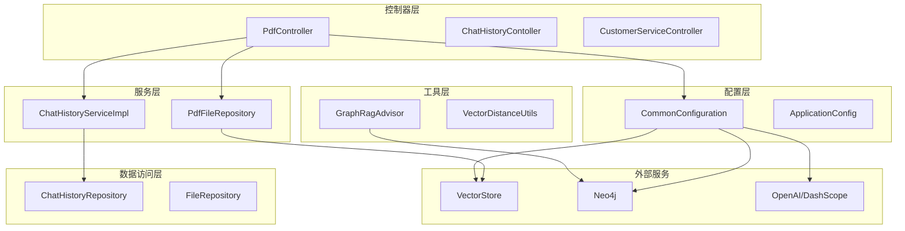
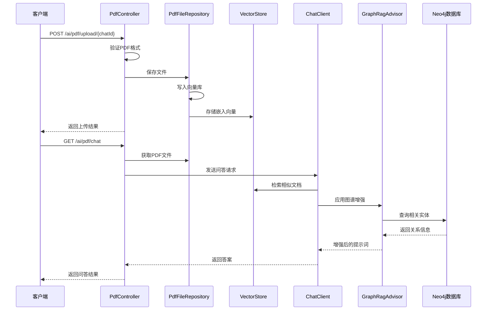
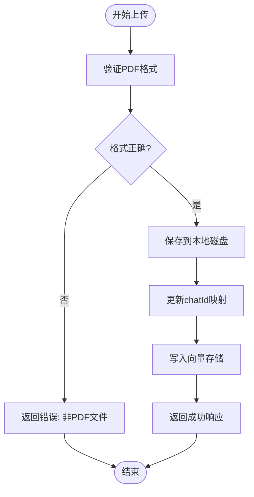
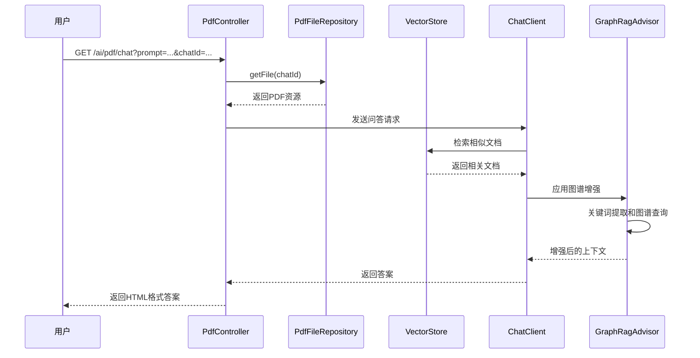
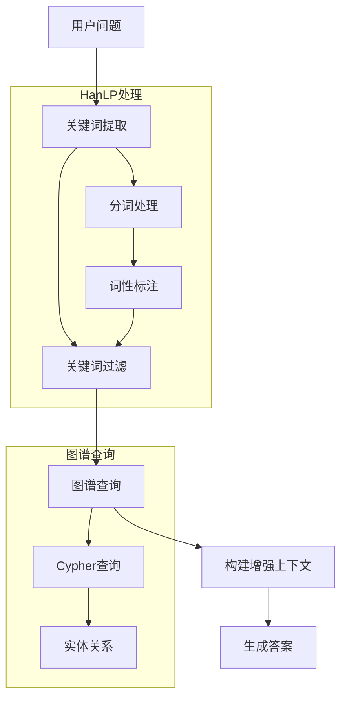
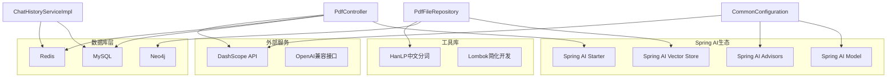

# PDF文档处理接口

<cite>
**本文档引用的文件**
- [PdfController.java](file://src/main/java/com/xdu/aibot/controller/PdfController.java)
- [FileRepository.java](file://src/main/java/com/xdu/aibot/repository/FileRepository.java)
- [PdfFileRepository.java](file://src/main/java/com/xdu/aibot/repository/Impl/PdfFileRepository.java)
- [ChatHistoryServiceImpl.java](file://src/main/java/com/xdu/aibot/service/impl/ChatHistoryServiceImpl.java)
- [ChatHistoryRepository.java](file://src/main/java/com/xdu/aibot/repository/ChatHistoryRepository.java)
- [ChatType.java](file://src/main/java/com/xdu/aibot/constant/ChatType.java)
- [Result.java](file://src/main/java/com/xdu/aibot/pojo/vo/Result.java)
- [CommonConfiguration.java](file://src/main/java/com/xdu/aibot/config/CommonConfiguration.java)
- [GraphRagAdvisor.java](file://src/main/java/com/xdu/aibot/advisor/GraphRagAdvisor.java)
- [application.yaml](file://src/main/resources/application.yaml)
- [chat-pdf.properties](file://chat-pdf.properties)
- [pom.xml](file://pom.xml)
</cite>

## 目录
1. [简介](#简介)
2. [项目结构](#项目结构)
3. [核心组件](#核心组件)
4. [架构概览](#架构概览)
5. [详细组件分析](#详细组件分析)
6. [依赖关系分析](#依赖关系分析)
7. [性能考虑](#性能考虑)
8. [故障排除指南](#故障排除指南)
9. [结论](#结论)

## 简介

本项目是一个基于Spring Boot的PDF文档处理接口系统，提供了完整的PDF文件上传、下载和智能问答功能。系统采用Spring AI框架构建，集成了向量存储、知识图谱增强和对话记忆管理等高级功能。

该系统的核心特性包括：
- PDF文件上传和存储管理
- 基于向量检索的智能问答
- 知识图谱增强的RAG（检索增强生成）
- 对话历史管理和记忆保持
- 多层安全验证和错误处理

## 项目结构

项目采用标准的Spring Boot分层架构，主要包含以下模块：



**图表来源**
- [PdfController.java:26-30](file://src/main/java/com/xdu/aibot/controller/PdfController.java#L26-L30)
- [CommonConfiguration.java:34-128](file://src/main/java/com/xdu/aibot/config/CommonConfiguration.java#L34-L128)

**章节来源**
- [PdfController.java:1-98](file://src/main/java/com/xdu/aibot/controller/PdfController.java#L1-L98)
- [pom.xml:1-139](file://pom.xml#L1-L139)

## 核心组件

### 控制器层

系统包含三个主要控制器：
- **PdfController**: 处理PDF相关的所有HTTP请求
- **ChatHistoryContoller**: 管理对话历史记录
- **CustomerServiceController**: 提供客户服务功能

### 仓储层

- **FileRepository**: 定义文件操作的抽象接口
- **PdfFileRepository**: 实现PDF文件的存储和检索
- **ChatHistoryRepository**: 管理对话历史数据

### 配置层

- **CommonConfiguration**: 定义Spring AI相关的Bean配置
- **GraphRagAdvisor**: 实现知识图谱增强的RAG功能

**章节来源**
- [FileRepository.java:1-22](file://src/main/java/com/xdu/aibot/repository/FileRepository.java#L1-L22)
- [ChatHistoryRepository.java:1-14](file://src/main/java/com/xdu/aibot/repository/ChatHistoryRepository.java#L1-L14)

## 架构概览

系统采用多层架构设计，结合了现代AI技术栈：



**图表来源**
- [PdfController.java:42-55](file://src/main/java/com/xdu/aibot/controller/PdfController.java#L42-L55)
- [PdfFileRepository.java:94-108](file://src/main/java/com/xdu/aibot/repository/Impl/PdfFileRepository.java#L94-L108)
- [CommonConfiguration.java:90-127](file://src/main/java/com/xdu/aibot/config/CommonConfiguration.java#L90-L127)

## 详细组件分析

### PDF上传接口

#### 接口定义

**URL**: `/ai/pdf/upload/{chatId}`
**方法**: `POST`
**内容类型**: `multipart/form-data`

#### 请求参数

| 参数名 | 类型 | 必填 | 描述 |
|--------|------|------|------|
| chatId | 路径参数 | 是 | 会话标识符，用于关联文件和对话历史 |
| file | 文件 | 是 | PDF格式的文件对象 |

#### 参数验证规则

1. **文件格式验证**
   - 严格检查`Content-Type`为`application/pdf`
   - 不接受任何其他格式的文件

2. **文件大小限制**
   - 单个文件最大30MB
   - 请求总大小最大40MB

3. **会话ID验证**
   - 必须提供有效的chatId参数
   - 用于建立文件与对话的关联关系

#### 存储机制



**图表来源**
- [PdfController.java:61-77](file://src/main/java/com/xdu/aibot/controller/PdfController.java#L61-L77)
- [PdfFileRepository.java:41-58](file://src/main/java/com/xdu/aibot/repository/Impl/PdfFileRepository.java#L41-L58)

#### 响应格式

**成功响应**:
```json
{
    "ok": 1,
    "msg": "ok"
}
```

**失败响应**:
```json
{
    "ok": 0,
    "msg": "错误消息"
}
```

**章节来源**
- [PdfController.java:57-77](file://src/main/java/com/xdu/aibot/controller/PdfController.java#L57-L77)
- [Result.java:17-23](file://src/main/java/com/xdu/aibot/pojo/vo/Result.java#L17-L23)

### PDF下载接口

#### 接口定义

**URL**: `/ai/pdf/file/{chatId}`
**方法**: `GET`
**内容类型**: `application/octet-stream`

#### 请求参数

| 参数名 | 类型 | 必填 | 描述 |
|--------|------|------|------|
| chatId | 路径参数 | 是 | 会话标识符，用于定位要下载的文件 |

#### 响应头设置

系统自动设置以下响应头：
- `Content-Type`: `application/octet-stream`
- `Content-Disposition`: `attachment; filename="文件名"`
- 自动进行UTF-8编码处理

#### 错误处理

- **文件不存在**: 返回HTTP 404状态码
- **权限不足**: 返回HTTP 403状态码
- **服务器错误**: 返回HTTP 500状态码

#### 文件编码策略

系统采用统一的UTF-8编码策略：
- 文件名进行URL编码
- 支持中文文件名的正确传输
- 兼容各种浏览器的文件下载行为

**章节来源**
- [PdfController.java:79-96](file://src/main/java/com/xdu/aibot/controller/PdfController.java#L79-L96)

### 智能问答接口

#### 接口定义

**URL**: `/ai/pdf/chat`
**方法**: `GET`
**内容类型**: `text/html;charset=utf-8`

#### 请求参数

| 参数名 | 类型 | 必填 | 描述 |
|--------|------|------|------|
| prompt | 查询参数 | 是 | 用户的问题或查询内容 |
| chatId | 查询参数 | 是 | 会话标识符，关联特定的PDF文件 |

#### 智能问答流程



**图表来源**
- [PdfController.java:42-55](file://src/main/java/com/xdu/aibot/controller/PdfController.java#L42-L55)
- [CommonConfiguration.java:90-127](file://src/main/java/com/xdu/aibot/config/CommonConfiguration.java#L90-L127)

#### 向量过滤机制

系统实现了多层过滤机制：

1. **相似度阈值过滤**
   - 最小相似度阈值: 0.2
   - 过滤掉低质量的相关文档

2. **数量限制**
   - 最大返回3个最相关的文档
   - 避免信息过载

3. **文件级过滤**
   - 使用`file_name == '特定文件名'`表达式
   - 确保问答仅基于指定PDF文件内容

#### 对话记忆管理

系统集成了Redis内存管理：
- 维护最近20条对话历史
- 支持跨请求的上下文保持
- 自动清理过期对话

#### 知识图谱增强



**图表来源**
- [GraphRagAdvisor.java:69-136](file://src/main/java/com/xdu/aibot/advisor/GraphRagAdvisor.java#L69-L136)

**章节来源**
- [PdfController.java:42-55](file://src/main/java/com/xdu/aibot/controller/PdfController.java#L42-L55)
- [GraphRagAdvisor.java:18-149](file://src/main/java/com/xdu/aibot/advisor/GraphRagAdvisor.java#L18-L149)

## 依赖关系分析

系统依赖关系复杂但层次清晰：



**图表来源**
- [pom.xml:33-115](file://pom.xml#L33-L115)
- [CommonConfiguration.java:34-128](file://src/main/java/com/xdu/aibot/config/CommonConfiguration.java#L34-L128)

**章节来源**
- [pom.xml:1-139](file://pom.xml#L1-L139)
- [application.yaml:1-59](file://src/main/resources/application.yaml#L1-L59)

## 性能考虑

### 存储优化

1. **向量存储策略**
   - 使用Neo4j作为向量存储后端
   - 支持Cosine距离计算
   - 嵌入维度1536，平衡精度和性能

2. **文件缓存机制**
   - 会话ID到文件名的映射缓存
   - 应用启动时自动加载向量数据
   - 关闭时持久化所有状态

### 检索性能

1. **索引优化**
   - 自动初始化Neo4j索引
   - 支持快速向量相似度搜索
   - 限制返回文档数量避免性能下降

2. **内存管理**
   - Redis内存聊天存储
   - 最大保留20条对话历史
   - 自动清理过期数据

### 并发处理

1. **线程安全**
   - 所有仓库操作线程安全
   - 向量存储支持并发访问
   - 文件操作使用原子性保证

2. **资源管理**
   - 自动关闭数据库连接
   - 合理的连接池配置
   - 及时释放内存资源

## 故障排除指南

### 常见错误及解决方案

| 错误类型 | 错误代码 | 可能原因 | 解决方案 |
|----------|----------|----------|----------|
| 文件格式错误 | 400 Bad Request | 非PDF文件上传 | 确保上传PDF格式文件 |
| 文件过大 | 413 Payload Too Large | 超过文件大小限制 | 减少文件大小或分割文件 |
| 文件不存在 | 404 Not Found | chatId无效或文件未上传 | 检查chatId并确认文件已上传 |
| 服务器错误 | 500 Internal Server Error | 数据库连接失败 | 检查数据库配置和服务状态 |

### 日志监控

系统启用了详细的日志记录：
- Spring AI框架调试日志
- Neo4j数据库操作日志  
- MySQL数据库访问日志
- Redis缓存操作日志

### 性能监控指标

1. **向量检索性能**
   - 检索响应时间
   - 相似度计算耗时
   - 文档返回数量

2. **系统资源使用**
   - 内存使用情况
   - CPU占用率
   - 磁盘I/O操作

**章节来源**
- [application.yaml:52-59](file://src/main/resources/application.yaml#L52-L59)
- [PdfController.java:73-76](file://src/main/java/com/xdu/aibot/controller/PdfController.java#L73-L76)

## 结论

本PDF文档处理接口系统提供了完整的企业级解决方案，具有以下优势：

1. **功能完整性**: 覆盖了PDF文件处理的所有核心需求
2. **技术先进性**: 集成了最新的AI技术和向量存储
3. **架构合理性**: 清晰的分层设计和良好的扩展性
4. **性能优化**: 针对大规模应用的性能考量
5. **安全性保障**: 多层验证和错误处理机制

系统特别适合需要处理大量PDF文档的企业应用场景，能够有效提升文档检索和问答的智能化水平。通过合理的配置和部署，可以满足大多数企业级PDF处理需求。