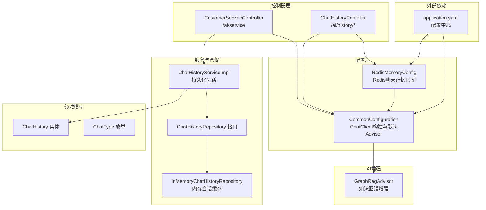
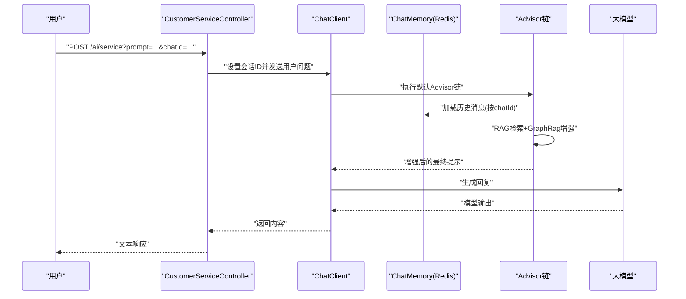
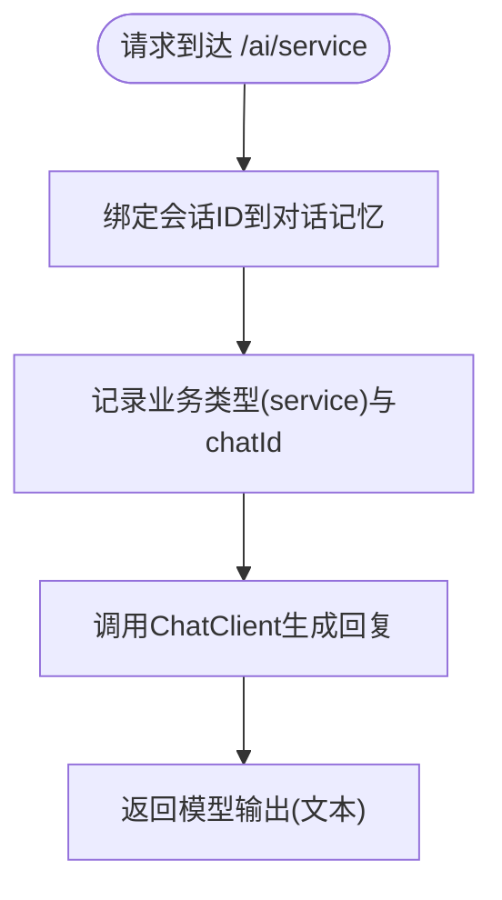
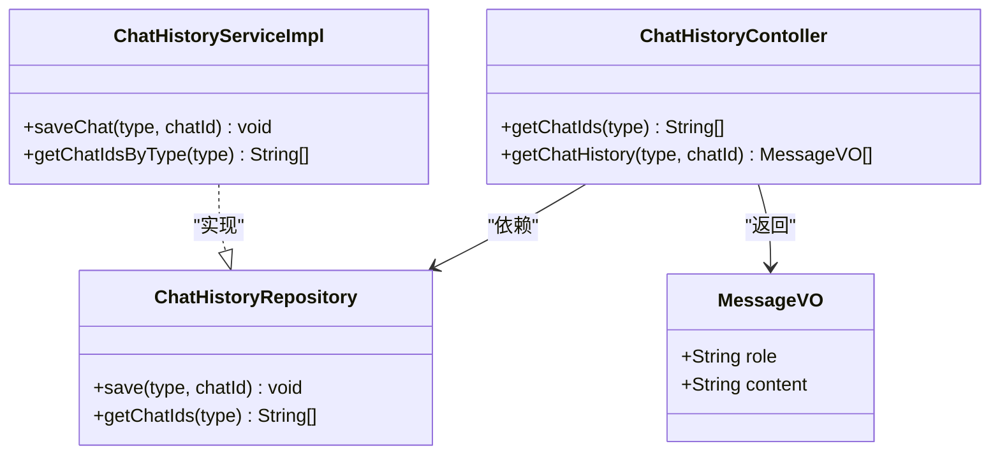
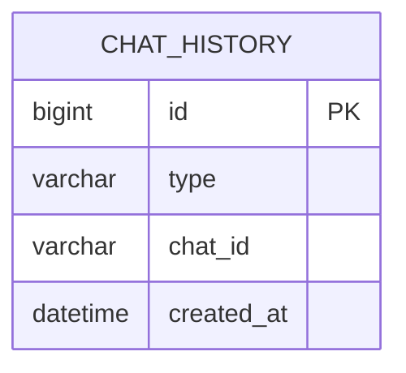
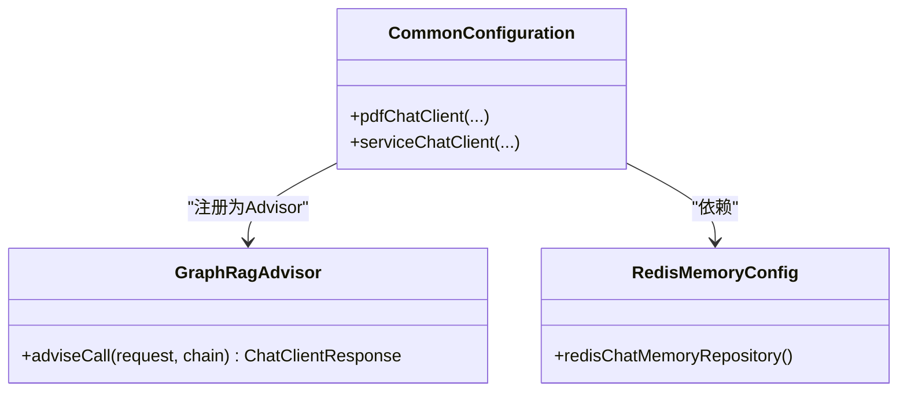
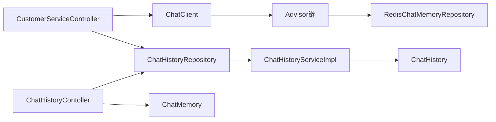

# 客服对话接口

<cite>
**本文引用的文件**
- [CustomerServiceController.java](file://src/main/java/com/xdu/aibot/controller/CustomerServiceController.java)
- [ChatHistoryContoller.java](file://src/main/java/com/xdu/aibot/controller/ChatHistoryContoller.java)
- [CommonConfiguration.java](file://src/main/java/com/xdu/aibot/config/CommonConfiguration.java)
- [RedisMemoryConfig.java](file://src/main/java/com/xdu/aibot/config/RedisMemoryConfig.java)
- [ChatHistoryRepository.java](file://src/main/java/com/xdu/aibot/repository/ChatHistoryRepository.java)
- [ChatHistoryServiceImpl.java](file://src/main/java/com/xdu/aibot/service/impl/ChatHistoryServiceImpl.java)
- [InMemoryChatHistoryRepository.java](file://src/main/java/com/xdu/aibot/repository/Impl/InMemoryChatHistoryRepository.java)
- [ChatHistory.java](file://src/main/java/com/xdu/aibot/pojo/entity/ChatHistory.java)
- [ChatType.java](file://src/main/java/com/xdu/aibot/constant/ChatType.java)
- [GraphRagAdvisor.java](file://src/main/java/com/xdu/aibot/advisor/GraphRagAdvisor.java)
- [application.yaml](file://src/main/resources/application.yaml)
- [MessageVO.java](file://src/main/java/com/xdu/aibot/pojo/vo/MessageVO.java)
- [Result.java](file://src/main/java/com/xdu/aibot/pojo/vo/Result.java)
</cite>

## 目录
1. [简介](#简介)
2. [项目结构](#项目结构)
3. [核心组件](#核心组件)
4. [架构总览](#架构总览)
5. [详细组件分析](#详细组件分析)
6. [依赖分析](#依赖分析)
7. [性能考虑](#性能考虑)
8. [故障排查指南](#故障排查指南)
9. [结论](#结论)
10. [附录](#附录)

## 简介
本文件为“图书预约对话系统”的客服对话接口完整API文档，聚焦于智能客服问答接口的设计与实现。内容覆盖：
- RESTful API规范：HTTP方法、URL模式、请求参数、响应格式
- 对话上下文管理：会话ID绑定、消息窗口记忆、Redis持久化
- 预设问题模板与智能响应生成：基于RAG与知识图谱增强的问答流程
- 实际请求/响应示例：常见问题类型与标准回复格式
- 对话状态管理、会话超时处理与错误恢复策略
- 客服场景下的特殊需求与用户体验优化建议

## 项目结构
系统采用Spring Boot分层架构，控制器负责对外暴露REST接口；配置类定义AI模型与对话记忆；服务层负责会话历史存取；适配器用于增强提示词与检索上下文。

图表来源
- [CustomerServiceController.java:1-35](file://src/main/java/com/xdu/aibot/controller/CustomerServiceController.java#L1-L35)
- [ChatHistoryContoller.java:1-38](file://src/main/java/com/xdu/aibot/controller/ChatHistoryContoller.java#L1-L38)
- [CommonConfiguration.java:77-128](file://src/main/java/com/xdu/aibot/config/CommonConfiguration.java#L77-L128)
- [RedisMemoryConfig.java:1-26](file://src/main/java/com/xdu/aibot/config/RedisMemoryConfig.java#L1-L26)
- [ChatHistoryServiceImpl.java:1-63](file://src/main/java/com/xdu/aibot/service/impl/ChatHistoryServiceImpl.java#L1-L63)
- [ChatHistoryRepository.java:1-14](file://src/main/java/com/xdu/aibot/repository/ChatHistoryRepository.java#L1-L14)
- [InMemoryChatHistoryRepository.java:1-31](file://src/main/java/com/xdu/aibot/repository/Impl/InMemoryChatHistoryRepository.java#L1-L31)
- [ChatHistory.java:1-23](file://src/main/java/com/xdu/aibot/pojo/entity/ChatHistory.java#L1-L23)
- [ChatType.java:1-17](file://src/main/java/com/xdu/aibot/constant/ChatType.java#L1-L17)
- [GraphRagAdvisor.java:1-149](file://src/main/java/com/xdu/aibot/advisor/GraphRagAdvisor.java#L1-L149)
- [application.yaml:1-59](file://src/main/resources/application.yaml#L1-L59)

章节来源
- [CustomerServiceController.java:1-35](file://src/main/java/com/xdu/aibot/controller/CustomerServiceController.java#L1-L35)
- [ChatHistoryContoller.java:1-38](file://src/main/java/com/xdu/aibot/controller/ChatHistoryContoller.java#L1-L38)
- [CommonConfiguration.java:77-128](file://src/main/java/com/xdu/aibot/config/CommonConfiguration.java#L77-L128)
- [RedisMemoryConfig.java:1-26](file://src/main/java/com/xdu/aibot/config/RedisMemoryConfig.java#L1-L26)
- [application.yaml:1-59](file://src/main/resources/application.yaml#L1-L59)

## 核心组件
- 客服对话控制器：提供智能客服问答接口，绑定会话ID以启用上下文记忆。
- 会话历史控制器：提供会话ID列表查询与指定会话的消息历史读取。
- 会话历史服务与仓储：支持去重保存、按类型查询会话ID、以及内存/持久化两种存储方式。
- AI配置与记忆：通过ChatClient默认Advisor链注入日志、消息窗口记忆与RAG增强；Redis持久化对话上下文。
- 图谱增强适配器：基于关键词抽取与Neo4j图谱进行关系扩展，动态注入上下文。

章节来源
- [CustomerServiceController.java:1-35](file://src/main/java/com/xdu/aibot/controller/CustomerServiceController.java#L1-L35)
- [ChatHistoryContoller.java:1-38](file://src/main/java/com/xdu/aibot/controller/ChatHistoryContoller.java#L1-L38)
- [ChatHistoryServiceImpl.java:1-63](file://src/main/java/com/xdu/aibot/service/impl/ChatHistoryServiceImpl.java#L1-L63)
- [ChatHistoryRepository.java:1-14](file://src/main/java/com/xdu/aibot/repository/ChatHistoryRepository.java#L1-L14)
- [InMemoryChatHistoryRepository.java:1-31](file://src/main/java/com/xdu/aibot/repository/Impl/InMemoryChatHistoryRepository.java#L1-L31)
- [CommonConfiguration.java:77-128](file://src/main/java/com/xdu/aibot/config/CommonConfiguration.java#L77-L128)
- [RedisMemoryConfig.java:1-26](file://src/main/java/com/xdu/aibot/config/RedisMemoryConfig.java#L1-L26)
- [GraphRagAdvisor.java:1-149](file://src/main/java/com/xdu/aibot/advisor/GraphRagAdvisor.java#L1-L149)

## 架构总览
客服对话接口围绕“请求-增强-调用-响应”闭环展开：
- 请求进入控制器后，绑定会话ID并交由ChatClient处理
- ChatClient默认Advisor链依次执行：日志记录、消息窗口记忆、向量检索、图谱增强
- 最终调用大模型生成智能回复，返回给客户端

图表来源
- [CustomerServiceController.java:25-33](file://src/main/java/com/xdu/aibot/controller/CustomerServiceController.java#L25-L33)
- [CommonConfiguration.java:77-128](file://src/main/java/com/xdu/aibot/config/CommonConfiguration.java#L77-L128)
- [RedisMemoryConfig.java:18-25](file://src/main/java/com/xdu/aibot/config/RedisMemoryConfig.java#L18-L25)
- [GraphRagAdvisor.java:38-136](file://src/main/java/com/xdu/aibot/advisor/GraphRagAdvisor.java#L38-L136)

## 详细组件分析

### 客服对话接口（/ai/service）
- 功能：接收用户问题与会话ID，返回智能客服回复
- HTTP方法：GET
- URL模式：/ai/service
- 查询参数：
  - prompt：用户问题文本
  - chatId：会话标识，用于绑定上下文记忆
- 响应格式：纯文本字符串（模型生成的回复内容）

图表来源
- [CustomerServiceController.java:25-33](file://src/main/java/com/xdu/aibot/controller/CustomerServiceController.java#L25-L33)
- [ChatType.java:3-6](file://src/main/java/com/xdu/aibot/constant/ChatType.java#L3-L6)

章节来源
- [CustomerServiceController.java:25-33](file://src/main/java/com/xdu/aibot/controller/CustomerServiceController.java#L25-L33)
- [ChatType.java:3-6](file://src/main/java/com/xdu/aibot/constant/ChatType.java#L3-L6)

### 会话历史接口（/ai/history/*）
- 功能：查询指定类型的会话ID列表；查询指定会话的历史消息
- HTTP方法：GET
- URL模式：
  - /ai/history/{type}：获取该类型的所有会话ID
  - /ai/history/{type}/{chatId}：获取该会话的历史消息列表
- 路径参数：
  - type：业务类型（如service/pdf）
  - chatId：会话标识
- 响应格式：
  - 会话ID列表：字符串数组
  - 历史消息：MessageVO对象数组，包含role与content字段

图表来源
- [ChatHistoryContoller.java:25-37](file://src/main/java/com/xdu/aibot/controller/ChatHistoryContoller.java#L25-L37)
- [ChatHistoryRepository.java:7-13](file://src/main/java/com/xdu/aibot/repository/ChatHistoryRepository.java#L7-L13)
- [ChatHistoryServiceImpl.java:23-62](file://src/main/java/com/xdu/aibot/service/impl/ChatHistoryServiceImpl.java#L23-L62)
- [MessageVO.java:9-28](file://src/main/java/com/xdu/aibot/pojo/vo/MessageVO.java#L9-L28)

章节来源
- [ChatHistoryContoller.java:25-37](file://src/main/java/com/xdu/aibot/controller/ChatHistoryContoller.java#L25-L37)
- [ChatHistoryRepository.java:7-13](file://src/main/java/com/xdu/aibot/repository/ChatHistoryRepository.java#L7-L13)
- [ChatHistoryServiceImpl.java:23-62](file://src/main/java/com/xdu/aibot/service/impl/ChatHistoryServiceImpl.java#L23-L62)
- [MessageVO.java:9-28](file://src/main/java/com/xdu/aibot/pojo/vo/MessageVO.java#L9-L28)

### 会话历史持久化与内存缓存
- ChatHistoryServiceImpl：基于MyBatis-Plus持久化会话，自动去重保存，按类型查询chatId列表
- InMemoryChatHistoryRepository：内存Map结构缓存类型到chatId列表，便于快速查询
- ChatHistory实体：包含自增主键、类型、会话ID与创建时间

图表来源
- [ChatHistoryServiceImpl.java:23-62](file://src/main/java/com/xdu/aibot/service/impl/ChatHistoryServiceImpl.java#L23-L62)
- [ChatHistory.java:8-23](file://src/main/java/com/xdu/aibot/pojo/entity/ChatHistory.java#L8-L23)
- [InMemoryChatHistoryRepository.java:15-29](file://src/main/java/com/xdu/aibot/repository/Impl/InMemoryChatHistoryRepository.java#L15-L29)

章节来源
- [ChatHistoryServiceImpl.java:23-62](file://src/main/java/com/xdu/aibot/service/impl/ChatHistoryServiceImpl.java#L23-L62)
- [ChatHistory.java:8-23](file://src/main/java/com/xdu/aibot/pojo/entity/ChatHistory.java#L8-L23)
- [InMemoryChatHistoryRepository.java:15-29](file://src/main/java/com/xdu/aibot/repository/Impl/InMemoryChatHistoryRepository.java#L15-L29)

### AI配置与对话记忆
- CommonConfiguration：构建ChatClient，设置默认系统提示、默认Advisor链（日志、消息窗口记忆、RAG检索、图谱增强、拦截打印）
- RedisMemoryConfig：配置Redis作为聊天记忆仓库，实现跨进程/实例的上下文共享
- GraphRagAdvisor：在RAG检索后，基于关键词抽取与Neo4j图谱扩展关系，动态注入上下文

图表来源
- [CommonConfiguration.java:77-128](file://src/main/java/com/xdu/aibot/config/CommonConfiguration.java#L77-L128)
- [RedisMemoryConfig.java:18-25](file://src/main/java/com/xdu/aibot/config/RedisMemoryConfig.java#L18-L25)
- [GraphRagAdvisor.java:18-136](file://src/main/java/com/xdu/aibot/advisor/GraphRagAdvisor.java#L18-L136)

章节来源
- [CommonConfiguration.java:77-128](file://src/main/java/com/xdu/aibot/config/CommonConfiguration.java#L77-L128)
- [RedisMemoryConfig.java:18-25](file://src/main/java/com/xdu/aibot/config/RedisMemoryConfig.java#L18-L25)
- [GraphRagAdvisor.java:38-136](file://src/main/java/com/xdu/aibot/advisor/GraphRagAdvisor.java#L38-L136)

## 依赖分析
- 控制器依赖：
  - CustomerServiceController依赖ChatClient与ChatHistoryRepository
  - ChatHistoryContoller依赖ChatHistoryRepository与ChatMemory
- 服务与仓储：
  - ChatHistoryServiceImpl实现ChatHistoryRepository接口，同时继承MyBatis-Plus的服务基类
  - InMemoryChatHistoryRepository提供内存级缓存能力
- AI与配置：
  - ChatClient通过Advisor链完成增强与调用
  - Redis作为ChatMemory后端，保障多实例一致性

图表来源
- [CustomerServiceController.java:18-23](file://src/main/java/com/xdu/aibot/controller/CustomerServiceController.java#L18-L23)
- [ChatHistoryContoller.java:18-23](file://src/main/java/com/xdu/aibot/controller/ChatHistoryContoller.java#L18-L23)
- [ChatHistoryServiceImpl.java:18-21](file://src/main/java/com/xdu/aibot/service/impl/ChatHistoryServiceImpl.java#L18-L21)
- [CommonConfiguration.java:77-128](file://src/main/java/com/xdu/aibot/config/CommonConfiguration.java#L77-L128)
- [RedisMemoryConfig.java:18-25](file://src/main/java/com/xdu/aibot/config/RedisMemoryConfig.java#L18-L25)

章节来源
- [CustomerServiceController.java:18-23](file://src/main/java/com/xdu/aibot/controller/CustomerServiceController.java#L18-L23)
- [ChatHistoryContoller.java:18-23](file://src/main/java/com/xdu/aibot/controller/ChatHistoryContoller.java#L18-L23)
- [ChatHistoryServiceImpl.java:18-21](file://src/main/java/com/xdu/aibot/service/impl/ChatHistoryServiceImpl.java#L18-L21)
- [CommonConfiguration.java:77-128](file://src/main/java/com/xdu/aibot/config/CommonConfiguration.java#L77-L128)
- [RedisMemoryConfig.java:18-25](file://src/main/java/com/xdu/aibot/config/RedisMemoryConfig.java#L18-L25)

## 性能考虑
- 记忆窗口控制：消息窗口记忆最大消息数限制为20条，避免上下文过长导致延迟与成本上升
- 检索阈值与TopK：RAG检索相似度阈值与返回数量已配置，平衡召回质量与性能
- 图谱增强：关键词过滤与关系限制（LIMIT 30）降低Cypher查询复杂度
- Redis持久化：跨实例共享上下文，减少重复检索与重复计算
- 建议：
  - 在高并发场景下，适当调整记忆窗口与RAG TopK
  - 对高频问题可引入本地缓存或预设模板，缩短响应路径
  - 对长会话定期清理无关历史，保持上下文精简

章节来源
- [CommonConfiguration.java:98-109](file://src/main/java/com/xdu/aibot/config/CommonConfiguration.java#L98-L109)
- [GraphRagAdvisor.java:88-106](file://src/main/java/com/xdu/aibot/advisor/GraphRagAdvisor.java#L88-L106)

## 故障排查指南
- 会话ID缺失或无效
  - 现象：无法加载历史消息或上下文丢失
  - 处理：确保请求携带有效chatId；检查Redis连接与密码配置
- Redis连接异常
  - 现象：ChatMemory不可用，Advisor链中断
  - 处理：核对application.yaml中的Redis地址、端口与密码
- RAG检索无结果
  - 现象：回复缺乏上下文支撑
  - 处理：检查向量库初始化、索引名称与嵌入维度配置
- 图谱增强未生效
  - 现象：未注入图谱关系
  - 处理：确认文档元数据中包含chat_id；检查Neo4j连接与Cypher查询
- 响应为空或异常
  - 现象：接口返回空串或异常
  - 处理：查看日志级别与Advisor链执行顺序；确认系统提示与工具配置

章节来源
- [application.yaml:36-45](file://src/main/resources/application.yaml#L36-L45)
- [CommonConfiguration.java:96-127](file://src/main/java/com/xdu/aibot/config/CommonConfiguration.java#L96-L127)
- [GraphRagAdvisor.java:42-59](file://src/main/java/com/xdu/aibot/advisor/GraphRagAdvisor.java#L42-L59)

## 结论
本API通过简洁的REST接口与完善的AI增强链路，实现了图书预约场景下的智能客服问答。结合消息窗口记忆与Redis持久化，系统在保证上下文连贯的同时具备良好的扩展性。建议在生产环境中进一步完善会话生命周期管理、错误监控与性能指标采集，持续优化用户体验。

## 附录

### API规范总览
- 客服对话接口
  - 方法：GET
  - 路径：/ai/service
  - 参数：
    - prompt：用户问题文本
    - chatId：会话ID（必填）
  - 响应：纯文本（模型回复）
- 会话历史接口
  - GET /ai/history/{type}：返回该类型的所有会话ID
  - GET /ai/history/{type}/{chatId}：返回该会话的历史消息列表（MessageVO数组）

章节来源
- [CustomerServiceController.java:25-33](file://src/main/java/com/xdu/aibot/controller/CustomerServiceController.java#L25-L33)
- [ChatHistoryContoller.java:25-37](file://src/main/java/com/xdu/aibot/controller/ChatHistoryContoller.java#L25-L37)

### 常见问题类型与标准回复格式
- 常见问题类型
  - 图书预约流程咨询
  - 预约状态查询
  - 图书归还与续借规则
  - 图书馆开放时间与位置
- 标准回复格式
  - 文本型回复：直接返回模型生成的自然语言文本
  - 历史消息格式（MessageVO）：包含role（user/assistant）与content字段

章节来源
- [MessageVO.java:9-28](file://src/main/java/com/xdu/aibot/pojo/vo/MessageVO.java#L9-L28)

### 对话状态管理与会话超时
- 会话绑定：通过chatId将用户问题与历史消息关联
- 记忆窗口：最多保留最近20条消息，超出则按先进先出策略移除
- 会话超时：当前实现未显式设置超时策略，建议结合业务场景增加TTL与清理任务
- 错误恢复：若某步失败（如RAG或图谱），Advisor链会回退到下一环节，确保整体可用性

章节来源
- [CommonConfiguration.java:79-85](file://src/main/java/com/xdu/aibot/config/CommonConfiguration.java#L79-L85)
- [CommonConfiguration.java:98-109](file://src/main/java/com/xdu/aibot/config/CommonConfiguration.java#L98-L109)
- [GraphRagAdvisor.java:32-36](file://src/main/java/com/xdu/aibot/advisor/GraphRagAdvisor.java#L32-L36)

### 配置要点与环境变量
- 大模型与嵌入配置：OpenAI兼容接口、模型名称、温度、嵌入维度
- 向量库与图数据库：Neo4j连接、索引名称、距离类型
- 数据源与Redis：MySQL连接、Redis主机与认证
- 日志级别：开启Spring AI与MyBatis等框架调试日志，便于排障

章节来源
- [application.yaml:1-59](file://src/main/resources/application.yaml#L1-L59)