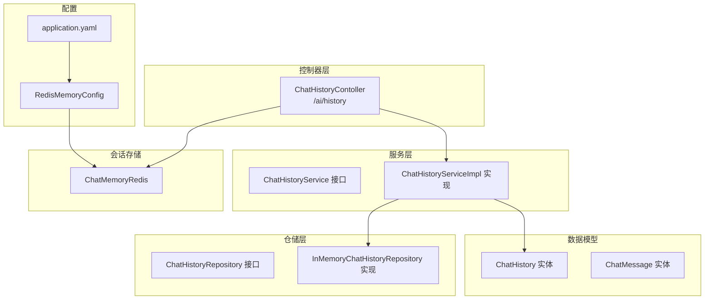
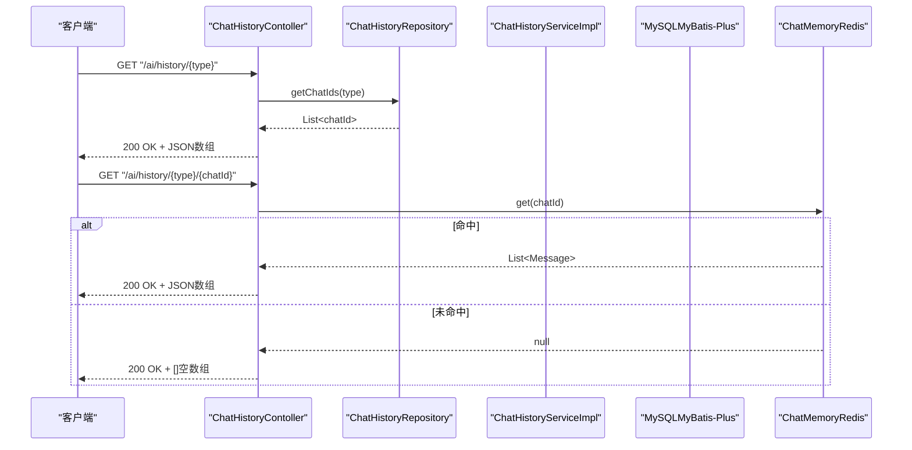
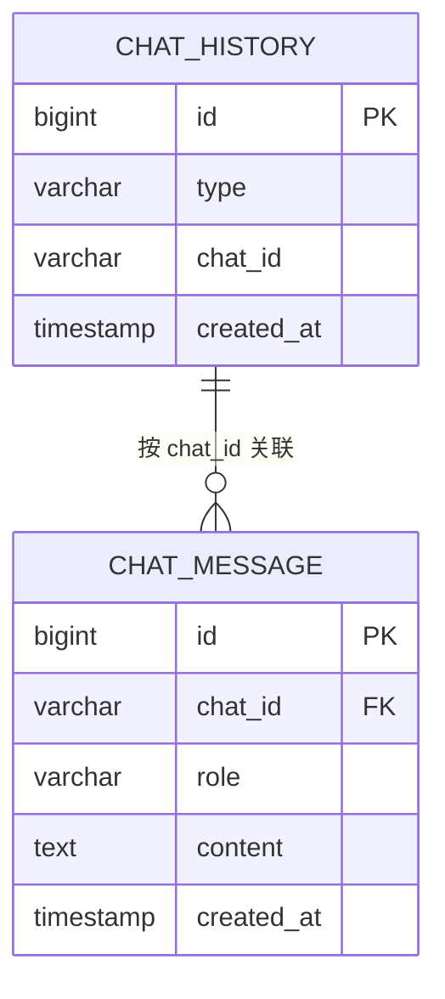
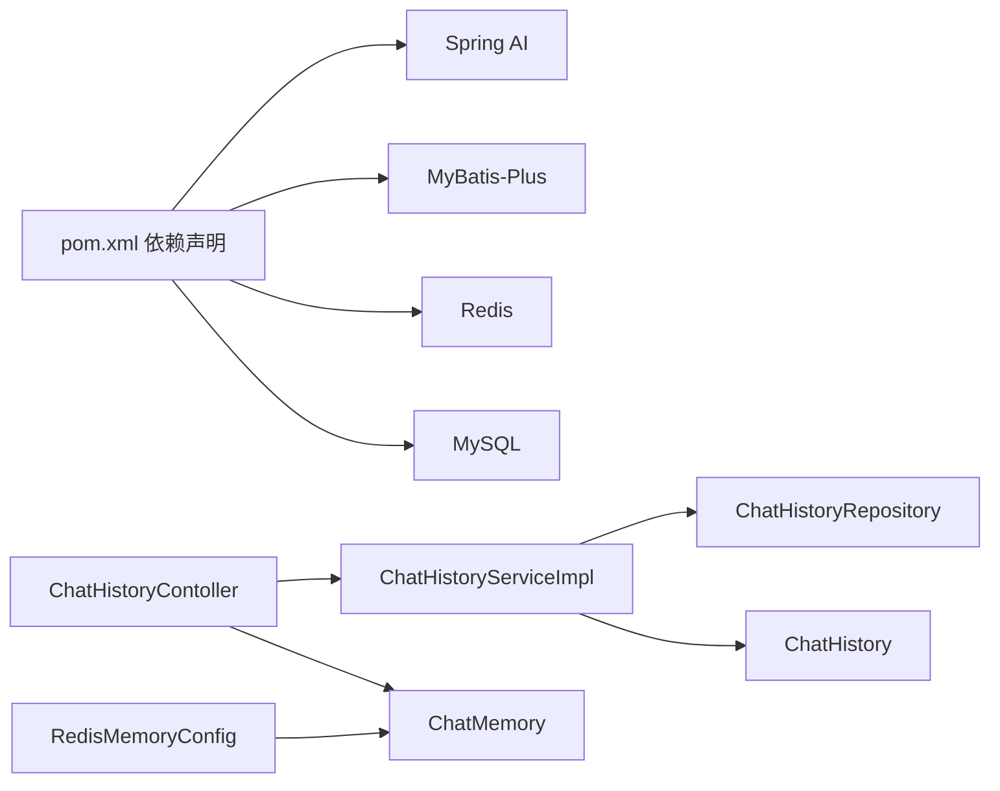

# 对话历史接口

<cite>
**本文引用的文件**
- [ChatHistoryContoller.java](file://src/main/java/com/xdu/aibot/controller/ChatHistoryContoller.java)
- [ChatHistoryService.java](file://src/main/java/com/xdu/aibot/service/ChatHistoryService.java)
- [ChatHistoryServiceImpl.java](file://src/main/java/com/xdu/aibot/service/impl/ChatHistoryServiceImpl.java)
- [ChatHistoryRepository.java](file://src/main/java/com/xdu/aibot/repository/ChatHistoryRepository.java)
- [InMemoryChatHistoryRepository.java](file://src/main/java/com/xdu/aibot/repository/Impl/InMemoryChatHistoryRepository.java)
- [ChatHistory.java](file://src/main/java/com/xdu/aibot/pojo/entity/ChatHistory.java)
- [ChatMessage.java](file://src/main/java/com/xdu/aibot/pojo/entity/ChatMessage.java)
- [MessageVO.java](file://src/main/java/com/xdu/aibot/pojo/vo/MessageVO.java)
- [Result.java](file://src/main/java/com/xdu/aibot/pojo/vo/Result.java)
- [RedisMemoryConfig.java](file://src/main/java/com/xdu/aibot/config/RedisMemoryConfig.java)
- [application.yaml](file://src/main/resources/application.yaml)
- [pom.xml](file://pom.xml)
</cite>

## 目录
1. [简介](#简介)
2. [项目结构](#项目结构)
3. [核心组件](#核心组件)
4. [架构总览](#架构总览)
5. [详细组件分析](#详细组件分析)
6. [依赖分析](#依赖分析)
7. [性能考虑](#性能考虑)
8. [故障排查指南](#故障排查指南)
9. [结论](#结论)
10. [附录](#附录)

## 简介
本文件为“对话历史管理接口”的完整API文档，覆盖聊天历史查询、管理和删除的RESTful接口规范；详细说明历史记录的数据结构、存储格式与检索方式；记录分页查询、时间范围筛选与会话过滤能力现状与扩展建议；提供请求参数、响应格式与状态码定义；涵盖对话历史生命周期管理、数据清理策略与隐私保护措施；并给出批量操作、导出功能与性能优化建议及实际调用示例与集成指南。

当前实现基于Spring Boot + Spring AI + MyBatis-Plus + Redis内存会话存储，提供两类历史数据：
- 会话标识历史：持久化存储，按业务类型分类，支持去重保存与查询。
- 会话消息历史：基于Spring AI ChatMemory的内存存储（默认Redis），按会话ID读取消息序列。

## 项目结构
围绕对话历史的关键模块如下：
- 控制器层：对外暴露REST接口，负责路由与参数解析。
- 服务层：封装业务逻辑，包括会话标识的去重保存与查询。
- 数据访问层：MyBatis-Plus Mapper与实体模型。
- 存储层：会话标识持久化（MySQL）与会话消息内存存储（Redis）。
- 配置层：Redis会话存储配置与应用配置。

图表来源
- [ChatHistoryContoller.java:14-38](file://src/main/java/com/xdu/aibot/controller/ChatHistoryContoller.java#L14-L38)
- [ChatHistoryService.java:8-19](file://src/main/java/com/xdu/aibot/service/ChatHistoryService.java#L8-L19)
- [ChatHistoryServiceImpl.java:18-63](file://src/main/java/com/xdu/aibot/service/impl/ChatHistoryServiceImpl.java#L18-L63)
- [ChatHistoryRepository.java:7-13](file://src/main/java/com/xdu/aibot/repository/ChatHistoryRepository.java#L7-L13)
- [InMemoryChatHistoryRepository.java:12-30](file://src/main/java/com/xdu/aibot/repository/Impl/InMemoryChatHistoryRepository.java#L12-L30)
- [ChatHistory.java:8-23](file://src/main/java/com/xdu/aibot/pojo/entity/ChatHistory.java#L8-L23)
- [ChatMessage.java:8-27](file://src/main/java/com/xdu/aibot/pojo/entity/ChatMessage.java#L8-L27)
- [RedisMemoryConfig.java:9-26](file://src/main/java/com/xdu/aibot/config/RedisMemoryConfig.java#L9-L26)
- [application.yaml:36-46](file://src/main/resources/application.yaml#L36-L46)

章节来源
- [ChatHistoryContoller.java:14-38](file://src/main/java/com/xdu/aibot/controller/ChatHistoryContoller.java#L14-L38)
- [ChatHistoryService.java:8-19](file://src/main/java/com/xdu/aibot/service/ChatHistoryService.java#L8-L19)
- [ChatHistoryServiceImpl.java:18-63](file://src/main/java/com/xdu/aibot/service/impl/ChatHistoryServiceImpl.java#L18-L63)
- [ChatHistoryRepository.java:7-13](file://src/main/java/com/xdu/aibot/repository/ChatHistoryRepository.java#L7-L13)
- [InMemoryChatHistoryRepository.java:12-30](file://src/main/java/com/xdu/aibot/repository/Impl/InMemoryChatHistoryRepository.java#L12-L30)
- [ChatHistory.java:8-23](file://src/main/java/com/xdu/aibot/pojo/entity/ChatHistory.java#L8-L23)
- [ChatMessage.java:8-27](file://src/main/java/com/xdu/aibot/pojo/entity/ChatMessage.java#L8-L27)
- [RedisMemoryConfig.java:9-26](file://src/main/java/com/xdu/aibot/config/RedisMemoryConfig.java#L9-L26)
- [application.yaml:36-46](file://src/main/resources/application.yaml#L36-L46)

## 核心组件
- 控制器：提供会话标识查询与会话消息读取两个接口。
- 服务与仓储：提供会话标识的去重保存与按类型查询。
- 数据模型：会话标识与消息实体，映射到MySQL表。
- 会话存储：通过Redis实现的ChatMemory，用于读取消息历史。

章节来源
- [ChatHistoryContoller.java:14-38](file://src/main/java/com/xdu/aibot/controller/ChatHistoryContoller.java#L14-L38)
- [ChatHistoryService.java:8-19](file://src/main/java/com/xdu/aibot/service/ChatHistoryService.java#L8-L19)
- [ChatHistoryServiceImpl.java:18-63](file://src/main/java/com/xdu/aibot/service/impl/ChatHistoryServiceImpl.java#L18-L63)
- [ChatHistoryRepository.java:7-13](file://src/main/java/com/xdu/aibot/repository/ChatHistoryRepository.java#L7-L13)
- [ChatHistory.java:8-23](file://src/main/java/com/xdu/aibot/pojo/entity/ChatHistory.java#L8-L23)
- [ChatMessage.java:8-27](file://src/main/java/com/xdu/aibot/pojo/entity/ChatMessage.java#L8-L27)
- [RedisMemoryConfig.java:9-26](file://src/main/java/com/xdu/aibot/config/RedisMemoryConfig.java#L9-L26)

## 架构总览
下图展示从HTTP请求到数据存储与会话内存的交互流程：

图表来源
- [ChatHistoryContoller.java:25-37](file://src/main/java/com/xdu/aibot/controller/ChatHistoryContoller.java#L25-L37)
- [ChatHistoryServiceImpl.java:44-52](file://src/main/java/com/xdu/aibot/service/impl/ChatHistoryServiceImpl.java#L44-L52)
- [RedisMemoryConfig.java:18-25](file://src/main/java/com/xdu/aibot/config/RedisMemoryConfig.java#L18-L25)

## 详细组件分析

### 控制器：对话历史接口
- 路径前缀：/ai/history
- 方法与路径：
  - GET /ai/history/{type}：按业务类型查询会话ID列表
  - GET /ai/history/{type}/{chatId}：按会话ID查询消息历史

- 请求参数
  - 路径参数
    - type：业务类型字符串，如“default”、“pdf”等
    - chatId：会话ID字符串
  - 查询参数：当前未使用

- 响应
  - GET /ai/history/{type}
    - 成功：200 OK，返回JSON数组，元素为字符串类型的chatId
  - GET /ai/history/{type}/{chatId}
    - 成功：200 OK，返回JSON数组，元素为消息对象
    - 未命中：200 OK，返回空数组

- 错误处理
  - 当前未显式抛出异常，未命中时返回空数组

章节来源
- [ChatHistoryContoller.java:14-38](file://src/main/java/com/xdu/aibot/controller/ChatHistoryContoller.java#L14-L38)
- [MessageVO.java:9-28](file://src/main/java/com/xdu/aibot/pojo/vo/MessageVO.java#L9-L28)

### 服务与仓储：会话标识历史
- 保存会话（去重）
  - 输入：type、chatId
  - 行为：若不存在则插入新记录，字段包含类型、会话ID与创建时间
- 查询会话ID列表
  - 输入：type
  - 行为：按类型查询所有chatId，仅返回ID字段

- 复杂度
  - 保存：单条插入，时间复杂度近似O(1)，取决于数据库索引
  - 查询：全表或带索引的条件查询，时间复杂度取决于数据量与索引

- 并发与一致性
  - 服务方法未声明事务，保存时通过存在性检查避免重复
  - 建议在高并发场景下增加唯一约束或分布式锁

章节来源
- [ChatHistoryService.java:8-19](file://src/main/java/com/xdu/aibot/service/ChatHistoryService.java#L8-L19)
- [ChatHistoryServiceImpl.java:23-52](file://src/main/java/com/xdu/aibot/service/impl/ChatHistoryServiceImpl.java#L23-L52)
- [ChatHistoryRepository.java:7-13](file://src/main/java/com/xdu/aibot/repository/ChatHistoryRepository.java#L7-L13)
- [InMemoryChatHistoryRepository.java:12-30](file://src/main/java/com/xdu/aibot/repository/Impl/InMemoryChatHistoryRepository.java#L12-L30)

### 数据模型：会话与消息
- 会话标识（chat_history）
  - 字段：id、type、chat_id、created_at
  - 主键：自增id
  - 建议：对type与chat_id建立组合唯一索引以保证去重

- 会话消息（chat_message）
  - 字段：id、chat_id、role、content、created_at
  - 角色：user / assistant
  - 建议：对chat_id建立索引以加速按会话查询

图表来源
- [ChatHistory.java:8-23](file://src/main/java/com/xdu/aibot/pojo/entity/ChatHistory.java#L8-L23)
- [ChatMessage.java:8-27](file://src/main/java/com/xdu/aibot/pojo/entity/ChatMessage.java#L8-L27)

章节来源
- [ChatHistory.java:8-23](file://src/main/java/com/xdu/aibot/pojo/entity/ChatHistory.java#L8-L23)
- [ChatMessage.java:8-27](file://src/main/java/com/xdu/aibot/pojo/entity/ChatMessage.java#L8-L27)

### 会话存储：消息历史
- 存储介质：基于Redis的ChatMemory（通过配置注入）
- 读取行为：按chatId获取消息列表，未命中返回空数组
- 生命周期：由Spring AI内存存储管理，默认无过期策略

章节来源
- [ChatHistoryContoller.java:30-37](file://src/main/java/com/xdu/aibot/controller/ChatHistoryContoller.java#L30-L37)
- [RedisMemoryConfig.java:18-25](file://src/main/java/com/xdu/aibot/config/RedisMemoryConfig.java#L18-L25)

## 依赖分析
- 外部依赖
  - Spring AI：提供ChatMemory与向量存储能力
  - MyBatis-Plus：ORM框架，简化数据库操作
  - MySQL：持久化会话标识
  - Redis：内存会话存储
- 内部耦合
  - 控制器依赖仓储接口，便于替换实现（当前默认实现为内存）
  - 服务层同时实现仓储接口，承担业务逻辑与数据访问职责

图表来源
- [pom.xml:33-116](file://pom.xml#L33-L116)
- [ChatHistoryContoller.java:14-38](file://src/main/java/com/xdu/aibot/controller/ChatHistoryContoller.java#L14-L38)
- [ChatHistoryServiceImpl.java:18-63](file://src/main/java/com/xdu/aibot/service/impl/ChatHistoryServiceImpl.java#L18-L63)
- [RedisMemoryConfig.java:9-26](file://src/main/java/com/xdu/aibot/config/RedisMemoryConfig.java#L9-L26)

章节来源
- [pom.xml:33-116](file://pom.xml#L33-L116)
- [ChatHistoryContoller.java:14-38](file://src/main/java/com/xdu/aibot/controller/ChatHistoryContoller.java#L14-L38)
- [ChatHistoryServiceImpl.java:18-63](file://src/main/java/com/xdu/aibot/service/impl/ChatHistoryServiceImpl.java#L18-L63)
- [RedisMemoryConfig.java:9-26](file://src/main/java/com/xdu/aibot/config/RedisMemoryConfig.java#L9-L26)

## 性能考虑
- 会话标识查询
  - 建议在type与chat_id上建立索引，避免全表扫描
  - 若数据量大，可引入分页查询（见“扩展建议”）
- 会话消息读取
  - Redis内存读取延迟低，注意内存容量与淘汰策略
  - 长会话消息过多时，建议定期清理或迁移至持久化存储
- 并发写入
  - 保存时存在存在性检查，建议在数据库层面增加唯一约束，减少重复写入
- 导出与批处理
  - 可通过分页与时间范围筛选导出会话消息，结合后台任务异步处理

[本节为通用性能建议，不直接分析具体文件]

## 故障排查指南
- 返回空数组
  - 可能原因：会话ID不存在或消息尚未写入
  - 建议：确认chatId正确性与会话是否已初始化
- 保存失败或重复
  - 可能原因：未设置唯一约束导致重复插入
  - 建议：在数据库添加唯一索引（type, chat_id）
- Redis连接问题
  - 可能原因：Redis地址、端口或密码配置错误
  - 建议：核对application.yaml中的Redis配置与网络连通性
- 响应格式异常
  - 可能原因：MessageVO映射角色值为空
  - 建议：检查消息类型枚举与映射逻辑

章节来源
- [ChatHistoryContoller.java:30-37](file://src/main/java/com/xdu/aibot/controller/ChatHistoryContoller.java#L30-L37)
- [MessageVO.java:13-28](file://src/main/java/com/xdu/aibot/pojo/vo/MessageVO.java#L13-L28)
- [application.yaml:36-46](file://src/main/resources/application.yaml#L36-L46)

## 结论
当前实现提供了简洁高效的对话历史接口：会话标识历史持久化与会话消息历史内存化读取。建议在生产环境中补充索引、唯一约束与Redis容量规划，并按需扩展分页、时间范围筛选与批量导出能力，以满足更大规模与更严格合规要求。

[本节为总结性内容，不直接分析具体文件]

## 附录

### API规范

- 获取会话ID列表
  - 方法与路径：GET /ai/history/{type}
  - 请求参数
    - 路径参数：type（业务类型）
  - 响应
    - 200 OK：返回字符串数组，元素为chatId
    - 200 OK（空）：type无对应记录时返回[]
  - 示例
    - curl -i http://localhost:8080/ai/history/default

- 获取会话消息历史
  - 方法与路径：GET /ai/history/{type}/{chatId}
  - 请求参数
    - 路径参数：type（业务类型）、chatId（会话ID）
  - 响应
    - 200 OK：返回消息数组，元素包含role与content
    - 200 OK（空）：未找到会话时返回[]
  - 示例
    - curl -i http://localhost:8080/ai/history/default/abc123

- 状态码
  - 200：成功
  - 404：资源不存在（当前未显式抛出，返回空数组）
  - 500：服务器内部错误（如Redis连接失败）

章节来源
- [ChatHistoryContoller.java:25-37](file://src/main/java/com/xdu/aibot/controller/ChatHistoryContoller.java#L25-L37)
- [MessageVO.java:9-28](file://src/main/java/com/xdu/aibot/pojo/vo/MessageVO.java#L9-L28)

### 数据结构与存储格式

- 会话标识（chat_history）
  - 字段：id、type、chat_id、created_at
  - 类型：整数、字符串、字符串、时间戳
  - 建议索引：type、chat_id（组合唯一）

- 会话消息（chat_message）
  - 字段：id、chat_id、role、content、created_at
  - 角色：user、assistant
  - 建议索引：chat_id

章节来源
- [ChatHistory.java:8-23](file://src/main/java/com/xdu/aibot/pojo/entity/ChatHistory.java#L8-L23)
- [ChatMessage.java:8-27](file://src/main/java/com/xdu/aibot/pojo/entity/ChatMessage.java#L8-L27)

### 扩展建议

- 分页查询
  - 在服务层新增分页参数（page、size），并在Mapper中实现分页查询
- 时间范围筛选
  - 在查询条件中增加created_at范围过滤
- 会话过滤
  - 支持按角色（user/assistant）过滤消息
- 批量操作
  - 批量删除：提供按chatId列表删除会话标识与消息
  - 批量导出：按时间范围与类型导出会话消息为CSV/JSON
- 数据清理策略
  - 定期清理过期会话（基于created_at）
  - 提供用户隐私删除接口（删除其所有会话与消息）
- 性能优化
  - 引入缓存层（如Redis）缓存热门会话标识
  - 对高频查询建立复合索引
  - 使用异步任务处理大批量导出

[本节为概念性扩展建议，不直接分析具体文件]

### 集成指南

- 启动顺序
  - 启动Redis与MySQL
  - 启动应用，确保application.yaml中的Redis与数据库配置正确
- 认证与授权
  - 如需启用安全控制，在控制器层增加鉴权注解与拦截器
- 日志与监控
  - 建议开启Spring AI与MyBatis日志，便于排查问题
- 压力测试
  - 使用JMeter或Gatling对高频接口进行压测，评估Redis与数据库瓶颈

章节来源
- [application.yaml:36-59](file://src/main/resources/application.yaml#L36-L59)
- [pom.xml:33-116](file://pom.xml#L33-L116)