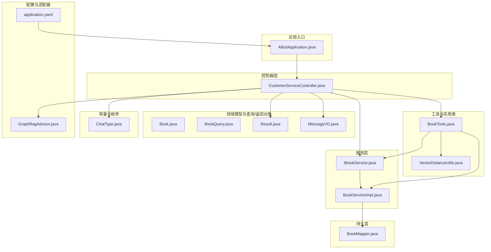
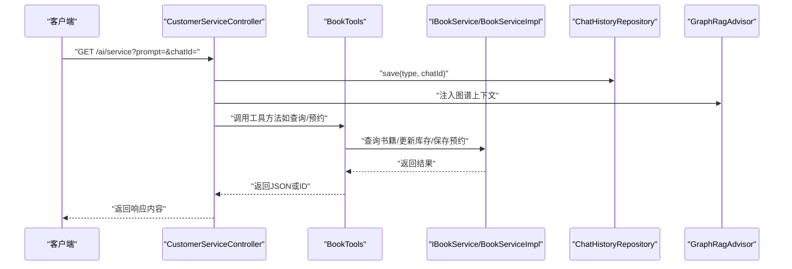
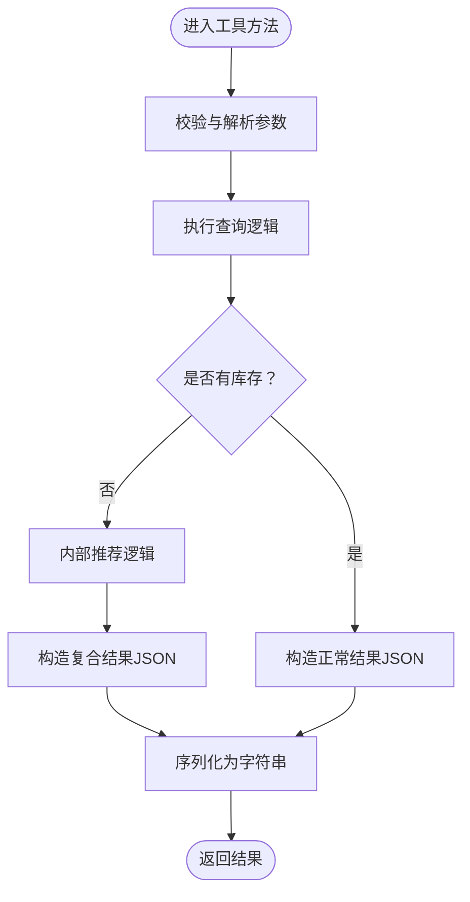
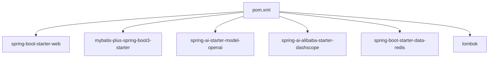

# 代码规范与约定

<cite>
**本文引用的文件**
- [AIbotApplication.java](file://src/main/java/com/xdu/aibot/AIbotApplication.java)
- [BookTools.java](file://src/main/java/com/xdu/aibot/tools/BookTools.java)
- [VectorDistanceUtils.java](file://src/main/java/com/xdu/aibot/util/VectorDistanceUtils.java)
- [ChatType.java](file://src/main/java/com/xdu/aibot/constant/ChatType.java)
- [Result.java](file://src/main/java/com/xdu/aibot/pojo/vo/Result.java)
- [MessageVO.java](file://src/main/java/com/xdu/aibot/pojo/vo/MessageVO.java)
- [Book.java](file://src/main/java/com/xdu/aibot/pojo/entity/Book.java)
- [BookQuery.java](file://src/main/java/com/xdu/aibot/pojo/query/BookQuery.java)
- [IBookService.java](file://src/main/java/com/xdu/aibot/service/IBookService.java)
- [BookServiceImpl.java](file://src/main/java/com/xdu/aibot/service/impl/BookServiceImpl.java)
- [CustomerServiceController.java](file://src/main/java/com/xdu/aibot/controller/CustomerServiceController.java)
- [GraphRagAdvisor.java](file://src/main/java/com/xdu/aibot/advisor/GraphRagAdvisor.java)
- [application.yaml](file://src/main/resources/application.yaml)
- [pom.xml](file://pom.xml)
- [AIbotApplicationTests.java](file://src/test/java/com/xdu/aibot/AIbotApplicationTests.java)
</cite>

## 目录
1. [引言](#引言)
2. [项目结构](#项目结构)
3. [核心组件](#核心组件)
4. [架构总览](#架构总览)
5. [详细组件分析](#详细组件分析)
6. [依赖分析](#依赖分析)
7. [性能考虑](#性能考虑)
8. [故障排查指南](#故障排查指南)
9. [结论](#结论)
10. [附录](#附录)

## 引言
本文件面向AIbot项目的开发团队，系统化梳理Java编码规范、命名约定、代码组织原则以及工具类设计与使用规范。重点覆盖以下方面：
- 工具类设计模式与使用规范：以BookTools为例，说明方法命名、参数传递、异常处理与返回值约定。
- 注释规范与文档字符串标准：统一方法级注释、参数注释与异常说明风格。
- 常量与枚举使用约定：明确常量定义位置、枚举类型使用场景与访问方式。
- 业务规则的代码实现标准：结合具体业务流程，给出可复用的实现模板与约束。
- 代码格式化工具配置、IDE设置建议与代码质量检查标准：帮助团队建立一致的开发体验与质量基线。

## 项目结构
AIbot采用Spring Boot标准分层架构，按功能域划分包结构，清晰分离控制器、服务、持久层、工具与配置等模块。整体结构如下：

图表来源
- [AIbotApplication.java:1-16](file://src/main/java/com/xdu/aibot/AIbotApplication.java#L1-L16)
- [CustomerServiceController.java:1-35](file://src/main/java/com/xdu/aibot/controller/CustomerServiceController.java#L1-L35)
- [IBookService.java:1-17](file://src/main/java/com/xdu/aibot/service/IBookService.java#L1-L17)
- [BookServiceImpl.java:1-21](file://src/main/java/com/xdu/aibot/service/impl/BookServiceImpl.java#L1-L21)
- [BookTools.java:1-127](file://src/main/java/com/xdu/aibot/tools/BookTools.java#L1-L127)
- [VectorDistanceUtils.java:1-111](file://src/main/java/com/xdu/aibot/util/VectorDistanceUtils.java#L1-L111)
- [Book.java:1-58](file://src/main/java/com/xdu/aibot/pojo/entity/Book.java#L1-L58)
- [BookQuery.java:1-30](file://src/main/java/com/xdu/aibot/pojo/query/BookQuery.java#L1-L30)
- [Result.java:1-24](file://src/main/java/com/xdu/aibot/pojo/vo/Result.java#L1-L24)
- [MessageVO.java:1-29](file://src/main/java/com/xdu/aibot/pojo/vo/MessageVO.java#L1-L29)
- [ChatType.java:1-17](file://src/main/java/com/xdu/aibot/constant/ChatType.java#L1-L17)
- [GraphRagAdvisor.java:1-149](file://src/main/java/com/xdu/aibot/advisor/GraphRagAdvisor.java#L1-L149)
- [application.yaml:1-59](file://src/main/resources/application.yaml#L1-L59)

章节来源
- [AIbotApplication.java:1-16](file://src/main/java/com/xdu/aibot/AIbotApplication.java#L1-L16)
- [application.yaml:1-59](file://src/main/resources/application.yaml#L1-L59)

## 核心组件
本节聚焦于与编码规范直接相关的核心组件，包括工具类、实体类、服务接口与实现、控制器、常量与枚举、以及向量距离工具类。

- 工具类BookTools：提供书籍查询与预约两大工具方法，遵循Spring AI工具注解规范，统一返回字符串JSON或整型ID；内部封装库存检查与推荐逻辑，保证在无库存时提供替代方案。
- 实体类Book：基于MyBatis-Plus注解映射数据库表，使用Lombok简化getter/setter/toString等；字段注释详尽，便于维护与文档生成。
- 查询对象BookQuery：使用Spring AI工具参数注解，支持多字段过滤与排序组合，便于工具方法接收复杂查询条件。
- 服务接口与实现IBookService/BookServiceImpl：遵循MyBatis-Plus IService扩展，保持最小实现，职责清晰。
- 控制器CustomerServiceController：通过ChatClient发起对话，结合内存存储与图RAG增强，统一输出内容。
- 常量与枚举ChatType：定义业务类型常量，提供类型字符串访问方法，避免魔法字符串。
- 向量距离工具VectorDistanceUtils：提供向量运算与距离计算的静态工具方法，统一参数校验与异常抛出策略。

章节来源
- [BookTools.java:1-127](file://src/main/java/com/xdu/aibot/tools/BookTools.java#L1-L127)
- [Book.java:1-58](file://src/main/java/com/xdu/aibot/pojo/entity/Book.java#L1-L58)
- [BookQuery.java:1-30](file://src/main/java/com/xdu/aibot/pojo/query/BookQuery.java#L1-L30)
- [IBookService.java:1-17](file://src/main/java/com/xdu/aibot/service/IBookService.java#L1-L17)
- [BookServiceImpl.java:1-21](file://src/main/java/com/xdu/aibot/service/impl/BookServiceImpl.java#L1-L21)
- [CustomerServiceController.java:1-35](file://src/main/java/com/xdu/aibot/controller/CustomerServiceController.java#L1-L35)
- [ChatType.java:1-17](file://src/main/java/com/xdu/aibot/constant/ChatType.java#L1-L17)
- [VectorDistanceUtils.java:1-111](file://src/main/java/com/xdu/aibot/util/VectorDistanceUtils.java#L1-L111)

## 架构总览
AIbot采用“控制器-服务-持久层-工具-适配器”的分层架构，结合Spring AI与向量存储、图数据库进行RAG增强。下图展示关键交互路径：

图表来源
- [CustomerServiceController.java:1-35](file://src/main/java/com/xdu/aibot/controller/CustomerServiceController.java#L1-L35)
- [BookTools.java:1-127](file://src/main/java/com/xdu/aibot/tools/BookTools.java#L1-L127)
- [IBookService.java:1-17](file://src/main/java/com/xdu/aibot/service/IBookService.java#L1-L17)
- [BookServiceImpl.java:1-21](file://src/main/java/com/xdu/aibot/service/impl/BookServiceImpl.java#L1-L21)
- [GraphRagAdvisor.java:1-149](file://src/main/java/com/xdu/aibot/advisor/GraphRagAdvisor.java#L1-L149)

## 详细组件分析

### 工具类BookTools设计与使用规范
- 设计模式
  - 组件化：使用Spring组件注解，交由IoC容器管理。
  - 工具方法：对外暴露的工具方法应具备单一职责，输入参数明确，返回值稳定。
  - 事务控制：涉及写操作的方法使用事务注解，保证一致性。
- 方法命名
  - queryBook：语义明确，表示查询书籍。
  - queryBookReservation：语义明确，表示生成预约单。
- 参数传递
  - 使用Spring AI工具参数注解描述参数含义与必填性，提升工具可读性与可维护性。
  - 对复杂查询使用查询对象，支持多字段过滤与排序组合。
- 异常处理
  - 未找到书籍或库存不足时抛出语义化的异常，便于上层捕获与提示。
  - JSON序列化失败时返回兜底字符串，保证工具可用性。
- 返回值约定
  - 查询成功返回JSON字符串；查询失败且存在推荐时返回复合JSON；预约成功返回ID，失败返回null或抛出异常。
- 关键流程示意

图表来源
- [BookTools.java:32-82](file://src/main/java/com/xdu/aibot/tools/BookTools.java#L32-L82)
- [BookTools.java:84-91](file://src/main/java/com/xdu/aibot/tools/BookTools.java#L84-L91)

章节来源
- [BookTools.java:1-127](file://src/main/java/com/xdu/aibot/tools/BookTools.java#L1-L127)
- [BookQuery.java:1-30](file://src/main/java/com/xdu/aibot/pojo/query/BookQuery.java#L1-L30)

### 实体类Book与查询对象BookQuery
- 字段注释与可读性
  - 字段注释详尽，便于生成文档与理解业务含义。
- 查询对象设计
  - 使用工具参数注解描述每个字段的含义与取值范围，支持可选字段与排序子对象。
- 与工具类协作
  - 工具类通过查询链式包装器构建查询条件，体现“查询即文档”的思想。

章节来源
- [Book.java:1-58](file://src/main/java/com/xdu/aibot/pojo/entity/Book.java#L1-L58)
- [BookQuery.java:1-30](file://src/main/java/com/xdu/aibot/pojo/query/BookQuery.java#L1-L30)

### 服务接口与实现IBookService/BookServiceImpl
- 接口职责
  - 定义领域服务契约，保持接口简洁与稳定。
- 实现类
  - 基于MyBatis-Plus通用Service实现，减少样板代码，提升开发效率。

章节来源
- [IBookService.java:1-17](file://src/main/java/com/xdu/aibot/service/IBookService.java#L1-L17)
- [BookServiceImpl.java:1-21](file://src/main/java/com/xdu/aibot/service/impl/BookServiceImpl.java#L1-L21)

### 控制器CustomerServiceController
- 职责边界
  - 负责接收请求、保存会话、调用ChatClient与Advisor、组装响应。
- 输出编码
  - 明确响应内容类型，确保前端正确渲染。
- 与工具类协作
  - 在对话流程中调用工具方法，实现“智能工具+对话”的闭环。

章节来源
- [CustomerServiceController.java:1-35](file://src/main/java/com/xdu/aibot/controller/CustomerServiceController.java#L1-L35)

### 常量与枚举ChatType
- 枚举设计
  - 枚举值与业务类型一一对应，提供类型字符串访问方法，避免魔法字符串。
- 使用建议
  - 在控制器与仓库层统一使用枚举值，保证类型安全与可读性。

章节来源
- [ChatType.java:1-17](file://src/main/java/com/xdu/aibot/constant/ChatType.java#L1-L17)

### 向量距离工具VectorDistanceUtils
- 工具方法
  - 提供欧氏距离、余弦距离、向量加法与减法等静态方法。
- 参数校验
  - 统一参数校验逻辑，抛出语义化异常，确保输入有效。
- 精度处理
  - 使用极小阈值处理浮点误差，保证相似度计算稳定。

章节来源
- [VectorDistanceUtils.java:1-111](file://src/main/java/com/xdu/aibot/util/VectorDistanceUtils.java#L1-L111)

### 图RAG增强适配器GraphRagAdvisor
- 功能定位
  - 在对话前从上下文文档中抽取关键词，查询图数据库，将关系信息注入到用户消息中，提升回答准确性。
- 关键流程
  - 解析上下文文档 → 提取chatId → 关键词抽取与过滤 → Cypher查询 → 注入上下文 → 继续后续Advisor链。

章节来源
- [GraphRagAdvisor.java:1-149](file://src/main/java/com/xdu/aibot/advisor/GraphRagAdvisor.java#L1-L149)

## 依赖分析
项目使用Maven管理依赖，核心依赖包括Spring Boot Web、MyBatis-Plus、Spring AI生态组件、Neo4j与Redis等。下图展示关键依赖关系：

图表来源
- [pom.xml:1-139](file://pom.xml#L1-L139)

章节来源
- [pom.xml:1-139](file://pom.xml#L1-L139)

## 性能考虑
- 工具方法的查询与排序
  - 对于复杂查询，优先使用链式查询包装器，避免一次性构造大型SQL；必要时添加索引与限制返回条数。
- 库存扣减与事务
  - 预约流程中的库存扣减与预约记录保存需在事务内完成，确保一致性。
- 向量计算与距离
  - 向量维度较大时，尽量批量处理；余弦距离计算中注意零向量与精度截断，避免无效结果。
- 图查询优化
  - 关键词过滤与Cypher查询应配合索引与LIMIT，避免全量扫描。

## 故障排查指南
- 工具方法返回兜底字符串
  - 当JSON序列化失败时，工具方法返回兜底字符串，便于快速定位问题；建议在日志中记录原始异常堆栈。
- 参数校验异常
  - 向量工具类在参数非法时抛出语义化异常，需检查输入向量长度与非空性。
- 会话上下文缺失
  - 图RAG适配器依赖上下文文档与chatId，若缺失则直接透传请求；需检查文档注入与元数据键名。
- 数据源与连接
  - application.yaml中配置了数据库、Redis与向量存储等连接信息，若连接失败，优先检查凭据与网络连通性。

章节来源
- [BookTools.java:69-81](file://src/main/java/com/xdu/aibot/tools/BookTools.java#L69-L81)
- [VectorDistanceUtils.java:100-110](file://src/main/java/com/xdu/aibot/util/VectorDistanceUtils.java#L100-L110)
- [GraphRagAdvisor.java:44-59](file://src/main/java/com/xdu/aibot/advisor/GraphRagAdvisor.java#L44-L59)
- [application.yaml:1-59](file://src/main/resources/application.yaml#L1-L59)

## 结论
本规范文档总结了AIbot项目在Java编码、命名约定、代码组织、工具类设计与使用、注释与文档、常量与枚举、业务规则实现、以及代码质量与工具链方面的最佳实践。建议团队在日常开发中严格遵循上述约定，持续提升代码一致性、可读性与可维护性。

## 附录

### Java编码规范与命名约定
- 包命名
  - 使用反向域名+功能域，如com.xdu.aibot.tools。
- 类命名
  - 遵循帕斯卡命名法；工具类以Tools结尾，服务接口以I开头，实现类以Impl结尾。
- 方法命名
  - 动宾结构，语义明确；工具方法使用queryXXX、generateXXX等前缀。
- 常量命名
  - 全大写+下划线，位于constant包或类内静态常量。
- 枚举命名
  - 全大写，提供访问方法；避免魔法字符串。
- 变量命名
  - 驼峰命名，避免缩写；布尔变量使用is/has前缀。

### 注释规范与文档字符串标准
- 类注释
  - 描述类职责、作用与作者信息，置于类声明上方。
- 方法注释
  - 说明方法目的、参数含义、返回值与异常；对复杂算法提供简要步骤。
- 参数注释
  - 使用工具参数注解描述必填性与取值范围，提升可读性。
- 异常注释
  - 明确抛出异常的触发条件与处理建议。

### 常量定义规范与枚举使用约定
- 常量定义
  - 位于constant包或类内静态final字段；避免魔法值。
- 枚举使用
  - 通过枚举值访问类型字符串，避免硬编码；在控制器与仓库层统一使用。

### 业务规则的代码实现标准
- 查询与排序
  - 使用链式查询包装器，支持多字段过滤与排序；必要时限制返回数量。
- 库存与事务
  - 预约流程必须在事务内完成；库存不足时抛出语义化异常。
- 工具方法返回
  - 明确返回值类型与格式；失败时提供兜底策略。

### 代码格式化工具配置与IDE设置建议
- 格式化工具
  - 推荐使用Spotless或Google Java Format，统一缩进、换行与空白字符。
- IDE设置
  - IntelliJ IDEA：启用“On Save”格式化；配置代码模板与Live Templates；开启Inspections。
- 代码质量检查
  - 使用SonarQube或Spotbugs进行静态分析；在CI中集成质量门禁。