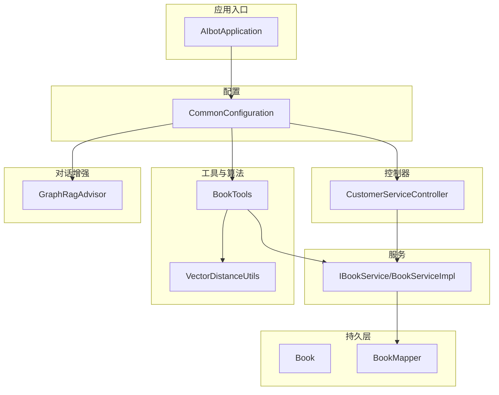
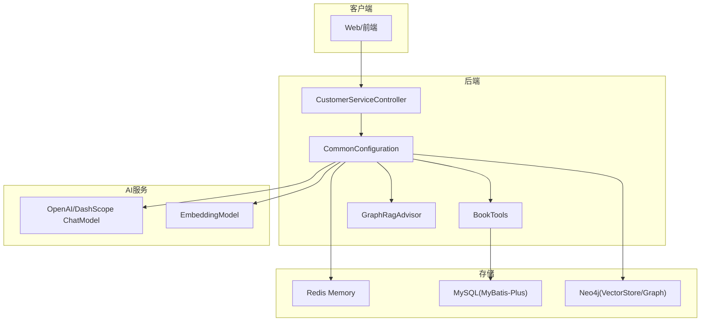
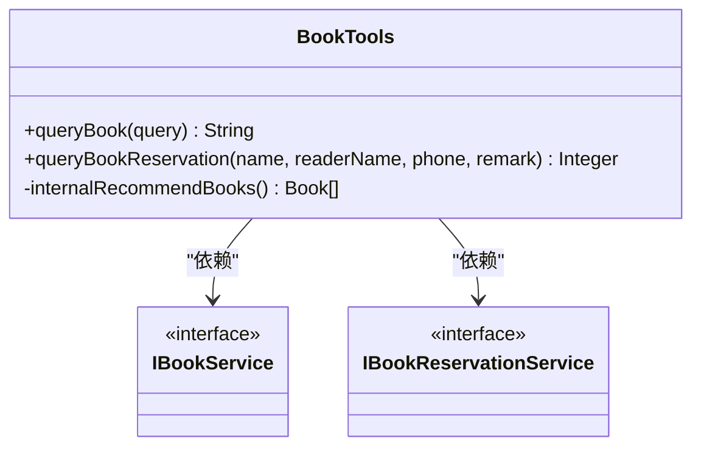
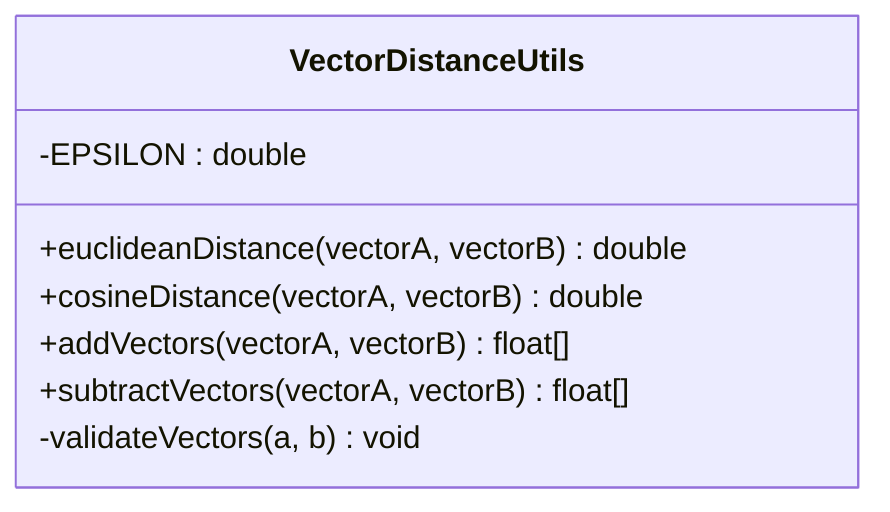
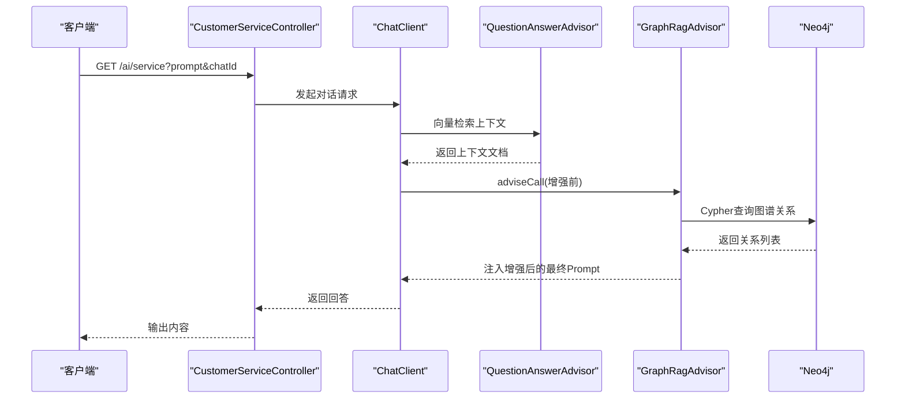
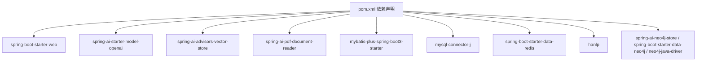

# 开发指南

<cite>
**本文引用的文件**
- [AIbotApplication.java](file://src/main/java/com/xdu/aibot/AIbotApplication.java)
- [BookTools.java](file://src/main/java/com/xdu/aibot/tools/BookTools.java)
- [VectorDistanceUtils.java](file://src/main/java/com/xdu/aibot/util/VectorDistanceUtils.java)
- [ChatType.java](file://src/main/java/com/xdu/aibot/constant/ChatType.java)
- [pom.xml](file://pom.xml)
- [application.yaml](file://src/main/resources/application.yaml)
- [BookServiceImpl.java](file://src/main/java/com/xdu/aibot/service/impl/BookServiceImpl.java)
- [IBookService.java](file://src/main/java/com/xdu/aibot/service/IBookService.java)
- [Book.java](file://src/main/java/com/xdu/aibot/pojo/entity/Book.java)
- [BookQuery.java](file://src/main/java/com/xdu/aibot/pojo/query/BookQuery.java)
- [CustomerServiceController.java](file://src/main/java/com/xdu/aibot/controller/CustomerServiceController.java)
- [CommonConfiguration.java](file://src/main/java/com/xdu/aibot/config/CommonConfiguration.java)
- [GraphRagAdvisor.java](file://src/main/java/com/xdu/aibot/advisor/GraphRagAdvisor.java)
- [AIbotApplicationTests.java](file://src/test/java/com/xdu/aibot/AIbotApplicationTests.java)
- [chat-pdf.properties](file://chat-pdf.properties)
</cite>

## 目录
1. [简介](#简介)
2. [项目结构](#项目结构)
3. [核心组件](#核心组件)
4. [架构总览](#架构总览)
5. [详细组件分析](#详细组件分析)
6. [依赖分析](#依赖分析)
7. [性能考虑](#性能考虑)
8. [故障排查指南](#故障排查指南)
9. [结论](#结论)
10. [附录](#附录)

## 简介
本开发指南面向AIbot项目，目标是帮助开发者快速上手、规范开发、提升质量与性能。内容覆盖代码规范、环境配置、调试技巧、工具类使用（BookTools、VectorDistanceUtils）、常量与枚举、业务规则、最佳实践、重构指导、性能优化、单元与集成测试、CI/CD配置、版本控制与发布管理等。

## 项目结构
项目采用Spring Boot标准目录结构，按功能域分层组织：
- config：应用配置与Bean装配
- constant：常量与枚举
- controller：对外HTTP接口
- service：业务服务与实现
- repository：数据访问抽象与实现
- mapper/vo/pojo：MyBatis映射与领域对象
- advisor：对话增强器（RAG/记忆）
- tools/util：工具类与通用算法
- resources：配置文件、XML映射、静态资源
- test：集成测试与示例

图表来源
- [AIbotApplication.java:1-16](file://src/main/java/com/xdu/aibot/AIbotApplication.java#L1-L16)
- [CommonConfiguration.java:1-129](file://src/main/java/com/xdu/aibot/config/CommonConfiguration.java#L1-L129)
- [CustomerServiceController.java:1-35](file://src/main/java/com/xdu/aibot/controller/CustomerServiceController.java#L1-L35)
- [IBookService.java:1-17](file://src/main/java/com/xdu/aibot/service/IBookService.java#L1-L17)
- [BookServiceImpl.java:1-21](file://src/main/java/com/xdu/aibot/service/impl/BookServiceImpl.java#L1-L21)
- [BookTools.java:1-127](file://src/main/java/com/xdu/aibot/tools/BookTools.java#L1-L127)
- [VectorDistanceUtils.java:1-111](file://src/main/java/com/xdu/aibot/util/VectorDistanceUtils.java#L1-L111)
- [GraphRagAdvisor.java:1-149](file://src/main/java/com/xdu/aibot/advisor/GraphRagAdvisor.java#L1-L149)

章节来源
- [AIbotApplication.java:1-16](file://src/main/java/com/xdu/aibot/AIbotApplication.java#L1-L16)
- [pom.xml:1-139](file://pom.xml#L1-L139)
- [application.yaml:1-59](file://src/main/resources/application.yaml#L1-L59)

## 核心组件
- 应用入口与扫描：通过@SpringBootApplication与@MapperScan启用自动装配与Mapper扫描。
- 配置中心：CommonConfiguration集中装配ChatClient、VectorStore、Neo4j驱动、工具与顾问链。
- 控制器：CustomerServiceController提供服务型对话接口，绑定ChatClient与内存存储。
- 业务服务：基于MyBatis-Plus的IBookService/BookServiceImpl，提供基础CRUD能力。
- 工具类：BookTools封装图书查询与预约工具；VectorDistanceUtils提供向量运算与距离计算。
- 对话增强：GraphRagAdvisor结合HanLP抽取关键词，从Neo4j图谱扩展上下文，增强问答效果。

章节来源
- [AIbotApplication.java:1-16](file://src/main/java/com/xdu/aibot/AIbotApplication.java#L1-L16)
- [CommonConfiguration.java:1-129](file://src/main/java/com/xdu/aibot/config/CommonConfiguration.java#L1-L129)
- [CustomerServiceController.java:1-35](file://src/main/java/com/xdu/aibot/controller/CustomerServiceController.java#L1-L35)
- [IBookService.java:1-17](file://src/main/java/com/xdu/aibot/service/IBookService.java#L1-L17)
- [BookServiceImpl.java:1-21](file://src/main/java/com/xdu/aibot/service/impl/BookServiceImpl.java#L1-L21)
- [BookTools.java:1-127](file://src/main/java/com/xdu/aibot/tools/BookTools.java#L1-L127)
- [VectorDistanceUtils.java:1-111](file://src/main/java/com/xdu/aibot/util/VectorDistanceUtils.java#L1-L111)
- [GraphRagAdvisor.java:1-149](file://src/main/java/com/xdu/aibot/advisor/GraphRagAdvisor.java#L1-L149)

## 架构总览
系统围绕Spring AI生态构建，结合OpenAI兼容模型、DashScope适配、Neo4j向量索引与图谱增强、Redis会话记忆、MySQL持久化与MyBatis-Plus。

图表来源
- [CommonConfiguration.java:1-129](file://src/main/java/com/xdu/aibot/config/CommonConfiguration.java#L1-L129)
- [CustomerServiceController.java:1-35](file://src/main/java/com/xdu/aibot/controller/CustomerServiceController.java#L1-L35)
- [application.yaml:1-59](file://src/main/resources/application.yaml#L1-L59)

## 详细组件分析

### BookTools 图书管理工具
职责与行为
- 查询工具：支持按类型、作者、名称（模糊）、评分与库存过滤，支持多字段排序；若无库存或无结果，自动返回推荐列表并封装复合结果。
- 预约工具：校验库存、扣减库存、保存预约记录，返回预约单号；事务保证一致性。
- 错误处理：参数校验、库存不足、序列化异常均有明确分支与异常抛出。

图表来源
- [BookTools.java:1-127](file://src/main/java/com/xdu/aibot/tools/BookTools.java#L1-L127)

章节来源
- [BookTools.java:1-127](file://src/main/java/com/xdu/aibot/tools/BookTools.java#L1-L127)

### VectorDistanceUtils 向量距离计算工具
职责与行为
- 提供欧氏距离、余弦距离、向量加法与减法。
- 统一参数校验：非空、维度一致、非空向量。
- 数值稳定性：使用极小阈值避免除零与越界。

图表来源
- [VectorDistanceUtils.java:1-111](file://src/main/java/com/xdu/aibot/util/VectorDistanceUtils.java#L1-L111)

章节来源
- [VectorDistanceUtils.java:1-111](file://src/main/java/com/xdu/aibot/util/VectorDistanceUtils.java#L1-L111)

### ChatType 常量与枚举
- 定义对话类型：PDF与SERVICE两类，用于历史记录与上下文区分。

章节来源
- [ChatType.java:1-17](file://src/main/java/com/xdu/aibot/constant/ChatType.java#L1-L17)

### Book 实体与查询模型
- Book实体：包含主键、名称、作者、类型、评分、库存等字段。
- BookQuery：查询参数模型，支持类型、作者、名称、评分、库存与排序字段。

章节来源
- [Book.java:1-58](file://src/main/java/com/xdu/aibot/pojo/entity/Book.java#L1-L58)
- [BookQuery.java:1-30](file://src/main/java/com/xdu/aibot/pojo/query/BookQuery.java#L1-L30)

### CustomerServiceController 服务对话控制器
- 接口：/ai/service，接收prompt与chatId，写入会话类型，调用ChatClient进行对话并返回内容。
- 依赖：ChatClient（默认系统提示、记忆顾问、工具），ChatHistoryRepository（会话存储）。

章节来源
- [CustomerServiceController.java:1-35](file://src/main/java/com/xdu/aibot/controller/CustomerServiceController.java#L1-L35)

### GraphRagAdvisor 图谱增强顾问
- 关键流程：从上下文文档中提取chatId，对用户问题进行分词与关键词过滤，查询Neo4j图谱扩展关系，注入到最终UserMessage中。
- 顺序：必须在QuestionAnswerAdvisor之后执行，以确保先检索再增强。

图表来源
- [CommonConfiguration.java:90-127](file://src/main/java/com/xdu/aibot/config/CommonConfiguration.java#L90-L127)
- [GraphRagAdvisor.java:1-149](file://src/main/java/com/xdu/aibot/advisor/GraphRagAdvisor.java#L1-L149)

章节来源
- [GraphRagAdvisor.java:1-149](file://src/main/java/com/xdu/aibot/advisor/GraphRagAdvisor.java#L1-L149)

### 业务规则与实现要点
- 图书查询：优先返回满足条件的书籍；若全部无库存或无结果，返回“遗憾通知+推荐列表”，避免空响应。
- 预约流程：库存校验、原子扣减、保存预约、返回单号；异常路径清晰。
- 向量计算：统一校验与边界处理，避免零向量与维度不一致。
- 图谱增强：关键词抽取与Cypher查询，限制返回数量，避免过度膨胀。

章节来源
- [BookTools.java:32-82](file://src/main/java/com/xdu/aibot/tools/BookTools.java#L32-L82)
- [BookTools.java:94-125](file://src/main/java/com/xdu/aibot/tools/BookTools.java#L94-L125)
- [VectorDistanceUtils.java:18-62](file://src/main/java/com/xdu/aibot/util/VectorDistanceUtils.java#L18-L62)
- [GraphRagAdvisor.java:88-136](file://src/main/java/com/xdu/aibot/advisor/GraphRagAdvisor.java#L88-L136)

## 依赖分析
- Spring Boot与Spring AI：OpenAI/DashScope模型、向量存储、RAG顾问、嵌入模型。
- 数据访问：MyBatis-Plus、MySQL驱动。
- 图数据库：Neo4j向量存储与Java Driver。
- 缓存与会话：Redis（Spring AI Redis Memory）。
- 中文分词：HanLP。
- Lombok简化POJO。

图表来源
- [pom.xml:33-116](file://pom.xml#L33-L116)

章节来源
- [pom.xml:1-139](file://pom.xml#L1-L139)

## 性能考虑
- 向量检索与排序
  - 使用Neo4j向量索引与Cosine距离，合理设置similarityThreshold与topK，减少无关文档。
  - 嵌入维度与批量策略：根据实际硬件与延迟需求调整embedding维度与批处理策略。
- 图谱查询
  - 限制Cypher返回条目数量，避免大规模遍历；关键词过滤与一跳扩展已降低复杂度。
- 会话记忆
  - 控制MessageWindow大小，避免过长历史导致上下文超限。
- IO与连接池
  - Redis连接池参数需结合并发与QPS调优；数据库连接与线程池亦需监控。
- 序列化与JSON
  - 避免大对象频繁序列化；必要时使用Result VO统一输出。

## 故障排查指南
- 配置项缺失
  - DASHSCOPE_API_KEY未设置会导致模型初始化失败；检查环境变量与application.yaml占位符。
- 数据源与驱动
  - MySQL驱动版本与URL参数需与数据库版本匹配；SSL与时区参数影响连接稳定性。
- Neo4j连接
  - 校验URI、用户名与密码；网络连通性与防火墙；索引初始化失败时检查权限与数据库名。
- Redis连接
  - 校验主机、端口、密码与池参数；关注连接耗尽与超时。
- 工具调用异常
  - BookTools库存不足、序列化异常、参数为空；VectorDistanceUtils零向量与维度不一致。
- 单元测试
  - AIbotApplicationTests包含嵌入向量对比、Neo4j连通性与基本查询验证，可作为本地回归参考。

章节来源
- [application.yaml:1-59](file://src/main/resources/application.yaml#L1-L59)
- [AIbotApplicationTests.java:1-104](file://src/test/java/com/xdu/aibot/AIbotApplicationTests.java#L1-L104)

## 结论
本指南从架构、组件、工具、配置与测试五个维度梳理了AIbot的开发要点。建议在日常开发中坚持：清晰的职责划分、严格的参数校验、合理的异常处理、可观察的日志与指标、完善的测试覆盖与CI流水线。在此基础上持续优化向量检索、图谱增强与会话记忆策略，以获得更稳定与高性能的用户体验。

## 附录

### 代码规范与最佳实践
- 命名规范
  - 包名全小写；类名采用PascalCase；常量全大写；方法与字段驼峰命名。
- 注释与文档
  - 公共API与工具方法提供清晰描述；复杂逻辑添加流程说明与边界条件注释。
- 异常处理
  - 明确区分非法参数、业务状态与系统异常；在工具类中提供可预期的兜底返回。
- 日志与可观测性
  - 在关键路径打印必要日志；对AI调用与图谱查询增加采样日志，避免噪声。
- 安全
  - 密钥通过环境变量注入；禁止硬编码敏感信息；对输入进行长度与格式限制。

### 调试技巧
- 本地联调
  - 使用AIbotApplicationTests进行嵌入与图谱连通性验证；逐步替换为真实数据源。
- ChatClient链路
  - 启用SimpleLoggerAdvisor查看请求与响应；在自定义Advisor中打印增强后的最终Prompt。
- 向量与距离
  - 通过测试用例对比同一向量与不同向量的距离，验证实现正确性与数值稳定性。

### 单元测试与集成测试
- 单元测试
  - 针对VectorDistanceUtils的关键方法进行边界与异常场景覆盖；针对BookTools的查询与预约分支进行断言。
- 集成测试
  - 使用@SpringBootTest启动容器，验证ChatClient、VectorStore、Neo4j与Redis协同工作；模拟不同上下文与关键词组合，验证GraphRagAdvisor增强效果。

章节来源
- [AIbotApplicationTests.java:1-104](file://src/test/java/com/xdu/aibot/AIbotApplicationTests.java#L1-L104)

### 持续集成与部署
- CI流水线建议
  - 代码检查（静态分析）、单元测试、集成测试、安全扫描；通过环境变量注入密钥。
- 版本与发布
  - 使用语义化版本；变更日志与发布说明；灰度发布与回滚预案。
- 配置管理
  - 不同环境使用不同profile与外部化配置；敏感配置通过Secret管理。

### 版本控制与代码审查
- 分支策略
  - 主干保护、特性分支、热修复分支；提交信息清晰描述变更与动机。
- 代码审查
  - 关注安全性、可维护性、性能与测试覆盖率；跨模块依赖与接口稳定性。

### 常用配置参考
- 应用与AI
  - 模型与嵌入选项、API Key、Base URL与兼容模式；向量索引参数与数据库名。
- 数据源
  - JDBC驱动、URL、用户名与密码；SSL与时区参数。
- 缓存
  - Redis主机、端口、密码与连接池参数。
- 文件上传
  - 最大文件与请求大小限制。

章节来源
- [application.yaml:1-59](file://src/main/resources/application.yaml#L1-L59)