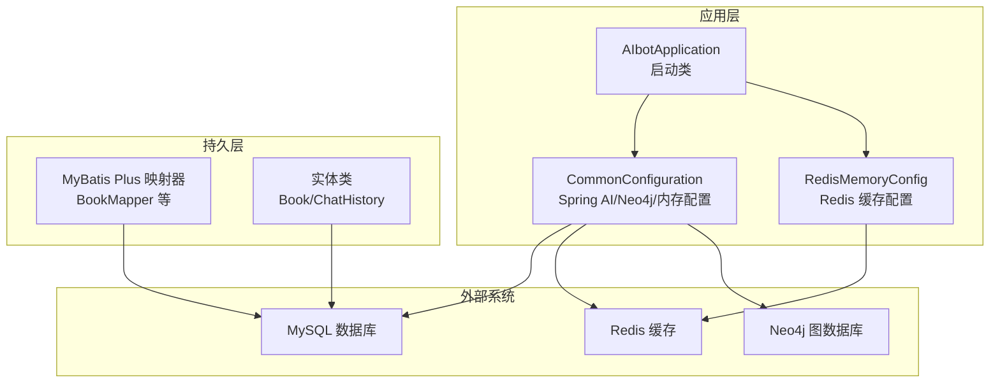
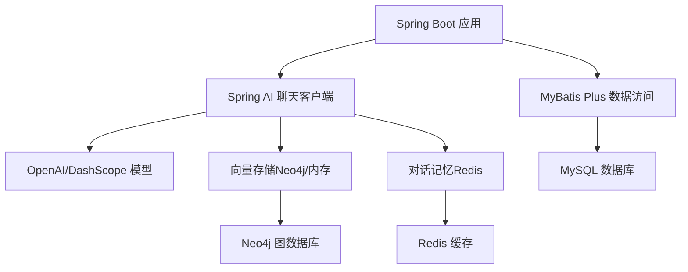
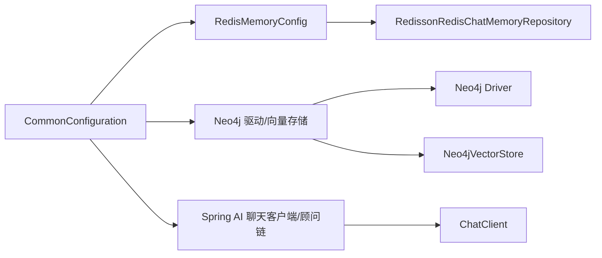

# 开发环境配置

<cite>
**本文引用的文件**
- [pom.xml](file://pom.xml)
- [application.yaml](file://src/main/resources/application.yaml)
- [AIbotApplication.java](file://src/main/java/com/xdu/aibot/AIbotApplication.java)
- [CommonConfiguration.java](file://src/main/java/com/xdu/aibot/config/CommonConfiguration.java)
- [RedisMemoryConfig.java](file://src/main/java/com/xdu/aibot/config/RedisMemoryConfig.java)
- [BookMapper.java](file://src/main/java/com/xdu/aibot/mapper/BookMapper.java)
- [Book.java](file://src/main/java/com/xdu/aibot/pojo/entity/Book.java)
- [ChatHistory.java](file://src/main/java/com/xdu/aibot/pojo/entity/ChatHistory.java)
- [maven-wrapper.properties](file://.mvn/wrapper/maven-wrapper.properties)
- [mvnw.cmd](file://mvnw.cmd)
- [.gitignore](file://.gitignore)
- [chat-pdf.properties](file://chat-pdf.properties)
</cite>

## 目录
1. [简介](#简介)
2. [项目结构](#项目结构)
3. [核心组件](#核心组件)
4. [架构总览](#架构总览)
5. [详细组件分析](#详细组件分析)
6. [依赖分析](#依赖分析)
7. [性能考虑](#性能考虑)
8. [故障排查指南](#故障排查指南)
9. [结论](#结论)
10. [附录](#附录)

## 简介
本指南面向首次参与 AIbot 项目的开发者，提供从 JDK 17 到 IDE 导入、Maven 构建与依赖管理、数据库与缓存配置、Neo4j 图数据库本地部署，以及 Git 版本控制、代码格式化与调试环境的完整配置说明。文档同时覆盖常见环境问题的排查与解决路径，帮助你快速搭建稳定一致的开发环境。

## 项目结构
AIbot 是基于 Spring Boot 3 的 Java 应用，采用 MyBatis Plus 进行数据访问，结合 Spring AI 生态实现向量检索与 RAG 能力，并通过 Redis 缓存对话记忆，Neo4j 存储图谱与向量索引。资源文件集中于 resources 目录，配置以 YAML 为主，Java 源码按功能域分包组织。

图表来源
- [AIbotApplication.java:1-16](file://src/main/java/com/xdu/aibot/AIbotApplication.java#L1-L16)
- [CommonConfiguration.java:1-129](file://src/main/java/com/xdu/aibot/config/CommonConfiguration.java#L1-L129)
- [RedisMemoryConfig.java:1-26](file://src/main/java/com/xdu/aibot/config/RedisMemoryConfig.java#L1-L26)
- [BookMapper.java:1-17](file://src/main/java/com/xdu/aibot/mapper/BookMapper.java#L1-L17)
- [Book.java:1-58](file://src/main/java/com/xdu/aibot/pojo/entity/Book.java#L1-L58)
- [ChatHistory.java:1-23](file://src/main/java/com/xdu/aibot/pojo/entity/ChatHistory.java#L1-L23)

章节来源
- [AIbotApplication.java:1-16](file://src/main/java/com/xdu/aibot/AIbotApplication.java#L1-L16)
- [CommonConfiguration.java:1-129](file://src/main/java/com/xdu/aibot/config/CommonConfiguration.java#L1-L129)
- [RedisMemoryConfig.java:1-26](file://src/main/java/com/xdu/aibot/config/RedisMemoryConfig.java#L1-L26)
- [BookMapper.java:1-17](file://src/main/java/com/xdu/aibot/mapper/BookMapper.java#L1-L17)
- [Book.java:1-58](file://src/main/java/com/xdu/aibot/pojo/entity/Book.java#L1-L58)
- [ChatHistory.java:1-23](file://src/main/java/com/xdu/aibot/pojo/entity/ChatHistory.java#L1-L23)

## 核心组件
- 启动类与扫描
  - 启动类负责加载 Spring Boot 上下文并扫描 Mapper 包，确保 MyBatis Plus 正常工作。
  - 参考路径：[AIbotApplication.java:1-16](file://src/main/java/com/xdu/aibot/AIbotApplication.java#L1-L16)
- 配置类
  - 通用配置：定义向量存储、Neo4j 驱动、聊天客户端与顾问链、嵌入与对话记忆等。
    - 参考路径：[CommonConfiguration.java:1-129](file://src/main/java/com/xdu/aibot/config/CommonConfiguration.java#L1-L129)
  - Redis 内存配置：基于 Redisson 的聊天记忆仓库，连接参数来自配置文件。
    - 参考路径：[RedisMemoryConfig.java:1-26](file://src/main/java/com/xdu/aibot/config/RedisMemoryConfig.java#L1-L26)
- 数据访问
  - Mapper 接口继承 MyBatis Plus 基类，实体类标注表名与主键策略。
    - 示例：[BookMapper.java:1-17](file://src/main/java/com/xdu/aibot/mapper/BookMapper.java#L1-L17)
    - 示例：[Book.java:1-58](file://src/main/java/com/xdu/aibot/pojo/entity/Book.java#L1-L58)
    - 示例：[ChatHistory.java:1-23](file://src/main/java/com/xdu/aibot/pojo/entity/ChatHistory.java#L1-L23)

章节来源
- [AIbotApplication.java:1-16](file://src/main/java/com/xdu/aibot/AIbotApplication.java#L1-L16)
- [CommonConfiguration.java:1-129](file://src/main/java/com/xdu/aibot/config/CommonConfiguration.java#L1-L129)
- [RedisMemoryConfig.java:1-26](file://src/main/java/com/xdu/aibot/config/RedisMemoryConfig.java#L1-L26)
- [BookMapper.java:1-17](file://src/main/java/com/xdu/aibot/mapper/BookMapper.java#L1-L17)
- [Book.java:1-58](file://src/main/java/com/xdu/aibot/pojo/entity/Book.java#L1-L58)
- [ChatHistory.java:1-23](file://src/main/java/com/xdu/aibot/pojo/entity/ChatHistory.java#L1-L23)

## 架构总览
AIbot 的运行时架构围绕“Spring Boot 应用”为核心，向上承载 Spring AI 的聊天客户端与顾问链，向下对接 MySQL、Redis 与 Neo4j。配置文件集中管理各组件的连接信息与行为参数。

图表来源
- [CommonConfiguration.java:74-127](file://src/main/java/com/xdu/aibot/config/CommonConfiguration.java#L74-L127)
- [application.yaml:1-59](file://src/main/resources/application.yaml#L1-L59)

章节来源
- [CommonConfiguration.java:1-129](file://src/main/java/com/xdu/aibot/config/CommonConfiguration.java#L1-L129)
- [application.yaml:1-59](file://src/main/resources/application.yaml#L1-L59)

## 详细组件分析

### JDK 与构建工具
- JDK 17
  - 项目属性指定 Java 版本为 17，需在本地安装对应版本以保证兼容性。
  - 参考路径：[pom.xml 属性区域:29-32](file://pom.xml#L29-L32)
- Maven Wrapper
  - 使用 Maven Wrapper 自动下载并缓存指定版本的 Maven，避免团队成员手工安装。
  - 分发版本与脚本位置参考：
    - [maven-wrapper.properties:1-4](file://.mvn/wrapper/maven-wrapper.properties#L1-L4)
    - [mvnw.cmd:1-190](file://mvnw.cmd#L1-L190)

章节来源
- [pom.xml:29-32](file://pom.xml#L29-L32)
- [.mvn/wrapper/maven-wrapper.properties:1-4](file://.mvn/wrapper/maven-wrapper.properties#L1-L4)
- [mvnw.cmd:1-190](file://mvnw.cmd#L1-L190)

### IDE 设置与项目导入
- 推荐使用 IntelliJ IDEA 或 Eclipse（依据 .gitignore 中的 IDE 忽略规则）
- 导入步骤
  - 打开项目根目录，选择使用 Maven 项目导入
  - 确认 JDK 17 已被识别
  - 等待 Maven 依赖解析完成（可使用 mvnw.cmd 获取统一的 Maven 版本）
- 关键配置
  - 启动类：[AIbotApplication.java:1-16](file://src/main/java/com/xdu/aibot/AIbotApplication.java#L1-L16)
  - Mapper 扫描：[AIbotApplication.java:7-9](file://src/main/java/com/xdu/aibot/AIbotApplication.java#L7-L9)

章节来源
- [AIbotApplication.java:1-16](file://src/main/java/com/xdu/aibot/AIbotApplication.java#L1-L16)
- [.gitignore:16-20](file://.gitignore#L16-L20)
- [mvnw.cmd:1-190](file://mvnw.cmd#L1-L190)

### Maven 依赖管理与版本要点
- Spring Boot 父工程与版本
  - 父 POM 版本用于统一插件与依赖版本，当前为 3.5.10。
  - 参考路径：[pom.xml 父工程段落:5-10](file://pom.xml#L5-L10)
- Java 版本
  - 属性 java.version=17。
  - 参考路径：[pom.xml 属性区域:29-32](file://pom.xml#L29-L32)
- Spring AI 版本与 BOM
  - spring-ai.version=1.1.2；通过 dependencyManagement 引入 spring-ai-bom。
  - 参考路径：[pom.xml 属性与依赖管理:29-32](file://pom.xml#L29-L32), [pom.xml 依赖管理段落:117-127](file://pom.xml#L117-L127)
- 核心依赖
  - Web 启动器、MyBatis Plus、MySQL 驱动、Spring AI OpenAI/DashScope、Neo4j Store/Driver、Redis 启动器、Lombok、HanLP 等。
  - 参考路径：[pom.xml 依赖列表:33-116](file://pom.xml#L33-L116)
- 插件
  - spring-boot-maven-plugin 用于打包与运行。
  - 参考路径：[pom.xml 构建插件段落:129-136](file://pom.xml#L129-L136)

章节来源
- [pom.xml:1-139](file://pom.xml#L1-L139)

### 数据库连接配置
- MySQL
  - 驱动类名、连接 URL、用户名与密码均在配置文件中定义。
  - 参考路径：[application.yaml 数据源配置:30-34](file://src/main/resources/application.yaml#L30-L34)
- MyBatis Plus
  - 启动类已配置 Mapper 扫描包，实体类使用注解映射表与字段。
  - 参考路径：
    - [AIbotApplication.java Mapper 扫描:7-9](file://src/main/java/com/xdu/aibot/AIbotApplication.java#L7-L9)
    - [Book.java 表映射与主键策略:22-31](file://src/main/java/com/xdu/aibot/pojo/entity/Book.java#L22-L31)
    - [ChatHistory.java 表映射与自动填充:9-22](file://src/main/java/com/xdu/aibot/pojo/entity/ChatHistory.java#L9-L22)
    - [BookMapper.java Mapper 接口:1-17](file://src/main/java/com/xdu/aibot/mapper/BookMapper.java#L1-L17)

章节来源
- [application.yaml:30-34](file://src/main/resources/application.yaml#L30-L34)
- [AIbotApplication.java:7-9](file://src/main/java/com/xdu/aibot/AIbotApplication.java#L7-L9)
- [Book.java:1-58](file://src/main/java/com/xdu/aibot/pojo/entity/Book.java#L1-L58)
- [ChatHistory.java:1-23](file://src/main/java/com/xdu/aibot/pojo/entity/ChatHistory.java#L1-L23)
- [BookMapper.java:1-17](file://src/main/java/com/xdu/aibot/mapper/BookMapper.java#L1-L17)

### Redis 缓存设置
- 连接参数
  - 主机、端口、密码与连接池参数在配置文件中定义。
  - 参考路径：[application.yaml Redis 配置:36-45](file://src/main/resources/application.yaml#L36-L45)
- 内存仓库
  - 通过 RedissonRedisChatMemoryRepository 构建聊天记忆仓库，注入到顾问链中。
  - 参考路径：
    - [RedisMemoryConfig.java Bean 定义:18-25](file://src/main/java/com/xdu/aibot/config/RedisMemoryConfig.java#L18-L25)
    - [CommonConfiguration.java 聊天客户端与顾问链:74-88](file://src/main/java/com/xdu/aibot/config/CommonConfiguration.java#L74-L88)

章节来源
- [application.yaml:36-45](file://src/main/resources/application.yaml#L36-L45)
- [RedisMemoryConfig.java:1-26](file://src/main/java/com/xdu/aibot/config/RedisMemoryConfig.java#L1-L26)
- [CommonConfiguration.java:74-88](file://src/main/java/com/xdu/aibot/config/CommonConfiguration.java#L74-L88)

### Neo4j 图数据库本地部署与配置
- 远程示例配置
  - 当前配置指向远程 Neo4j 数据库（云服务），包含认证信息与向量存储参数。
  - 参考路径：[application.yaml Neo4j 与向量存储配置:4-16](file://src/main/resources/application.yaml#L4-L16)
- 本地部署建议
  - 下载并安装 Neo4j Desktop 或 Server，创建数据库实例，启用向量扩展或使用向量存储适配方案。
  - 将 application.yaml 中的 neo4j.uri、用户名与密码替换为本地地址与凭据。
  - 若使用本地向量存储，保持向量索引与距离度量参数一致。
- 驱动与依赖
  - 项目已引入 spring-ai-neo4j-store 与 spring-boot-starter-data-neo4j，以及 Neo4j Java Driver。
  - 参考路径：[pom.xml Neo4j 相关依赖:93-110](file://pom.xml#L93-L110), [CommonConfiguration.java Neo4j 驱动与向量存储:52-70](file://src/main/java/com/xdu/aibot/config/CommonConfiguration.java#L52-L70)

章节来源
- [application.yaml:4-16](file://src/main/resources/application.yaml#L4-L16)
- [pom.xml:93-110](file://pom.xml#L93-L110)
- [CommonConfiguration.java:52-70](file://src/main/java/com/xdu/aibot/config/CommonConfiguration.java#L52-L70)

### 开发工具链配置
- Git
  - .gitignore 已屏蔽 IDE、Maven、构建产物等，确保仓库整洁。
  - 参考路径：[.gitignore:1-34](file://.gitignore#L1-L34)
- 代码格式化与检查
  - 建议在 IDE 中启用 Google Java Format 或 Spotless/Maven 插件，统一风格。
  - 本仓库未包含格式化配置文件，可在本地 IDE 中设置默认风格。
- 调试环境
  - application.yaml 已开启多模块调试日志级别，便于定位问题。
  - 参考路径：[application.yaml 日志配置:52-59](file://src/main/resources/application.yaml#L52-L59)

章节来源
- [.gitignore:1-34](file://.gitignore#L1-L34)
- [application.yaml:52-59](file://src/main/resources/application.yaml#L52-L59)

## 依赖分析
- 组件耦合
  - CommonConfiguration 作为装配中心，依赖 Redis、Neo4j 与 Spring AI 组件，形成“配置即服务”的模式。
  - RedisMemoryConfig 仅负责 Redis 连接参数的 Bean 注册，职责单一。
- 外部依赖
  - MySQL、Redis、Neo4j 的连接参数集中于 application.yaml，便于切换环境。
- 版本一致性
  - 通过 Spring AI BOM 与 Spring Boot 父 POM 管理版本，降低冲突风险。

图表来源
- [CommonConfiguration.java:34-129](file://src/main/java/com/xdu/aibot/config/CommonConfiguration.java#L34-L129)
- [RedisMemoryConfig.java:1-26](file://src/main/java/com/xdu/aibot/config/RedisMemoryConfig.java#L1-L26)
- [application.yaml:1-59](file://src/main/resources/application.yaml#L1-L59)

章节来源
- [CommonConfiguration.java:1-129](file://src/main/java/com/xdu/aibot/config/CommonConfiguration.java#L1-L129)
- [RedisMemoryConfig.java:1-26](file://src/main/java/com/xdu/aibot/config/RedisMemoryConfig.java#L1-L26)
- [application.yaml:1-59](file://src/main/resources/application.yaml#L1-L59)

## 性能考虑
- 向量检索
  - 合理设置相似度阈值与 topK，平衡召回与性能。
  - 参考路径：[CommonConfiguration.java 检索参数:102-108](file://src/main/java/com/xdu/aibot/config/CommonConfiguration.java#L102-L108)
- 缓存池
  - 根据并发量调整 Redis 连接池大小，避免阻塞。
  - 参考路径：[application.yaml Redis 连接池:40-45](file://src/main/resources/application.yaml#L40-L45)
- 日志级别
  - 开发阶段可开启 debug，生产关闭以减少 IO。
  - 参考路径：[application.yaml 日志级别:52-59](file://src/main/resources/application.yaml#L52-L59)

章节来源
- [CommonConfiguration.java:102-108](file://src/main/java/com/xdu/aibot/config/CommonConfiguration.java#L102-L108)
- [application.yaml:40-45](file://src/main/resources/application.yaml#L40-L45)
- [application.yaml:52-59](file://src/main/resources/application.yaml#L52-L59)

## 故障排查指南
- 启动失败（JDK 版本不匹配）
  - 现象：编译或运行时报错，提示不支持的 JDK 版本。
  - 处理：确认本地 JDK 为 17，清理并重新导入项目。
  - 参考路径：[pom.xml 属性区域:29-32](file://pom.xml#L29-L32)
- Maven 依赖解析异常
  - 现象：无法下载依赖或版本冲突。
  - 处理：使用 mvnw.cmd 获取统一 Maven 版本，刷新依赖。
  - 参考路径：
    - [maven-wrapper.properties:1-4](file://.mvn/wrapper/maven-wrapper.properties#L1-L4)
    - [mvnw.cmd:1-190](file://mvnw.cmd#L1-L190)
- 数据库连接失败
  - 现象：启动时报错无法连接 MySQL。
  - 处理：核对 application.yaml 中的驱动类名、URL、用户名与密码。
  - 参考路径：[application.yaml 数据源配置:30-34](file://src/main/resources/application.yaml#L30-L34)
- Redis 连接失败
  - 现象：聊天记忆无法持久化。
  - 处理：核对主机、端口与密码；确认 Redis 服务可用。
  - 参考路径：[application.yaml Redis 配置:36-45](file://src/main/resources/application.yaml#L36-L45)
- Neo4j 连接失败
  - 现象：向量存储初始化或查询报错。
  - 处理：核对 URI、用户名与密码；如使用本地部署，确保服务可达且启用所需扩展。
  - 参考路径：[application.yaml Neo4j 配置:4-16](file://src/main/resources/application.yaml#L4-L16)
- 日志辅助定位
  - 开启相关包的日志级别以获取详细信息。
  - 参考路径：[application.yaml 日志配置:52-59](file://src/main/resources/application.yaml#L52-L59)

章节来源
- [pom.xml:29-32](file://pom.xml#L29-L32)
- [.mvn/wrapper/maven-wrapper.properties:1-4](file://.mvn/wrapper/maven-wrapper.properties#L1-L4)
- [mvnw.cmd:1-190](file://mvnw.cmd#L1-L190)
- [application.yaml:30-34](file://src/main/resources/application.yaml#L30-L34)
- [application.yaml:36-45](file://src/main/resources/application.yaml#L36-L45)
- [application.yaml:4-16](file://src/main/resources/application.yaml#L4-L16)
- [application.yaml:52-59](file://src/main/resources/application.yaml#L52-L59)

## 结论
通过本指南，你可以完成从 JDK 17 到 IDE 导入、Maven 构建、数据库与缓存配置、Neo4j 图数据库部署，以及 Git、代码格式化与调试环境的全套准备。建议在本地先完成 MySQL、Redis 与 Neo4j 的基础连通性验证，再启动应用进行端到端测试。

## 附录
- 其他资源文件
  - PDF 聊天相关属性文件，用于记录与处理 PDF 文件。
  - 参考路径：[chat-pdf.properties:1-4](file://chat-pdf.properties#L1-L4)

章节来源
- [chat-pdf.properties:1-4](file://chat-pdf.properties#L1-L4)