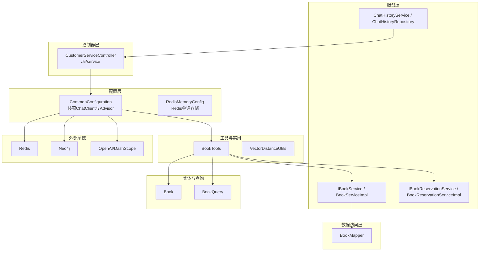
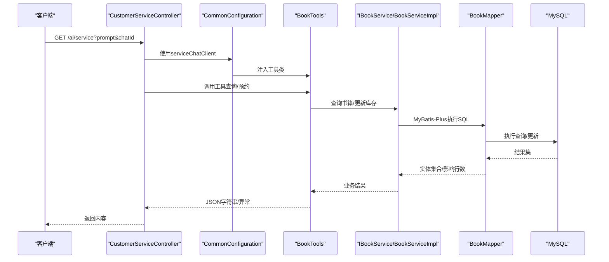
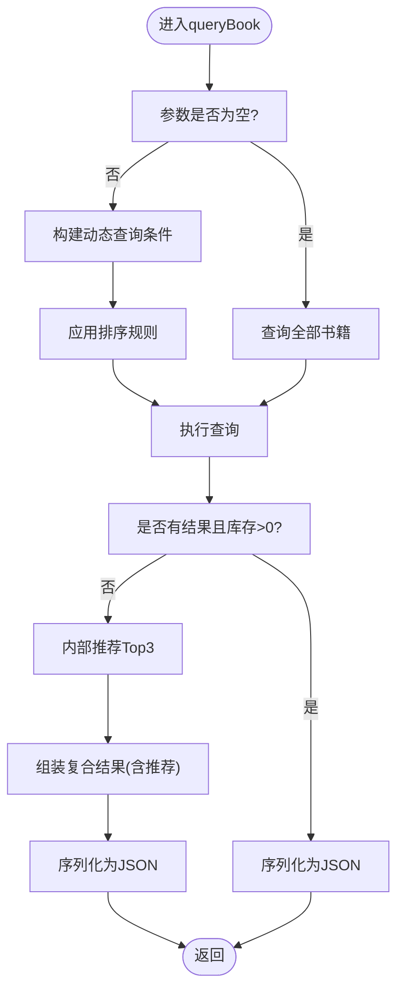
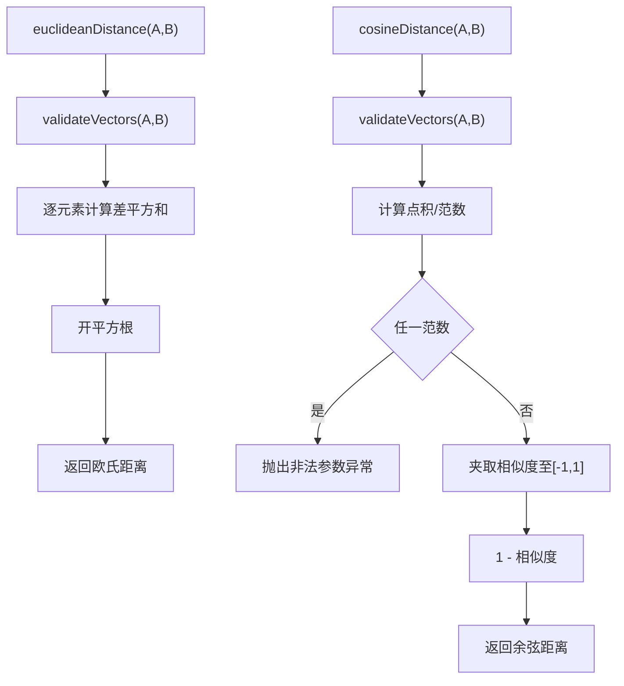
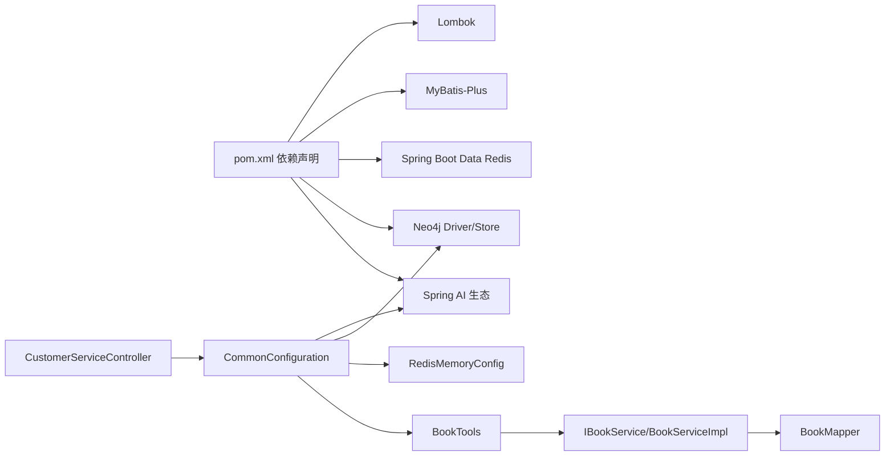

# 最佳实践与重构

<cite>
**本文引用的文件**
- [BookTools.java](file://src/main/java/com/xdu/aibot/tools/BookTools.java)
- [VectorDistanceUtils.java](file://src/main/java/com/xdu/aibot/util/VectorDistanceUtils.java)
- [CommonConfiguration.java](file://src/main/java/com/xdu/aibot/config/CommonConfiguration.java)
- [RedisMemoryConfig.java](file://src/main/java/com/xdu/aibot/config/RedisMemoryConfig.java)
- [BookServiceImpl.java](file://src/main/java/com/xdu/aibot/service/impl/BookServiceImpl.java)
- [IBookService.java](file://src/main/java/com/xdu/aibot/service/IBookService.java)
- [BookMapper.java](file://src/main/java/com/xdu/aibot/mapper/BookMapper.java)
- [Book.java](file://src/main/java/com/xdu/aibot/pojo/entity/Book.java)
- [BookQuery.java](file://src/main/java/com/xdu/aibot/pojo/query/BookQuery.java)
- [CustomerServiceController.java](file://src/main/java/com/xdu/aibot/controller/CustomerServiceController.java)
- [ChatType.java](file://src/main/java/com/xdu/aibot/constant/ChatType.java)
- [application.yaml](file://src/main/resources/application.yaml)
- [pom.xml](file://pom.xml)
- [ChatHistoryRepository.java](file://src/main/java/com/xdu/aibot/repository/ChatHistoryRepository.java)
- [ChatHistoryService.java](file://src/main/java/com/xdu/aibot/service/ChatHistoryService.java)
- [Result.java](file://src/main/java/com/xdu/aibot/pojo/vo/Result.java)
</cite>

## 目录
1. [引言](#引言)
2. [项目结构](#项目结构)
3. [核心组件](#核心组件)
4. [架构总览](#架构总览)
5. [详细组件分析](#详细组件分析)
6. [依赖分析](#依赖分析)
7. [性能考虑](#性能考虑)
8. [故障排查指南](#故障排查指南)
9. [结论](#结论)
10. [附录](#附录)

## 引言
本指南面向AIbot项目，系统性阐述代码重构原则与方法，重点围绕以下主题展开：
- 工具类重构：以BookTools为例，说明从“功能堆叠”到“职责清晰、可测试、可扩展”的演进路径
- 工具类优化：以VectorDistanceUtils为例，总结纯工具类的参数校验、异常处理与数值稳定性策略
- 设计模式应用：工具类设计、配置类管理、服务层封装与接口契约
- 性能优化：数据库查询优化、缓存策略、异步处理与向量相似度计算的工程化要点
- 代码复用与接口设计：统一返回体、查询对象与领域模型的协同
- 异常处理最佳实践：参数校验、运行时异常与幂等控制
- 代码审查清单、质量评估标准与持续改进策略

## 项目结构
AIbot采用Spring Boot + MyBatis-Plus + Spring AI的分层架构，主要模块如下：
- 配置层：负责外部系统连接（Neo4j、Redis、OpenAI/DashScope）、ChatClient装配与Advisor链路
- 控制器层：对外提供REST接口，驱动ChatClient完成对话与工具调用
- 服务层：封装业务逻辑，提供IBookService等接口与默认实现
- 数据访问层：基于MyBatis-Plus的Mapper接口
- 实体与查询对象：Book、BookQuery等
- 工具与实用类：BookTools（工具类）、VectorDistanceUtils（纯工具类）
- 缓存与内存：RedissonRedisChatMemoryRepository用于会话记忆

图表来源
- [CommonConfiguration.java:34-128](file://src/main/java/com/xdu/aibot/config/CommonConfiguration.java#L34-L128)
- [RedisMemoryConfig.java:9-25](file://src/main/java/com/xdu/aibot/config/RedisMemoryConfig.java#L9-L25)
- [CustomerServiceController.java:14-35](file://src/main/java/com/xdu/aibot/controller/CustomerServiceController.java#L14-L35)
- [BookTools.java:22-126](file://src/main/java/com/xdu/aibot/tools/BookTools.java#L22-L126)
- [BookServiceImpl.java:17-20](file://src/main/java/com/xdu/aibot/service/impl/BookServiceImpl.java#L17-L20)
- [BookMapper.java:14-16](file://src/main/java/com/xdu/aibot/mapper/BookMapper.java#L14-L16)
- [Book.java:23-57](file://src/main/java/com/xdu/aibot/pojo/entity/Book.java#L23-L57)
- [BookQuery.java:9-29](file://src/main/java/com/xdu/aibot/pojo/query/BookQuery.java#L9-L29)

章节来源
- [CommonConfiguration.java:34-128](file://src/main/java/com/xdu/aibot/config/CommonConfiguration.java#L34-L128)
- [RedisMemoryConfig.java:9-25](file://src/main/java/com/xdu/aibot/config/RedisMemoryConfig.java#L9-L25)
- [CustomerServiceController.java:14-35](file://src/main/java/com/xdu/aibot/controller/CustomerServiceController.java#L14-L35)
- [BookTools.java:22-126](file://src/main/java/com/xdu/aibot/tools/BookTools.java#L22-L126)
- [BookServiceImpl.java:17-20](file://src/main/java/com/xdu/aibot/service/impl/BookServiceImpl.java#L17-L20)
- [BookMapper.java:14-16](file://src/main/java/com/xdu/aibot/mapper/BookMapper.java#L14-L16)
- [Book.java:23-57](file://src/main/java/com/xdu/aibot/pojo/entity/Book.java#L23-L57)
- [BookQuery.java:9-29](file://src/main/java/com/xdu/aibot/pojo/query/BookQuery.java#L9-L29)

## 核心组件
- BookTools：作为Spring AI工具类，承担“查询书籍+库存不足时的智能推荐+预约下单”的闭环能力；内部通过IBookService与IBookReservationService协作，并对库存变更进行事务保护
- VectorDistanceUtils：纯静态工具类，提供向量运算与距离计算，包含严格的参数校验与数值稳定性处理
- CommonConfiguration：集中装配ChatClient、Advisor链、向量存储与Neo4j图RAG适配器，统一系统提示词与会话记忆
- RedisMemoryConfig：提供Redis会话记忆仓库，支撑多轮对话状态持久化
- IBookService/BookServiceImpl/BookMapper/Book：服务层、数据映射与实体模型，遵循MyBatis-Plus约定式开发
- BookQuery：工具类输入参数的标准化载体，支持多维过滤与排序
- CustomerServiceController：对外HTTP入口，注入serviceChatClient并转发用户消息

章节来源
- [BookTools.java:22-126](file://src/main/java/com/xdu/aibot/tools/BookTools.java#L22-L126)
- [VectorDistanceUtils.java:3-111](file://src/main/java/com/xdu/aibot/util/VectorDistanceUtils.java#L3-L111)
- [CommonConfiguration.java:34-128](file://src/main/java/com/xdu/aibot/config/CommonConfiguration.java#L34-L128)
- [RedisMemoryConfig.java:9-25](file://src/main/java/com/xdu/aibot/config/RedisMemoryConfig.java#L9-L25)
- [IBookService.java:14-16](file://src/main/java/com/xdu/aibot/service/IBookService.java#L14-L16)
- [BookServiceImpl.java:17-20](file://src/main/java/com/xdu/aibot/service/impl/BookServiceImpl.java#L17-L20)
- [BookMapper.java:14-16](file://src/main/java/com/xdu/aibot/mapper/BookMapper.java#L14-L16)
- [Book.java:23-57](file://src/main/java/com/xdu/aibot/pojo/entity/Book.java#L23-L57)
- [BookQuery.java:9-29](file://src/main/java/com/xdu/aibot/pojo/query/BookQuery.java#L9-L29)
- [CustomerServiceController.java:14-35](file://src/main/java/com/xdu/aibot/controller/CustomerServiceController.java#L14-L35)

## 架构总览
AIbot通过配置类装配ChatClient与Advisor链，结合工具类与服务层实现“自然语言—工具—数据库”的闭环。Redis提供会话记忆，Neo4j与向量存储支撑图RAG问答。

图表来源
- [CustomerServiceController.java:25-33](file://src/main/java/com/xdu/aibot/controller/CustomerServiceController.java#L25-L33)
- [CommonConfiguration.java:74-88](file://src/main/java/com/xdu/aibot/config/CommonConfiguration.java#L74-L88)
- [BookTools.java:32-82](file://src/main/java/com/xdu/aibot/tools/BookTools.java#L32-L82)
- [BookServiceImpl.java:17-20](file://src/main/java/com/xdu/aibot/service/impl/BookServiceImpl.java#L17-L20)
- [BookMapper.java:14-16](file://src/main/java/com/xdu/aibot/mapper/BookMapper.java#L14-L16)

## 详细组件分析

### BookTools重构案例
重构目标
- 将“查询+库存判断+推荐+序列化”的流程拆分为清晰职责：查询、判定、推荐、序列化
- 明确异常边界：参数非法、资源不存在、库存不足、更新失败等
- 提升可测试性：将内部推荐逻辑抽取为独立方法，便于单元测试
- 保证幂等与一致性：预约流程使用@Transactional，库存扣减与记录写入原子化

重构建议
- 输入参数标准化：使用BookQuery承载过滤与排序，避免散落的字符串参数
- 输出格式统一：返回JSON字符串或错误信息，保持对外一致的契约
- 推荐策略可插拔：将internalRecommendBooks抽象为策略接口，便于替换算法
- 日志与可观测性：在关键分支打印日志，便于定位问题
- 安全与健壮性：对空指针、空结果、序列化异常进行兜底

图表来源
- [BookTools.java:32-82](file://src/main/java/com/xdu/aibot/tools/BookTools.java#L32-L82)
- [BookQuery.java:9-29](file://src/main/java/com/xdu/aibot/pojo/query/BookQuery.java#L9-L29)

章节来源
- [BookTools.java:32-125](file://src/main/java/com/xdu/aibot/tools/BookTools.java#L32-L125)
- [BookQuery.java:9-29](file://src/main/java/com/xdu/aibot/pojo/query/BookQuery.java#L9-L29)

### VectorDistanceUtils优化策略
优化要点
- 参数校验：统一validateVectors，拒绝null、长度不等、空数组
- 数值稳定性：引入EPSILON处理零向量与浮点误差，限制相似度在[-1,1]区间
- 异常语义：明确抛出IllegalArgumentException，便于上层捕获与提示
- 可读性与可维护性：每个方法职责单一，命名清晰，注释完整

图表来源
- [VectorDistanceUtils.java:18-62](file://src/main/java/com/xdu/aibot/util/VectorDistanceUtils.java#L18-L62)

章节来源
- [VectorDistanceUtils.java:3-111](file://src/main/java/com/xdu/aibot/util/VectorDistanceUtils.java#L3-L111)

### 设计模式与最佳实践
- 工具类设计
  - 无状态、纯静态方法，必要时提供工厂或Builder
  - 统一异常类型与错误码，避免吞掉异常
  - 对外输出格式稳定，便于前端解析
- 配置类管理
  - 将外部系统连接、模型参数、Advisor链集中管理，降低耦合
  - Bean作用域与生命周期明确，避免循环依赖
- 服务层封装
  - IXXXService接口+ServiceImpl默认实现，遵循MyBatis-Plus约定
  - 业务方法尽量短小，复杂逻辑下沉到工具类或策略
- 接口设计规范
  - 统一返回体：Result类提供成功/失败模板
  - 查询对象：BookQuery统一过滤与排序参数
  - 实体模型：Book字段与数据库一致，使用注解声明主键与表名

章节来源
- [Result.java:6-24](file://src/main/java/com/xdu/aibot/pojo/vo/Result.java#L6-L24)
- [BookQuery.java:9-29](file://src/main/java/com/xdu/aibot/pojo/query/BookQuery.java#L9-L29)
- [Book.java:23-57](file://src/main/java/com/xdu/aibot/pojo/entity/Book.java#L23-L57)
- [CommonConfiguration.java:34-128](file://src/main/java/com/xdu/aibot/config/CommonConfiguration.java#L34-L128)

## 依赖分析
- 外部依赖
  - Spring AI生态：OpenAI/DashScope模型、向量存储、Advisor链、PDF阅读器
  - Neo4j：Java Driver与Neo4j向量存储
  - Redis：会话记忆
  - MySQL：MyBatis-Plus数据源
- 内部依赖
  - BookTools依赖IBookService与IBookReservationService
  - CommonConfiguration依赖BookTools、Redis会话仓库与Neo4jClient
  - 控制器依赖ChatClient与ChatHistoryRepository

图表来源
- [pom.xml:33-116](file://pom.xml#L33-L116)
- [CommonConfiguration.java:34-128](file://src/main/java/com/xdu/aibot/config/CommonConfiguration.java#L34-L128)
- [RedisMemoryConfig.java:9-25](file://src/main/java/com/xdu/aibot/config/RedisMemoryConfig.java#L9-L25)
- [CustomerServiceController.java:14-35](file://src/main/java/com/xdu/aibot/controller/CustomerServiceController.java#L14-L35)
- [BookTools.java:22-126](file://src/main/java/com/xdu/aibot/tools/BookTools.java#L22-L126)
- [BookServiceImpl.java:17-20](file://src/main/java/com/xdu/aibot/service/impl/BookServiceImpl.java#L17-L20)
- [BookMapper.java:14-16](file://src/main/java/com/xdu/aibot/mapper/BookMapper.java#L14-L16)

章节来源
- [pom.xml:33-116](file://pom.xml#L33-L116)
- [application.yaml:1-59](file://src/main/resources/application.yaml#L1-L59)

## 性能考虑
- 数据库查询优化
  - 使用MyBatis-Plus链式查询，按需拼装条件，避免N+1
  - 对常用过滤字段建立索引（如name、author、type），减少全表扫描
  - 排序字段合理利用索引，避免大结果集排序
- 缓存策略
  - Redis会话记忆：通过MessageWindowChatMemory限制消息窗口，降低上下文成本
  - 向量检索：调整相似度阈值与topK，平衡召回与性能
- 异步处理
  - 对非阻塞IO与网络调用（OpenAI/DashScope）采用响应式流或异步任务
  - 避免在请求线程中执行耗时的数据库更新或文件处理
- 向量计算
  - VectorDistanceUtils已具备数值稳定性与参数校验，建议在批量计算时复用数组，减少分配
  - 对高维向量，优先使用近似最近邻（ANN）策略（如向量存储配置）

章节来源
- [CommonConfiguration.java:96-127](file://src/main/java/com/xdu/aibot/config/CommonConfiguration.java#L96-L127)
- [RedisMemoryConfig.java:18-25](file://src/main/java/com/xdu/aibot/config/RedisMemoryConfig.java#L18-L25)
- [VectorDistanceUtils.java:18-62](file://src/main/java/com/xdu/aibot/util/VectorDistanceUtils.java#L18-L62)

## 故障排查指南
常见问题与对策
- 工具类序列化失败
  - 现象：返回“JSON序列化错误”
  - 排查：确认对象属性可序列化，避免循环引用；必要时使用DTO
- 库存不足或资源不存在
  - 现象：抛出IllegalArgumentException或IllegalStateException
  - 排查：核对书名唯一性、库存状态与更新是否成功
- 向量计算异常
  - 现象：抛出IllegalArgumentException（零向量或参数非法）
  - 排查：检查维度一致性、非空性与EPSILON阈值
- 会话记忆未生效
  - 现象：多轮对话丢失
  - 排查：确认Redis连接参数、会话ID传递与Advisor链顺序

章节来源
- [BookTools.java:69-81](file://src/main/java/com/xdu/aibot/tools/BookTools.java#L69-L81)
- [BookTools.java:103-117](file://src/main/java/com/xdu/aibot/tools/BookTools.java#L103-L117)
- [VectorDistanceUtils.java:52-55](file://src/main/java/com/xdu/aibot/util/VectorDistanceUtils.java#L52-L55)
- [application.yaml:35-45](file://src/main/resources/application.yaml#L35-L45)

## 结论
通过将BookTools从“功能堆叠”重构为“职责清晰、可测试、可扩展”的工具类，并对VectorDistanceUtils进行参数校验与数值稳定性优化，AIbot在保持简洁的同时提升了可靠性与可维护性。配合统一的配置管理、服务层封装与接口设计规范，项目具备良好的演进空间。建议持续引入单元测试、集成测试与性能压测，完善可观测性与告警体系，推动持续改进。

## 附录

### 代码审查清单
- 代码结构
  - 是否遵循分层与单一职责
  - 工具类是否无状态、方法是否纯函数化
  - 配置类是否集中管理外部依赖
- 接口与契约
  - 输入参数是否标准化（如BookQuery）
  - 输出格式是否统一（如Result/JSON）
  - 异常类型是否明确且可预期
- 性能与安全
  - 是否存在N+1与全表扫描
  - 是否对输入参数进行严格校验
  - 是否使用事务保证关键路径一致性
- 可测试性
  - 是否提供Mock与单元测试覆盖
  - 是否支持隔离环境（测试数据库/Redis）

### 质量评估标准
- 可靠性：异常处理完备、边界条件覆盖、幂等性保障
- 可维护性：代码可读、注释清晰、依赖关系简单
- 性能：查询与向量计算优化、缓存命中率、响应时间达标
- 可观测性：日志分级、关键指标埋点、告警机制

### 持续改进策略
- 建立CI/CD流水线，强制执行代码审查与测试覆盖率
- 引入静态分析工具（如SpotBugs/PMD）与格式化工具（Lombok规范）
- 定期进行性能回归测试与压力测试
- 逐步引入监控与APM，完善端到端追踪