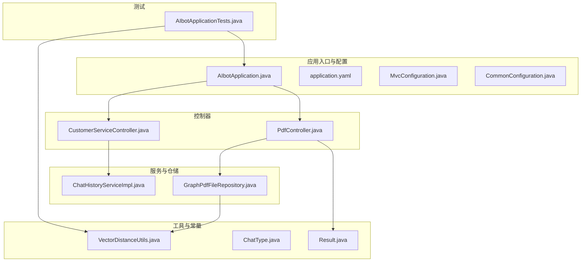
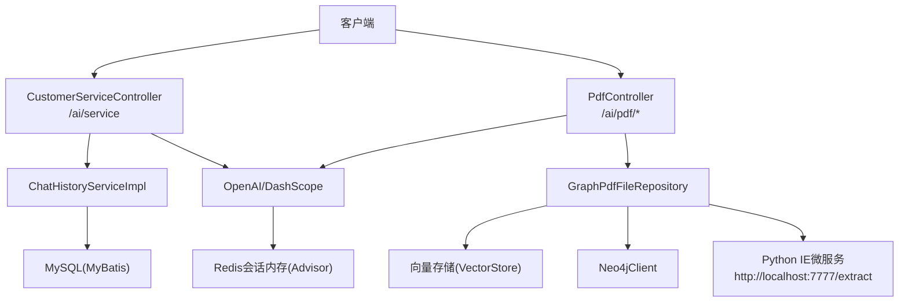
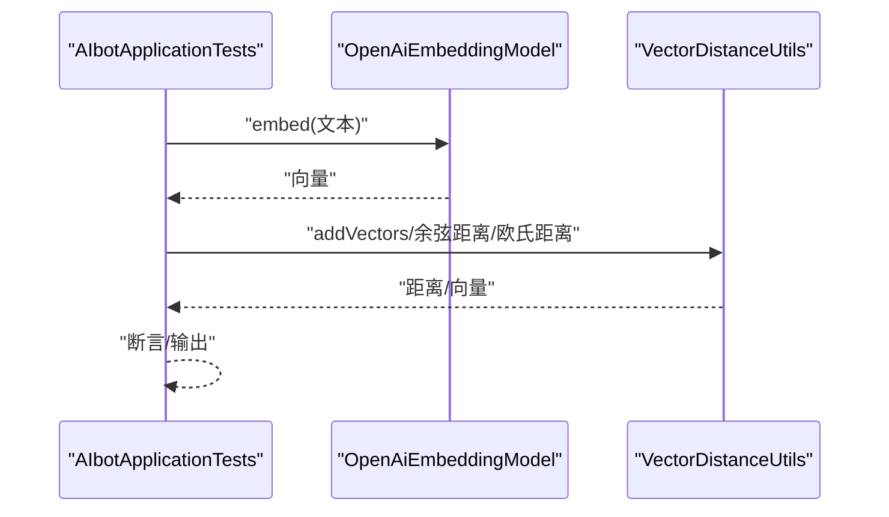
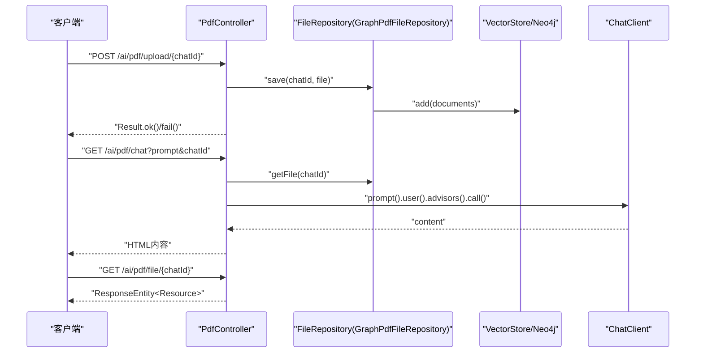
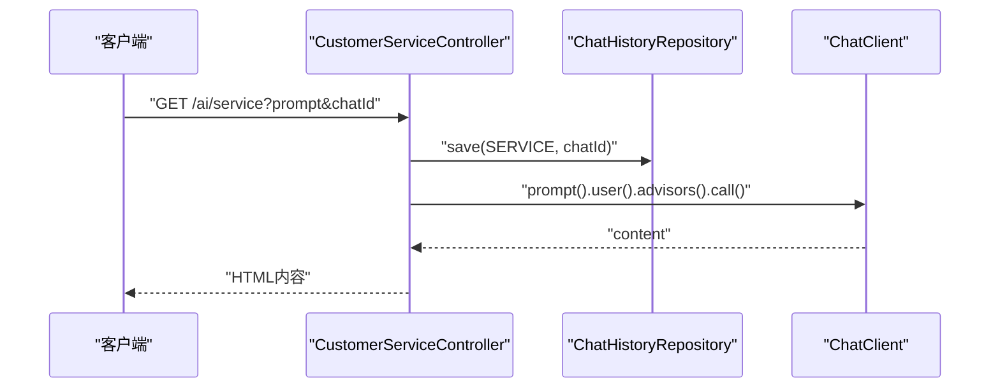
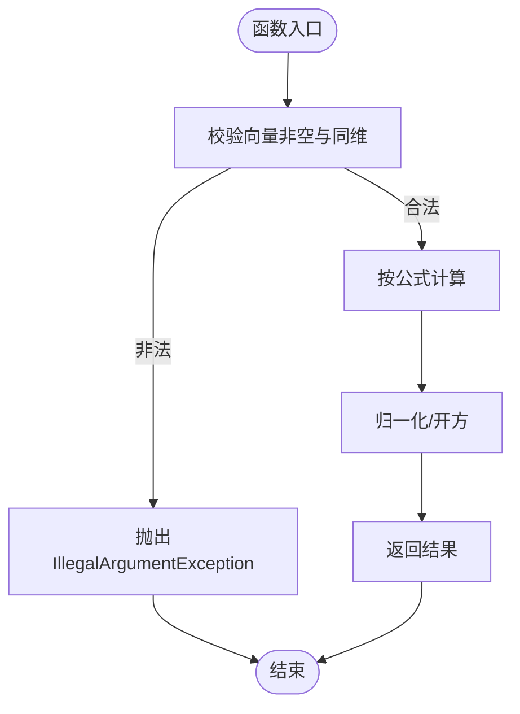
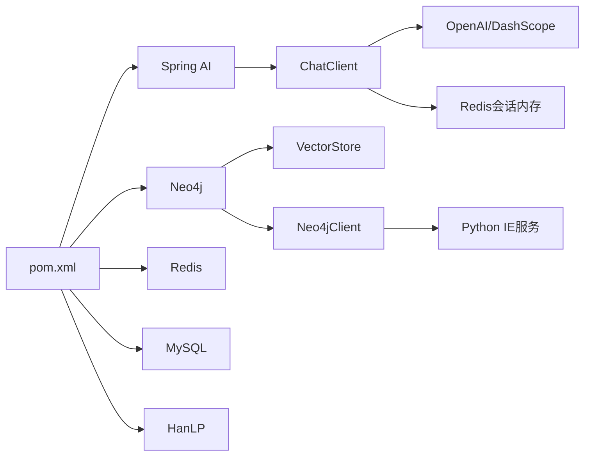

# 调试与测试

<cite>
**本文引用的文件**
- [AIbotApplicationTests.java](file://src/test/java/com/xdu/aibot/AIbotApplicationTests.java)
- [pom.xml](file://pom.xml)
- [AIbotApplication.java](file://src/main/java/com/xdu/aibot/AIbotApplication.java)
- [application.yaml](file://src/main/resources/application.yaml)
- [CustomerServiceController.java](file://src/main/java/com/xdu/aibot/controller/CustomerServiceController.java)
- [PdfController.java](file://src/main/java/com/xdu/aibot/controller/PdfController.java)
- [VectorDistanceUtils.java](file://src/main/java/com/xdu/aibot/util/VectorDistanceUtils.java)
- [ChatHistoryServiceImpl.java](file://src/main/java/com/xdu/aibot/service/impl/ChatHistoryServiceImpl.java)
- [GraphPdfFileRepository.java](file://src/main/java/com/xdu/aibot/repository/Impl/GraphPdfFileRepository.java)
- [ChatType.java](file://src/main/java/com/xdu/aibot/constant/ChatType.java)
- [CommonConfiguration.java](file://src/main/java/com/xdu/aibot/config/CommonConfiguration.java)
- [MvcConfiguration.java](file://src/main/java/com/xdu/aibot/config/MvcConfiguration.java)
- [Result.java](file://src/main/java/com/xdu/aibot/pojo/vo/Result.java)
</cite>

## 目录
1. [简介](#简介)
2. [项目结构](#项目结构)
3. [核心组件](#核心组件)
4. [架构总览](#架构总览)
5. [详细组件分析](#详细组件分析)
6. [依赖分析](#依赖分析)
7. [性能考虑](#性能考虑)
8. [故障排查指南](#故障排查指南)
9. [结论](#结论)
10. [附录](#附录)

## 简介
本指南面向AIbot项目的开发与测试团队，系统性阐述单元测试与集成测试的编写方法、调试技巧与工具使用、测试数据准备与Mock策略、测试环境隔离方案，以及自动化测试与持续集成配置建议和测试覆盖率分析思路。文档以现有代码为依据，结合控制器、服务与工具类的职责边界，给出可落地的实践步骤。

## 项目结构
AIbot采用Spring Boot标准目录组织，核心模块包括：
- 应用入口与配置：AIbotApplication、application.yaml、MvcConfiguration、CommonConfiguration
- 控制器层：CustomerServiceController、PdfController
- 业务服务：ChatHistoryServiceImpl
- 数据访问与存储：MyBatis Mapper接口与实现、FileRepository（GraphPdfFileRepository）
- 工具类：VectorDistanceUtils
- 测试：AIbotApplicationTests（当前包含嵌入向量、Neo4j连通性与向量距离示例）

图表来源
- [AIbotApplication.java:1-16](file://src/main/java/com/xdu/aibot/AIbotApplication.java#L1-L16)
- [application.yaml:1-59](file://src/main/resources/application.yaml#L1-L59)
- [MvcConfiguration.java:1-18](file://src/main/java/com/xdu/aibot/config/MvcConfiguration.java#L1-L18)
- [CommonConfiguration.java:34-58](file://src/main/java/com/xdu/aibot/config/CommonConfiguration.java#L34-L58)
- [CustomerServiceController.java:1-35](file://src/main/java/com/xdu/aibot/controller/CustomerServiceController.java#L1-L35)
- [PdfController.java:1-98](file://src/main/java/com/xdu/aibot/controller/PdfController.java#L1-L98)
- [ChatHistoryServiceImpl.java:1-63](file://src/main/java/com/xdu/aibot/service/impl/ChatHistoryServiceImpl.java#L1-L63)
- [GraphPdfFileRepository.java:1-262](file://src/main/java/com/xdu/aibot/repository/Impl/GraphPdfFileRepository.java#L1-L262)
- [VectorDistanceUtils.java:1-111](file://src/main/java/com/xdu/aibot/util/VectorDistanceUtils.java#L1-L111)
- [ChatType.java:1-17](file://src/main/java/com/xdu/aibot/constant/ChatType.java#L1-L17)
- [Result.java:1-24](file://src/main/java/com/xdu/aibot/pojo/vo/Result.java#L1-L24)
- [AIbotApplicationTests.java:1-104](file://src/test/java/com/xdu/aibot/AIbotApplicationTests.java#L1-L104)

章节来源
- [AIbotApplication.java:1-16](file://src/main/java/com/xdu/aibot/AIbotApplication.java#L1-L16)
- [application.yaml:1-59](file://src/main/resources/application.yaml#L1-L59)
- [AIbotApplicationTests.java:1-104](file://src/test/java/com/xdu/aibot/AIbotApplicationTests.java#L1-L104)

## 核心组件
- 应用入口与配置
  - AIbotApplication：Spring Boot启动类，启用Mapper扫描
  - application.yaml：数据库、Redis、Neo4j、OpenAI/DashScope、日志级别等全局配置
  - MvcConfiguration：CORS跨域配置，暴露Content-Disposition响应头
  - CommonConfiguration：向量存储、Neo4j驱动Bean注册
- 控制器
  - CustomerServiceController：REST接口“/ai/service”，基于ChatClient与Advisor参数化会话记忆
  - PdfController：REST接口“/ai/pdf/chat”、“/ai/pdf/upload/{chatId}”、“/ai/pdf/file/{chatId}”，封装PDF上传、下载与问答
- 服务与仓储
  - ChatHistoryServiceImpl：会话历史持久化与查询
  - GraphPdfFileRepository：PDF解析、向量入库、调用Python微服务抽取实体关系、写入Neo4j
- 工具与常量
  - VectorDistanceUtils：向量加减、欧氏距离、余弦距离计算与参数校验
  - ChatType：会话类型枚举
  - Result：统一响应包装

章节来源
- [AIbotApplication.java:1-16](file://src/main/java/com/xdu/aibot/AIbotApplication.java#L1-L16)
- [application.yaml:1-59](file://src/main/resources/application.yaml#L1-L59)
- [MvcConfiguration.java:1-18](file://src/main/java/com/xdu/aibot/config/MvcConfiguration.java#L1-L18)
- [CommonConfiguration.java:34-58](file://src/main/java/com/xdu/aibot/config/CommonConfiguration.java#L34-L58)
- [CustomerServiceController.java:1-35](file://src/main/java/com/xdu/aibot/controller/CustomerServiceController.java#L1-L35)
- [PdfController.java:1-98](file://src/main/java/com/xdu/aibot/controller/PdfController.java#L1-L98)
- [ChatHistoryServiceImpl.java:1-63](file://src/main/java/com/xdu/aibot/service/impl/ChatHistoryServiceImpl.java#L1-L63)
- [GraphPdfFileRepository.java:1-262](file://src/main/java/com/xdu/aibot/repository/Impl/GraphPdfFileRepository.java#L1-L262)
- [VectorDistanceUtils.java:1-111](file://src/main/java/com/xdu/aibot/util/VectorDistanceUtils.java#L1-L111)
- [ChatType.java:1-17](file://src/main/java/com/xdu/aibot/constant/ChatType.java#L1-L17)
- [Result.java:1-24](file://src/main/java/com/xdu/aibot/pojo/vo/Result.java#L1-L24)

## 架构总览
AIbot围绕“控制器-服务-仓储-外部系统”的分层架构运行。控制器负责HTTP接入与参数校验；服务层协调业务流程；仓储层对接向量库与图数据库；外部系统包括OpenAI/DashScope、Neo4j、MySQL、Redis与Python微服务。

图表来源
- [CustomerServiceController.java:25-33](file://src/main/java/com/xdu/aibot/controller/CustomerServiceController.java#L25-L33)
- [PdfController.java:42-55](file://src/main/java/com/xdu/aibot/controller/PdfController.java#L42-L55)
- [ChatHistoryServiceImpl.java:23-41](file://src/main/java/com/xdu/aibot/service/impl/ChatHistoryServiceImpl.java#L23-L41)
- [GraphPdfFileRepository.java:37-39](file://src/main/java/com/xdu/aibot/repository/Impl/GraphPdfFileRepository.java#L37-L39)
- [application.yaml:30-46](file://src/main/resources/application.yaml#L30-L46)

## 详细组件分析

### 单元测试：AIbotApplicationTests
- 测试目标
  - 验证嵌入模型可用性与向量运算正确性
  - 验证Neo4j连接与基本写入能力
- 当前结构
  - 基于@SpringBootTest加载上下文，注入OpenAiEmbeddingModel与Neo4j Driver
  - 包含上下文加载、嵌入向量对比、Neo4j连通性与写入示例
- 建议改进
  - 将嵌入与向量距离逻辑拆分为独立单元测试，便于回归
  - 引入Mockito对外部依赖（如ChatClient、VectorStore、Neo4jClient）进行隔离测试
  - 使用@DynamicPropertySource为测试环境动态注入配置，避免硬编码凭据

图表来源
- [AIbotApplicationTests.java:25-35](file://src/test/java/com/xdu/aibot/AIbotApplicationTests.java#L25-L35)
- [VectorDistanceUtils.java:18-62](file://src/main/java/com/xdu/aibot/util/VectorDistanceUtils.java#L18-L62)

章节来源
- [AIbotApplicationTests.java:1-104](file://src/test/java/com/xdu/aibot/AIbotApplicationTests.java#L1-L104)
- [VectorDistanceUtils.java:1-111](file://src/main/java/com/xdu/aibot/util/VectorDistanceUtils.java#L1-L111)

### 集成测试：PDF控制器功能测试
- 测试场景
  - PDF上传校验与保存
  - PDF问答（基于向量检索与Advisor过滤）
  - 文件下载与不存在文件处理
- 关键路径
  - 上传：/ai/pdf/upload/{chatId}，校验MIME类型，调用FileRepository.save
  - 问答：/ai/pdf/chat，校验文件存在，调用ChatClient并附加QuestionAnswerAdvisor过滤表达式
  - 下载：/ai/pdf/file/{chatId}，返回octet-stream并设置Content-Disposition
- Mock策略
  - Mock FileRepository.save/getFile，控制向量库与图库行为
  - Mock ChatClient.call返回固定内容，验证控制器组装逻辑
  - 使用@AutoConfigureTestDatabase与@Testcontainers隔离数据库/图库

图表来源
- [PdfController.java:60-77](file://src/main/java/com/xdu/aibot/controller/PdfController.java#L60-L77)
- [PdfController.java:42-55](file://src/main/java/com/xdu/aibot/controller/PdfController.java#L42-L55)
- [PdfController.java:82-96](file://src/main/java/com/xdu/aibot/controller/PdfController.java#L82-L96)
- [GraphPdfFileRepository.java:42-70](file://src/main/java/com/xdu/aibot/repository/Impl/GraphPdfFileRepository.java#L42-L70)

章节来源
- [PdfController.java:1-98](file://src/main/java/com/xdu/aibot/controller/PdfController.java#L1-L98)
- [GraphPdfFileRepository.java:1-262](file://src/main/java/com/xdu/aibot/repository/Impl/GraphPdfFileRepository.java#L1-L262)
- [Result.java:1-24](file://src/main/java/com/xdu/aibot/pojo/vo/Result.java#L1-L24)

### 集成测试：客服控制器功能测试
- 测试场景
  - 会话发起与历史记录保存
  - 基于Advisor的会话记忆传递
- 关键路径
  - /ai/service：写入会话类型与chatId，调用ChatClient并返回内容
  - ChatHistoryRepository.save：去重与创建时间

图表来源
- [CustomerServiceController.java:25-33](file://src/main/java/com/xdu/aibot/controller/CustomerServiceController.java#L25-L33)
- [ChatHistoryServiceImpl.java:23-41](file://src/main/java/com/xdu/aibot/service/impl/ChatHistoryServiceImpl.java#L23-L41)
- [ChatType.java:3-6](file://src/main/java/com/xdu/aibot/constant/ChatType.java#L3-L6)

章节来源
- [CustomerServiceController.java:1-35](file://src/main/java/com/xdu/aibot/controller/CustomerServiceController.java#L1-L35)
- [ChatHistoryServiceImpl.java:1-63](file://src/main/java/com/xdu/aibot/service/impl/ChatHistoryServiceImpl.java#L1-L63)
- [ChatType.java:1-17](file://src/main/java/com/xdu/aibot/constant/ChatType.java#L1-L17)

### 工具类：向量距离与加法
- 功能要点
  - 欧氏距离、余弦距离、向量加减与参数校验
  - 零向量与维度不匹配异常
- 性能与复杂度
  - 时间复杂度O(n)，空间复杂度O(1)
- 测试关注点
  - 正常输入、零向量、不同维度、空数组等边界条件
  - 余弦相似度归一化与误差处理

图表来源
- [VectorDistanceUtils.java:18-62](file://src/main/java/com/xdu/aibot/util/VectorDistanceUtils.java#L18-L62)
- [VectorDistanceUtils.java:100-110](file://src/main/java/com/xdu/aibot/util/VectorDistanceUtils.java#L100-L110)

章节来源
- [VectorDistanceUtils.java:1-111](file://src/main/java/com/xdu/aibot/util/VectorDistanceUtils.java#L1-L111)

## 依赖分析
- 外部依赖
  - Spring AI（OpenAI/DashScope）、Neo4j Vector Store、PDF Reader、Redis Memory
  - MySQL Connector、MyBatis Plus
  - Neo4j Java Driver
- 内部耦合
  - 控制器依赖服务与仓储接口
  - 服务依赖MyBatis Mapper与ChatClient
  - 仓储依赖VectorStore、Neo4jClient与外部Python服务
- 潜在风险
  - 外部服务超时与降级
  - 图库写入失败导致问答不可用
  - PDF解析与分词策略影响检索质量

图表来源
- [pom.xml:33-116](file://pom.xml#L33-L116)
- [application.yaml:30-46](file://src/main/resources/application.yaml#L30-L46)

章节来源
- [pom.xml:1-139](file://pom.xml#L1-L139)
- [application.yaml:1-59](file://src/main/resources/application.yaml#L1-L59)

## 性能考虑
- 向量检索与排序
  - 使用向量索引与过滤表达式减少候选集规模
  - 控制分页与切分器参数，平衡召回与性能
- 图库写入
  - 批量写入与事务合并，避免频繁网络往返
  - 对长文本分片与去噪，提升抽取稳定性
- 会话记忆
  - Redis会话内存容量与过期策略需与业务峰值匹配
- I/O与并发
  - PDF上传/下载限流与超时配置
  - Python微服务健康检查与熔断

## 故障排查指南
- 日志级别
  - application.yaml中已开启Spring AI、Neo4j、MyBatis等调试日志，便于定位问题
- 常见问题
  - OpenAI/DashScope API密钥未配置或不可用：检查环境变量与配置覆盖
  - Neo4j连接失败：确认URI、认证与网络可达性
  - PDF上传失败：检查MIME类型、磁盘权限与向量库写入异常
  - Python IE服务不可达：确认端口监听与网络策略
- 断点与观测
  - 在控制器入口、服务保存点、向量库写入点、图库写入点设置断点
  - 使用线程转储与GC日志辅助排查阻塞与内存问题
- 性能监控
  - 结合Micrometer与Prometheus/Grafana观察关键指标（请求耗时、向量库写入延迟、图库查询耗时）

章节来源
- [application.yaml:52-59](file://src/main/resources/application.yaml#L52-L59)
- [GraphPdfFileRepository.java:59-64](file://src/main/java/com/xdu/aibot/repository/Impl/GraphPdfFileRepository.java#L59-L64)

## 结论
通过将单元测试聚焦于工具类与嵌入逻辑，集成测试覆盖控制器与外部系统交互，并配合Mock与隔离策略，可显著提升测试效率与稳定性。建议逐步完善测试矩阵，引入覆盖率分析与CI流水线，保障RAG链路的可靠性与性能。

## 附录

### 单元测试编写要点
- 面向工具类与业务逻辑
  - VectorDistanceUtils：边界条件、异常分支、数值精度
  - ChatHistoryServiceImpl：去重、时间戳、查询过滤
- 面向外部依赖
  - 使用Mockito模拟ChatClient、VectorStore、Neo4jClient、RestTemplate
  - 使用@Import与@MockBean注入测试Bean，避免真实网络调用

章节来源
- [VectorDistanceUtils.java:1-111](file://src/main/java/com/xdu/aibot/util/VectorDistanceUtils.java#L1-L111)
- [ChatHistoryServiceImpl.java:1-63](file://src/main/java/com/xdu/aibot/service/impl/ChatHistoryServiceImpl.java#L1-L63)

### 集成测试实施策略
- 端到端场景
  - PDF上传→向量入库→图谱构建→问答→下载
  - 客服问答→会话历史保存→会话记忆传递
- Mock与隔离
  - 使用@AutoConfigureTestDatabase与@Testcontainers管理测试数据库/图库
  - 使用@MockBean替换真实外部服务，保证可控性与速度
- 断言与报告
  - 对响应体、状态码、异常消息进行断言
  - 输出测试报告与覆盖率统计

章节来源
- [PdfController.java:1-98](file://src/main/java/com/xdu/aibot/controller/PdfController.java#L1-L98)
- [CustomerServiceController.java:1-35](file://src/main/java/com/xdu/aibot/controller/CustomerServiceController.java#L1-L35)

### 测试数据准备与Mock对象
- 测试数据
  - 构造多组向量样本，覆盖相似、不相似、零向量等场景
  - 准备PDF样例与不同Schema的抽取期望
- Mock对象
  - ChatClient：返回固定内容或流式Flux
  - VectorStore：记录add调用参数，返回空或异常
  - Neo4jClient：模拟查询与写入成功/失败
  - RestTemplate：模拟IE服务返回结构

章节来源
- [GraphPdfFileRepository.java:162-175](file://src/main/java/com/xdu/aibot/repository/Impl/GraphPdfFileRepository.java#L162-L175)

### 测试环境隔离
- 配置隔离
  - 使用application-test.yaml或@ActiveProfiles(test)切换测试配置
  - 动态注入Neo4j/Redis/MySQL连接参数
- 数据隔离
  - 使用唯一chatId前缀，测试后清理
  - 使用临时文件与向量库命名空间隔离

章节来源
- [application.yaml:1-59](file://src/main/resources/application.yaml#L1-L59)

### 自动化测试与持续集成
- Maven插件
  - spring-boot-maven-plugin用于打包与运行
- 测试执行
  - 使用Maven Surefire/Failsafe插件执行JUnit测试
  - 配置测试报告与覆盖率（Jacoco）
- CI流水线建议
  - 拉起MySQL、Redis、Neo4j容器，执行测试
  - 缓存依赖与构建产物，加速流水线
  - 发送覆盖率与测试报告到质量平台

章节来源
- [pom.xml:129-136](file://pom.xml#L129-L136)

### 测试覆盖率分析
- 覆盖率目标
  - 行覆盖率≥80%，分支覆盖率≥70%
- 分析工具
  - Jacoco聚合报告，结合SonarQube或Codecov展示趋势
- 关注点
  - 业务分支（异常路径、空值处理）
  - 外部依赖Mock分支
  - 控制器参数校验与异常处理