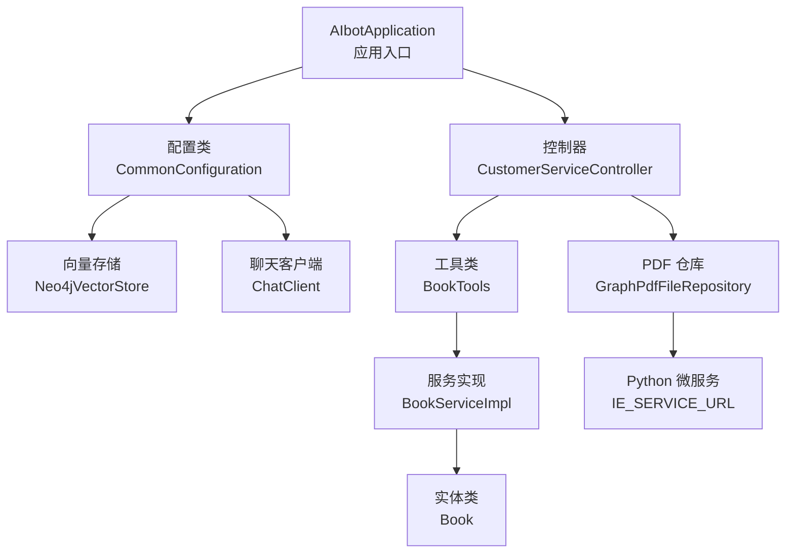
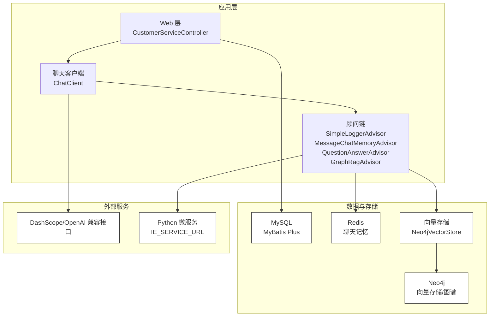
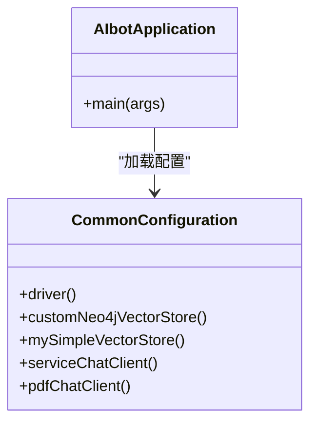
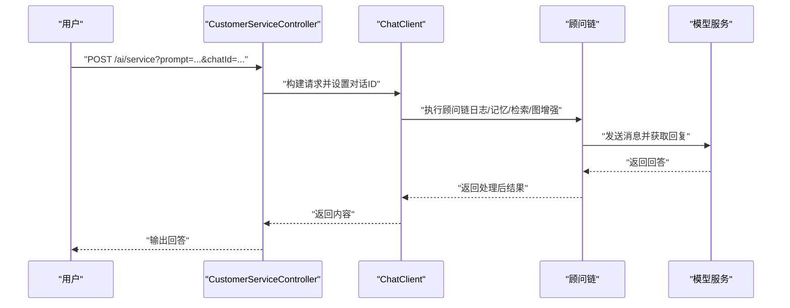
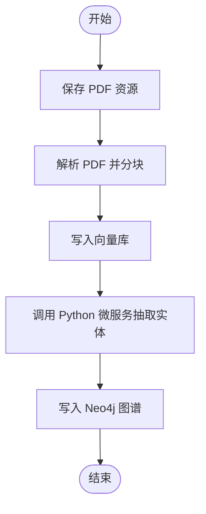
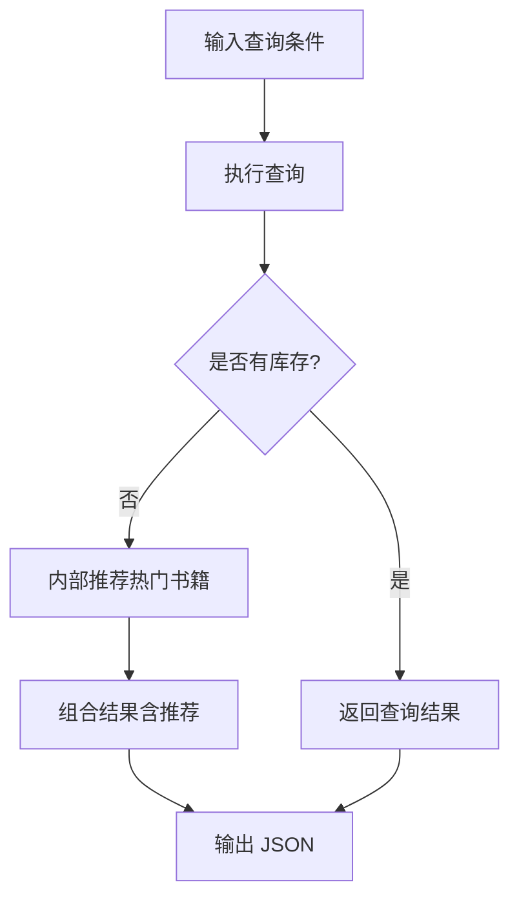
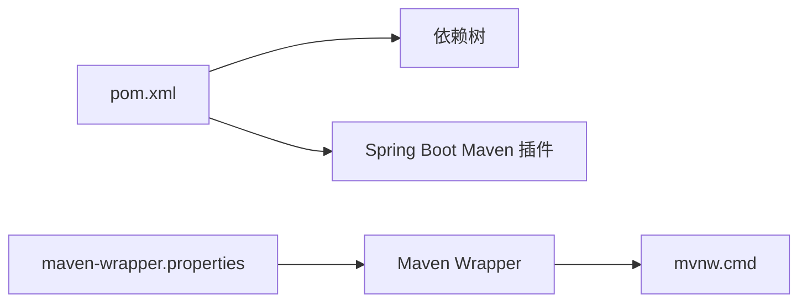

# 快速开始

<cite>
**本文引用的文件**
- [pom.xml](file://pom.xml)
- [application.yaml](file://src/main/resources/application.yaml)
- [AIbotApplication.java](file://src/main/java/com/xdu/aibot/AIbotApplication.java)
- [CommonConfiguration.java](file://src/main/java/com/xdu/aibot/config/CommonConfiguration.java)
- [CustomerServiceController.java](file://src/main/java/com/xdu/aibot/controller/CustomerServiceController.java)
- [GraphPdfFileRepository.java](file://src/main/java/com/xdu/aibot/repository/Impl/GraphPdfFileRepository.java)
- [BookTools.java](file://src/main/java/com/xdu/aibot/tools/BookTools.java)
- [Book.java](file://src/main/java/com/xdu/aibot/pojo/entity/Book.java)
- [mvnw.cmd](file://mvnw.cmd)
- [maven-wrapper.properties](file://.mvn/wrapper/maven-wrapper.properties)
- [index.html](file://src/main/resources/static/index.html)
- [chat-pdf.properties](file://chat-pdf.properties)
- [.gitignore](file://.gitignore)
</cite>

## 目录
1. [简介](#简介)
2. [项目结构](#项目结构)
3. [核心组件](#核心组件)
4. [架构总览](#架构总览)
5. [详细组件分析](#详细组件分析)
6. [依赖分析](#依赖分析)
7. [性能考虑](#性能考虑)
8. [故障排除指南](#故障排除指南)
9. [结论](#结论)
10. [附录](#附录)

## 简介
本指南面向新开发者，帮助你在最短时间内完成 AIbot 项目的环境准备、依赖安装与应用启动，并验证核心功能。项目基于 Spring Boot 3.x 与 Spring AI，集成了向量检索、知识图谱、PDF 问答、图书预约等能力。你将从 JDK 配置开始，逐步完成数据库、缓存、外部模型服务的设置，再通过 Maven 构建与启动应用，最后通过浏览器访问首页并进行基本功能验证。

## 项目结构
AIbot 采用标准的 Spring Boot 工程结构，核心模块包括：
- 应用入口与扫描：Spring Boot 启动类与 MyBatis Mapper 扫描
- 配置层：Spring 配置类与 YAML 配置文件
- 控制器层：对外暴露 REST 接口
- 业务层：工具类与服务实现
- 数据访问层：MyBatis Plus Mapper 与实体类
- 资源层：静态页面与 XML 映射文件
- 依赖管理：Maven POM 中定义的依赖与版本

图表来源
- [AIbotApplication.java:1-16](file://src/main/java/com/xdu/aibot/AIbotApplication.java#L1-L16)
- [CommonConfiguration.java:1-129](file://src/main/java/com/xdu/aibot/config/CommonConfiguration.java#L1-L129)
- [CustomerServiceController.java:1-35](file://src/main/java/com/xdu/aibot/controller/CustomerServiceController.java#L1-L35)
- [BookTools.java:1-127](file://src/main/java/com/xdu/aibot/tools/BookTools.java#L1-L127)
- [Book.java:1-58](file://src/main/java/com/xdu/aibot/pojo/entity/Book.java#L1-L58)
- [GraphPdfFileRepository.java:1-262](file://src/main/java/com/xdu/aibot/repository/Impl/GraphPdfFileRepository.java#L1-L262)

章节来源
- [AIbotApplication.java:1-16](file://src/main/java/com/xdu/aibot/AIbotApplication.java#L1-L16)
- [pom.xml:1-139](file://pom.xml#L1-L139)

## 核心组件
- 应用入口与扫描
  - 启动类启用 Spring Boot 自动装配与 MyBatis Mapper 扫描
  - 参考路径：[AIbotApplication.java:1-16](file://src/main/java/com/xdu/aibot/AIbotApplication.java#L1-L16)
- 配置类
  - 定义向量存储、Neo4j 驱动、聊天客户端与顾问链
  - 参考路径：[CommonConfiguration.java:1-129](file://src/main/java/com/xdu/aibot/config/CommonConfiguration.java#L1-L129)
- 控制器
  - 提供 /ai/service 接口，支持多轮对话与历史记录
  - 参考路径：[CustomerServiceController.java:1-35](file://src/main/java/com/xdu/aibot/controller/CustomerServiceController.java#L1-L35)
- 工具类
  - 图书查询与预约工具，内嵌推荐逻辑
  - 参考路径：[BookTools.java:1-127](file://src/main/java/com/xdu/aibot/tools/BookTools.java#L1-L127)
- 实体与服务
  - 书籍实体与 MyBatis Plus 服务实现
  - 参考路径：[Book.java:1-58](file://src/main/java/com/xdu/aibot/pojo/entity/Book.java#L1-L58)
- PDF 仓库
  - PDF 解析、向量入库、知识图谱构建与 Python 微服务集成
  - 参考路径：[GraphPdfFileRepository.java:1-262](file://src/main/java/com/xdu/aibot/repository/Impl/GraphPdfFileRepository.java#L1-L262)

章节来源
- [CommonConfiguration.java:1-129](file://src/main/java/com/xdu/aibot/config/CommonConfiguration.java#L1-L129)
- [CustomerServiceController.java:1-35](file://src/main/java/com/xdu/aibot/controller/CustomerServiceController.java#L1-L35)
- [BookTools.java:1-127](file://src/main/java/com/xdu/aibot/tools/BookTools.java#L1-L127)
- [Book.java:1-58](file://src/main/java/com/xdu/aibot/pojo/entity/Book.java#L1-L58)
- [GraphPdfFileRepository.java:1-262](file://src/main/java/com/xdu/aibot/repository/Impl/GraphPdfFileRepository.java#L1-L262)

## 架构总览
AIbot 的整体架构围绕 Spring Boot 与 Spring AI 展开，结合 MySQL、Redis、Neo4j 以及外部模型服务（DashScope/OpenAI 兼容接口）。核心数据流包括：
- Web 请求经控制器进入，通过 ChatClient 与顾问链处理
- 顾问链包含日志、对话记忆、向量检索与图 RAG 增强
- 向量存储与知识图谱用于 PDF 问答与上下文增强
- Python 微服务负责实体抽取与知识图谱构建

图表来源
- [CommonConfiguration.java:74-127](file://src/main/java/com/xdu/aibot/config/CommonConfiguration.java#L74-L127)
- [CustomerServiceController.java:25-33](file://src/main/java/com/xdu/aibot/controller/CustomerServiceController.java#L25-L33)
- [GraphPdfFileRepository.java:37-39](file://src/main/java/com/xdu/aibot/repository/Impl/GraphPdfFileRepository.java#L37-L39)

## 详细组件分析

### 组件一：应用启动与配置
- 启动类
  - 启用 Spring Boot 自动装配与 Mapper 扫描
  - 参考路径：[AIbotApplication.java:1-16](file://src/main/java/com/xdu/aibot/AIbotApplication.java#L1-L16)
- 配置类
  - 定义向量存储、Neo4j 驱动、聊天客户端与顾问链
  - 关键 Bean：自定义 Neo4jVectorStore、SimpleVectorStore、ChatClient（服务端与 PDF）
  - 参考路径：[CommonConfiguration.java:47-127](file://src/main/java/com/xdu/aibot/config/CommonConfiguration.java#L47-L127)

图表来源
- [AIbotApplication.java:1-16](file://src/main/java/com/xdu/aibot/AIbotApplication.java#L1-L16)
- [CommonConfiguration.java:34-127](file://src/main/java/com/xdu/aibot/config/CommonConfiguration.java#L34-L127)

章节来源
- [AIbotApplication.java:1-16](file://src/main/java/com/xdu/aibot/AIbotApplication.java#L1-L16)
- [CommonConfiguration.java:1-129](file://src/main/java/com/xdu/aibot/config/CommonConfiguration.java#L1-L129)

### 组件二：控制器与对话流程
- 控制器
  - 提供 /ai/service 接口，接收 prompt 与 chatId，调用 ChatClient 执行对话
  - 将对话 ID 注入顾问链以启用对话记忆
  - 参考路径：[CustomerServiceController.java:25-33](file://src/main/java/com/xdu/aibot/controller/CustomerServiceController.java#L25-L33)
- 对话流程序列图

图表来源
- [CustomerServiceController.java:25-33](file://src/main/java/com/xdu/aibot/controller/CustomerServiceController.java#L25-L33)
- [CommonConfiguration.java:74-127](file://src/main/java/com/xdu/aibot/config/CommonConfiguration.java#L74-L127)

章节来源
- [CustomerServiceController.java:1-35](file://src/main/java/com/xdu/aibot/controller/CustomerServiceController.java#L1-L35)
- [CommonConfiguration.java:74-127](file://src/main/java/com/xdu/aibot/config/CommonConfiguration.java#L74-L127)

### 组件三：PDF 问答与知识图谱
- PDF 处理流程
  - 保存资源、解析 PDF、分块、写入向量库、调用 Python 微服务抽取实体并构建 Neo4j 图谱
  - 参考路径：[GraphPdfFileRepository.java:42-177](file://src/main/java/com/xdu/aibot/repository/Impl/GraphPdfFileRepository.java#L42-L177)
- 流程图

图表来源
- [GraphPdfFileRepository.java:42-177](file://src/main/java/com/xdu/aibot/repository/Impl/GraphPdfFileRepository.java#L42-L177)

章节来源
- [GraphPdfFileRepository.java:1-262](file://src/main/java/com/xdu/aibot/repository/Impl/GraphPdfFileRepository.java#L1-L262)

### 组件四：图书查询与预约工具
- 功能要点
  - 支持按名称、作者、类型、评分、库存等条件查询
  - 当无库存或无结果时，自动返回推荐书籍
  - 预约成功后扣减库存并生成预约单
  - 参考路径：[BookTools.java:32-125](file://src/main/java/com/xdu/aibot/tools/BookTools.java#L32-L125)

图表来源
- [BookTools.java:32-82](file://src/main/java/com/xdu/aibot/tools/BookTools.java#L32-L82)

章节来源
- [BookTools.java:1-127](file://src/main/java/com/xdu/aibot/tools/BookTools.java#L1-L127)
- [Book.java:1-58](file://src/main/java/com/xdu/aibot/pojo/entity/Book.java#L1-L58)

## 依赖分析
- 运行时依赖
  - Spring Web、Spring AI（OpenAI 兼容）、MyBatis Plus、MySQL Connector、Redis、Neo4j、DashScope Starter、阿里巴巴 Agent Framework 等
  - 参考路径：[pom.xml:33-116](file://pom.xml#L33-L116)
- 构建与打包
  - 使用 Spring Boot Maven 插件，默认构建可执行 JAR
  - 参考路径：[pom.xml:129-136](file://pom.xml#L129-L136)
- 包装器与 Maven 版本
  - 使用 Maven Wrapper，指定 Maven 分发包与校验和
  - 参考路径：[maven-wrapper.properties:1-4](file://.mvn/wrapper/maven-wrapper.properties#L1-L4)、[mvnw.cmd:1-190](file://mvnw.cmd#L1-L190)

图表来源
- [pom.xml:33-136](file://pom.xml#L33-L136)
- [.mvn/wrapper/maven-wrapper.properties:1-4](file://.mvn/wrapper/maven-wrapper.properties#L1-L4)
- [mvnw.cmd:1-190](file://mvnw.cmd#L1-L190)

章节来源
- [pom.xml:1-139](file://pom.xml#L1-L139)
- [.mvn/wrapper/maven-wrapper.properties:1-4](file://.mvn/wrapper/maven-wrapper.properties#L1-L4)
- [mvnw.cmd:1-190](file://mvnw.cmd#L1-L190)

## 性能考虑
- 向量检索参数
  - 相似度阈值与 topK 影响召回质量与性能，建议根据实际数据规模调整
  - 参考路径：[CommonConfiguration.java:102-108](file://src/main/java/com/xdu/aibot/config/CommonConfiguration.java#L102-L108)
- 文本分块策略
  - TokenTextSplitter 的 chunk 大小与重叠影响检索精度与延迟
  - 参考路径：[GraphPdfFileRepository.java:147-156](file://src/main/java/com/xdu/aibot/repository/Impl/GraphPdfFileRepository.java#L147-L156)
- 缓存与连接池
  - Redis 连接池大小与超时需结合并发场景调优
  - 参考路径：[application.yaml:40-46](file://src/main/resources/application.yaml#L40-L46)
- 日志级别
  - 开发阶段可开启调试日志以便定位问题
  - 参考路径：[application.yaml:52-59](file://src/main/resources/application.yaml#L52-L59)

## 故障排除指南
- 环境变量缺失
  - DashScope API Key 未设置导致模型调用失败
  - 设置方式参考：[application.yaml:17-21](file://src/main/resources/application.yaml#L17-L21)
- 数据库连接异常
  - MySQL 地址、端口、账号、密码不匹配
  - 修改位置参考：[application.yaml:30-34](file://src/main/resources/application.yaml#L30-L34)
- Redis 连接失败
  - 主机、端口、密码与实际部署不一致
  - 修改位置参考：[application.yaml:36-46](file://src/main/resources/application.yaml#L36-L46)
- Neo4j 连接失败
  - URI、用户名、密码与云端实例不一致
  - 修改位置参考：[application.yaml:4-8](file://src/main/resources/application.yaml#L4-L8)
- Python 微服务不可达
  - IE_SERVICE_URL 默认指向本地 7777 端口，若未启动或被占用需调整
  - 参考路径：[GraphPdfFileRepository.java](file://src/main/java/com/xdu/aibot/repository/Impl/GraphPdfFileRepository.java#L39)
- Maven 下载缓慢或失败
  - 使用 Maven Wrapper 自动下载分发包，必要时设置代理
  - 参考路径：[mvnw.cmd:75-80](file://mvnw.cmd#L75-L80)
- 构建产物被 IDE 忽略
  - .gitignore 中排除了 target 目录，确保使用 Maven 打包
  - 参考路径：[.gitignore:1-6](file://.gitignore#L1-L6)

章节来源
- [application.yaml:4-59](file://src/main/resources/application.yaml#L4-L59)
- [GraphPdfFileRepository.java](file://src/main/java/com/xdu/aibot/repository/Impl/GraphPdfFileRepository.java#L39)
- [mvnw.cmd:75-80](file://mvnw.cmd#L75-L80)
- [.gitignore:1-6](file://.gitignore#L1-L6)

## 结论
通过本指南，你已掌握从环境准备到应用启动的完整流程，并理解了项目的核心组件与数据流。建议在本地先完成数据库、缓存与模型服务的最小可用配置，再逐步接入知识图谱与 PDF 问答功能，最终通过浏览器首页体验核心能力。

## 附录

### 环境要求与安装步骤
- JDK 17
  - 在系统中安装并配置 JAVA_HOME，确保 java -version 输出 JDK 17
- Maven
  - 使用 Maven Wrapper（mvnw.cmd）自动下载并使用指定版本的 Maven
  - 参考路径：[maven-wrapper.properties:1-4](file://.mvn/wrapper/maven-wrapper.properties#L1-L4)、[mvnw.cmd:1-190](file://mvnw.cmd#L1-L190)
- 数据库（MySQL）
  - 创建数据库 aibot，账号具备读写权限
  - 修改连接信息参考：[application.yaml:30-34](file://src/main/resources/application.yaml#L30-L34)
- 缓存（Redis）
  - 启动本地 Redis 或使用云 Redis，配置主机、端口、密码
  - 修改位置参考：[application.yaml:36-46](file://src/main/resources/application.yaml#L36-L46)
- 图数据库（Neo4j）
  - 使用云端 Neo4j 数据库，配置 URI、用户名、密码
  - 修改位置参考：[application.yaml:4-8](file://src/main/resources/application.yaml#L4-L8)
- 外部模型服务（DashScope/OpenAI 兼容）
  - 设置 DASHSCOPE_API_KEY 环境变量
  - 修改位置参考：[application.yaml:17-21](file://src/main/resources/application.yaml#L17-L21)
- Python 微服务（可选）
  - 启动本地 Python 微服务，监听 7777 端口
  - 调整地址参考：[GraphPdfFileRepository.java](file://src/main/java/com/xdu/aibot/repository/Impl/GraphPdfFileRepository.java#L39)

### 依赖安装与项目启动
- 依赖安装
  - 使用 Maven Wrapper 执行依赖下载与编译
  - 参考命令：[mvnw.cmd:1-190](file://mvnw.cmd#L1-L190)
- 项目启动
  - 进入项目根目录，执行 Maven Wrapper 构建并启动
  - 参考路径：[pom.xml:129-136](file://pom.xml#L129-L136)
- 访问首页
  - 启动完成后，在浏览器打开首页，体验核心功能
  - 参考路径：[index.html:1-246](file://src/main/resources/static/index.html#L1-L246)

### 验证安装成功
- 启动日志
  - 观察应用启动日志，确认数据库、Redis、Neo4j、模型服务连接成功
  - 参考路径：[application.yaml:52-59](file://src/main/resources/application.yaml#L52-L59)
- 基础接口测试
  - 访问 /ai/service 接口，传入 prompt 与 chatId，验证返回内容
  - 参考路径：[CustomerServiceController.java:25-33](file://src/main/java/com/xdu/aibot/controller/CustomerServiceController.java#L25-L33)
- PDF 问答测试（可选）
  - 上传 PDF 文件，触发向量入库与知识图谱构建流程
  - 参考路径：[GraphPdfFileRepository.java:42-177](file://src/main/java/com/xdu/aibot/repository/Impl/GraphPdfFileRepository.java#L42-L177)
- 图书查询与预约（可选）
  - 使用 BookTools 工具进行查询与预约，观察库存变化
  - 参考路径：[BookTools.java:32-125](file://src/main/java/com/xdu/aibot/tools/BookTools.java#L32-L125)

### 常见问题与解决方案
- 无法连接数据库
  - 检查地址、端口、账号、密码；确认防火墙放行
  - 参考路径：[application.yaml:30-34](file://src/main/resources/application.yaml#L30-L34)
- Redis 连接超时
  - 检查网络连通性与密码；适当增大连接池
  - 参考路径：[application.yaml:40-46](file://src/main/resources/application.yaml#L40-L46)
- Neo4j 连接认证失败
  - 核对用户名与密码；确认网络策略允许访问
  - 参考路径：[application.yaml:4-8](file://src/main/resources/application.yaml#L4-L8)
- 模型调用失败
  - 确认 DASHSCOPE_API_KEY 已设置；检查网络代理
  - 参考路径：[application.yaml:17-21](file://src/main/resources/application.yaml#L17-L21)
- PDF 处理异常
  - 检查 Python 微服务状态；确认分块与向量维度配置一致
  - 参考路径：[GraphPdfFileRepository.java:147-177](file://src/main/java/com/xdu/aibot/repository/Impl/GraphPdfFileRepository.java#L147-L177)