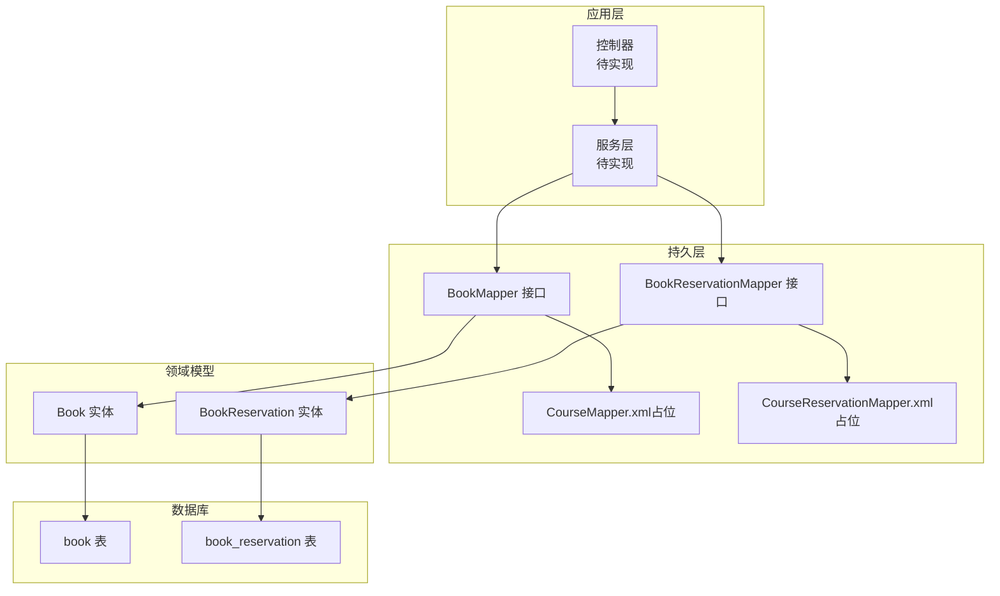
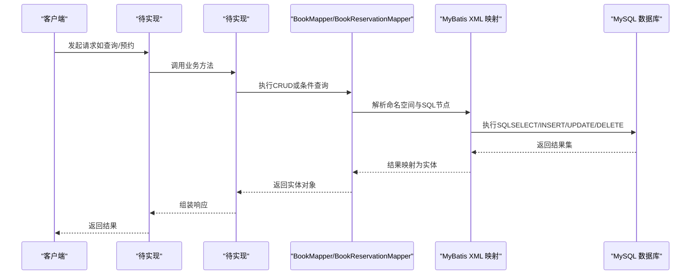
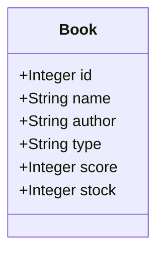
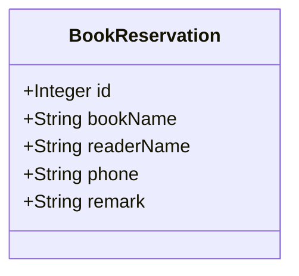
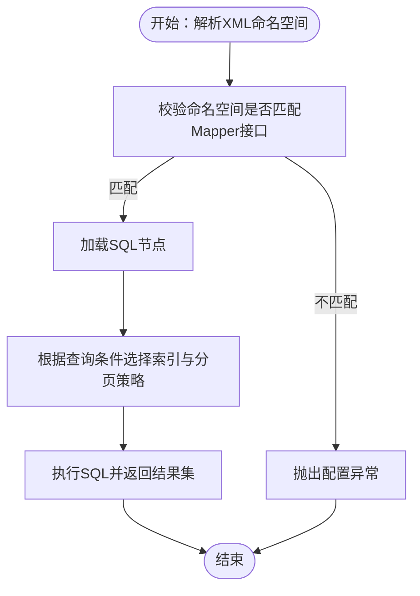
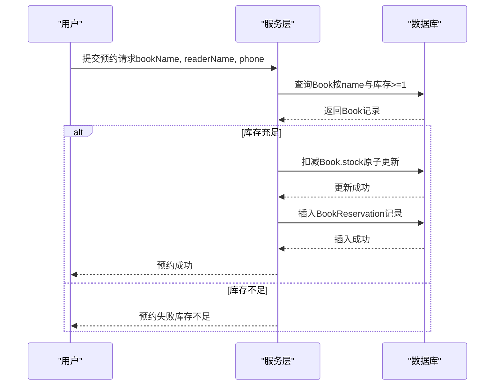
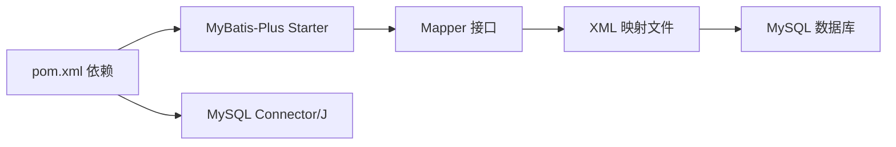

# 图书数据模型

<cite>
**本文引用的文件**
- [Book.java](file://src/main/java/com/xdu/aibot/pojo/entity/Book.java)
- [BookReservation.java](file://src/main/java/com/xdu/aibot/pojo/entity/BookReservation.java)
- [BookMapper.java](file://src/main/java/com/xdu/aibot/mapper/BookMapper.java)
- [BookReservationMapper.java](file://src/main/java/com/xdu/aibot/mapper/BookReservationMapper.java)
- [CourseMapper.xml](file://src/main/resources/mapper/CourseMapper.xml)
- [CourseReservationMapper.xml](file://src/main/resources/mapper/CourseReservationMapper.xml)
- [pom.xml](file://pom.xml)
</cite>

## 目录
1. [简介](#简介)
2. [项目结构](#项目结构)
3. [核心组件](#核心组件)
4. [架构总览](#架构总览)
5. [详细组件分析](#详细组件分析)
6. [依赖分析](#依赖分析)
7. [性能考虑](#性能考虑)
8. [故障排查指南](#故障排查指南)
9. [结论](#结论)
10. [附录](#附录)

## 简介
本文件聚焦于AIbot项目中的图书数据模型，系统性阐述Book实体类与BookReservation实体类的设计理念、字段定义与业务含义；说明图书基本信息字段的数据类型、长度限制与验证规则；梳理Book与BookReservation之间的关系映射与业务逻辑；结合MyBatis映射配置与SQL语句设计，给出查询优化策略；并从数据一致性角度解释图书状态管理、库存控制与预约流程的最佳实践。最后提供增删改查操作示例与最佳实践建议。

## 项目结构
AIbot采用Spring Boot + MyBatis-Plus的分层架构，图书相关代码主要位于以下位置：
- 实体层：pojo.entity（Book、BookReservation）
- 映射层：mapper（BookMapper、BookReservationMapper）
- 配置层：resources.mapper（MyBatis XML映射文件）
- 依赖层：pom.xml（MyBatis-Plus、MySQL驱动等）

图表来源
- [Book.java:1-58](file://src/main/java/com/xdu/aibot/pojo/entity/Book.java#L1-L58)
- [BookReservation.java:1-52](file://src/main/java/com/xdu/aibot/pojo/entity/BookReservation.java#L1-L52)
- [BookMapper.java:1-17](file://src/main/java/com/xdu/aibot/mapper/BookMapper.java#L1-L17)
- [BookReservationMapper.java:1-17](file://src/main/java/com/xdu/aibot/mapper/BookReservationMapper.java#L1-L17)
- [CourseMapper.xml:1-6](file://src/main/resources/mapper/CourseMapper.xml#L1-L6)
- [CourseReservationMapper.xml:1-6](file://src/main/resources/mapper/CourseReservationMapper.xml#L1-L6)

章节来源
- [Book.java:1-58](file://src/main/java/com/xdu/aibot/pojo/entity/Book.java#L1-L58)
- [BookReservation.java:1-52](file://src/main/java/com/xdu/aibot/pojo/entity/BookReservation.java#L1-L52)
- [BookMapper.java:1-17](file://src/main/java/com/xdu/aibot/mapper/BookMapper.java#L1-L17)
- [BookReservationMapper.java:1-17](file://src/main/java/com/xdu/aibot/mapper/BookReservationMapper.java#L1-L17)
- [CourseMapper.xml:1-6](file://src/main/resources/mapper/CourseMapper.xml#L1-L6)
- [CourseReservationMapper.xml:1-6](file://src/main/resources/mapper/CourseReservationMapper.xml#L1-L6)

## 核心组件
- Book实体：承载图书基本信息，包括主键、名称、作者、类型、评分、库存等字段，并通过注解映射到book表。
- BookReservation实体：承载预约信息，包括主键、借阅书籍名称、读者姓名、联系方式、备注等字段，并映射到book_reservation表。
- Mapper接口：基于MyBatis-Plus的BaseMapper，提供通用CRUD能力；当前XML文件为空，可按需扩展自定义SQL。
- 依赖与配置：pom.xml引入MyBatis-Plus与MySQL驱动，为数据访问提供基础能力。

章节来源
- [Book.java:22-57](file://src/main/java/com/xdu/aibot/pojo/entity/Book.java#L22-L57)
- [BookReservation.java:22-51](file://src/main/java/com/xdu/aibot/pojo/entity/BookReservation.java#L22-L51)
- [BookMapper.java:14-14](file://src/main/java/com/xdu/aibot/mapper/BookMapper.java#L14-L14)
- [BookReservationMapper.java:14-14](file://src/main/java/com/xdu/aibot/mapper/BookReservationMapper.java#L14-L14)
- [pom.xml:49-52](file://pom.xml#L49-L52)

## 架构总览
下图展示从应用到数据库的端到端数据流，以及实体与表之间的映射关系。

图表来源
- [BookMapper.java:14-14](file://src/main/java/com/xdu/aibot/mapper/BookMapper.java#L14-L14)
- [BookReservationMapper.java:14-14](file://src/main/java/com/xdu/aibot/mapper/BookReservationMapper.java#L14-L14)
- [CourseMapper.xml:3-3](file://src/main/resources/mapper/CourseMapper.xml#L3-L3)
- [CourseReservationMapper.xml:3-3](file://src/main/resources/mapper/CourseReservationMapper.xml#L3-L3)

## 详细组件分析

### Book实体类设计与字段规范
- 设计理念
  - 使用MyBatis-Plus注解进行表与字段映射，启用链式setter以提升可读性。
  - 字段覆盖常用图书元信息，便于后续扩展（如新增状态字段）。
- 字段定义与业务含义
  - id：主键，自增整型，唯一标识每条图书记录。
  - name：书籍名称，字符串，用于检索与展示。
  - author：作者姓名，字符串，支持多作者逗号分隔等场景。
  - type：书籍类型，字符串，枚举化建议在应用层约束（如亚洲文学、欧美文学、诗歌、科幻、历史、其它）。
  - score：书籍评分，整型，范围建议在1-10之间。
  - stock：库存数量，整型，非负数，用于借阅与预约控制。
- 数据类型、长度与验证规则
  - 字符串字段建议在数据库层面设置合理长度上限（如VARCHAR(255)），并在服务层进行长度与格式校验。
  - 数值字段（score、stock）建议在DAO层与服务层进行边界校验（score范围1-10，stock非负）。
  - 建议在实体层或DTO层添加注解式校验（如非空、长度、数值范围），确保入参合法性。
- 关系映射
  - 通过注解映射至book表，与BookReservation无直接外键关联，但可通过name字段在业务层建立弱关联（如预约时比对名称）。

图表来源
- [Book.java:23-56](file://src/main/java/com/xdu/aibot/pojo/entity/Book.java#L23-L56)

章节来源
- [Book.java:22-57](file://src/main/java/com/xdu/aibot/pojo/entity/Book.java#L22-L57)

### BookReservation实体类设计与业务逻辑
- 设计理念
  - 专注预约流程所需的关键信息，避免冗余字段污染业务模型。
- 字段定义与业务含义
  - id：主键，自增整型。
  - bookName：借阅书籍名称，用于与Book.name建立业务关联。
  - readerName：读者姓名，字符串。
  - phone：联系方式，字符串（建议格式校验）。
  - remark：备注，字符串（用于特殊需求说明）。
- 关系映射与业务逻辑
  - 当前未声明外键，业务上可通过bookName与Book.name进行匹配，实现“弱关联”。
  - 建议在服务层增加一致性校验：若bookName不存在或库存不足，则拒绝预约。
  - 可在数据库层面增加bookName索引，提升匹配效率。

图表来源
- [BookReservation.java:23-50](file://src/main/java/com/xdu/aibot/pojo/entity/BookReservation.java#L23-L50)

章节来源
- [BookReservation.java:22-51](file://src/main/java/com/xdu/aibot/pojo/entity/BookReservation.java#L22-L51)

### MyBatis映射配置与SQL设计
- 命名空间与接口绑定
  - XML命名空间应与对应Mapper接口全限定名一致，当前占位文件已声明命名空间，但尚未填充SQL。
- SQL语句设计建议
  - 通用CRUD：优先使用MyBatis-Plus提供的通用方法，减少手写SQL。
  - 自定义查询：针对“按类型分组统计库存”、“按评分筛选”、“按名称模糊搜索”等场景，建议在XML中编写SQL并配合参数化查询。
  - 预约关联查询：当需要“根据bookName关联查询Book”的场景，可在XML中编写JOIN查询，并对bookName建立索引。
- 查询优化策略
  - 为高频查询字段（如name、type、bookName）建立索引。
  - 对分页查询使用LIMIT/OFFSET或游标分页，避免全表扫描。
  - 对复杂条件查询使用复合索引（如(type, score)、(name, type)）。
  - 使用只读事务与连接池优化，避免长事务占用资源。

图表来源
- [CourseMapper.xml:3-3](file://src/main/resources/mapper/CourseMapper.xml#L3-L3)
- [CourseReservationMapper.xml:3-3](file://src/main/resources/mapper/CourseReservationMapper.xml#L3-L3)

章节来源
- [CourseMapper.xml:1-6](file://src/main/resources/mapper/CourseMapper.xml#L1-L6)
- [CourseReservationMapper.xml:1-6](file://src/main/resources/mapper/CourseReservationMapper.xml#L1-L6)

### 数据一致性与业务流程
- 图书状态管理
  - 建议在Book中新增状态字段（如“可借阅/已预约/已借出/维护中”），并在服务层统一更新状态机。
- 库存控制
  - 预约成功后，服务层应先检查库存，再原子性扣减库存并生成预约记录；失败则回滚。
  - 使用数据库事务包裹“检查-扣减-记录”三步，确保一致性。
- 预约流程
  - 先校验bookName是否存在且库存充足，再插入BookReservation记录。
  - 可引入“并发锁”或“乐观锁版本号”防止超卖。
- 与数据库交互的一致性
  - 使用MyBatis-Plus的事务注解或手动开启事务，确保多表写入原子性。
  - 对关键字段（如stock）使用行级锁或版本号控制并发修改。

图表来源
- [Book.java:51-56](file://src/main/java/com/xdu/aibot/pojo/entity/Book.java#L51-L56)
- [BookReservation.java:33-33](file://src/main/java/com/xdu/aibot/pojo/entity/BookReservation.java#L33-L33)

章节来源
- [Book.java:51-56](file://src/main/java/com/xdu/aibot/pojo/entity/Book.java#L51-L56)
- [BookReservation.java:33-33](file://src/main/java/com/xdu/aibot/pojo/entity/BookReservation.java#L33-L33)

### 增删改查操作示例与最佳实践
- 新增（Insert）
  - 示例路径：调用BookMapper.insert或BookReservationMapper.insert（基于通用方法）。
  - 最佳实践：在服务层进行参数校验与业务规则检查；使用事务包裹可能的多表写入。
- 查询（Select）
  - 示例路径：BookMapper.selectById、selectList、selectPage；BookReservationMapper.selectList。
  - 最佳实践：对高频查询建立索引；使用分页查询；避免N+1问题。
- 更新（Update）
  - 示例路径：BookMapper.updateById、BookReservationMapper.updateById。
  - 最佳实践：使用乐观锁版本号或行级锁；对库存字段使用原子更新（如stock=stock-1）。
- 删除（Delete）
  - 示例路径：BookMapper.deleteById、BookReservationMapper.deleteById。
  - 最佳实践：软删除建议引入deleted字段；物理删除前确认无关联预约或借阅记录。

章节来源
- [BookMapper.java:14-14](file://src/main/java/com/xdu/aibot/mapper/BookMapper.java#L14-L14)
- [BookReservationMapper.java:14-14](file://src/main/java/com/xdu/aibot/mapper/BookReservationMapper.java#L14-L14)

## 依赖分析
- 框架依赖
  - MyBatis-Plus Starter：提供通用Mapper与自动SQL生成能力。
  - MySQL Connector/J：数据库驱动。
- 运行时行为
  - Mapper接口继承BaseMapper后，可直接使用通用CRUD方法；XML文件为空时，仍可运行通用SQL。
- 配置建议
  - 在application.yaml中配置MyBatis-Plus的mapperLocations指向resources/mapper目录，确保XML被正确加载。

图表来源
- [pom.xml:49-52](file://pom.xml#L49-L52)
- [CourseMapper.xml:1-6](file://src/main/resources/mapper/CourseMapper.xml#L1-L6)

章节来源
- [pom.xml:49-52](file://pom.xml#L49-L52)
- [CourseMapper.xml:1-6](file://src/main/resources/mapper/CourseMapper.xml#L1-L6)

## 性能考虑
- 索引策略
  - 为book(name)、book(type)、book_reservation(bookName)建立合适索引，提升查询与关联效率。
- 分页与排序
  - 对大表查询使用分页；避免ORDER BY无索引导致的全表排序。
- 缓存与热点
  - 对热门图书信息使用Redis缓存，降低数据库压力。
- 事务与锁
  - 高并发场景下，对库存更新使用原子操作与行级锁，避免超卖。
- SQL优化
  - 避免SELECT *，仅返回必要字段；使用EXPLAIN分析慢查询。

## 故障排查指南
- 常见问题
  - XML命名空间不匹配：检查命名空间与Mapper接口全限定名一致。
  - 未加载XML：确认mapperLocations配置正确，确保resources/mapper目录可被扫描。
  - 预约失败：检查库存是否充足、bookName是否匹配、数据库事务是否回滚。
- 排查步骤
  - 启用MyBatis日志，观察SQL执行情况与参数绑定。
  - 使用数据库慢查询日志定位低效SQL。
  - 对关键路径增加单元测试与集成测试，覆盖边界条件。

章节来源
- [CourseMapper.xml:3-3](file://src/main/resources/mapper/CourseMapper.xml#L3-L3)
- [CourseReservationMapper.xml:3-3](file://src/main/resources/mapper/CourseReservationMapper.xml#L3-L3)

## 结论
Book与BookReservation作为图书与预约的核心数据模型，具备清晰的职责划分与良好的扩展性。通过MyBatis-Plus的通用Mapper与合理的XML定制SQL，可满足常见增删改查与复杂查询需求。建议在服务层完善业务规则与数据一致性保障，在数据库层完善索引与事务控制，从而构建高性能、高可靠的图书数据体系。

## 附录
- 开发建议
  - 在实体层补充字段校验注解与业务注释。
  - 在Mapper层按需扩展XML，逐步替换通用SQL为定制化高效SQL。
  - 引入单元测试与集成测试，覆盖库存控制与预约流程的关键分支。