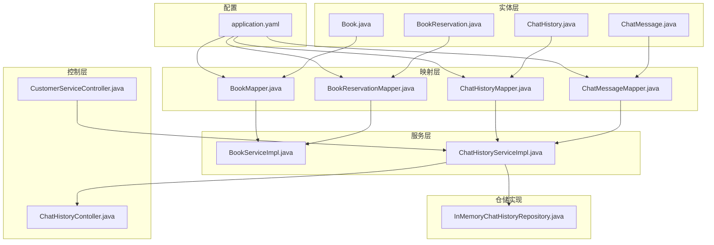
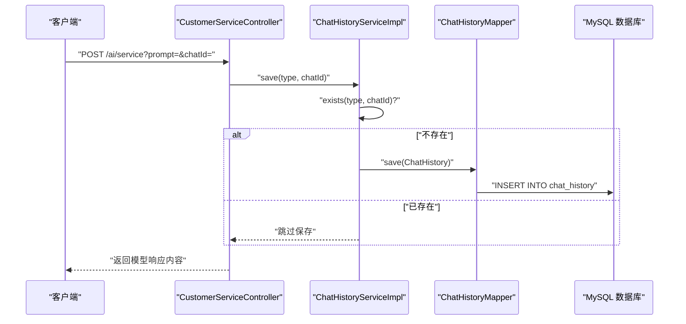
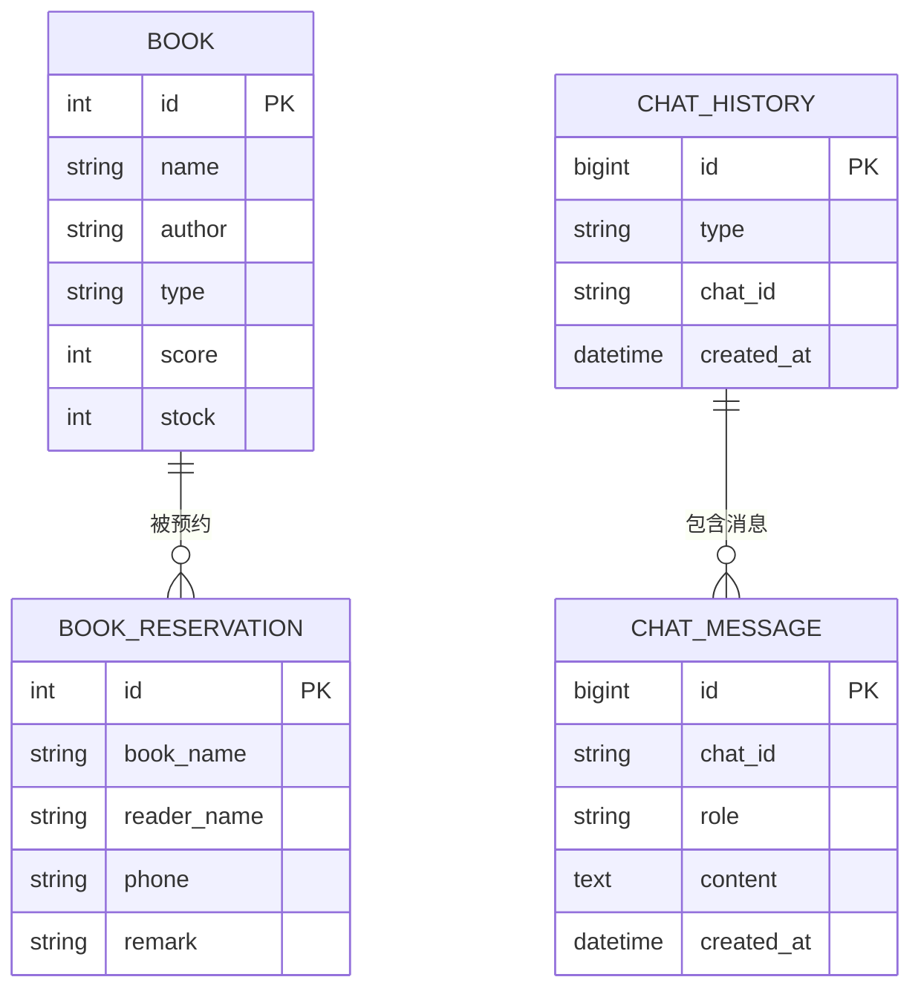
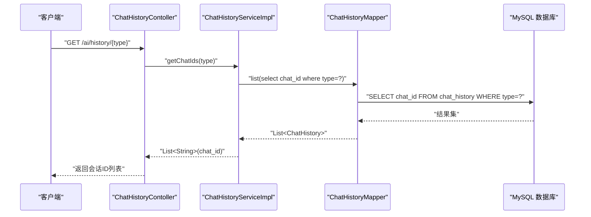
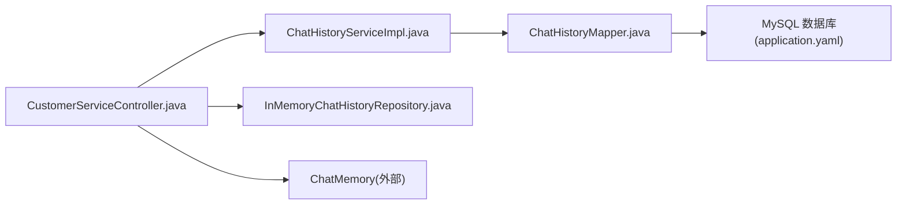

# 实体关系设计

<cite>
**本文引用的文件**
- [application.yaml](file://src/main/resources/application.yaml)
- [Book.java](file://src/main/java/com/xdu/aibot/pojo/entity/Book.java)
- [BookReservation.java](file://src/main/java/com/xdu/aibot/pojo/entity/BookReservation.java)
- [ChatHistory.java](file://src/main/java/com/xdu/aibot/pojo/entity/ChatHistory.java)
- [ChatMessage.java](file://src/main/java/com/xdu/aibot/pojo/entity/ChatMessage.java)
- [BookMapper.java](file://src/main/java/com/xdu/aibot/mapper/BookMapper.java)
- [BookReservationMapper.java](file://src/main/java/com/xdu/aibot/mapper/BookReservationMapper.java)
- [ChatHistoryMapper.java](file://src/main/java/com/xdu/aibot/mapper/ChatHistoryMapper.java)
- [ChatMessageMapper.java](file://src/main/java/com/xdu/aibot/mapper/ChatMessageMapper.java)
- [BookServiceImpl.java](file://src/main/java/com/xdu/aibot/service/impl/BookServiceImpl.java)
- [ChatHistoryServiceImpl.java](file://src/main/java/com/xdu/aibot/service/impl/ChatHistoryServiceImpl.java)
- [CustomerServiceController.java](file://src/main/java/com/xdu/aibot/controller/CustomerServiceController.java)
- [ChatHistoryContoller.java](file://src/main/java/com/xdu/aibot/controller/ChatHistoryContoller.java)
- [InMemoryChatHistoryRepository.java](file://src/main/java/com/xdu/aibot/repository/Impl/InMemoryChatHistoryRepository.java)
</cite>

## 目录
1. [简介](#简介)
2. [项目结构](#项目结构)
3. [核心组件](#核心组件)
4. [架构总览](#架构总览)
5. [详细组件分析](#详细组件分析)
6. [依赖分析](#依赖分析)
7. [性能考虑](#性能考虑)
8. [故障排查指南](#故障排查指南)
9. [结论](#结论)
10. [附录](#附录)

## 简介
本设计文档聚焦于AIbot项目中的实体关系设计，基于当前代码库中可见的实体与映射关系，系统化梳理实体类之间的关系映射（一对一、一对多、多对多）、外键约束、关联表设计与级联规则，并给出实体关系图（ERD）与数据库表结构图。同时，结合项目采用的关系型数据库连接配置，讨论范式化与反规范化策略、性能优化建议以及实体关系变更的影响分析与迁移策略。

## 项目结构
AIbot采用Spring Boot工程结构，实体位于pojo/entity包下，MyBatis-Plus映射器位于mapper包下，服务层在service/impl中，控制器在controller包下，数据源通过application.yaml进行配置。

图表来源
- [application.yaml:30-34](file://src/main/resources/application.yaml#L30-L34)
- [Book.java:22](file://src/main/java/com/xdu/aibot/pojo/entity/Book.java#L22)
- [BookReservation.java:22](file://src/main/java/com/xdu/aibot/pojo/entity/BookReservation.java#L22)
- [ChatHistory.java:9](file://src/main/java/com/xdu/aibot/pojo/entity/ChatHistory.java#L9)
- [ChatMessage.java:9](file://src/main/java/com/xdu/aibot/pojo/entity/ChatMessage.java#L9)
- [BookMapper.java:14](file://src/main/java/com/xdu/aibot/mapper/BookMapper.java#L14)
- [BookReservationMapper.java:14](file://src/main/java/com/xdu/aibot/mapper/BookReservationMapper.java#L14)
- [ChatHistoryMapper.java:9](file://src/main/java/com/xdu/aibot/mapper/ChatHistoryMapper.java#L9)
- [ChatMessageMapper.java:8](file://src/main/java/com/xdu/aibot/mapper/ChatMessageMapper.java#L8)
- [BookServiceImpl.java:18](file://src/main/java/com/xdu/aibot/service/impl/BookServiceImpl.java#L18)
- [ChatHistoryServiceImpl.java:20](file://src/main/java/com/xdu/aibot/service/impl/ChatHistoryServiceImpl.java#L20)
- [CustomerServiceController.java:16](file://src/main/java/com/xdu/aibot/controller/CustomerServiceController.java#L16)
- [ChatHistoryContoller.java:16](file://src/main/java/com/xdu/aibot/controller/ChatHistoryContoller.java#L16)
- [InMemoryChatHistoryRepository.java:12](file://src/main/java/com/xdu/aibot/repository/Impl/InMemoryChatHistoryRepository.java#L12)

章节来源
- [application.yaml:30-34](file://src/main/resources/application.yaml#L30-L34)
- [Book.java:22](file://src/main/java/com/xdu/aibot/pojo/entity/Book.java#L22)
- [BookReservation.java:22](file://src/main/java/com/xdu/aibot/pojo/entity/BookReservation.java#L22)
- [ChatHistory.java:9](file://src/main/java/com/xdu/aibot/pojo/entity/ChatHistory.java#L9)
- [ChatMessage.java:9](file://src/main/java/com/xdu/aibot/pojo/entity/ChatMessage.java#L9)

## 核心组件
- 关系型数据库配置：通过application.yaml配置MySQL数据源驱动、URL、用户名与密码，用于持久化实体。
- 实体定义：
  - Book：书籍实体，对应数据库表“book”，包含主键、名称、作者、类型、评分、库存等字段。
  - BookReservation：图书预约实体，对应数据库表“book_reservation”，包含主键、借阅书籍名称、读者姓名、联系方式、备注等字段。
  - ChatHistory：会话历史实体，对应数据库表“chat_history”，包含主键、类型、会话标识、创建时间等字段。
  - ChatMessage：消息实体，对应数据库表“chat_message”，包含主键、会话标识、角色、内容、创建时间等字段。
- 映射器接口：各实体均配有对应的Mapper接口，继承BaseMapper以获得通用CRUD能力。
- 服务实现：BookServiceImpl继承ServiceImpl并注入对应Mapper；ChatHistoryServiceImpl实现业务逻辑，使用Mapper进行持久化。
- 控制器：CustomerServiceController与ChatHistoryContoller分别负责对外接口调用与会话历史查询，其中ChatHistoryContoller还直接依赖ChatMemory进行消息读取。

章节来源
- [application.yaml:30-34](file://src/main/resources/application.yaml#L30-L34)
- [Book.java:23-57](file://src/main/java/com/xdu/aibot/pojo/entity/Book.java#L23-L57)
- [BookReservation.java:23-51](file://src/main/java/com/xdu/aibot/pojo/entity/BookReservation.java#L23-L51)
- [ChatHistory.java:10-22](file://src/main/java/com/xdu/aibot/pojo/entity/ChatHistory.java#L10-L22)
- [ChatMessage.java:10-26](file://src/main/java/com/xdu/aibot/pojo/entity/ChatMessage.java#L10-L26)
- [BookMapper.java:14](file://src/main/java/com/xdu/aibot/mapper/BookMapper.java#L14)
- [BookReservationMapper.java:14](file://src/main/java/com/xdu/aibot/mapper/BookReservationMapper.java#L14)
- [ChatHistoryMapper.java:9](file://src/main/java/com/xdu/aibot/mapper/ChatHistoryMapper.java#L9)
- [ChatMessageMapper.java:8](file://src/main/java/com/xdu/aibot/mapper/ChatMessageMapper.java#L8)
- [BookServiceImpl.java:18](file://src/main/java/com/xdu/aibot/service/impl/BookServiceImpl.java#L18)
- [ChatHistoryServiceImpl.java:20-63](file://src/main/java/com/xdu/aibot/service/impl/ChatHistoryServiceImpl.java#L20-L63)
- [CustomerServiceController.java:16-35](file://src/main/java/com/xdu/aibot/controller/CustomerServiceController.java#L16-L35)
- [ChatHistoryContoller.java:16-39](file://src/main/java/com/xdu/aibot/controller/ChatHistoryContoller.java#L16-L39)

## 架构总览
AIbot采用分层架构：控制器接收请求，调用服务层，服务层通过Mapper访问数据库；同时，会话历史也通过内存仓储与外部ChatMemory交互。

图表来源
- [CustomerServiceController.java:25-33](file://src/main/java/com/xdu/aibot/controller/CustomerServiceController.java#L25-L33)
- [ChatHistoryServiceImpl.java:24-41](file://src/main/java/com/xdu/aibot/service/impl/ChatHistoryServiceImpl.java#L24-L41)
- [ChatHistoryMapper.java:9](file://src/main/java/com/xdu/aibot/mapper/ChatHistoryMapper.java#L9)

## 详细组件分析

### 实体关系与表结构
基于实体定义，可抽象出以下数据库表及字段：

图表来源
- [Book.java:30-57](file://src/main/java/com/xdu/aibot/pojo/entity/Book.java#L30-L57)
- [BookReservation.java:27-51](file://src/main/java/com/xdu/aibot/pojo/entity/BookReservation.java#L27-L51)
- [ChatHistory.java:12-22](file://src/main/java/com/xdu/aibot/pojo/entity/ChatHistory.java#L12-L22)
- [ChatMessage.java:12-26](file://src/main/java/com/xdu/aibot/pojo/entity/ChatMessage.java#L12-L26)

章节来源
- [Book.java:23-57](file://src/main/java/com/xdu/aibot/pojo/entity/Book.java#L23-L57)
- [BookReservation.java:23-51](file://src/main/java/com/xdu/aibot/pojo/entity/BookReservation.java#L23-L51)
- [ChatHistory.java:10-22](file://src/main/java/com/xdu/aibot/pojo/entity/ChatHistory.java#L10-L22)
- [ChatMessage.java:10-26](file://src/main/java/com/xdu/aibot/pojo/entity/ChatMessage.java#L10-L26)

### 关系映射与约束设计
- 一对一/一对多/多对多关系
  - 图书与预约：Book与BookReservation之间为一对多关系（一本书可被多人预约），当前实体未显式声明外键字段，因此在数据库层面未建立外键约束。
  - 会话与消息：ChatHistory与ChatMessage之间为一对多关系（一个会话包含多条消息），当前实体未显式声明外键字段，数据库层面未建立外键约束。
- 外键约束与级联规则
  - 当前实体未定义外键字段，因此未生成外键约束与级联删除/更新规则。若需保证参照完整性，可在数据库层补充外键，并根据业务需求设定RESTRICT/SET NULL/CASCADE等策略。
- 关联表设计
  - 若未来引入多对多关系（如用户与角色、书籍与标签等），可采用关联表并在实体层增加中间实体或通过查询扩展支持。
- 继承、组合与依赖
  - 继承：实体类之间无继承关系。
  - 组合：实体与Mapper之间为组合关系（实体持有表名注解，Mapper管理实体的持久化）。
  - 依赖：服务层依赖Mapper接口；控制器依赖服务层；会话历史同时依赖内存仓储与外部ChatMemory。

章节来源
- [Book.java:23-57](file://src/main/java/com/xdu/aibot/pojo/entity/Book.java#L23-L57)
- [BookReservation.java:23-51](file://src/main/java/com/xdu/aibot/pojo/entity/BookReservation.java#L23-L51)
- [ChatHistory.java:10-22](file://src/main/java/com/xdu/aibot/pojo/entity/ChatHistory.java#L10-L22)
- [ChatMessage.java:10-26](file://src/main/java/com/xdu/aibot/pojo/entity/ChatMessage.java#L10-L26)
- [BookMapper.java:14](file://src/main/java/com/xdu/aibot/mapper/BookMapper.java#L14)
- [ChatHistoryMapper.java:9](file://src/main/java/com/xdu/aibot/mapper/ChatHistoryMapper.java#L9)
- [ChatMessageMapper.java:8](file://src/main/java/com/xdu/aibot/mapper/ChatMessageMapper.java#L8)
- [ChatHistoryServiceImpl.java:20-63](file://src/main/java/com/xdu/aibot/service/impl/ChatHistoryServiceImpl.java#L20-L63)
- [InMemoryChatHistoryRepository.java:12-31](file://src/main/java/com/xdu/aibot/repository/Impl/InMemoryChatHistoryRepository.java#L12-L31)

### 设计范式与反规范化
- 范式化
  - 当前实体满足第一范式（原子性）、第二范式（非主属性完全依赖主键）、第三范式（消除传递依赖）。例如：Book与BookReservation分离存储，避免重复字段冗余。
- 反规范化
  - 会话消息与历史分离存储，便于按会话检索；但未建立外键约束，可能带来数据不一致风险。若查询频繁且一致性要求高，可考虑在数据库层建立外键并启用级联。
- 性能优化
  - 对常用查询字段（如chat_history.type、chat_history.chat_id、chat_message.chat_id）建立索引。
  - 针对高频读场景，可结合Redis缓存会话ID列表（当前内存仓储已体现思路）。

章节来源
- [application.yaml:30-34](file://src/main/resources/application.yaml#L30-L34)
- [ChatHistoryServiceImpl.java:44-52](file://src/main/java/com/xdu/aibot/service/impl/ChatHistoryServiceImpl.java#L44-L52)
- [InMemoryChatHistoryRepository.java:12-31](file://src/main/java/com/xdu/aibot/repository/Impl/InMemoryChatHistoryRepository.java#L12-L31)

### 典型流程与序列图
- 保存会话历史流程

图表来源
- [ChatHistoryContoller.java:25-28](file://src/main/java/com/xdu/aibot/controller/ChatHistoryContoller.java#L25-L28)
- [ChatHistoryServiceImpl.java:44-52](file://src/main/java/com/xdu/aibot/service/impl/ChatHistoryServiceImpl.java#L44-L52)
- [ChatHistoryMapper.java:9](file://src/main/java/com/xdu/aibot/mapper/ChatHistoryMapper.java#L9)

## 依赖分析
- 组件耦合与内聚
  - 实体与映射器内聚度高，通过注解绑定表结构；服务层通过Mapper实现业务逻辑；控制器仅负责接口暴露。
- 直接与间接依赖
  - 控制器依赖服务接口；服务依赖Mapper接口；Mapper依赖数据库；会话历史同时依赖内存仓储与外部ChatMemory。
- 外部依赖
  - MySQL驱动与URL由application.yaml配置；Neo4j用于向量存储（与实体关系设计无直接外键约束）。

图表来源
- [CustomerServiceController.java:18-23](file://src/main/java/com/xdu/aibot/controller/CustomerServiceController.java#L18-L23)
- [ChatHistoryServiceImpl.java:20-63](file://src/main/java/com/xdu/aibot/service/impl/ChatHistoryServiceImpl.java#L20-L63)
- [ChatHistoryMapper.java:9](file://src/main/java/com/xdu/aibot/mapper/ChatHistoryMapper.java#L9)
- [InMemoryChatHistoryRepository.java:12-31](file://src/main/java/com/xdu/aibot/repository/Impl/InMemoryChatHistoryRepository.java#L12-L31)
- [application.yaml:30-34](file://src/main/resources/application.yaml#L30-L34)

章节来源
- [application.yaml:30-34](file://src/main/resources/application.yaml#L30-L34)
- [CustomerServiceController.java:16-35](file://src/main/java/com/xdu/aibot/controller/CustomerServiceController.java#L16-L35)
- [ChatHistoryServiceImpl.java:20-63](file://src/main/java/com/xdu/aibot/service/impl/ChatHistoryServiceImpl.java#L20-L63)
- [InMemoryChatHistoryRepository.java:12-31](file://src/main/java/com/xdu/aibot/repository/Impl/InMemoryChatHistoryRepository.java#L12-L31)

## 性能考虑
- 索引策略
  - 在chat_history表的type与chat_id列建立复合索引，加速按类型与会话ID查询。
  - 在chat_message表的chat_id列建立索引，加速按会话检索消息。
- 缓存策略
  - 将会话ID列表缓存至Redis（当前内存仓储体现思路），降低数据库压力。
- 写入优化
  - 使用exists判断避免重复插入，减少写放大。
- 事务与并发
  - 对于高并发场景，建议在服务层使用@Transactional确保一致性，并合理设置隔离级别。

## 故障排查指南
- 数据库连接失败
  - 检查application.yaml中的driver-class-name、url、username、password是否正确。
- 实体映射异常
  - 确认实体类上的@TableId、@TableField注解与数据库表结构一致。
- 查询性能差
  - 检查是否缺少必要索引；确认Mapper查询条件是否命中索引。
- 会话历史为空
  - 确认ChatHistoryServiceImpl的save逻辑是否执行；检查ChatMemory中是否存在对应chatId的数据。

章节来源
- [application.yaml:30-34](file://src/main/resources/application.yaml#L30-L34)
- [ChatHistoryServiceImpl.java:24-41](file://src/main/java/com/xdu/aibot/service/impl/ChatHistoryServiceImpl.java#L24-L41)
- [ChatHistoryContoller.java:30-37](file://src/main/java/com/xdu/aibot/controller/ChatHistoryContoller.java#L30-L37)

## 结论
当前AIbot项目实体关系清晰，采用分层架构与MyBatis-Plus映射，满足基本的增删改查需求。建议在未来引入外键约束与索引以提升一致性与查询性能，并结合Redis缓存优化高频读场景。对于潜在的多对多关系，可通过关联表与中间实体扩展。

## 附录
- 迁移策略
  - 新增外键：先在数据库添加外键约束与索引，再在实体层补充关联字段与级联策略，最后进行灰度验证。
  - 表结构调整：采用在线DDL或影子表策略，避免长时间锁表；迁移完成后切换流量并清理旧结构。
  - 版本回滚：保留迁移脚本与备份，确保可逆向回滚。