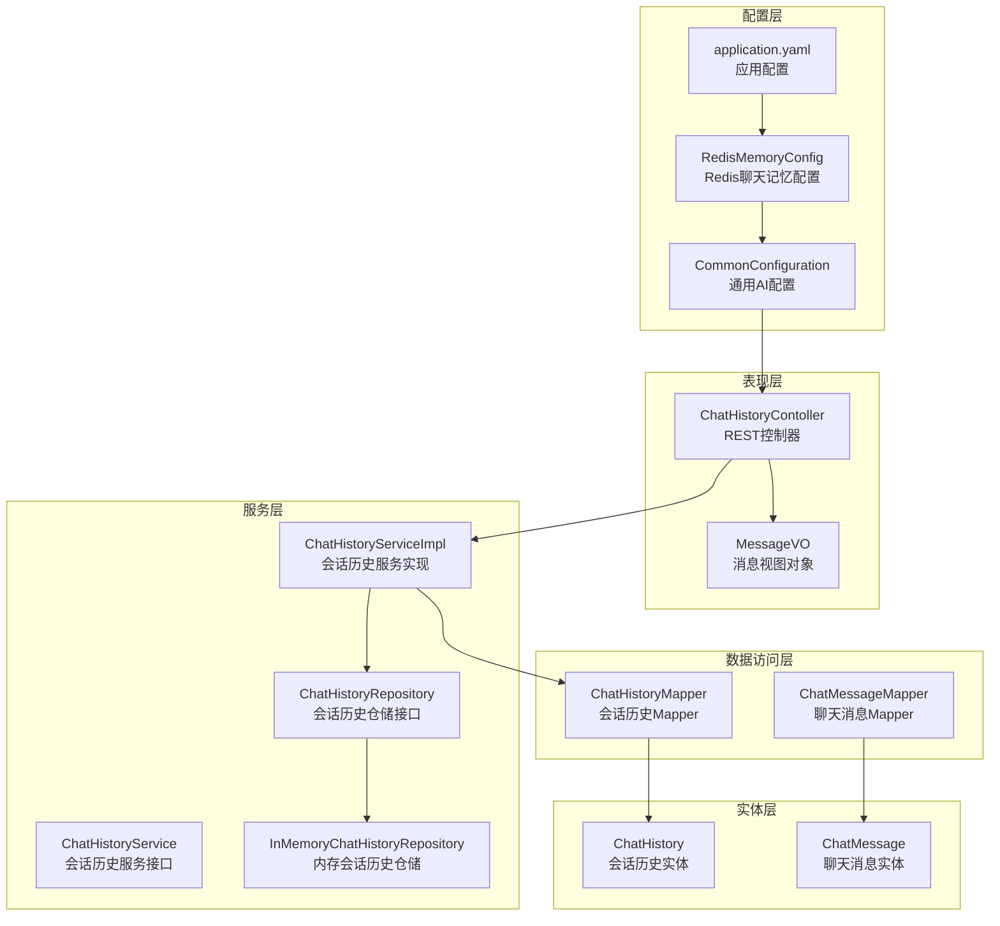
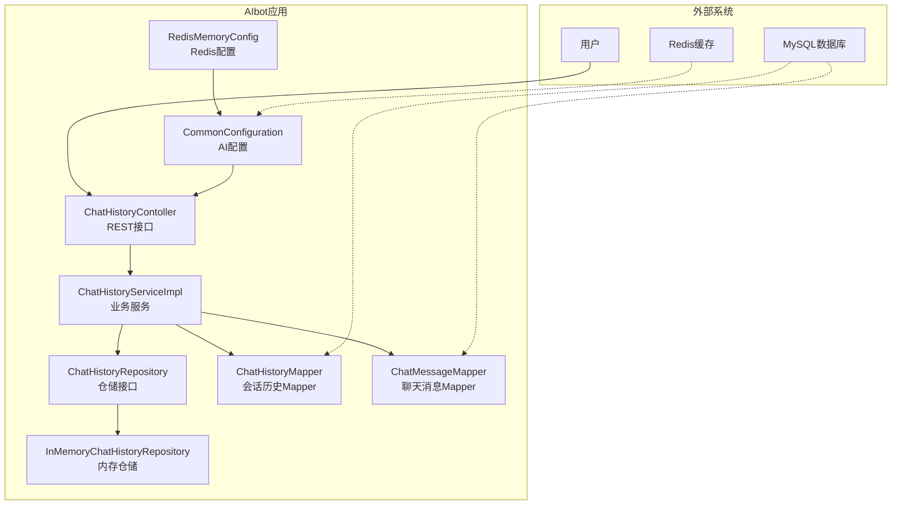
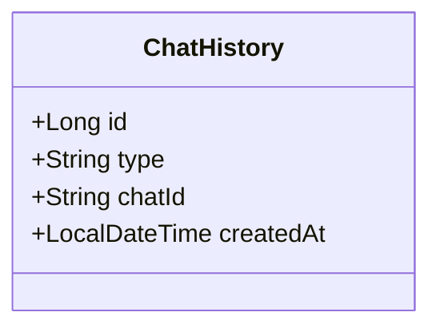
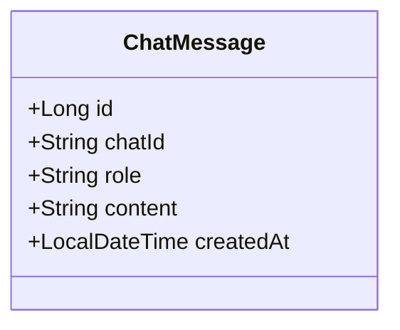
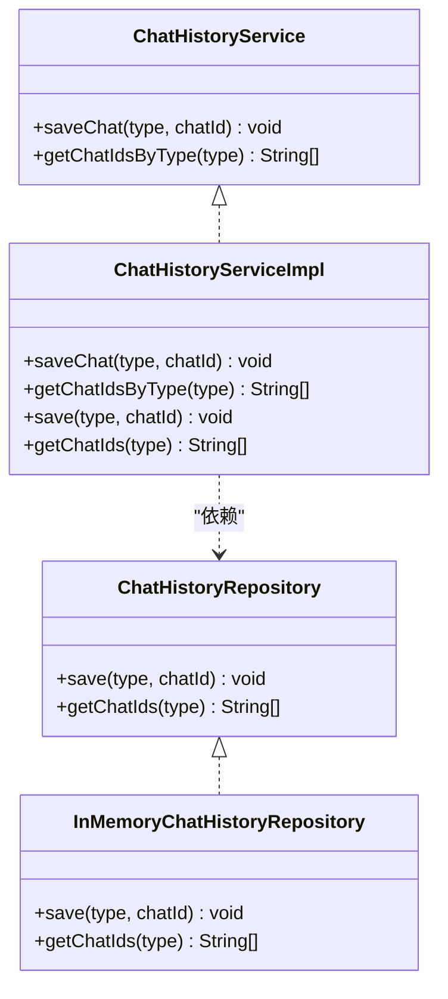
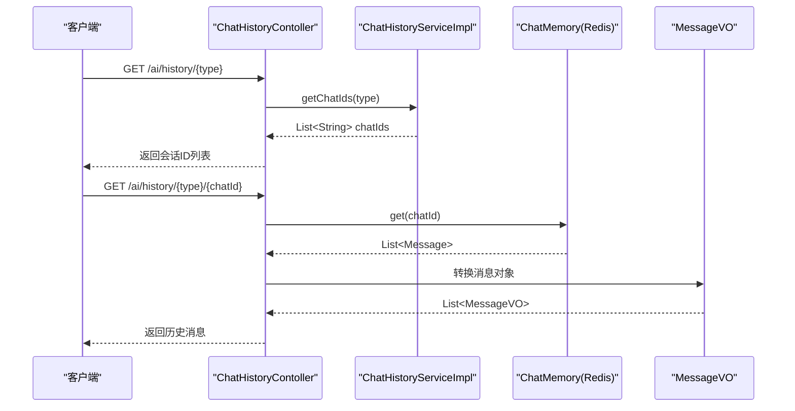
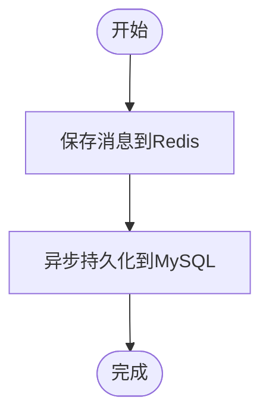
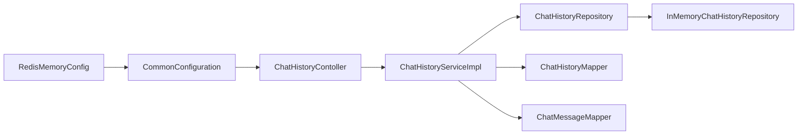

# 对话历史数据模型

<cite>
**本文档引用的文件**
- [ChatHistory.java](file://src/main/java/com/xdu/aibot/pojo/entity/ChatHistory.java)
- [ChatMessage.java](file://src/main/java/com/xdu/aibot/pojo/entity/ChatMessage.java)
- [ChatHistoryMapper.java](file://src/main/java/com/xdu/aibot/mapper/ChatHistoryMapper.java)
- [ChatMessageMapper.java](file://src/main/java/com/xdu/aibot/mapper/ChatMessageMapper.java)
- [ChatHistoryServiceImpl.java](file://src/main/java/com/xdu/aibot/service/impl/ChatHistoryServiceImpl.java)
- [ChatHistoryService.java](file://src/main/java/com/xdu/aibot/service/ChatHistoryService.java)
- [ChatHistoryRepository.java](file://src/main/java/com/xdu/aibot/repository/ChatHistoryRepository.java)
- [InMemoryChatHistoryRepository.java](file://src/main/java/com/xdu/aibot/repository/Impl/InMemoryChatHistoryRepository.java)
- [ChatHistoryContoller.java](file://src/main/java/com/xdu/aibot/controller/ChatHistoryContoller.java)
- [RedisMemoryConfig.java](file://src/main/java/com/xdu/aibot/config/RedisMemoryConfig.java)
- [CommonConfiguration.java](file://src/main/java/com/xdu/aibot/config/CommonConfiguration.java)
- [MessageVO.java](file://src/main/java/com/xdu/aibot/pojo/vo/MessageVO.java)
- [ChatType.java](file://src/main/java/com/xdu/aibot/constant/ChatType.java)
- [application.yaml](file://src/main/resources/application.yaml)
</cite>

## 目录
1. [简介](#简介)
2. [项目结构](#项目结构)
3. [核心组件](#核心组件)
4. [架构概览](#架构概览)
5. [详细组件分析](#详细组件分析)
6. [依赖分析](#依赖分析)
7. [性能考虑](#性能考虑)
8. [故障排除指南](#故障排除指南)
9. [结论](#结论)
10. [附录](#附录)

## 简介
本文件为AIbot项目的对话历史数据模型提供全面技术文档。重点阐述ChatHistory与ChatMessage两个实体类的设计理念、字段语义及业务含义，解析它们之间的一对多关系映射与数据完整性约束，并详细说明消息持久化策略、历史记录管理与会话恢复机制。同时，文档覆盖Redis缓存与数据库的双写一致性保障方案、性能优化策略，以及对话数据的查询、统计与分析功能实现思路。

## 项目结构
AIbot采用分层架构组织代码，围绕对话历史与消息管理构建了清晰的层次划分：
- 实体层：定义数据库表映射的领域对象
- 映射层：MyBatis-Plus Mapper接口，负责与数据库交互
- 服务层：业务逻辑封装，提供统一的服务接口
- 仓储层：抽象的会话历史访问接口与内存实现
- 控制器层：对外暴露REST接口，连接前端与后端服务
- 配置层：Redis聊天记忆配置与通用AI配置
- 常量与值对象：定义业务类型与响应包装类

**图表来源**
- [ChatHistoryContoller.java:1-39](file://src/main/java/com/xdu/aibot/controller/ChatHistoryContoller.java#L1-L39)
- [ChatHistoryServiceImpl.java:1-63](file://src/main/java/com/xdu/aibot/service/impl/ChatHistoryServiceImpl.java#L1-L63)
- [ChatHistoryRepository.java:1-14](file://src/main/java/com/xdu/aibot/repository/ChatHistoryRepository.java#L1-L14)
- [InMemoryChatHistoryRepository.java:1-31](file://src/main/java/com/xdu/aibot/repository/Impl/InMemoryChatHistoryRepository.java#L1-L31)
- [ChatHistoryMapper.java:1-10](file://src/main/java/com/xdu/aibot/mapper/ChatHistoryMapper.java#L1-L10)
- [ChatMessageMapper.java:1-10](file://src/main/java/com/xdu/aibot/mapper/ChatMessageMapper.java#L1-L10)
- [ChatHistory.java:1-23](file://src/main/java/com/xdu/aibot/pojo/entity/ChatHistory.java#L1-L23)
- [ChatMessage.java:1-27](file://src/main/java/com/xdu/aibot/pojo/entity/ChatMessage.java#L1-L27)
- [RedisMemoryConfig.java:1-26](file://src/main/java/com/xdu/aibot/config/RedisMemoryConfig.java#L1-L26)
- [CommonConfiguration.java:1-120](file://src/main/java/com/xdu/aibot/config/CommonConfiguration.java#L1-L120)
- [application.yaml:1-59](file://src/main/resources/application.yaml#L1-L59)

**章节来源**
- [ChatHistoryContoller.java:1-39](file://src/main/java/com/xdu/aibot/controller/ChatHistoryContoller.java#L1-L39)
- [ChatHistoryServiceImpl.java:1-63](file://src/main/java/com/xdu/aibot/service/impl/ChatHistoryServiceImpl.java#L1-L63)
- [ChatHistoryRepository.java:1-14](file://src/main/java/com/xdu/aibot/repository/ChatHistoryRepository.java#L1-L14)
- [InMemoryChatHistoryRepository.java:1-31](file://src/main/java/com/xdu/aibot/repository/Impl/InMemoryChatHistoryRepository.java#L1-L31)
- [ChatHistoryMapper.java:1-10](file://src/main/java/com/xdu/aibot/mapper/ChatHistoryMapper.java#L1-L10)
- [ChatMessageMapper.java:1-10](file://src/main/java/com/xdu/aibot/mapper/ChatMessageMapper.java#L1-L10)
- [ChatHistory.java:1-23](file://src/main/java/com/xdu/aibot/pojo/entity/ChatHistory.java#L1-L23)
- [ChatMessage.java:1-27](file://src/main/java/com/xdu/aibot/pojo/entity/ChatMessage.java#L1-L27)
- [RedisMemoryConfig.java:1-26](file://src/main/java/com/xdu/aibot/config/RedisMemoryConfig.java#L1-L26)
- [CommonConfiguration.java:1-120](file://src/main/java/com/xdu/aibot/config/CommonConfiguration.java#L1-L120)
- [application.yaml:1-59](file://src/main/resources/application.yaml#L1-L59)

## 核心组件
本节聚焦对话历史数据模型的核心实体与服务组件，明确各字段的业务含义与约束条件。

- ChatHistory（会话历史）
  - 字段与含义
    - id：自增主键，唯一标识每条会话记录
    - type：业务类型，用于区分不同场景（如PDF、客服等），支持按类型查询会话集合
    - chatId：会话标识符，同一业务类型下的唯一会话ID
    - createdAt：创建时间，使用插入时自动填充，确保数据审计与排序
  - 数据库映射
    - 表名：chat_history
    - 主键策略：数据库自增
    - 字段填充：插入时自动填充创建时间

- ChatMessage（聊天消息）
  - 字段与含义
    - id：自增主键，唯一标识每条消息
    - chatId：所属会话ID，关联到ChatHistory的chatId
    - role：消息发送者角色，常见取值为user（用户）或assistant（AI助手）
    - content：消息内容文本
    - createdAt：创建时间，插入时自动填充
  - 数据库映射
    - 表名：chat_message
    - 主键策略：数据库自增
    - 字段填充：插入时自动填充创建时间

- 关系映射与完整性约束
  - 一对多关系：ChatHistory与ChatMessage通过chatId建立一对多关联
  - 外键约束：当前代码未显式声明外键，但通过业务约定保证数据一致性
  - 唯一性约束：同一业务类型下chatId唯一；消息按时间顺序存储

**章节来源**
- [ChatHistory.java:1-23](file://src/main/java/com/xdu/aibot/pojo/entity/ChatHistory.java#L1-L23)
- [ChatMessage.java:1-27](file://src/main/java/com/xdu/aibot/pojo/entity/ChatMessage.java#L1-L27)
- [ChatHistoryMapper.java:1-10](file://src/main/java/com/xdu/aibot/mapper/ChatHistoryMapper.java#L1-L10)
- [ChatMessageMapper.java:1-10](file://src/main/java/com/xdu/aibot/mapper/ChatMessageMapper.java#L1-L10)

## 架构概览
AIbot的对话历史架构围绕“内存缓存 + 数据库持久化”的双层存储展开，结合Spring AI的ChatMemory实现会话恢复与查询。

**图表来源**
- [ChatHistoryContoller.java:1-39](file://src/main/java/com/xdu/aibot/controller/ChatHistoryContoller.java#L1-L39)
- [ChatHistoryServiceImpl.java:1-63](file://src/main/java/com/xdu/aibot/service/impl/ChatHistoryServiceImpl.java#L1-L63)
- [ChatHistoryRepository.java:1-14](file://src/main/java/com/xdu/aibot/repository/ChatHistoryRepository.java#L1-L14)
- [InMemoryChatHistoryRepository.java:1-31](file://src/main/java/com/xdu/aibot/repository/Impl/InMemoryChatHistoryRepository.java#L1-L31)
- [ChatHistoryMapper.java:1-10](file://src/main/java/com/xdu/aibot/mapper/ChatHistoryMapper.java#L1-L10)
- [ChatMessageMapper.java:1-10](file://src/main/java/com/xdu/aibot/mapper/ChatMessageMapper.java#L1-L10)
- [RedisMemoryConfig.java:1-26](file://src/main/java/com/xdu/aibot/config/RedisMemoryConfig.java#L1-L26)
- [CommonConfiguration.java:1-120](file://src/main/java/com/xdu/aibot/config/CommonConfiguration.java#L1-L120)

## 详细组件分析

### ChatHistory实体类分析
- 设计要点
  - 使用MyBatis-Plus注解进行表映射与字段填充
  - 通过type与chatId组合实现业务类型隔离与会话唯一性
  - 插入时自动填充createdAt，便于后续统计与排序
- 业务含义
  - type：区分业务场景，如PDF问答、在线客服等
  - chatId：会话标识，用于检索该会话下的全部消息
  - createdAt：会话创建时间，支持按时间维度的查询与分析

**图表来源**
- [ChatHistory.java:1-23](file://src/main/java/com/xdu/aibot/pojo/entity/ChatHistory.java#L1-L23)

**章节来源**
- [ChatHistory.java:1-23](file://src/main/java/com/xdu/aibot/pojo/entity/ChatHistory.java#L1-L23)

### ChatMessage实体类分析
- 设计要点
  - 通过chatId与ChatHistory形成一对多关联
  - role字段标准化消息发送者类型，便于前端展示与统计
  - createdAt用于消息顺序与时间分析
- 业务含义
  - role：user表示用户输入，assistant表示AI回复
  - content：实际对话内容，支持文本检索与分析
  - chatId：归属会话，用于消息聚合与会话恢复

**图表来源**
- [ChatMessage.java:1-27](file://src/main/java/com/xdu/aibot/pojo/entity/ChatMessage.java#L1-L27)

**章节来源**
- [ChatMessage.java:1-27](file://src/main/java/com/xdu/aibot/pojo/entity/ChatMessage.java#L1-L27)

### 会话历史服务与仓储
- ChatHistoryService
  - 提供saveChat与getChatIdsByType方法，封装会话保存与按类型查询
  - 自动去重：若同类型且相同chatId已存在，则不重复保存
- ChatHistoryRepository
  - 抽象接口，定义save与getChatIds方法
  - 支持多种实现（内存实现与数据库实现）
- InMemoryChatHistoryRepository
  - 内存级实现，适合开发测试或临时会话管理
  - 通过Map<String, List<String>>维护type到chatId列表的映射

**图表来源**
- [ChatHistoryService.java:1-19](file://src/main/java/com/xdu/aibot/service/ChatHistoryService.java#L1-L19)
- [ChatHistoryRepository.java:1-14](file://src/main/java/com/xdu/aibot/repository/ChatHistoryRepository.java#L1-L14)
- [ChatHistoryServiceImpl.java:1-63](file://src/main/java/com/xdu/aibot/service/impl/ChatHistoryServiceImpl.java#L1-L63)
- [InMemoryChatHistoryRepository.java:1-31](file://src/main/java/com/xdu/aibot/repository/Impl/InMemoryChatHistoryRepository.java#L1-L31)

**章节来源**
- [ChatHistoryService.java:1-19](file://src/main/java/com/xdu/aibot/service/ChatHistoryService.java#L1-L19)
- [ChatHistoryRepository.java:1-14](file://src/main/java/com/xdu/aibot/repository/ChatHistoryRepository.java#L1-L14)
- [ChatHistoryServiceImpl.java:1-63](file://src/main/java/com/xdu/aibot/service/impl/ChatHistoryServiceImpl.java#L1-L63)
- [InMemoryChatHistoryRepository.java:1-31](file://src/main/java/com/xdu/aibot/repository/Impl/InMemoryChatHistoryRepository.java#L1-L31)

### 控制器与会话恢复
- ChatHistoryContoller
  - 提供REST接口：按业务类型获取会话ID列表、按会话ID获取历史消息
  - 历史消息获取通过ChatMemory实现，将内部Message对象转换为MessageVO返回
- 会话恢复机制
  - 通过ChatMemory.get(chatId)从Redis中恢复会话消息
  - 若无历史则返回空列表，保证健壮性

**图表来源**
- [ChatHistoryContoller.java:1-39](file://src/main/java/com/xdu/aibot/controller/ChatHistoryContoller.java#L1-L39)
- [ChatHistoryServiceImpl.java:1-63](file://src/main/java/com/xdu/aibot/service/impl/ChatHistoryServiceImpl.java#L1-L63)
- [MessageVO.java:1-29](file://src/main/java/com/xdu/aibot/pojo/vo/MessageVO.java#L1-L29)

**章节来源**
- [ChatHistoryContoller.java:1-39](file://src/main/java/com/xdu/aibot/controller/ChatHistoryContoller.java#L1-L39)
- [MessageVO.java:1-29](file://src/main/java/com/xdu/aibot/pojo/vo/MessageVO.java#L1-L29)

### Redis缓存与数据库的双写一致性
- Redis配置
  - RedisMemoryConfig通过RedissonRedisChatMemoryRepository构建Redis聊天记忆仓库
  - 从application.yaml读取Redis主机、端口与密码
- 双写策略
  - 写入流程：先写入Redis（ChatMemory），再异步持久化到MySQL（可由业务在消息写入后触发）
  - 读取流程：优先从Redis读取（会话恢复），若无则回退至数据库
  - 一致性保障：通过事务与幂等写入避免重复与丢失；必要时引入消息队列确保最终一致
- 性能优化
  - Redis作为热数据缓存，显著降低数据库压力
  - 批量写入与连接池配置提升吞吐量
  - 合理设置TTL与淘汰策略，控制内存占用

**图表来源**
- [RedisMemoryConfig.java:1-26](file://src/main/java/com/xdu/aibot/config/RedisMemoryConfig.java#L1-L26)
- [application.yaml:35-46](file://src/main/resources/application.yaml#L35-L46)

**章节来源**
- [RedisMemoryConfig.java:1-26](file://src/main/java/com/xdu/aibot/config/RedisMemoryConfig.java#L1-L26)
- [application.yaml:35-46](file://src/main/resources/application.yaml#L35-L46)

### 查询、统计与分析功能实现示例
- 基础查询
  - 获取某业务类型的全部会话ID：通过ChatHistoryServiceImpl.getChatIdsByType实现
  - 获取指定会话的历史消息：通过ChatHistoryContoller.getChatHistory调用ChatMemory.get并转换为MessageVO
- 统计与分析思路
  - 会话数量统计：按type分组统计chatId数量
  - 消息数量统计：按chatId分组统计content条数
  - 时序分析：基于createdAt字段进行时间窗口聚合（日/周/月）
  - 角色分布：按role统计用户与AI消息占比
  - 可扩展点：在ChatHistoryMapper与ChatMessageMapper中添加自定义SQL或使用MyBatis-Plus的条件构造器实现复杂查询

**章节来源**
- [ChatHistoryServiceImpl.java:44-52](file://src/main/java/com/xdu/aibot/service/impl/ChatHistoryServiceImpl.java#L44-L52)
- [ChatHistoryContoller.java:25-37](file://src/main/java/com/xdu/aibot/controller/ChatHistoryContoller.java#L25-L37)

## 依赖分析
- 组件耦合
  - 控制器依赖服务接口，服务实现依赖仓储接口与Mapper
  - Redis配置通过CommonConfiguration注入ChatMemory，实现会话恢复
- 外部依赖
  - Spring AI：提供ChatMemory与消息管理能力
  - MyBatis-Plus：简化数据库操作
  - Redisson：提供Redis连接与会话存储能力

**图表来源**
- [ChatHistoryContoller.java:1-39](file://src/main/java/com/xdu/aibot/controller/ChatHistoryContoller.java#L1-L39)
- [ChatHistoryServiceImpl.java:1-63](file://src/main/java/com/xdu/aibot/service/impl/ChatHistoryServiceImpl.java#L1-L63)
- [ChatHistoryRepository.java:1-14](file://src/main/java/com/xdu/aibot/repository/ChatHistoryRepository.java#L1-L14)
- [InMemoryChatHistoryRepository.java:1-31](file://src/main/java/com/xdu/aibot/repository/Impl/InMemoryChatHistoryRepository.java#L1-L31)
- [ChatHistoryMapper.java:1-10](file://src/main/java/com/xdu/aibot/mapper/ChatHistoryMapper.java#L1-L10)
- [ChatMessageMapper.java:1-10](file://src/main/java/com/xdu/aibot/mapper/ChatMessageMapper.java#L1-L10)
- [RedisMemoryConfig.java:1-26](file://src/main/java/com/xdu/aibot/config/RedisMemoryConfig.java#L1-L26)
- [CommonConfiguration.java:1-120](file://src/main/java/com/xdu/aibot/config/CommonConfiguration.java#L1-L120)

**章节来源**
- [CommonConfiguration.java:1-120](file://src/main/java/com/xdu/aibot/config/CommonConfiguration.java#L1-L120)

## 性能考虑
- 缓存优先策略：会话恢复优先从Redis读取，减少数据库压力
- 连接池配置：application.yaml中配置了Redis连接池参数，建议根据并发量调整
- 异步持久化：消息写入Redis后异步持久化到MySQL，提高写入吞吐
- 分页与索引：对高频查询字段（如type、chatId、createdAt）建立索引，优化查询性能
- 内存管理：合理设置Redis TTL与淘汰策略，避免内存溢出

## 故障排除指南
- Redis连接失败
  - 检查application.yaml中的Redis主机、端口与密码配置
  - 确认Redis服务可用与网络连通性
- 会话恢复为空
  - 确认ChatMemory中是否存在对应chatId的会话
  - 检查会话是否已过期或被清理
- 数据库写入异常
  - 检查MySQL连接配置与权限
  - 确认表结构与字段类型与实体类一致
- 日志定位
  - application.yaml中已开启调试日志级别，可通过日志排查问题

**章节来源**
- [application.yaml:52-59](file://src/main/resources/application.yaml#L52-L59)

## 结论
AIbot的对话历史数据模型通过简洁的实体设计与清晰的分层架构，实现了会话与消息的高效管理。结合Redis缓存与数据库的双写策略，在保证数据一致性的同时提升了系统性能。未来可在以下方面持续优化：完善外键约束与事务管理、引入消息队列保障最终一致性、扩展统计分析接口与可视化报表。

## 附录
- 业务常量
  - ChatType：定义业务类型枚举，如PDF与SERVICE，用于区分不同会话场景
- 响应包装
  - MessageVO：将Spring AI的Message对象转换为统一的视图对象，便于前端展示

**章节来源**
- [ChatType.java:1-17](file://src/main/java/com/xdu/aibot/constant/ChatType.java#L1-L17)
- [MessageVO.java:1-29](file://src/main/java/com/xdu/aibot/pojo/vo/MessageVO.java#L1-L29)