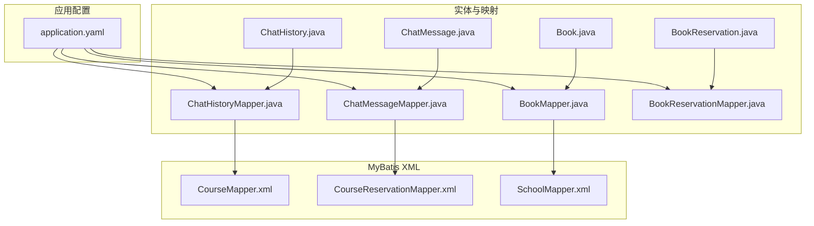
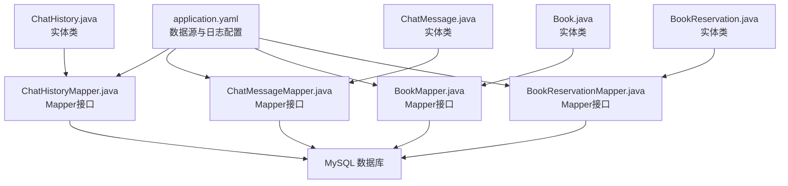
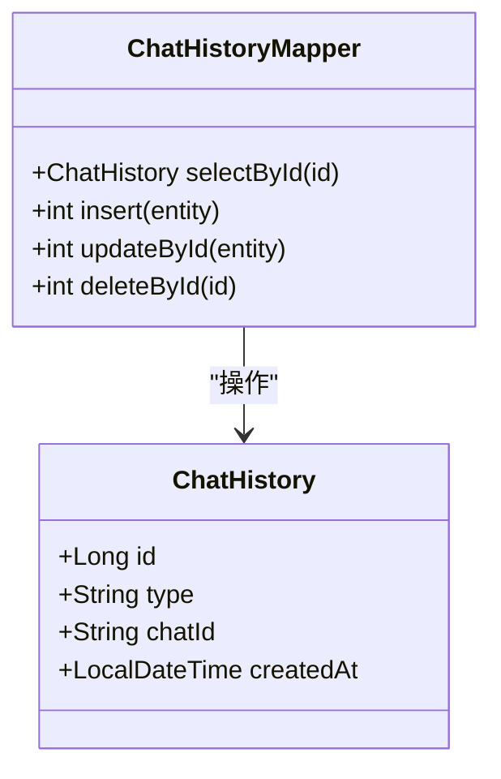
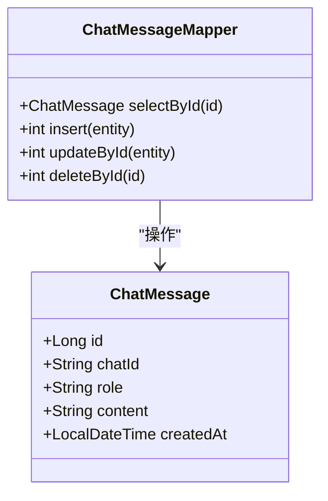
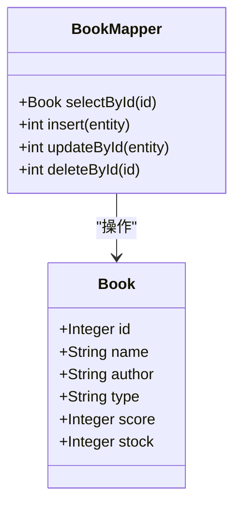
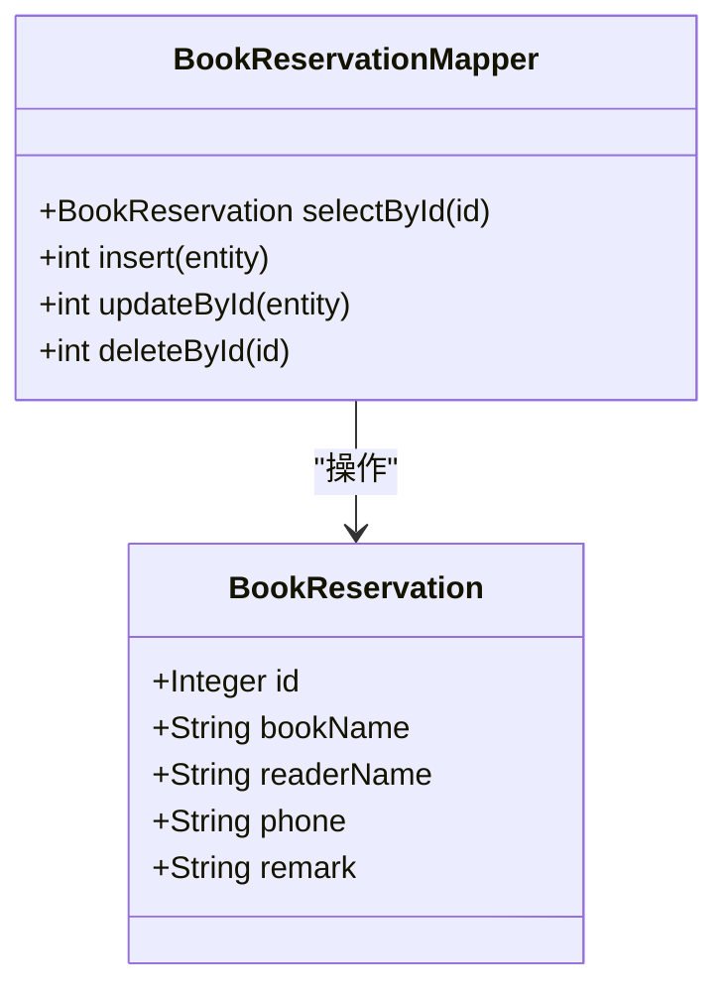
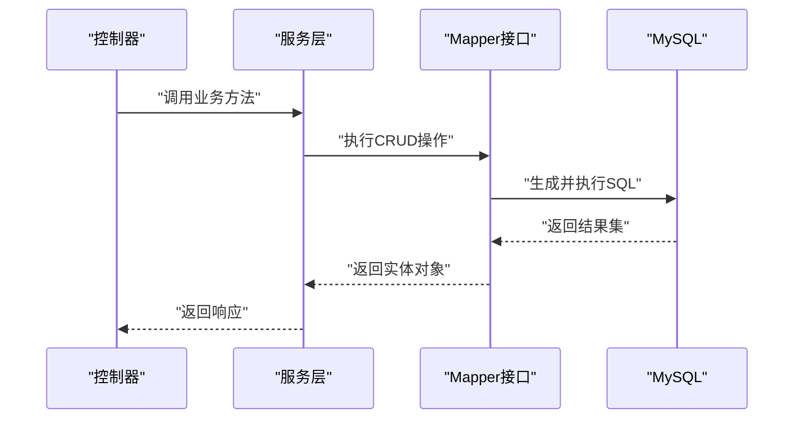
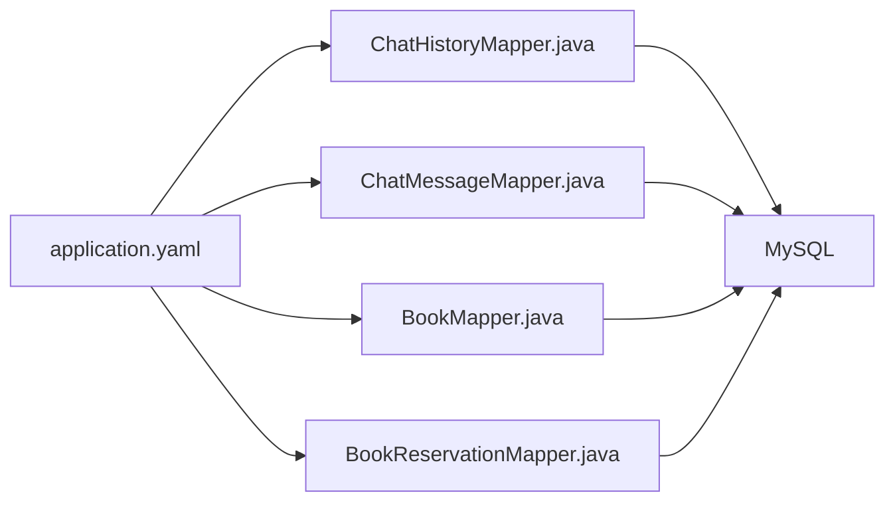

# 数据库表结构

<cite>
**本文引用的文件**
- [application.yaml](file://src/main/resources/application.yaml)
- [ChatHistory.java](file://src/main/java/com/xdu/aibot/pojo/entity/ChatHistory.java)
- [ChatHistoryMapper.java](file://src/main/java/com/xdu/aibot/mapper/ChatHistoryMapper.java)
- [ChatMessage.java](file://src/main/java/com/xdu/aibot/pojo/entity/ChatMessage.java)
- [ChatMessageMapper.java](file://src/main/java/com/xdu/aibot/mapper/ChatMessageMapper.java)
- [Book.java](file://src/main/java/com/xdu/aibot/pojo/entity/Book.java)
- [BookMapper.java](file://src/main/java/com/xdu/aibot/mapper/BookMapper.java)
- [BookReservation.java](file://src/main/java/com/xdu/aibot/pojo/entity/BookReservation.java)
- [BookReservationMapper.java](file://src/main/java/com/xdu/aibot/mapper/BookReservationMapper.java)
- [CourseMapper.xml](file://src/main/resources/mapper/CourseMapper.xml)
- [CourseReservationMapper.xml](file://src/main/resources/mapper/CourseReservationMapper.xml)
- [SchoolMapper.xml](file://src/main/resources/mapper/SchoolMapper.xml)
</cite>

## 目录
1. [简介](#简介)
2. [项目结构](#项目结构)
3. [核心组件](#核心组件)
4. [架构总览](#架构总览)
5. [详细组件分析](#详细组件分析)
6. [依赖分析](#依赖分析)
7. [性能考虑](#性能考虑)
8. [故障排查指南](#故障排查指南)
9. [结论](#结论)
10. [附录](#附录)

## 简介
本文件面向AIbot项目的数据库表结构，基于现有实体类与MyBatis配置，系统化梳理各表的字段定义、数据类型、约束条件与索引设计，并说明表与实体类的映射关系及MyBatis配置要点。同时给出数据库性能优化策略、数据字典与枚举值定义建议、迁移与备份恢复方案以及监控与调优指南。

## 项目结构
AIbot后端采用Spring Boot + MyBatis-Plus + MySQL的数据访问层。数据库连接在应用配置中声明，实体类通过注解映射到MySQL表，Mapper接口继承BaseMapper以获得通用CRUD能力。当前仓库中存在以下与数据库相关的核心文件：
- 数据源与向量配置：application.yaml
- 实体类与Mapper接口：ChatHistory、ChatMessage、Book、BookReservation
- MyBatis Mapper XML：CourseMapper.xml、CourseReservationMapper.xml、SchoolMapper.xml（当前为空）

**图示来源**
- [application.yaml:30-34](file://src/main/resources/application.yaml#L30-L34)
- [ChatHistory.java:9-22](file://src/main/java/com/xdu/aibot/pojo/entity/ChatHistory.java#L9-L22)
- [ChatMessage.java:9-25](file://src/main/java/com/xdu/aibot/pojo/entity/ChatMessage.java#L9-L25)
- [Book.java:22-56](file://src/main/java/com/xdu/aibot/pojo/entity/Book.java#L22-L56)
- [BookReservation.java:22-50](file://src/main/java/com/xdu/aibot/pojo/entity/BookReservation.java#L22-L50)
- [CourseMapper.xml:1-5](file://src/main/resources/mapper/CourseMapper.xml#L1-L5)
- [CourseReservationMapper.xml:1-5](file://src/main/resources/mapper/CourseReservationMapper.xml#L1-L5)
- [SchoolMapper.xml:1-5](file://src/main/resources/mapper/SchoolMapper.xml#L1-L5)

**章节来源**
- [application.yaml:30-34](file://src/main/resources/application.yaml#L30-L34)
- [ChatHistory.java:9-22](file://src/main/java/com/xdu/aibot/pojo/entity/ChatHistory.java#L9-L22)
- [ChatMessage.java:9-25](file://src/main/java/com/xdu/aibot/pojo/entity/ChatMessage.java#L9-L25)
- [Book.java:22-56](file://src/main/java/com/xdu/aibot/pojo/entity/Book.java#L22-L56)
- [BookReservation.java:22-50](file://src/main/java/com/xdu/aibot/pojo/entity/BookReservation.java#L22-L50)
- [CourseMapper.xml:1-5](file://src/main/resources/mapper/CourseMapper.xml#L1-L5)
- [CourseReservationMapper.xml:1-5](file://src/main/resources/mapper/CourseReservationMapper.xml#L1-L5)
- [SchoolMapper.xml:1-5](file://src/main/resources/mapper/SchoolMapper.xml#L1-L5)

## 核心组件
本节对每个实体对应的表进行字段定义、数据类型、约束与索引设计说明，并解释与实体类的映射关系。

- 表：chat_history
  - 映射实体：ChatHistory
  - 字段定义与约束
    - id：自增主键（整型或长整型，依据实体注解与数据库类型）
    - type：字符串，用于标识会话类型
    - chat_id：字符串，会话标识符
    - created_at：时间戳，默认插入时填充
  - 索引设计建议
    - 主键：id
    - 建议在chat_id上建立普通索引，便于按会话检索
    - 建议在type上建立普通索引，便于按类型过滤
    - 建议在created_at上建立普通索引，便于按时间排序与范围查询
  - 与实体映射
    - 使用MyBatis-Plus注解将类成员映射到表字段，主键自增由注解声明

- 表：chat_message
  - 映射实体：ChatMessage
  - 字段定义与约束
    - id：自增主键
    - chat_id：字符串，关联会话
    - role：字符串，取值如“user”、“assistant”
    - content：文本，消息内容
    - created_at：时间戳，默认插入时填充
  - 索引设计建议
    - 主键：id
    - 建议在chat_id上建立普通索引，便于按会话分页查询
    - 建议在role上建立普通索引，便于按角色过滤
    - 建议在created_at上建立普通索引，便于时间序列查询
  - 与实体映射
    - 使用MyBatis-Plus注解映射字段，主键自增由注解声明

- 表：book
  - 映射实体：Book
  - 字段定义与约束
    - id：自增主键
    - name：字符串，书籍名称
    - author：字符串，作者
    - type：字符串，类型枚举（亚洲文学、欧美文学、诗歌、科幻、历史、其它）
    - score：整数，评分1-10
    - stock：整数，库存
  - 索引设计建议
    - 主键：id
    - 建议在name上建立普通索引，便于按书名搜索
    - 建议在author上建立普通索引，便于按作者搜索
    - 建议在type上建立普通索引，便于按类型筛选
    - 建议在score上建立普通索引，便于按评分排序
    - 建议在stock上建立普通索引，便于按库存状态筛选
  - 与实体映射
    - 使用MyBatis-Plus注解映射字段，主键自增由注解声明

- 表：book_reservation
  - 映射实体：BookReservation
  - 字段定义与约束
    - id：自增主键
    - book_name：字符串，借阅书籍名称
    - reader_name：字符串，读者姓名
    - phone：字符串，联系方式
    - remark：字符串，备注
  - 索引设计建议
    - 主键：id
    - 建议在book_name上建立普通索引，便于按书名检索
    - 建议在reader_name上建立普通索引，便于按读者检索
    - 建议在phone上建立普通索引，便于按联系方式检索
  - 与实体映射
    - 使用MyBatis-Plus注解映射字段，主键自增由注解声明

**章节来源**
- [ChatHistory.java:12-22](file://src/main/java/com/xdu/aibot/pojo/entity/ChatHistory.java#L12-L22)
- [ChatMessage.java:12-25](file://src/main/java/com/xdu/aibot/pojo/entity/ChatMessage.java#L12-L25)
- [Book.java:30-56](file://src/main/java/com/xdu/aibot/pojo/entity/Book.java#L30-L56)
- [BookReservation.java:27-50](file://src/main/java/com/xdu/aibot/pojo/entity/BookReservation.java#L27-L50)

## 架构总览
下图展示应用配置、实体类、Mapper接口与数据库表之间的映射关系与交互流程。

**图示来源**
- [application.yaml:30-34](file://src/main/resources/application.yaml#L30-L34)
- [ChatHistory.java:9-22](file://src/main/java/com/xdu/aibot/pojo/entity/ChatHistory.java#L9-L22)
- [ChatMessage.java:9-25](file://src/main/java/com/xdu/aibot/pojo/entity/ChatMessage.java#L9-L25)
- [Book.java:22-56](file://src/main/java/com/xdu/aibot/pojo/entity/Book.java#L22-L56)
- [BookReservation.java:22-50](file://src/main/java/com/xdu/aibot/pojo/entity/BookReservation.java#L22-L50)
- [ChatHistoryMapper.java:8-9](file://src/main/java/com/xdu/aibot/mapper/ChatHistoryMapper.java#L8-L9)
- [ChatMessageMapper.java:7-9](file://src/main/java/com/xdu/aibot/mapper/ChatMessageMapper.java#L7-L9)
- [BookMapper.java:14-16](file://src/main/java/com/xdu/aibot/mapper/BookMapper.java#L14-L16)
- [BookReservationMapper.java:14-16](file://src/main/java/com/xdu/aibot/mapper/BookReservationMapper.java#L14-L16)

## 详细组件分析

### ChatHistory 表分析
- 表名：chat_history
- 字段与约束
  - id：自增主键
  - type：字符串，会话类型
  - chat_id：字符串，会话标识
  - created_at：时间戳，默认插入时填充
- 索引设计
  - 主键：id
  - 建议在chat_id、type、created_at上建立普通索引
- 与实体映射
  - 使用MyBatis-Plus注解映射字段，主键自增由注解声明

**图示来源**
- [ChatHistory.java:12-22](file://src/main/java/com/xdu/aibot/pojo/entity/ChatHistory.java#L12-L22)
- [ChatHistoryMapper.java:8-9](file://src/main/java/com/xdu/aibot/mapper/ChatHistoryMapper.java#L8-L9)

**章节来源**
- [ChatHistory.java:12-22](file://src/main/java/com/xdu/aibot/pojo/entity/ChatHistory.java#L12-L22)
- [ChatHistoryMapper.java:8-9](file://src/main/java/com/xdu/aibot/mapper/ChatHistoryMapper.java#L8-L9)

### ChatMessage 表分析
- 表名：chat_message
- 字段与约束
  - id：自增主键
  - chat_id：字符串，会话标识
  - role：字符串，消息角色
  - content：文本，消息内容
  - created_at：时间戳，默认插入时填充
- 索引设计
  - 主键：id
  - 建议在chat_id、role、created_at上建立普通索引
- 与实体映射
  - 使用MyBatis-Plus注解映射字段，主键自增由注解声明

**图示来源**
- [ChatMessage.java:12-25](file://src/main/java/com/xdu/aibot/pojo/entity/ChatMessage.java#L12-L25)
- [ChatMessageMapper.java:7-9](file://src/main/java/com/xdu/aibot/mapper/ChatMessageMapper.java#L7-L9)

**章节来源**
- [ChatMessage.java:12-25](file://src/main/java/com/xdu/aibot/pojo/entity/ChatMessage.java#L12-L25)
- [ChatMessageMapper.java:7-9](file://src/main/java/com/xdu/aibot/mapper/ChatMessageMapper.java#L7-L9)

### Book 表分析
- 表名：book
- 字段与约束
  - id：自增主键
  - name：字符串，书籍名称
  - author：字符串，作者
  - type：字符串，类型枚举
  - score：整数，评分1-10
  - stock：整数，库存
- 索引设计
  - 主键：id
  - 建议在name、author、type、score、stock上建立普通索引
- 与实体映射
  - 使用MyBatis-Plus注解映射字段，主键自增由注解声明

**图示来源**
- [Book.java:30-56](file://src/main/java/com/xdu/aibot/pojo/entity/Book.java#L30-L56)
- [BookMapper.java:14-16](file://src/main/java/com/xdu/aibot/mapper/BookMapper.java#L14-L16)

**章节来源**
- [Book.java:30-56](file://src/main/java/com/xdu/aibot/pojo/entity/Book.java#L30-L56)
- [BookMapper.java:14-16](file://src/main/java/com/xdu/aibot/mapper/BookMapper.java#L14-L16)

### BookReservation 表分析
- 表名：book_reservation
- 字段与约束
  - id：自增主键
  - book_name：字符串，借阅书籍名称
  - reader_name：字符串，读者姓名
  - phone：字符串，联系方式
  - remark：字符串，备注
- 索引设计
  - 主键：id
  - 建议在book_name、reader_name、phone上建立普通索引
- 与实体映射
  - 使用MyBatis-Plus注解映射字段，主键自增由注解声明

**图示来源**
- [BookReservation.java:27-50](file://src/main/java/com/xdu/aibot/pojo/entity/BookReservation.java#L27-L50)
- [BookReservationMapper.java:14-16](file://src/main/java/com/xdu/aibot/mapper/BookReservationMapper.java#L14-L16)

**章节来源**
- [BookReservation.java:27-50](file://src/main/java/com/xdu/aibot/pojo/entity/BookReservation.java#L27-L50)
- [BookReservationMapper.java:14-16](file://src/main/java/com/xdu/aibot/mapper/BookReservationMapper.java#L14-L16)

### MyBatis 配置与映射
- Mapper接口
  - ChatHistoryMapper、ChatMessageMapper、BookMapper、BookReservationMapper均继承BaseMapper，具备通用CRUD能力
- XML映射
  - 当前仓库中的XML文件为空，表示使用注解驱动的映射策略
- 日志与调试
  - application.yaml中开启MyBatis与Spring Boot相关日志级别，便于SQL与性能问题排查

**图示来源**
- [ChatHistoryMapper.java:8-9](file://src/main/java/com/xdu/aibot/mapper/ChatHistoryMapper.java#L8-L9)
- [ChatMessageMapper.java:7-9](file://src/main/java/com/xdu/aibot/mapper/ChatMessageMapper.java#L7-L9)
- [BookMapper.java:14-16](file://src/main/java/com/xdu/aibot/mapper/BookMapper.java#L14-L16)
- [BookReservationMapper.java:14-16](file://src/main/java/com/xdu/aibot/mapper/BookReservationMapper.java#L14-L16)
- [application.yaml:52-59](file://src/main/resources/application.yaml#L52-L59)

**章节来源**
- [ChatHistoryMapper.java:8-9](file://src/main/java/com/xdu/aibot/mapper/ChatHistoryMapper.java#L8-L9)
- [ChatMessageMapper.java:7-9](file://src/main/java/com/xdu/aibot/mapper/ChatMessageMapper.java#L7-L9)
- [BookMapper.java:14-16](file://src/main/java/com/xdu/aibot/mapper/BookMapper.java#L14-L16)
- [BookReservationMapper.java:14-16](file://src/main/java/com/xdu/aibot/mapper/BookReservationMapper.java#L14-L16)
- [CourseMapper.xml:1-5](file://src/main/resources/mapper/CourseMapper.xml#L1-L5)
- [CourseReservationMapper.xml:1-5](file://src/main/resources/mapper/CourseReservationMapper.xml#L1-L5)
- [SchoolMapper.xml:1-5](file://src/main/resources/mapper/SchoolMapper.xml#L1-L5)
- [application.yaml:52-59](file://src/main/resources/application.yaml#L52-L59)

## 依赖分析
- 组件耦合
  - 实体类与Mapper接口通过注解与泛型绑定，低耦合
  - Mapper接口依赖MyBatis-Plus的BaseMapper，提供统一CRUD能力
- 外部依赖
  - MySQL驱动与URL在application.yaml中配置
  - 日志框架与MyBatis日志级别在application.yaml中配置
- 潜在风险
  - 当前XML映射文件为空，若后续引入复杂SQL，需补充XML映射

**图示来源**
- [application.yaml:30-34](file://src/main/resources/application.yaml#L30-L34)
- [ChatHistoryMapper.java:8-9](file://src/main/java/com/xdu/aibot/mapper/ChatHistoryMapper.java#L8-L9)
- [ChatMessageMapper.java:7-9](file://src/main/java/com/xdu/aibot/mapper/ChatMessageMapper.java#L7-L9)
- [BookMapper.java:14-16](file://src/main/java/com/xdu/aibot/mapper/BookMapper.java#L14-L16)
- [BookReservationMapper.java:14-16](file://src/main/java/com/xdu/aibot/mapper/BookReservationMapper.java#L14-L16)

**章节来源**
- [application.yaml:30-34](file://src/main/resources/application.yaml#L30-L34)
- [ChatHistoryMapper.java:8-9](file://src/main/java/com/xdu/aibot/mapper/ChatHistoryMapper.java#L8-L9)
- [ChatMessageMapper.java:7-9](file://src/main/java/com/xdu/aibot/mapper/ChatMessageMapper.java#L7-L9)
- [BookMapper.java:14-16](file://src/main/java/com/xdu/aibot/mapper/BookMapper.java#L14-L16)
- [BookReservationMapper.java:14-16](file://src/main/java/com/xdu/aibot/mapper/BookReservationMapper.java#L14-L16)

## 性能考虑
- 索引设计
  - 为高频查询字段建立普通索引：chat_id、role、type、created_at、name、author、type、score、stock、book_name、reader_name、phone
- 查询优化
  - 使用分页查询避免全表扫描
  - 对时间范围查询使用created_at索引
  - 对等值过滤使用type、role、book_name等字段索引
- 分区策略
  - 对大表（如chat_message）可按created_at进行水平分区（按月/季度），降低单表数据量
- 缓存策略
  - 结合Redis缓存热点数据（如书籍详情、常用会话摘要）
- 连接池与日志
  - application.yaml中已开启MyBatis与Spring相关日志，便于定位慢查询与异常

**章节来源**
- [application.yaml:52-59](file://src/main/resources/application.yaml#L52-L59)

## 故障排查指南
- 连接问题
  - 检查application.yaml中的数据库URL、用户名、密码是否正确
- SQL异常
  - 查看MyBatis日志，确认SQL生成与参数绑定是否正确
- 索引缺失
  - 使用EXPLAIN分析慢查询，确认是否缺少必要索引
- 数据一致性
  - 对关键业务（如库存变更）增加校验逻辑与事务控制

**章节来源**
- [application.yaml:30-34](file://src/main/resources/application.yaml#L30-L34)
- [application.yaml:52-59](file://src/main/resources/application.yaml#L52-L59)

## 结论
本文件基于现有实体类与配置，给出了AIbot项目数据库表结构的完整设计说明与索引建议，并明确了表与实体类的映射关系及MyBatis配置要点。建议后续补充XML映射文件以支持复杂查询，并结合Redis与分区策略进一步提升性能与可维护性。

## 附录
- 数据字典与枚举值定义建议
  - type（会话/书籍类型）：建议在数据库层面以枚举或字典表管理，确保取值一致性
  - role（消息角色）：建议限定为“user”、“assistant”，并在应用层与数据库层共同校验
- 版本升级与迁移
  - 使用数据库迁移工具（如Flyway/Liquibase）管理DDL变更，记录版本号与回滚脚本
- 备份与恢复
  - 定期全量备份与增量备份结合；测试恢复流程，确保RTO/RPO达标
- 监控指标
  - QPS、慢查询数量、索引命中率、连接池使用率、数据库锁等待时间