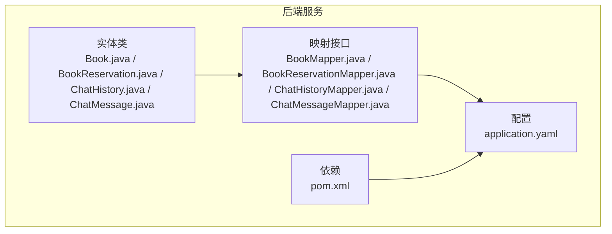
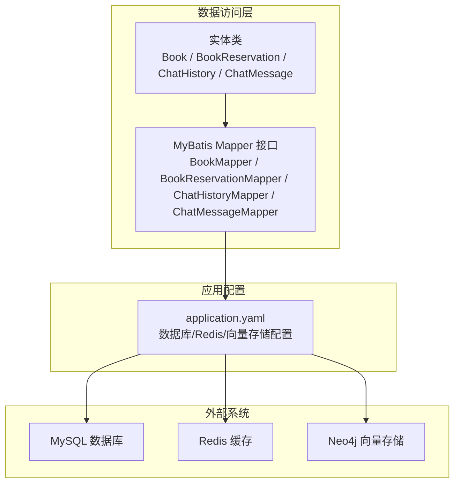
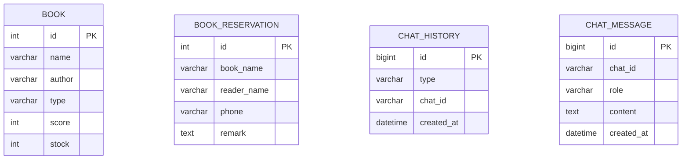
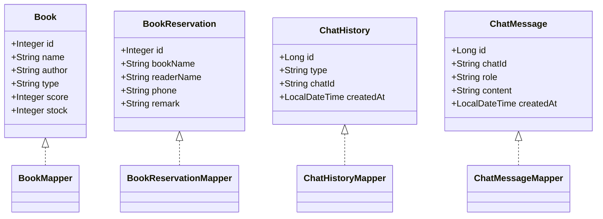
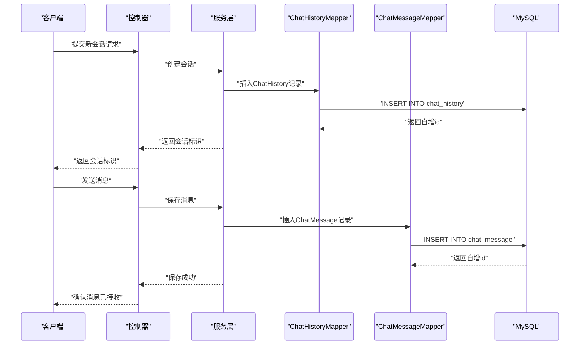
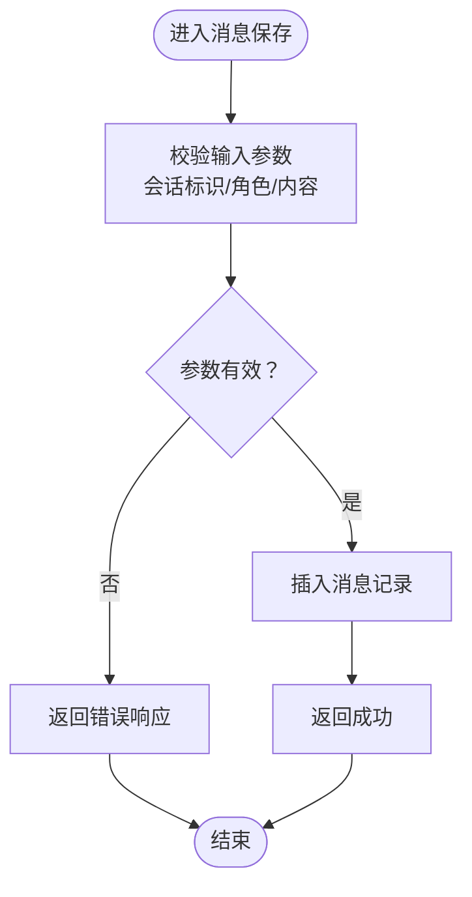
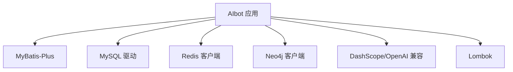

# 数据模型设计

<cite>
**本文引用的文件**
- [Book.java](file://src/main/java/com/xdu/aibot/pojo/entity/Book.java)
- [BookReservation.java](file://src/main/java/com/xdu/aibot/pojo/entity/BookReservation.java)
- [ChatHistory.java](file://src/main/java/com/xdu/aibot/pojo/entity/ChatHistory.java)
- [ChatMessage.java](file://src/main/java/com/xdu/aibot/pojo/entity/ChatMessage.java)
- [BookMapper.java](file://src/main/java/com/xdu/aibot/mapper/BookMapper.java)
- [BookReservationMapper.java](file://src/main/java/com/xdu/aibot/mapper/BookReservationMapper.java)
- [ChatHistoryMapper.java](file://src/main/java/com/xdu/aibot/mapper/ChatHistoryMapper.java)
- [ChatMessageMapper.java](file://src/main/java/com/xdu/aibot/mapper/ChatMessageMapper.java)
- [application.yaml](file://src/main/resources/application.yaml)
- [pom.xml](file://pom.xml)
</cite>

## 目录
1. [简介](#简介)
2. [项目结构](#项目结构)
3. [核心组件](#核心组件)
4. [架构总览](#架构总览)
5. [详细组件分析](#详细组件分析)
6. [依赖分析](#依赖分析)
7. [性能考虑](#性能考虑)
8. [故障排查指南](#故障排查指南)
9. [结论](#结论)
10. [附录](#附录)

## 简介
本文件面向AIbot项目的数据库与数据模型，系统化梳理实体类设计、字段语义、MyBatis映射关系、表结构与约束、数据访问模式、缓存策略、性能优化、数据安全与隐私保护、迁移与版本管理以及归档策略。内容以仓库中现有实体与映射为基础，结合Spring Boot与Spring AI生态进行说明。

## 项目结构
AIbot采用分层架构，数据相关的核心位于以下位置：
- 实体类：pojo/entity 下的领域对象
- 映射接口：mapper 下的MyBatis接口
- 配置：application.yaml 中的数据库、Redis、向量存储等配置
- 依赖：pom.xml 中的MyBatis Plus、MySQL驱动、Neo4j与Spring AI相关依赖

**章节来源**
- [application.yaml:1-59](file://src/main/resources/application.yaml#L1-L59)
- [pom.xml:1-139](file://pom.xml#L1-L139)

## 核心组件
本节对四个核心实体类进行逐项说明，包括设计理念、字段定义、业务含义、主键与默认值策略，以及与之对应的Mapper接口职责。

- Book（书籍）
  - 设计理念：承载基础图书信息，支持按类型与评分筛选、库存管理。
  - 关键字段：主键、书名、作者、类型、评分、库存。
  - 默认策略：主键自增；无字段级默认值。
  - 业务含义：用于图书检索、推荐与借阅流程的基础数据源。

- BookReservation（图书预约）
  - 设计理念：记录读者预约借阅信息，便于后续借还流程与通知。
  - 关键字段：主键、预约书籍名称、读者姓名、联系方式、备注。
  - 默认策略：主键自增；无字段级默认值。
  - 业务含义：作为借阅环节的前置登记与联系信息载体。

- ChatHistory（聊天历史）
  - 设计理念：记录一次对话的元信息，支持按会话标识查询与时间排序。
  - 关键字段：主键、类型、会话标识、创建时间（插入时自动填充）。
  - 默认策略：主键自增；createdAt插入时自动填充。
  - 业务含义：作为消息集合的入口，支撑多轮对话管理。

- ChatMessage（聊天消息）
  - 设计理念：记录单条消息内容与角色，配合历史表实现完整对话链路。
  - 关键字段：主键、会话标识、角色（用户/助手）、内容、创建时间（插入时自动填充）。
  - 默认策略：主键自增；createdAt插入时自动填充。
  - 业务含义：承载实际问答内容，支持检索与回放。

**章节来源**
- [Book.java:11-57](file://src/main/java/com/xdu/aibot/pojo/entity/Book.java#L11-L57)
- [BookReservation.java:11-51](file://src/main/java/com/xdu/aibot/pojo/entity/BookReservation.java#L11-L51)
- [ChatHistory.java:8-23](file://src/main/java/com/xdu/aibot/pojo/entity/ChatHistory.java#L8-L23)
- [ChatMessage.java:8-27](file://src/main/java/com/xdu/aibot/pojo/entity/ChatMessage.java#L8-L27)

## 架构总览
下图展示数据模型在系统中的位置与交互关系：实体类通过MyBatis接口映射到数据库表；应用配置指定MySQL与Redis连接；Spring AI与Neo4j用于向量化与图存储能力。

**图表来源**
- [application.yaml:1-59](file://src/main/resources/application.yaml#L1-L59)
- [BookMapper.java:1-17](file://src/main/java/com/xdu/aibot/mapper/BookMapper.java#L1-L17)
- [BookReservationMapper.java:1-17](file://src/main/java/com/xdu/aibot/mapper/BookReservationMapper.java#L1-L17)
- [ChatHistoryMapper.java:1-10](file://src/main/java/com/xdu/aibot/mapper/ChatHistoryMapper.java#L1-L10)
- [ChatMessageMapper.java:1-10](file://src/main/java/com/xdu/aibot/mapper/ChatMessageMapper.java#L1-L10)

## 详细组件分析

### 实体类与表结构
- 表命名与主键
  - Book：表名为book，主键id自增。
  - BookReservation：表名为book_reservation，主键id自增。
  - ChatHistory：表名为chat_history，主键id自增。
  - ChatMessage：表名为chat_message，主键id自增。
- 字段映射与默认值
  - 所有实体均使用MyBatis-Plus注解声明表名与主键策略。
  - createdAt字段在历史与消息实体中声明插入时自动填充，确保数据生命周期一致性。

**图表来源**
- [Book.java:22-57](file://src/main/java/com/xdu/aibot/pojo/entity/Book.java#L22-L57)
- [BookReservation.java:22-51](file://src/main/java/com/xdu/aibot/pojo/entity/BookReservation.java#L22-L51)
- [ChatHistory.java:9-23](file://src/main/java/com/xdu/aibot/pojo/entity/ChatHistory.java#L9-L23)
- [ChatMessage.java:9-27](file://src/main/java/com/xdu/aibot/pojo/entity/ChatMessage.java#L9-L27)

**章节来源**
- [Book.java:22-57](file://src/main/java/com/xdu/aibot/pojo/entity/Book.java#L22-L57)
- [BookReservation.java:22-51](file://src/main/java/com/xdu/aibot/pojo/entity/BookReservation.java#L22-L51)
- [ChatHistory.java:9-23](file://src/main/java/com/xdu/aibot/pojo/entity/ChatHistory.java#L9-L23)
- [ChatMessage.java:9-27](file://src/main/java/com/xdu/aibot/pojo/entity/ChatMessage.java#L9-L27)

### POJO类与MyBatis映射
- POJO类职责
  - 以纯Java对象承载数据库记录，提供getter/setter与序列化能力，便于跨层传递与持久化。
- MyBatis映射
  - 使用BaseMapper接口，继承通用CRUD能力，无需手写SQL即可完成常见操作。
  - 注解驱动：@TableName、@TableId、@TableField、@FieldFill等，保证实体与表结构的一致性。

**图表来源**
- [Book.java:19-57](file://src/main/java/com/xdu/aibot/pojo/entity/Book.java#L19-L57)
- [BookReservation.java:19-51](file://src/main/java/com/xdu/aibot/pojo/entity/BookReservation.java#L19-L51)
- [ChatHistory.java:8-23](file://src/main/java/com/xdu/aibot/pojo/entity/ChatHistory.java#L8-L23)
- [ChatMessage.java:8-27](file://src/main/java/com/xdu/aibot/pojo/entity/ChatMessage.java#L8-L27)
- [BookMapper.java:14-16](file://src/main/java/com/xdu/aibot/mapper/BookMapper.java#L14-L16)
- [BookReservationMapper.java:14-16](file://src/main/java/com/xdu/aibot/mapper/BookReservationMapper.java#L14-L16)
- [ChatHistoryMapper.java:9-9](file://src/main/java/com/xdu/aibot/mapper/ChatHistoryMapper.java#L9-L9)
- [ChatMessageMapper.java:8-9](file://src/main/java/com/xdu/aibot/mapper/ChatMessageMapper.java#L8-L9)

**章节来源**
- [BookMapper.java:14-16](file://src/main/java/com/xdu/aibot/mapper/BookMapper.java#L14-L16)
- [BookReservationMapper.java:14-16](file://src/main/java/com/xdu/aibot/mapper/BookReservationMapper.java#L14-L16)
- [ChatHistoryMapper.java:9-9](file://src/main/java/com/xdu/aibot/mapper/ChatHistoryMapper.java#L9-L9)
- [ChatMessageMapper.java:8-9](file://src/main/java/com/xdu/aibot/mapper/ChatMessageMapper.java#L8-L9)

### 数据访问流程（以聊天为例）

**图表来源**
- [ChatHistoryMapper.java:9-9](file://src/main/java/com/xdu/aibot/mapper/ChatHistoryMapper.java#L9-L9)
- [ChatMessageMapper.java:8-9](file://src/main/java/com/xdu/aibot/mapper/ChatMessageMapper.java#L8-L9)
- [application.yaml:30-34](file://src/main/resources/application.yaml#L30-L34)

**章节来源**
- [ChatHistoryMapper.java:9-9](file://src/main/java/com/xdu/aibot/mapper/ChatHistoryMapper.java#L9-L9)
- [ChatMessageMapper.java:8-9](file://src/main/java/com/xdu/aibot/mapper/ChatMessageMapper.java#L8-L9)

### 复杂逻辑流程（消息入库校验）

**图表来源**
- [ChatMessage.java:15-25](file://src/main/java/com/xdu/aibot/pojo/entity/ChatMessage.java#L15-L25)

**章节来源**
- [ChatMessage.java:15-25](file://src/main/java/com/xdu/aibot/pojo/entity/ChatMessage.java#L15-L25)

## 依赖分析
- 持久化与ORM
  - MyBatis-Plus：提供通用Mapper与自动填充能力，简化CRUD与注解映射。
  - MySQL驱动：连接本地数据库，支持SSL与时区配置。
- 缓存与内存
  - Redis：连接本地实例，配置连接池参数，可用于会话缓存或短期状态存储。
- 向量存储与图数据库
  - Neo4j：配置远程数据库URI与认证，启用向量索引初始化，支持嵌入维度与距离类型设置。
- 外部模型服务
  - DashScope/OpenAI兼容：通过Spring AI适配器调用，提供对话与嵌入能力。

**图表来源**
- [pom.xml:33-115](file://pom.xml#L33-L115)
- [application.yaml:30-49](file://src/main/resources/application.yaml#L30-L49)

**章节来源**
- [pom.xml:33-115](file://pom.xml#L33-L115)
- [application.yaml:30-49](file://src/main/resources/application.yaml#L30-L49)

## 性能考虑
- 数据库层面
  - 自增主键策略简单高效，适合高并发写入场景。
  - 插入时自动填充创建时间，减少应用侧逻辑与网络往返。
- 缓存策略
  - Redis连接池参数可调优，建议根据QPS与峰值内存评估最大活跃连接数与空闲连接数。
  - 对高频查询结果（如最近会话列表）可引入短期缓存，降低数据库压力。
- 向量与图存储
  - Neo4j向量索引初始化与嵌入维度设置需与硬件资源匹配，避免过高的维度导致索引膨胀与查询延迟。
- 日志与可观测性
  - 开启调试日志有助于定位慢查询与异常，但生产环境应平衡日志级别与性能开销。

**章节来源**
- [application.yaml:36-45](file://src/main/resources/application.yaml#L36-L45)
- [application.yaml:10-29](file://src/main/resources/application.yaml#L10-L29)
- [application.yaml:52-59](file://src/main/resources/application.yaml#L52-L59)

## 故障排查指南
- 连接问题
  - MySQL：核对URL、用户名、密码与时区配置；确认SSL与公钥检索选项是否符合环境要求。
  - Redis：核对主机、端口与密码；检查连接池参数与驱逐间隔。
  - Neo4j：核对URI与认证信息；确认向量索引初始化开关与数据库名称。
- ORM问题
  - 若出现字段映射不一致，检查实体类注解与表字段是否一致；确认插入时间自动填充是否生效。
- 日志定位
  - 结合Spring AI、Neo4j与MyBatis的日志级别，逐步缩小问题范围。

**章节来源**
- [application.yaml:30-49](file://src/main/resources/application.yaml#L30-L49)
- [ChatHistory.java:21-22](file://src/main/java/com/xdu/aibot/pojo/entity/ChatHistory.java#L21-L22)
- [ChatMessage.java:24-25](file://src/main/java/com/xdu/aibot/pojo/entity/ChatMessage.java#L24-L25)
- [application.yaml:52-59](file://src/main/resources/application.yaml#L52-L59)

## 结论
AIbot的数据模型围绕“图书”与“聊天”两大业务域展开，采用简洁的POJO+MyBatis-Plus方案实现快速开发与良好扩展性。通过Redis与Neo4j增强实时性与向量化能力，配合合理的缓存与日志策略，可在保证性能的同时满足业务演进需求。后续可在索引设计、缓存淘汰策略与数据归档方面进一步细化。

## 附录

### 数据验证与业务规则
- 必填字段
  - 聊天消息：会话标识、角色、内容。
  - 图书预约：读者姓名、联系方式。
- 取值范围
  - 书籍评分：1-10（若存在业务约束，建议在服务层校验）。
- 时间字段
  - 创建时间由框架自动填充，确保数据一致性。

**章节来源**
- [ChatMessage.java:15-25](file://src/main/java/com/xdu/aibot/pojo/entity/ChatMessage.java#L15-L25)
- [BookReservation.java:30-48](file://src/main/java/com/xdu/aibot/pojo/entity/BookReservation.java#L30-L48)
- [Book.java:48-51](file://src/main/java/com/xdu/aibot/pojo/entity/Book.java#L48-L51)

### 数据生命周期管理
- 创建时间：插入时自动填充，便于审计与统计。
- 清理策略：建议基于会话超时与内容长度限制制定清理计划，避免历史表无限增长。

**章节来源**
- [ChatHistory.java:21-22](file://src/main/java/com/xdu/aibot/pojo/entity/ChatHistory.java#L21-L22)
- [ChatMessage.java:24-25](file://src/main/java/com/xdu/aibot/pojo/entity/ChatMessage.java#L24-L25)

### 数据安全、隐私与访问控制
- 传输安全
  - MySQL与Neo4j连接建议启用SSL/TLS；生产环境避免明文凭据。
- 凭据管理
  - 使用环境变量注入敏感配置（如DashScope/OpenAI API Key），避免硬编码。
- 访问控制
  - 控制器层建议增加鉴权与权限校验，防止越权访问。

**章节来源**
- [application.yaml:30-34](file://src/main/resources/application.yaml#L30-L34)
- [application.yaml:6-8](file://src/main/resources/application.yaml#L6-L8)
- [application.yaml:17-29](file://src/main/resources/application.yaml#L17-L29)

### 数据迁移、版本管理与归档
- 版本管理
  - 使用数据库迁移工具（如Flyway/Liquibase）管理schema变更，确保多环境一致性。
- 归档策略
  - 对历史聊天数据设定保留周期，到期后归档至冷存储；对图书与预约数据按业务规则定期清理冗余记录。
- 回滚与备份
  - 建议在迁移前后执行备份与校验，确保数据完整性。

[本节为通用实践建议，不直接分析具体文件，故不附“章节来源”]