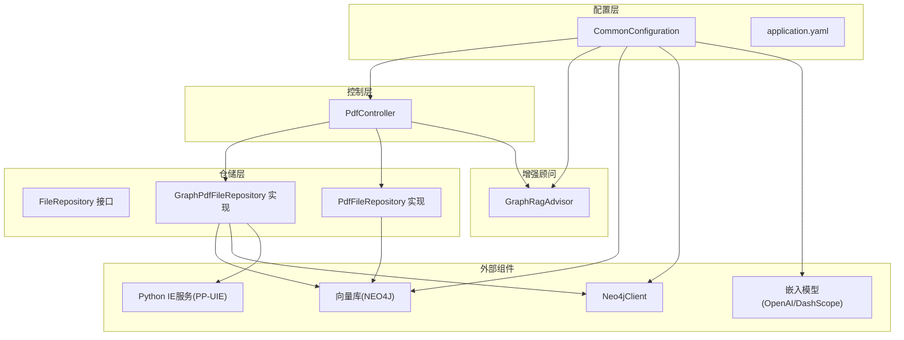
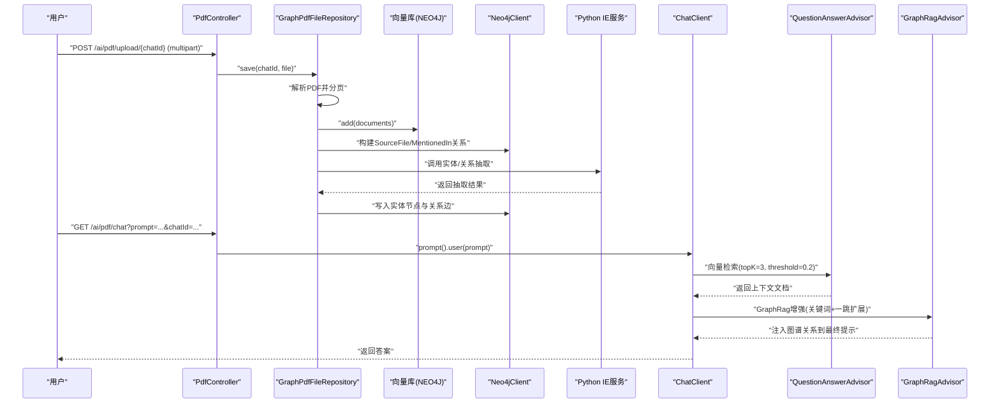
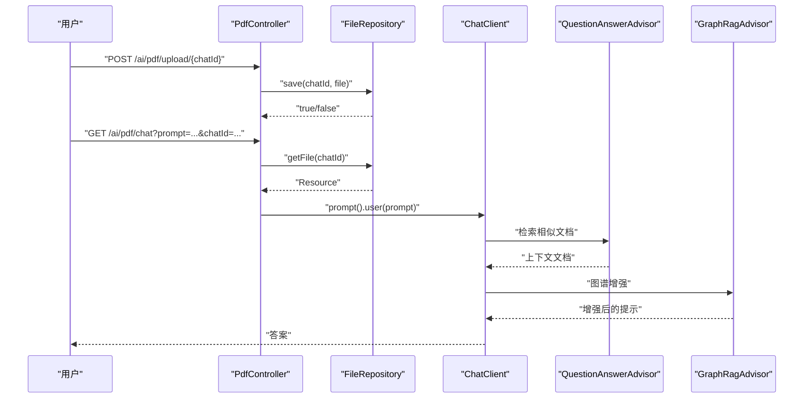
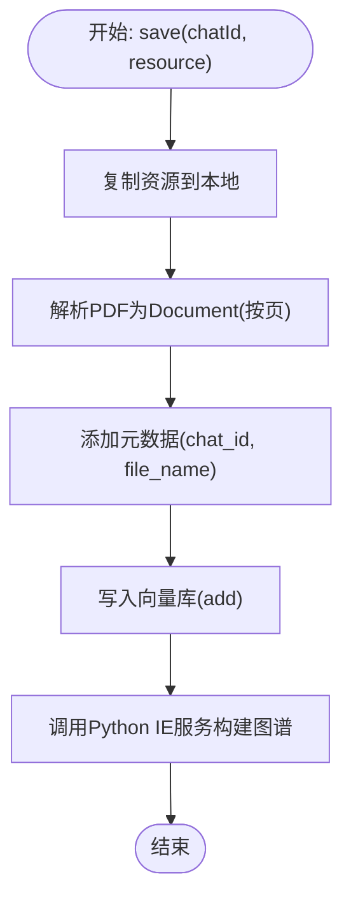
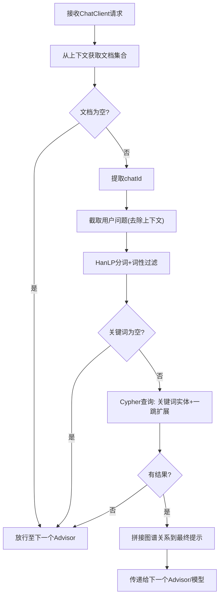
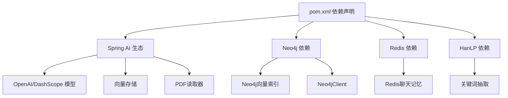

# PDF智能问答系统

<cite>
**本文档引用的文件**
- [PdfController.java](file://src/main/java/com/xdu/aibot/controller/PdfController.java)
- [GraphPdfFileRepository.java](file://src/main/java/com/xdu/aibot/repository/Impl/GraphPdfFileRepository.java)
- [PdfFileRepository.java](file://src/main/java/com/xdu/aibot/repository/Impl/PdfFileRepository.java)
- [GraphRagAdvisor.java](file://src/main/java/com/xdu/aibot/advisor/GraphRagAdvisor.java)
- [CommonConfiguration.java](file://src/main/java/com/xdu/aibot/config/CommonConfiguration.java)
- [FileRepository.java](file://src/main/java/com/xdu/aibot/repository/FileRepository.java)
- [Result.java](file://src/main/java/com/xdu/aibot/pojo/vo/Result.java)
- [application.yaml](file://src/main/resources/application.yaml)
- [chat-pdf.properties](file://chat-pdf.properties)
- [pom.xml](file://pom.xml)
</cite>

## 目录
1. [简介](#简介)
2. [项目结构](#项目结构)
3. [核心组件](#核心组件)
4. [架构总览](#架构总览)
5. [详细组件分析](#详细组件分析)
6. [依赖分析](#依赖分析)
7. [性能考虑](#性能考虑)
8. [故障排除指南](#故障排除指南)
9. [结论](#结论)
10. [附录](#附录)

## 简介
本系统是一个基于Spring Boot与Spring AI的PDF智能问答平台，支持PDF文档上传、解析、向量化存储、RAG增强检索与知识图谱增强问答。系统通过向量检索与Neo4j知识图谱相结合的方式，提升问答的准确性与可解释性。核心特性包括：
- PDF上传与验证
- 基于分页的PDF解析与向量化
- 向量库（Neo4j向量索引）存储与检索
- 图谱构建（实体抽取、关系抽取）与增强问答
- 会话管理与历史持久化
- 错误处理与性能优化

## 项目结构
系统采用按职责分层的组织方式，主要模块如下：
- 控制层：PdfController负责HTTP接口与会话控制
- 仓储层：FileRepository接口及其实现（GraphPdfFileRepository、PdfFileRepository）
- 增强顾问：GraphRagAdvisor用于图谱增强
- 配置层：CommonConfiguration定义ChatClient、向量库与Neo4j客户端
- 资源配置：application.yaml提供数据库、向量库、嵌入模型、Redis等配置
- 工具与常量：Result封装返回体、ChatType枚举类型

图表来源
- [PdfController.java:26-98](file://src/main/java/com/xdu/aibot/controller/PdfController.java#L26-L98)
- [GraphPdfFileRepository.java:27-262](file://src/main/java/com/xdu/aibot/repository/Impl/GraphPdfFileRepository.java#L27-L262)
- [PdfFileRepository.java:28-109](file://src/main/java/com/xdu/aibot/repository/Impl/PdfFileRepository.java#L28-L109)
- [GraphRagAdvisor.java:18-149](file://src/main/java/com/xdu/aibot/advisor/GraphRagAdvisor.java#L18-L149)
- [CommonConfiguration.java:34-129](file://src/main/java/com/xdu/aibot/config/CommonConfiguration.java#L34-L129)
- [application.yaml:1-59](file://src/main/resources/application.yaml#L1-L59)

章节来源
- [application.yaml:1-59](file://src/main/resources/application.yaml#L1-L59)
- [pom.xml:1-139](file://pom.xml#L1-L139)

## 核心组件
- PdfController：提供PDF上传、问答与文件下载接口，负责会话标识与向量检索过滤参数传递
- GraphPdfFileRepository：实现FileRepository，负责PDF解析、向量入库、图谱构建与文件查询
- GraphRagAdvisor：实现CallAdvisor，基于HanLP抽取关键词，在Neo4j中扩展图谱上下文并注入最终提示
- CommonConfiguration：装配ChatClient、向量库、Neo4jClient与Redis聊天记忆仓库
- FileRepository接口：抽象文件与向量的存取契约
- Result：统一返回体封装

章节来源
- [PdfController.java:26-98](file://src/main/java/com/xdu/aibot/controller/PdfController.java#L26-L98)
- [GraphPdfFileRepository.java:27-262](file://src/main/java/com/xdu/aibot/repository/Impl/GraphPdfFileRepository.java#L27-L262)
- [GraphRagAdvisor.java:18-149](file://src/main/java/com/xdu/aibot/advisor/GraphRagAdvisor.java#L18-L149)
- [CommonConfiguration.java:34-129](file://src/main/java/com/xdu/aibot/config/CommonConfiguration.java#L34-L129)
- [FileRepository.java:1-22](file://src/main/java/com/xdu/aibot/repository/FileRepository.java#L1-L22)
- [Result.java:1-24](file://src/main/java/com/xdu/aibot/pojo/vo/Result.java#L1-L24)

## 架构总览
系统采用“控制器-仓储-增强顾问-外部服务”的分层架构。控制器接收请求后，通过FileRepository将PDF解析并写入向量库，同时触发图谱构建；问答阶段由ChatClient驱动，结合QuestionAnswerAdvisor进行向量检索，并由GraphRagAdvisor进行图谱增强，最终生成答案。

图表来源
- [PdfController.java:42-55](file://src/main/java/com/xdu/aibot/controller/PdfController.java#L42-L55)
- [GraphPdfFileRepository.java:41-70](file://src/main/java/com/xdu/aibot/repository/Impl/GraphPdfFileRepository.java#L41-L70)
- [GraphPdfFileRepository.java:115-177](file://src/main/java/com/xdu/aibot/repository/Impl/GraphPdfFileRepository.java#L115-L177)
- [CommonConfiguration.java:90-127](file://src/main/java/com/xdu/aibot/config/CommonConfiguration.java#L90-L127)
- [GraphRagAdvisor.java:38-136](file://src/main/java/com/xdu/aibot/advisor/GraphRagAdvisor.java#L38-L136)

## 详细组件分析

### PdfController 组件分析
- 职责
  - 处理PDF上传：校验文件类型、保存资源、返回统一结果
  - 处理问答：根据chatId定位文件，设置过滤表达式，调用ChatClient进行RAG问答
  - 处理文件下载：根据chatId返回文件流
- 关键点
  - 上传接口：/ai/pdf/upload/{chatId}，仅允许PDF类型
  - 问答接口：/ai/pdf/chat，通过FILTER_EXPRESSION限制检索范围
  - 下载接口：/ai/pdf/file/{chatId}，支持中文文件名编码
  - 会话管理：调用ChatHistoryRepository保存会话类型与chatId

图表来源
- [PdfController.java:42-55](file://src/main/java/com/xdu/aibot/controller/PdfController.java#L42-L55)
- [PdfController.java:60-77](file://src/main/java/com/xdu/aibot/controller/PdfController.java#L60-L77)
- [PdfController.java:82-96](file://src/main/java/com/xdu/aibot/controller/PdfController.java#L82-L96)

章节来源
- [PdfController.java:26-98](file://src/main/java/com/xdu/aibot/controller/PdfController.java#L26-L98)
- [Result.java:17-23](file://src/main/java/com/xdu/aibot/pojo/vo/Result.java#L17-L23)

### GraphPdfFileRepository 组件分析
- 职责
  - PDF解析：按页拆分，设置元数据（chat_id、file_name）
  - 向量入库：将文档写入Neo4j向量索引
  - 图谱构建：调用Python IE服务抽取实体与关系，写入Neo4j
  - 文件查询：根据chatId从Neo4j查询文件名并返回Resource
- 关键点
  - 解析器配置：每页一个Document，文本格式化
  - 向量存储：使用自定义Neo4j向量索引（cosine距离、1536维）
  - 图谱抽取：Schema包含人物、地点、事件三类，调用本地Python服务
  - 无效实体过滤：过滤空值与特定占位符
  - SourceFile节点：为每个chatId预创建，建立“被提及”关系

图表来源
- [GraphPdfFileRepository.java:41-70](file://src/main/java/com/xdu/aibot/repository/Impl/GraphPdfFileRepository.java#L41-L70)
- [GraphPdfFileRepository.java:85-99](file://src/main/java/com/xdu/aibot/repository/Impl/GraphPdfFileRepository.java#L85-L99)
- [GraphPdfFileRepository.java:115-177](file://src/main/java/com/xdu/aibot/repository/Impl/GraphPdfFileRepository.java#L115-L177)

章节来源
- [GraphPdfFileRepository.java:27-262](file://src/main/java/com/xdu/aibot/repository/Impl/GraphPdfFileRepository.java#L27-L262)

### GraphRagAdvisor 组件分析
- 职责
  - 从上下文提取文档集合，获取chatId
  - 使用HanLP对用户问题进行分词与词性过滤，提取关键词
  - 在Neo4j中以SourceFile为锚点，查找包含关键词的实体并扩展一跳关系
  - 将图谱关系拼接到最终提示，交由下游LLM生成答案
- 关键点
  - 关键词过滤：仅保留人名、地名、机构、普通名词等
  - Cypher查询：限定返回条数，避免过多上下文
  - 上下文兼容：适配不同Key（qa_retrieved_documents、rag_document_context）

图表来源
- [GraphRagAdvisor.java:38-136](file://src/main/java/com/xdu/aibot/advisor/GraphRagAdvisor.java#L38-L136)

章节来源
- [GraphRagAdvisor.java:18-149](file://src/main/java/com/xdu/aibot/advisor/GraphRagAdvisor.java#L18-L149)

### 会话管理与历史持久化
- 会话标识：chatId作为会话唯一标识，贯穿上传、问答与文件查询
- 历史记录：PdfController在问答前调用ChatHistoryRepository保存会话类型（PDF）
- 聊天记忆：通过Redis与MessageWindowChatMemory实现多轮对话上下文
- 文件映射：GraphPdfFileRepository在保存时将chatId与文件名关联，便于后续查询

章节来源
- [PdfController.java:48](file://src/main/java/com/xdu/aibot/controller/PdfController.java#L48)
- [CommonConfiguration.java:74-88](file://src/main/java/com/xdu/aibot/config/CommonConfiguration.java#L74-L88)
- [CommonConfiguration.java:90-127](file://src/main/java/com/xdu/aibot/config/CommonConfiguration.java#L90-L127)

### API 使用示例
- 上传PDF
  - 方法与路径：POST /ai/pdf/upload/{chatId}
  - 参数：multipart/form-data，字段名为file，内容类型为application/pdf
  - 返回：Result对象，包含状态码与消息
- 问答
  - 方法与路径：GET /ai/pdf/chat
  - 参数：prompt（问题文本）、chatId（会话标识）
  - 行为：根据chatId定位文件，过滤向量检索范围，返回答案
- 文件下载
  - 方法与路径：GET /ai/pdf/file/{chatId}
  - 行为：根据chatId返回文件流，自动编码文件名

章节来源
- [PdfController.java:60-77](file://src/main/java/com/xdu/aibot/controller/PdfController.java#L60-L77)
- [PdfController.java:42-55](file://src/main/java/com/xdu/aibot/controller/PdfController.java#L42-L55)
- [PdfController.java:82-96](file://src/main/java/com/xdu/aibot/controller/PdfController.java#L82-L96)
- [Result.java:17-23](file://src/main/java/com/xdu/aibot/pojo/vo/Result.java#L17-L23)

## 依赖分析
- Spring AI生态：OpenAI/DashScope模型、向量存储、PDF读取器、Advisor链
- Neo4j：向量索引与原生图查询，支持大规模实体关系存储
- Redis：聊天记忆存储，支持高并发会话
- HanLP：中文分词与词性标注，用于关键词抽取
- Python IE服务：实体与关系抽取，输出结构化三元组

图表来源
- [pom.xml:33-116](file://pom.xml#L33-L116)
- [application.yaml:17-30](file://src/main/resources/application.yaml#L17-L30)

章节来源
- [pom.xml:1-139](file://pom.xml#L1-L139)
- [application.yaml:1-59](file://src/main/resources/application.yaml#L1-L59)

## 性能考虑
- 向量检索参数
  - topK=3、similarityThreshold=0.2，平衡召回与质量
  - cosine距离与1536维嵌入，适合细粒度相似度匹配
- 文档拆分策略
  - 每页为一个Document，降低单文档过长导致的嵌入与检索开销
- 图谱增强
  - 关键词过滤与Cypher限制返回数量，避免过多上下文影响推理
- 缓存与持久化
  - Redis聊天记忆减少重复上下文传输
  - 向量库批量写入与批处理策略（TokenCountBatchingStrategy）
- IO与网络
  - Python IE服务异步化与异常保护，避免阻塞主线程
  - 文件复制与向量入库分离，提高吞吐

## 故障排除指南
- 上传失败
  - 现象：返回“只能上传PDF文件！”或“保存文件失败”
  - 排查：确认文件类型为application/pdf；检查目标目录权限与磁盘空间
- 问答报错
  - 现象：提示“请先上传文件！”
  - 排查：确认已先执行上传；检查chatId是否正确；确认向量库初始化完成
- 图谱构建异常
  - 现象：Python IE服务调用失败或日志报错
  - 排查：确认IE服务地址可达；检查请求体schema与文本长度；查看Neo4j写入异常
- 向量检索无结果
  - 现象：返回空答案或低相关性
  - 排查：调整similarityThreshold；增大topK；检查嵌入维度与距离类型一致性
- 中文文件名下载乱码
  - 现象：浏览器下载文件名显示异常
  - 排查：确认响应头Content-Disposition中的文件名已UTF-8编码

章节来源
- [PdfController.java:64-76](file://src/main/java/com/xdu/aibot/controller/PdfController.java#L64-L76)
- [PdfController.java:45-47](file://src/main/java/com/xdu/aibot/controller/PdfController.java#L45-L47)
- [GraphPdfFileRepository.java:162-175](file://src/main/java/com/xdu/aibot/repository/Impl/GraphPdfFileRepository.java#L162-L175)
- [CommonConfiguration.java:102-108](file://src/main/java/com/xdu/aibot/config/CommonConfiguration.java#L102-L108)

## 结论
本系统通过“向量检索+知识图谱增强”的双通道设计，实现了对PDF文档的高效问答。GraphPdfFileRepository承担了PDF解析、向量入库与图谱构建的核心职责，GraphRagAdvisor在问答阶段注入图谱上下文，显著提升了答案的准确性与可解释性。配合Redis聊天记忆与严格的错误处理策略，系统具备良好的生产可用性与扩展性。

## 附录
- 配置要点
  - 向量库：cosine距离、1536维、自定义索引名称
  - 嵌入模型：DashScope/OpenAI兼容接口
  - Neo4j认证：用户名、密码、URI
  - Redis：连接参数与池配置
- 文件映射
  - chat-pdf.properties：会话ID到文件名的映射
  - chat-pdf.json：向量库持久化数据

章节来源
- [application.yaml:4-59](file://src/main/resources/application.yaml#L4-L59)
- [chat-pdf.properties:1-4](file://chat-pdf.properties#L1-L4)
- [PdfFileRepository.java:65-92](file://src/main/java/com/xdu/aibot/repository/Impl/PdfFileRepository.java#L65-L92)