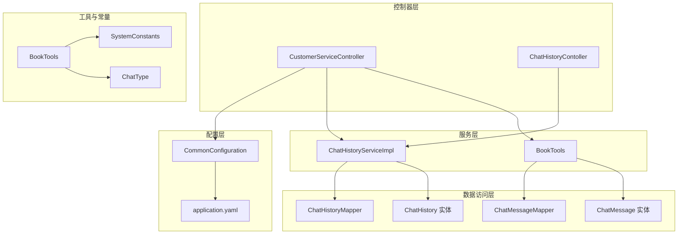
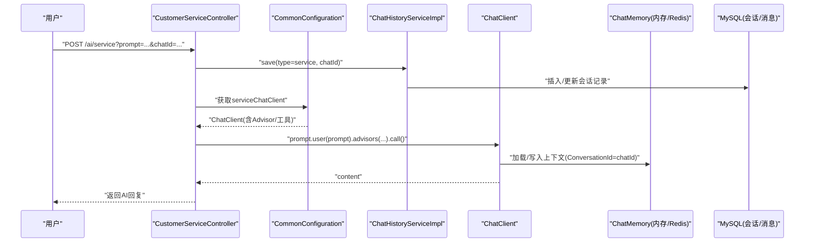
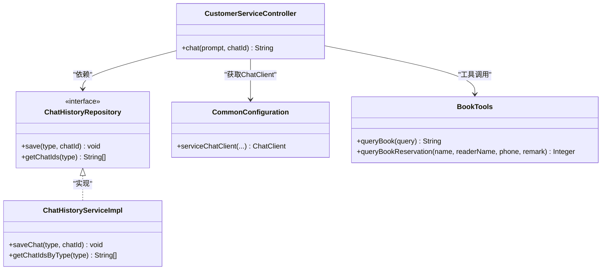
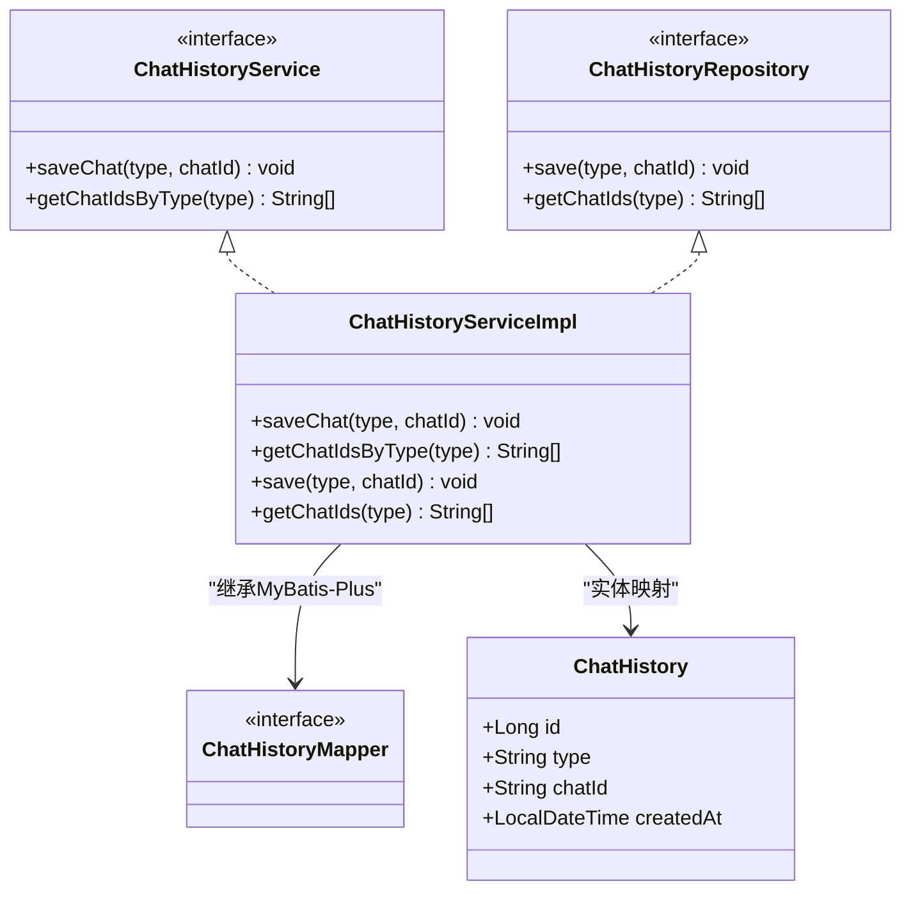
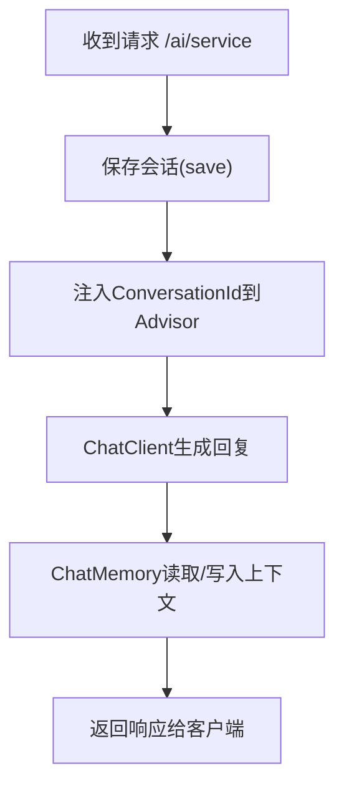
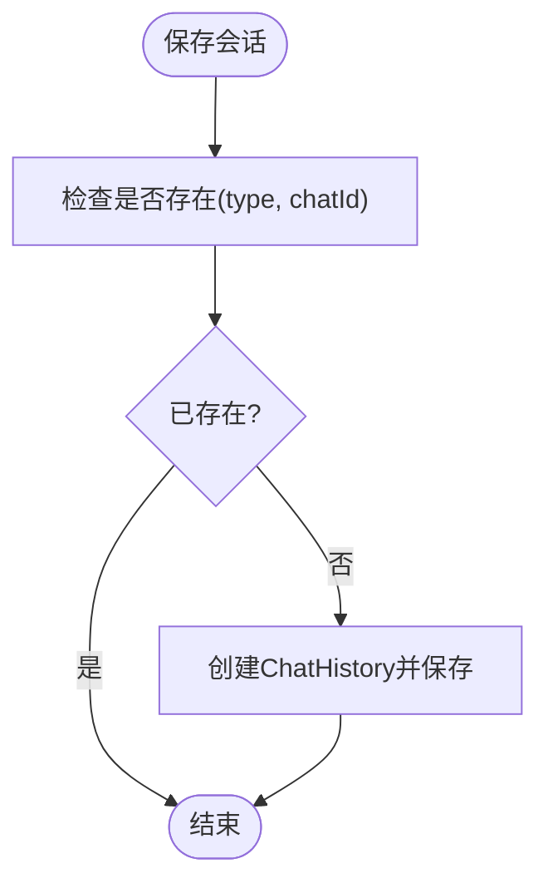
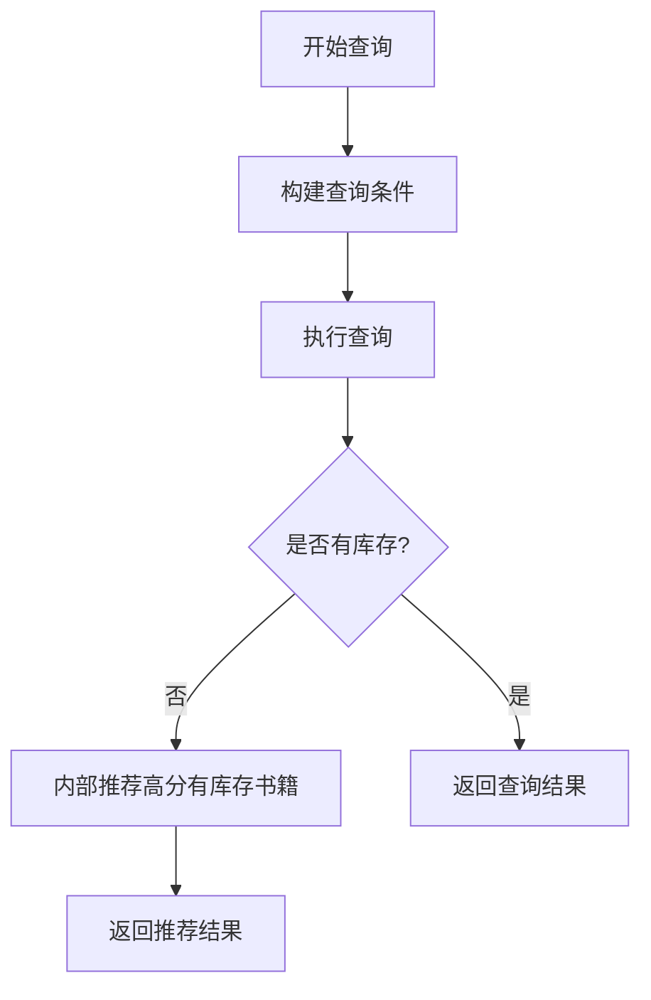
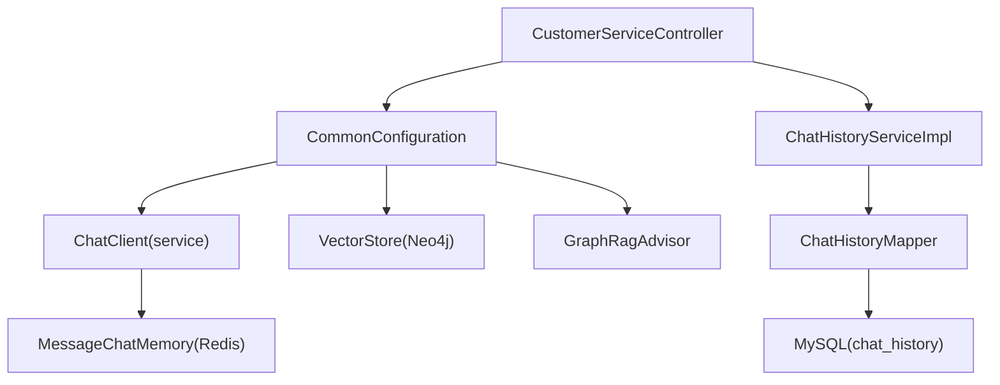

# 图书预约对话系统

<cite>
**本文档引用的文件**
- [CustomerServiceController.java](file://src/main/java/com/xdu/aibot/controller/CustomerServiceController.java)
- [ChatHistoryServiceImpl.java](file://src/main/java/com/xdu/aibot/service/impl/ChatHistoryServiceImpl.java)
- [InMemoryChatHistoryRepository.java](file://src/main/java/com/xdu/aibot/repository/Impl/InMemoryChatHistoryRepository.java)
- [ChatHistory.java](file://src/main/java/com/xdu/aibot/pojo/entity/ChatHistory.java)
- [ChatMessage.java](file://src/main/java/com/xdu/aibot/pojo/entity/ChatMessage.java)
- [ChatHistoryMapper.java](file://src/main/java/com/xdu/aibot/mapper/ChatHistoryMapper.java)
- [ChatMessageMapper.java](file://src/main/java/com/xdu/aibot/mapper/ChatMessageMapper.java)
- [ChatType.java](file://src/main/java/com/xdu/aibot/constant/ChatType.java)
- [CommonConfiguration.java](file://src/main/java/com/xdu/aibot/config/CommonConfiguration.java)
- [application.yaml](file://src/main/resources/application.yaml)
- [BookTools.java](file://src/main/java/com/xdu/aibot/tools/BookTools.java)
- [SystemConstants.java](file://src/main/java/com/xdu/aibot/constant/SystemConstants.java)
- [ChatHistoryService.java](file://src/main/java/com/xdu/aibot/service/ChatHistoryService.java)
- [ChatHistoryRepository.java](file://src/main/java/com/xdu/aibot/repository/ChatHistoryRepository.java)
- [ChatHistoryContoller.java](file://src/main/java/com/xdu/aibot/controller/ChatHistoryContoller.java)
</cite>

## 目录
1. [简介](#简介)
2. [项目结构](#项目结构)
3. [核心组件](#核心组件)
4. [架构总览](#架构总览)
5. [详细组件分析](#详细组件分析)
6. [依赖分析](#依赖分析)
7. [性能考虑](#性能考虑)
8. [故障排除指南](#故障排除指南)
9. [结论](#结论)
10. [附录](#附录)

## 简介
本项目是一个基于Spring AI与RAG技术的图书预约对话系统，围绕客户服务场景设计，支持图书查询、库存推荐与预约下单等功能。系统通过预设的系统提示词确保对话行为符合图书馆服务规范，结合工具函数实现业务逻辑（如库存校验与扣减），并通过内存或Redis进行对话上下文管理，同时提供会话历史的持久化与查询能力。

## 项目结构
系统采用分层架构，主要模块包括：
- 控制器层：对外提供REST API，负责接收请求与返回响应
- 服务层：封装业务逻辑，协调工具与数据访问
- 数据访问层：MyBatis Plus映射器与实体模型
- 配置层：Spring AI客户端配置、向量检索与RAG链路
- 工具层：面向业务的工具函数（图书查询与预约）
- 常量与枚举：系统提示词与会话类型定义

**图表来源**
- [CustomerServiceController.java:1-35](file://src/main/java/com/xdu/aibot/controller/CustomerServiceController.java#L1-L35)
- [ChatHistoryContoller.java:1-39](file://src/main/java/com/xdu/aibot/controller/ChatHistoryContoller.java#L1-L39)
- [ChatHistoryServiceImpl.java:1-63](file://src/main/java/com/xdu/aibot/service/impl/ChatHistoryServiceImpl.java#L1-L63)
- [BookTools.java:1-127](file://src/main/java/com/xdu/aibot/tools/BookTools.java#L1-L127)
- [CommonConfiguration.java:1-129](file://src/main/java/com/xdu/aibot/config/CommonConfiguration.java#L1-L129)
- [application.yaml:1-59](file://src/main/resources/application.yaml#L1-L59)

**章节来源**
- [CustomerServiceController.java:1-35](file://src/main/java/com/xdu/aibot/controller/CustomerServiceController.java#L1-L35)
- [ChatHistoryContoller.java:1-39](file://src/main/java/com/xdu/aibot/controller/ChatHistoryContoller.java#L1-L39)
- [CommonConfiguration.java:1-129](file://src/main/java/com/xdu/aibot/config/CommonConfiguration.java#L1-L129)
- [application.yaml:1-59](file://src/main/resources/application.yaml#L1-L59)

## 核心组件
- 客户服务控制器：负责接收用户输入，注入会话ID，调用Spring AI ChatClient生成回复，并持久化会话
- 会话历史服务：提供会话保存、按类型查询会话ID、以及与内存/Redis的会话存储交互
- 图书工具：封装图书查询与预约功能，包含库存校验、推荐逻辑与事务性预约下单
- 系统提示词：定义客户服务角色、规则与展示格式，确保对话一致性与合规性
- 配置与连接：OpenAI模型、向量存储、Neo4j图数据库、Redis会话内存与RAG链路

**章节来源**
- [CustomerServiceController.java:1-35](file://src/main/java/com/xdu/aibot/controller/CustomerServiceController.java#L1-L35)
- [ChatHistoryServiceImpl.java:1-63](file://src/main/java/com/xdu/aibot/service/impl/ChatHistoryServiceImpl.java#L1-L63)
- [BookTools.java:1-127](file://src/main/java/com/xdu/aibot/tools/BookTools.java#L1-L127)
- [SystemConstants.java:1-32](file://src/main/java/com/xdu/aibot/constant/SystemConstants.java#L1-L32)
- [CommonConfiguration.java:1-129](file://src/main/java/com/xdu/aibot/config/CommonConfiguration.java#L1-L129)

## 架构总览
系统采用“控制器-服务-数据访问-外部组件”的分层架构，结合Spring AI的ChatClient与Advisor链路，实现多轮对话与RAG增强。会话上下文由Redis或内存提供，历史消息通过ChatMemory读取；业务逻辑通过工具函数执行，数据库用于持久化会话与消息。

**图表来源**
- [CustomerServiceController.java:25-33](file://src/main/java/com/xdu/aibot/controller/CustomerServiceController.java#L25-L33)
- [CommonConfiguration.java:74-88](file://src/main/java/com/xdu/aibot/config/CommonConfiguration.java#L74-L88)
- [ChatHistoryServiceImpl.java:23-41](file://src/main/java/com/xdu/aibot/service/impl/ChatHistoryServiceImpl.java#L23-L41)

## 详细组件分析

### CustomerServiceController 组件分析
- 职责：接收用户输入与会话ID，调用ChatClient生成回复，并持久化会话
- 关键点：
  - 使用ChatClient默认系统提示词与Advisor链路
  - 通过参数注入ConversationId，确保上下文关联
  - 调用ChatHistoryRepository保存会话类型与ID
- 与BookTools协作：通过工具函数完成图书查询与预约业务

**图表来源**
- [CustomerServiceController.java:1-35](file://src/main/java/com/xdu/aibot/controller/CustomerServiceController.java#L1-L35)
- [ChatHistoryRepository.java:1-14](file://src/main/java/com/xdu/aibot/repository/ChatHistoryRepository.java#L1-L14)
- [ChatHistoryServiceImpl.java:1-63](file://src/main/java/com/xdu/aibot/service/impl/ChatHistoryServiceImpl.java#L1-L63)
- [CommonConfiguration.java:74-88](file://src/main/java/com/xdu/aibot/config/CommonConfiguration.java#L74-L88)
- [BookTools.java:1-127](file://src/main/java/com/xdu/aibot/tools/BookTools.java#L1-L127)

**章节来源**
- [CustomerServiceController.java:1-35](file://src/main/java/com/xdu/aibot/controller/CustomerServiceController.java#L1-L35)
- [ChatHistoryRepository.java:1-14](file://src/main/java/com/xdu/aibot/repository/ChatHistoryRepository.java#L1-L14)
- [ChatHistoryServiceImpl.java:1-63](file://src/main/java/com/xdu/aibot/service/impl/ChatHistoryServiceImpl.java#L1-L63)
- [CommonConfiguration.java:74-88](file://src/main/java/com/xdu/aibot/config/CommonConfiguration.java#L74-L88)
- [BookTools.java:1-127](file://src/main/java/com/xdu/aibot/tools/BookTools.java#L1-L127)

### ChatHistoryServiceImpl 组件分析
- 职责：会话历史的保存与查询，支持按类型过滤
- 关键点：
  - 去重保存：若同类型+chatId已存在则不重复插入
  - 查询优化：仅选择chat_id字段，避免不必要的列加载
  - 接口适配：同时实现服务接口与仓库接口，便于控制器注入
- 数据模型：ChatHistory实体映射到chat_history表

**图表来源**
- [ChatHistoryService.java:1-19](file://src/main/java/com/xdu/aibot/service/ChatHistoryService.java#L1-L19)
- [ChatHistoryRepository.java:1-14](file://src/main/java/com/xdu/aibot/repository/ChatHistoryRepository.java#L1-L14)
- [ChatHistoryServiceImpl.java:1-63](file://src/main/java/com/xdu/aibot/service/impl/ChatHistoryServiceImpl.java#L1-L63)
- [ChatHistoryMapper.java:1-10](file://src/main/java/com/xdu/aibot/mapper/ChatHistoryMapper.java#L1-L10)
- [ChatHistory.java:1-23](file://src/main/java/com/xdu/aibot/pojo/entity/ChatHistory.java#L1-L23)

**章节来源**
- [ChatHistoryServiceImpl.java:1-63](file://src/main/java/com/xdu/aibot/service/impl/ChatHistoryServiceImpl.java#L1-L63)
- [ChatHistoryService.java:1-19](file://src/main/java/com/xdu/aibot/service/ChatHistoryService.java#L1-L19)
- [ChatHistoryRepository.java:1-14](file://src/main/java/com/xdu/aibot/repository/ChatHistoryRepository.java#L1-L14)
- [ChatHistoryMapper.java:1-10](file://src/main/java/com/xdu/aibot/mapper/ChatHistoryMapper.java#L1-L10)
- [ChatHistory.java:1-23](file://src/main/java/com/xdu/aibot/pojo/entity/ChatHistory.java#L1-L23)

### 对话历史管理机制
- 会话ID注入：通过ChatClient的Advisor链将chatId作为ConversationId注入，确保上下文绑定
- 上下文存储：使用MessageWindowChatMemory配合Redis或内存存储，限制最大消息数
- 历史查询：通过ChatMemory.get(chatId)读取消息列表，控制器返回MessageVO列表
- 会话持久化：控制器调用ChatHistoryRepository.save(type, chatId)，服务层去重保存

**图表来源**
- [CustomerServiceController.java:25-33](file://src/main/java/com/xdu/aibot/controller/CustomerServiceController.java#L25-L33)
- [CommonConfiguration.java:74-88](file://src/main/java/com/xdu/aibot/config/CommonConfiguration.java#L74-L88)
- [ChatHistoryContoller.java:25-37](file://src/main/java/com/xdu/aibot/controller/ChatHistoryContoller.java#L25-L37)

**章节来源**
- [CustomerServiceController.java:1-35](file://src/main/java/com/xdu/aibot/controller/CustomerServiceController.java#L1-L35)
- [CommonConfiguration.java:74-88](file://src/main/java/com/xdu/aibot/config/CommonConfiguration.java#L74-L88)
- [ChatHistoryContoller.java:1-39](file://src/main/java/com/xdu/aibot/controller/ChatHistoryContoller.java#L1-L39)

### ChatHistoryServiceImpl 数据持久化方案
- 存储策略：MyBatis Plus自动保存，避免重复插入
- 查询优化：LambdaQueryWrapper仅选择chat_id字段，减少网络与内存开销
- 清理策略：当前实现未提供自动清理，建议结合业务需求增加定时任务或阈值清理

**图表来源**
- [ChatHistoryServiceImpl.java:23-41](file://src/main/java/com/xdu/aibot/service/impl/ChatHistoryServiceImpl.java#L23-L41)

**章节来源**
- [ChatHistoryServiceImpl.java:1-63](file://src/main/java/com/xdu/aibot/service/impl/ChatHistoryServiceImpl.java#L1-L63)

### 图书预约业务逻辑
- 图书查询：支持按类型、作者、名称、评分、库存等条件组合查询，支持排序
- 库存与推荐：当查询结果为空或全部无库存时，内部推荐高分有库存书籍
- 预约下单：校验库存、扣减库存、生成预约单并返回单号，事务保障一致性

**图表来源**
- [BookTools.java:32-82](file://src/main/java/com/xdu/aibot/tools/BookTools.java#L32-L82)

**章节来源**
- [BookTools.java:1-127](file://src/main/java/com/xdu/aibot/tools/BookTools.java#L1-L127)

### API 接口文档
- 对话发起
  - 方法：POST
  - 路径：/ai/service
  - 参数：
    - prompt：用户输入
    - chatId：会话ID
  - 返回：AI生成的文本内容
- 历史查询
  - 获取会话ID列表
    - 方法：GET
    - 路径：/ai/history/{type}
    - 参数：type（会话类型，如service/pdf）
    - 返回：List<String>（chatId列表）
  - 获取历史消息
    - 方法：GET
    - 路径：/ai/history/{type}/{chatId}
    - 返回：List<MessageVO>（消息列表）

**章节来源**
- [CustomerServiceController.java:25-33](file://src/main/java/com/xdu/aibot/controller/CustomerServiceController.java#L25-L33)
- [ChatHistoryContoller.java:25-37](file://src/main/java/com/xdu/aibot/controller/ChatHistoryContoller.java#L25-L37)

## 依赖分析
- Spring AI：ChatClient、Advisor链、MessageChatMemory、工具函数集成
- Redis：会话内存存储，支持分布式会话共享
- MySQL：会话与消息持久化
- Neo4j：向量存储与图RAG增强（PDF场景）
- MyBatis Plus：实体映射与查询优化

**图表来源**
- [CommonConfiguration.java:74-127](file://src/main/java/com/xdu/aibot/config/CommonConfiguration.java#L74-L127)
- [ChatHistoryServiceImpl.java:1-63](file://src/main/java/com/xdu/aibot/service/impl/ChatHistoryServiceImpl.java#L1-L63)
- [ChatHistoryMapper.java:1-10](file://src/main/java/com/xdu/aibot/mapper/ChatHistoryMapper.java#L1-L10)
- [application.yaml:1-59](file://src/main/resources/application.yaml#L1-L59)

**章节来源**
- [CommonConfiguration.java:1-129](file://src/main/java/com/xdu/aibot/config/CommonConfiguration.java#L1-L129)
- [application.yaml:1-59](file://src/main/resources/application.yaml#L1-L59)

## 性能考虑
- 查询优化：ChatHistoryServiceImpl仅选择必要字段，降低数据库负载
- 上下文窗口：MessageWindowChatMemory限制消息数量，控制内存占用
- 向量检索：SearchRequest设置相似度阈值与TopK，平衡召回与性能
- 缓存与连接池：Redis连接池参数需根据并发调整，避免阻塞

## 故障排除指南
- 会话未生效：确认请求中chatId参数正确传递，Advisor链中ConversationId已注入
- 历史为空：检查ChatMemory后端（Redis/内存）是否可用，以及会话ID是否匹配
- 预约失败：核对图书名称、库存状态与事务执行情况，关注异常抛出位置
- 配置问题：检查OpenAI/DashScope、Neo4j与MySQL连接参数，确保环境变量已设置

**章节来源**
- [CustomerServiceController.java:25-33](file://src/main/java/com/xdu/aibot/controller/CustomerServiceController.java#L25-L33)
- [ChatHistoryContoller.java:30-37](file://src/main/java/com/xdu/aibot/controller/ChatHistoryContoller.java#L30-L37)
- [BookTools.java:94-125](file://src/main/java/com/xdu/aibot/tools/BookTools.java#L94-L125)
- [application.yaml:1-59](file://src/main/resources/application.yaml#L1-L59)

## 结论
本系统通过清晰的分层设计与Spring AI的Advisor链路，实现了稳定的多轮对话与RAG增强。结合工具函数完成图书查询与预约业务，借助Redis与MySQL分别承担上下文与持久化职责。建议后续完善会话清理策略与监控告警，持续优化查询与检索性能。

## 附录
- 系统提示词：定义客户服务角色、规则与展示格式，确保对话一致性
- 会话类型：SERVICE/PDF两类，分别对应客户服务与PDF问答场景

**章节来源**
- [SystemConstants.java:1-32](file://src/main/java/com/xdu/aibot/constant/SystemConstants.java#L1-L32)
- [ChatType.java:1-17](file://src/main/java/com/xdu/aibot/constant/ChatType.java#L1-L17)