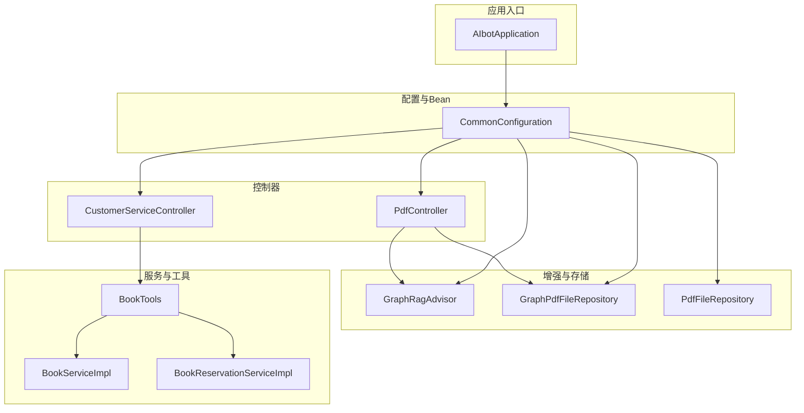
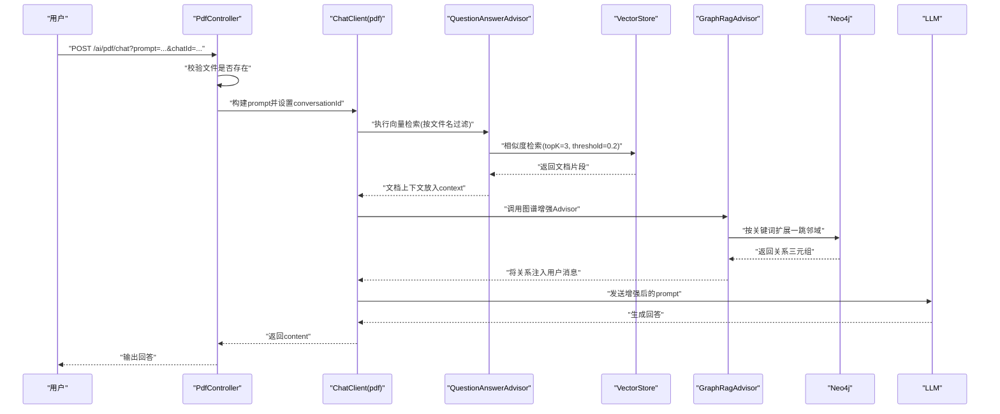
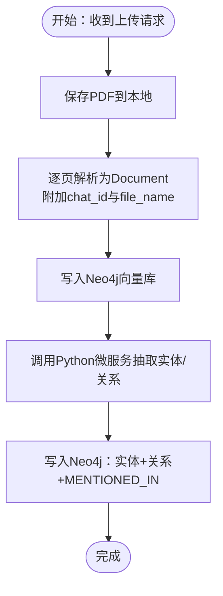
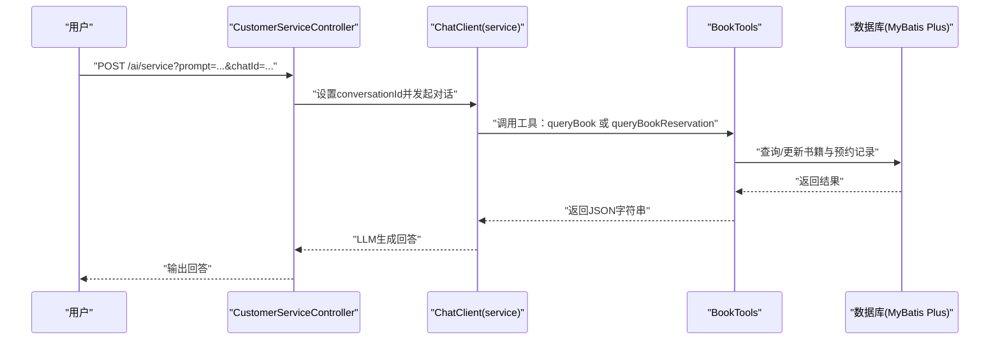
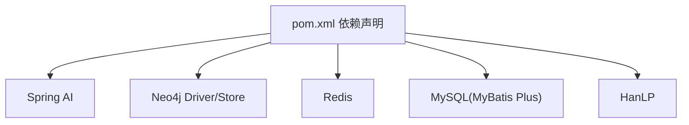

# 核心功能模块

<cite>
**本文引用的文件**
- [AIbotApplication.java](file://src/main/java/com/xdu/aibot/AIbotApplication.java)
- [CommonConfiguration.java](file://src/main/java/com/xdu/aibot/config/CommonConfiguration.java)
- [GraphRagAdvisor.java](file://src/main/java/com/xdu/aibot/advisor/GraphRagAdvisor.java)
- [PdfController.java](file://src/main/java/com/xdu/aibot/controller/PdfController.java)
- [CustomerServiceController.java](file://src/main/java/com/xdu/aibot/controller/CustomerServiceController.java)
- [GraphPdfFileRepository.java](file://src/main/java/com/xdu/aibot/repository/Impl/GraphPdfFileRepository.java)
- [PdfFileRepository.java](file://src/main/java/com/xdu/aibot/repository/Impl/PdfFileRepository.java)
- [BookTools.java](file://src/main/java/com/xdu/aibot/tools/BookTools.java)
- [Book.java](file://src/main/java/com/xdu/aibot/pojo/entity/Book.java)
- [BookReservation.java](file://src/main/java/com/xdu/aibot/pojo/entity/BookReservation.java)
- [BookReservationServiceImpl.java](file://src/main/java/com/xdu/aibot/service/impl/BookReservationServiceImpl.java)
- [BookServiceImpl.java](file://src/main/java/com/xdu/aibot/service/impl/BookServiceImpl.java)
- [application.yaml](file://src/main/resources/application.yaml)
- [chat-pdf.properties](file://chat-pdf.properties)
- [pom.xml](file://pom.xml)
</cite>

## 目录
1. [简介](#简介)
2. [项目结构](#项目结构)
3. [核心组件](#核心组件)
4. [架构总览](#架构总览)
5. [详细组件分析](#详细组件分析)
6. [依赖分析](#依赖分析)
7. [性能考虑](#性能考虑)
8. [故障排查指南](#故障排查指南)
9. [结论](#结论)
10. [附录](#附录)

## 简介
本文件面向AIbot系统的“核心功能模块”，聚焦三大能力：
- PDF文档问答模块：基于Spring AI的向量检索与RAG增强，结合知识图谱进行上下文扩展。
- 图书预约对话模块：通过工具函数实现书籍查询与预约，结合对话记忆与系统提示词，提供自然语言交互体验。
- 知识图谱增强模块：解析PDF内容，抽取实体与关系，构建Neo4j图谱，并在问答阶段动态注入图谱补充信息。

文档将从架构、数据流、处理逻辑、接口契约、错误处理与性能优化等方面进行系统化阐述，并给出模块间协作关系与扩展点。

## 项目结构
项目采用Spring Boot工程组织，按功能域划分包结构：
- config：应用配置与Bean装配，含向量存储、聊天客户端、图谱增强Advisor等。
- controller：对外HTTP接口，分别提供PDF问答与客服对话入口。
- advisor：自定义调用顾问，用于在问答前注入图谱增强信息。
- repository：文件与向量/图谱存储抽象及实现，负责PDF解析、向量入库与图谱构建。
- service：业务服务层，提供书籍与预约的CRUD与事务控制。
- pojo：数据库实体对象。
- tools：面向AI的工具函数，封装书籍查询与预约等原子能力。
- resources：配置文件与静态页面模板。



图表来源
- [AIbotApplication.java:1-16](file://src/main/java/com/xdu/aibot/AIbotApplication.java#L1-L16)
- [CommonConfiguration.java:34-129](file://src/main/java/com/xdu/aibot/config/CommonConfiguration.java#L34-L129)
- [PdfController.java:26-98](file://src/main/java/com/xdu/aibot/controller/PdfController.java#L26-L98)
- [CustomerServiceController.java:14-35](file://src/main/java/com/xdu/aibot/controller/CustomerServiceController.java#L14-L35)
- [GraphRagAdvisor.java:18-149](file://src/main/java/com/xdu/aibot/advisor/GraphRagAdvisor.java#L18-L149)
- [GraphPdfFileRepository.java:27-262](file://src/main/java/com/xdu/aibot/repository/Impl/GraphPdfFileRepository.java#L27-L262)
- [PdfFileRepository.java:28-109](file://src/main/java/com/xdu/aibot/repository/Impl/PdfFileRepository.java#L28-L109)
- [BookTools.java:22-127](file://src/main/java/com/xdu/aibot/tools/BookTools.java#L22-L127)

章节来源
- [AIbotApplication.java:1-16](file://src/main/java/com/xdu/aibot/AIbotApplication.java#L1-L16)
- [CommonConfiguration.java:34-129](file://src/main/java/com/xdu/aibot/config/CommonConfiguration.java#L34-L129)

## 核心组件
- PDF文档问答模块
  - 控制器：接收用户问题与会话ID，校验文件存在性，构造问答请求。
  - 向量检索：通过QuestionAnswerAdvisor限定检索范围（按文件名过滤）。
  - 图谱增强：GraphRagAdvisor在问答前抽取关键词，查询Neo4j图谱，将关系作为上下文注入LLM。
  - 文件存储：GraphPdfFileRepository负责PDF解析、向量入库与图谱构建；PdfFileRepository提供简单向量存储版本。
- 图书预约对话模块
  - 控制器：接收用户问题与会话ID，记录对话类型。
  - 工具函数：BookTools封装书籍查询与预约，内置库存检查与推荐逻辑。
  - 对话记忆：通过MessageChatMemoryAdvisor与Redis存储会话上下文。
- 知识图谱增强模块
  - 实体抽取：调用Python微服务（PP-UIE）抽取人物、地点、事件等实体与关系。
  - 图谱构建：将实体与关系写入Neo4j，建立SourceFile锚定与MENTIONED_IN关联。
  - 图谱检索：GraphRagAdvisor基于关键词扩展一跳邻域，拼接关系作为增强上下文。

章节来源
- [PdfController.java:26-98](file://src/main/java/com/xdu/aibot/controller/PdfController.java#L26-L98)
- [GraphRagAdvisor.java:18-149](file://src/main/java/com/xdu/aibot/advisor/GraphRagAdvisor.java#L18-L149)
- [GraphPdfFileRepository.java:27-262](file://src/main/java/com/xdu/aibot/repository/Impl/GraphPdfFileRepository.java#L27-L262)
- [PdfFileRepository.java:28-109](file://src/main/java/com/xdu/aibot/repository/Impl/PdfFileRepository.java#L28-L109)
- [BookTools.java:22-127](file://src/main/java/com/xdu/aibot/tools/BookTools.java#L22-L127)
- [CommonConfiguration.java:34-129](file://src/main/java/com/xdu/aibot/config/CommonConfiguration.java#L34-L129)

## 架构总览
下图展示从HTTP请求到LLM响应的关键路径，以及图谱增强的注入时机。



图表来源
- [PdfController.java:42-55](file://src/main/java/com/xdu/aibot/controller/PdfController.java#L42-L55)
- [CommonConfiguration.java:90-127](file://src/main/java/com/xdu/aibot/config/CommonConfiguration.java#L90-L127)
- [GraphRagAdvisor.java:38-136](file://src/main/java/com/xdu/aibot/advisor/GraphRagAdvisor.java#L38-L136)
- [GraphPdfFileRepository.java:115-177](file://src/main/java/com/xdu/aibot/repository/Impl/GraphPdfFileRepository.java#L115-L177)

## 详细组件分析

### PDF文档问答模块
- 控制器职责
  - 校验文件存在性，若不存在抛出异常。
  - 记录对话类型，设置会话ID，限定向量检索范围（按文件名过滤），调用ChatClient获取回答。
- 向量检索策略
  - 通过QuestionAnswerAdvisor限制检索上下文仅来自当前PDF文件，提升相关性与安全性。
- 图谱增强流程
  - GraphRagAdvisor从上下文文档中提取chat_id，分词并过滤关键词，查询Neo4j图谱，将关系以“实体-关系-实体”形式拼接为补充信息，注入用户消息后继续LLM推理。
- 文件与图谱构建
  - GraphPdfFileRepository保存PDF副本，逐页解析为Document并写入Neo4j向量库；随后调用Python微服务抽取实体与关系，写入Neo4j并建立SourceFile锚定。



图表来源
- [GraphPdfFileRepository.java:42-70](file://src/main/java/com/xdu/aibot/repository/Impl/GraphPdfFileRepository.java#L42-L70)
- [GraphPdfFileRepository.java:85-99](file://src/main/java/com/xdu/aibot/repository/Impl/GraphPdfFileRepository.java#L85-L99)
- [GraphPdfFileRepository.java:115-177](file://src/main/java/com/xdu/aibot/repository/Impl/GraphPdfFileRepository.java#L115-L177)
- [GraphPdfFileRepository.java:182-252](file://src/main/java/com/xdu/aibot/repository/Impl/GraphPdfFileRepository.java#L182-L252)

章节来源
- [PdfController.java:42-55](file://src/main/java/com/xdu/aibot/controller/PdfController.java#L42-L55)
- [CommonConfiguration.java:90-127](file://src/main/java/com/xdu/aibot/config/CommonConfiguration.java#L90-L127)
- [GraphRagAdvisor.java:38-136](file://src/main/java/com/xdu/aibot/advisor/GraphRagAdvisor.java#L38-L136)
- [GraphPdfFileRepository.java:27-262](file://src/main/java/com/xdu/aibot/repository/Impl/GraphPdfFileRepository.java#L27-L262)

### 图书预约对话模块
- 控制器职责
  - 记录对话类型，设置会话ID，调用ChatClient获取回答。
- 工具函数能力
  - queryBook：支持按类型、作者、书名、最低评分、最低库存等条件查询，若无货或缺货则返回“遗憾通知+推荐列表”。
  - queryBookReservation：检查库存、扣减库存、生成预约单并返回单号，具备事务一致性保障。
- 对话记忆与系统提示
  - 通过MessageChatMemoryAdvisor与Redis存储会话上下文；默认系统提示词引导模型以图书馆场景回答。



图表来源
- [CustomerServiceController.java:25-33](file://src/main/java/com/xdu/aibot/controller/CustomerServiceController.java#L25-L33)
- [CommonConfiguration.java:73-88](file://src/main/java/com/xdu/aibot/config/CommonConfiguration.java#L73-L88)
- [BookTools.java:32-82](file://src/main/java/com/xdu/aibot/tools/BookTools.java#L32-L82)
- [BookTools.java:94-125](file://src/main/java/com/xdu/aibot/tools/BookTools.java#L94-L125)

章节来源
- [CustomerServiceController.java:14-35](file://src/main/java/com/xdu/aibot/controller/CustomerServiceController.java#L14-L35)
- [BookTools.java:22-127](file://src/main/java/com/xdu/aibot/tools/BookTools.java#L22-L127)
- [Book.java:19-58](file://src/main/java/com/xdu/aibot/pojo/entity/Book.java#L19-L58)
- [BookReservation.java:19-52](file://src/main/java/com/xdu/aibot/pojo/entity/BookReservation.java#L19-L52)
- [BookServiceImpl.java:17-21](file://src/main/java/com/xdu/aibot/service/impl/BookServiceImpl.java#L17-L21)
- [BookReservationServiceImpl.java:17-21](file://src/main/java/com/xdu/aibot/service/impl/BookReservationServiceImpl.java#L17-L21)

### 知识图谱增强模块
- 关键点
  - 关键词抽取：使用HanLP进行分词与词性过滤，仅保留人名、地名、机构、普通名词等。
  - 图谱查询：基于SourceFile锚定，按关键词匹配实体，扩展一跳邻域，返回关系三元组。
  - 上下文注入：将关系拼接为补充信息注入用户消息，避免重复上下文污染。
- 数据模型（概念）
```mermaid
erDiagram
SOURCEFILE {
string chatId PK
}
ENTITY {
string name PK
}
PERSON {
string name PK
}
LOCATION {
string name PK
}
EVENT {
string name PK
}
SOURCEFILE ||--o{ ENTITY : "MENTIONED_IN"
SOURCEFILE ||--o{ PERSON : "MENTIONED_IN"
SOURCEFILE ||--o{ LOCATION : "MENTIONED_IN"
SOURCEFILE ||--o{ EVENT : "MENTIONED_IN"
PERSON ||--o|--o|| ENTITY : "关系(由图谱抽取)"
LOCATION ||--o|--o|| ENTITY : "关系(由图谱抽取)"
EVENT ||--o|--o|| ENTITY : "关系(由图谱抽取)"
```

图表来源
- [GraphPdfFileRepository.java:198-236](file://src/main/java/com/xdu/aibot/repository/Impl/GraphPdfFileRepository.java#L198-L236)
- [GraphRagAdvisor.java:88-96](file://src/main/java/com/xdu/aibot/advisor/GraphRagAdvisor.java#L88-L96)

章节来源
- [GraphRagAdvisor.java:18-149](file://src/main/java/com/xdu/aibot/advisor/GraphRagAdvisor.java#L18-L149)
- [GraphPdfFileRepository.java:115-177](file://src/main/java/com/xdu/aibot/repository/Impl/GraphPdfFileRepository.java#L115-L177)

## 依赖分析
- 外部依赖
  - Spring AI：OpenAI模型、向量存储、PDF读取器、Advisor链。
  - Neo4j：Java Driver与Neo4j向量存储，用于图谱构建与查询。
  - Redis：会话记忆存储。
  - MySQL：MyBatis Plus持久化书籍与预约数据。
  - HanLP：中文分词与词性过滤。
- 模块耦合
  - 控制器依赖ChatClient与仓库接口；ChatClient依赖Advisor链与向量存储。
  - 图谱增强Advisor依赖Neo4jClient与向量上下文。
  - 工具函数依赖服务层与数据库。



图表来源
- [pom.xml:33-116](file://pom.xml#L33-L116)

章节来源
- [pom.xml:1-139](file://pom.xml#L1-L139)
- [application.yaml:1-59](file://src/main/resources/application.yaml#L1-L59)

## 性能考虑
- 向量检索参数
  - topK=3、similarityThreshold=0.2，平衡召回与噪声控制；可根据业务调整阈值与数量。
- 文档切分
  - PDF逐页切分，减少单文档过长导致的嵌入与检索开销；建议保持每片在模型上下文内。
- 图谱查询限制
  - GraphRagAdvisor限制返回关系数量（LIMIT 30），避免过多上下文影响LLM效率。
- 缓存与持久化
  - Redis会话记忆降低重复上下文传输；SimpleVectorStore支持本地JSON持久化，便于快速恢复。
- I/O与网络
  - Python微服务调用需关注超时与重试；向量与图谱写入为同步步骤，建议在异步任务中扩展。

## 故障排查指南
- PDF上传/下载
  - 上传仅允许PDF类型；若失败检查文件大小限制与IO异常。
  - 下载返回404表示文件不存在；检查chatId与文件映射。
- 向量检索为空
  - 确认文件已解析并写入向量库；检查过滤表达式是否匹配文件名。
- 图谱增强无输出
  - 关键词为空或过滤后为空；检查HanLP分词与词性过滤规则。
  - Neo4j查询无结果：确认SourceFile节点与MENTIONED_IN关系已建立。
- 工具函数异常
  - 书籍不存在或库存不足：返回“遗憾通知+推荐列表”；预约失败检查库存与事务。
- 日志级别
  - application.yaml开启Spring AI与Neo4j调试日志，便于定位问题。

章节来源
- [PdfController.java:60-96](file://src/main/java/com/xdu/aibot/controller/PdfController.java#L60-L96)
- [GraphPdfFileRepository.java:42-70](file://src/main/java/com/xdu/aibot/repository/Impl/GraphPdfFileRepository.java#L42-L70)
- [GraphRagAdvisor.java:44-84](file://src/main/java/com/xdu/aibot/advisor/GraphRagAdvisor.java#L44-L84)
- [BookTools.java:54-82](file://src/main/java/com/xdu/aibot/tools/BookTools.java#L54-L82)
- [application.yaml:52-59](file://src/main/resources/application.yaml#L52-L59)

## 结论
AIbot通过“PDF文档问答 + 图书预约对话 + 知识图谱增强”的组合，实现了从文档理解到业务操作的闭环。其关键在于：
- 以向量检索为基础的RAG，确保答案与文档强相关；
- 以图谱为补充的上下文增强，提升复杂问题的推理质量；
- 以工具函数为核心的业务编排，使LLM具备真实服务能力；
- 以配置驱动的模块化设计，便于扩展与维护。

## 附录
- 配置项要点
  - OpenAI/DashScope：模型、温度、嵌入维度。
  - Neo4j：连接、认证、索引与距离类型。
  - Redis：主机、端口、密码与连接池。
  - MySQL：驱动、URL、账号与密码。
  - 文件上传：最大文件与请求大小。
- 扩展建议
  - 引入异步任务处理图谱构建与向量入库，提升吞吐。
  - 增加缓存层（如Redis）存放热点文档片段与图谱关系。
  - 支持多模态输入（图片/表格）与更丰富的Schema抽取。
  - 提供管理界面与指标监控，便于运维与优化。

章节来源
- [application.yaml:1-59](file://src/main/resources/application.yaml#L1-L59)
- [chat-pdf.properties:1-4](file://chat-pdf.properties#L1-L4)