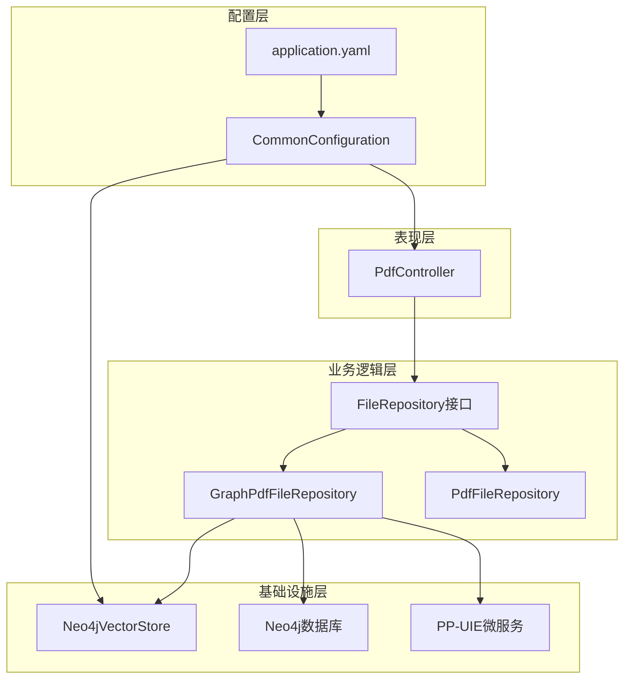
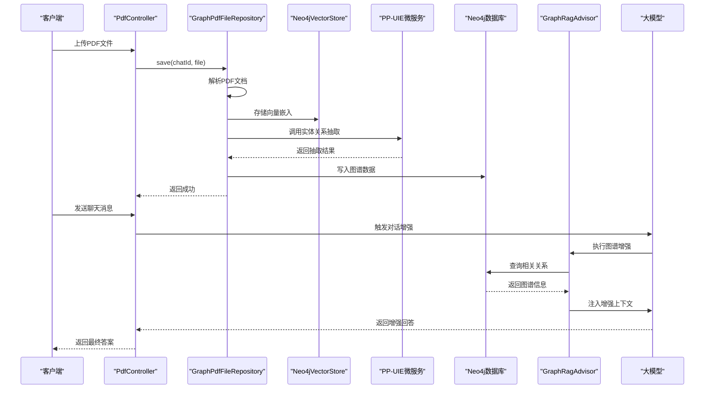
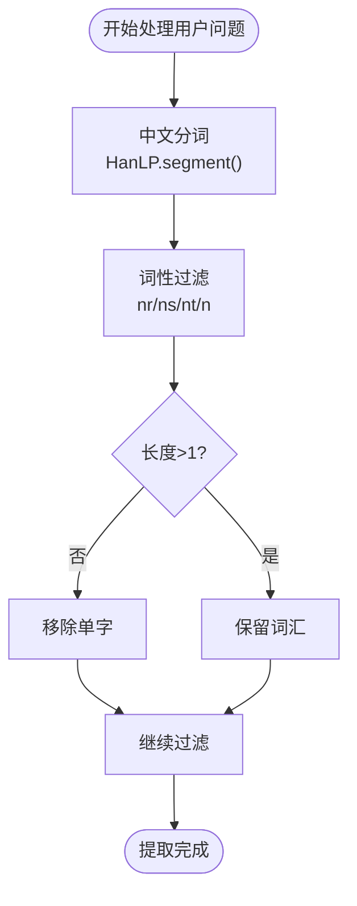
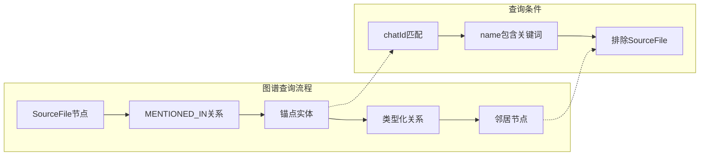
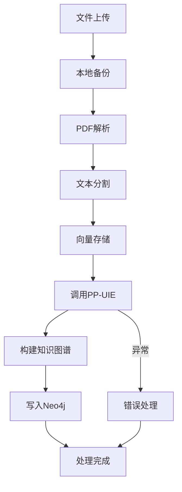
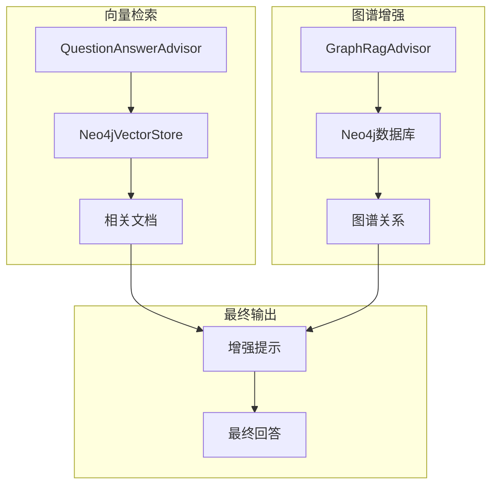
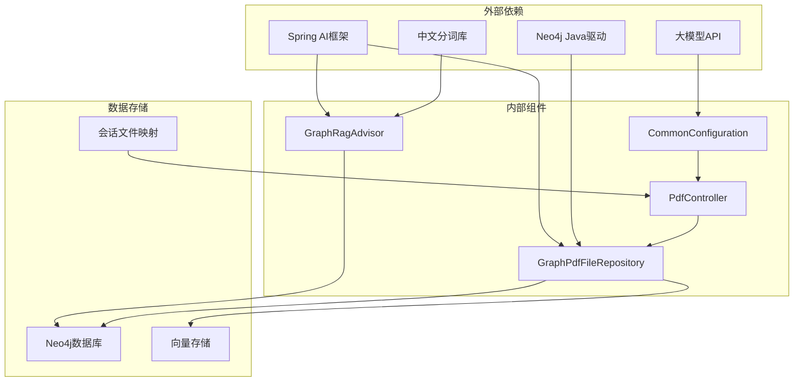
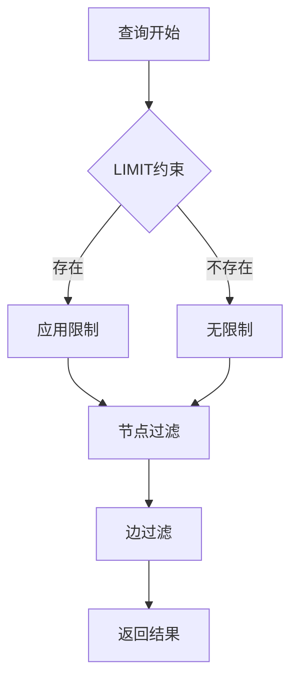

# 知识图谱增强模块

<cite>
**本文档引用的文件**
- [GraphRagAdvisor.java](file://src/main/java/com/xdu/aibot/advisor/GraphRagAdvisor.java)
- [GraphPdfFileRepository.java](file://src/main/java/com/xdu/aibot/repository/Impl/GraphPdfFileRepository.java)
- [FileRepository.java](file://src/main/java/com/xdu/aibot/repository/FileRepository.java)
- [PdfFileRepository.java](file://src/main/java/com/xdu/aibot/repository/Impl/PdfFileRepository.java)
- [CommonConfiguration.java](file://src/main/java/com/xdu/aibot/config/CommonConfiguration.java)
- [PdfController.java](file://src/main/java/com/xdu/aibot/controller/PdfController.java)
- [application.yaml](file://src/main/resources/application.yaml)
- [VectorDistanceUtils.java](file://src/main/java/com/xdu/aibot/util/VectorDistanceUtils.java)
- [chat-pdf.properties](file://chat-pdf.properties)
- [pom.xml](file://pom.xml)
</cite>

## 目录
1. [简介](#简介)
2. [项目结构](#项目结构)
3. [核心组件](#核心组件)
4. [架构概览](#架构概览)
5. [详细组件分析](#详细组件分析)
6. [依赖关系分析](#依赖关系分析)
7. [性能考虑](#性能考虑)
8. [故障排除指南](#故障排除指南)
9. [结论](#结论)
10. [附录](#附录)

## 简介

本项目是一个基于Spring AI框架的知识图谱增强模块，旨在通过结合向量检索和图数据库查询来提升问答系统的准确性和上下文理解能力。该模块的核心创新在于实现了GraphRagAdvisor，它能够智能地从知识图谱中提取相关信息并将其注入到对话上下文中，从而为大模型提供更丰富的背景知识。

系统采用多层架构设计，包括PDF文档处理层、向量存储层、知识图谱构建层和对话增强层。通过PP-UIE微服务进行实体关系抽取，利用Neo4j图数据库存储结构化知识，结合Spring AI的向量检索功能，实现了完整的RAG（Retrieval-Augmented Generation）增强机制。

## 项目结构

该项目采用标准的Spring Boot项目结构，主要分为以下几个层次：



**图表来源**
- [PdfController.java:1-98](file://src/main/java/com/xdu/aibot/controller/PdfController.java#L1-L98)
- [GraphPdfFileRepository.java:1-262](file://src/main/java/com/xdu/aibot/repository/Impl/GraphPdfFileRepository.java#L1-L262)
- [CommonConfiguration.java:1-129](file://src/main/java/com/xdu/aibot/config/CommonConfiguration.java#L1-L129)

**章节来源**
- [pom.xml:100-139](file://pom.xml#L100-L139)
- [application.yaml:1-59](file://src/main/resources/application.yaml#L1-59)

## 核心组件

### GraphRagAdvisor - 图谱增强适配器

GraphRagAdvisor是整个知识图谱增强系统的核心组件，它实现了Spring AI的CallAdvisor接口，负责在对话过程中动态地从知识图谱中提取相关信息并注入到用户消息中。

**主要功能特性：**
- 基于HanLP的中文分词和词性标注
- 关键词提取和过滤机制
- Cypher查询语言的图谱查询
- 动态上下文增强

**章节来源**
- [GraphRagAdvisor.java:19-149](file://src/main/java/com/xdu/aibot/advisor/GraphRagAdvisor.java#L19-L149)

### GraphPdfFileRepository - 图谱构建仓库

GraphPdfFileRepository实现了FileRepository接口，专门负责处理PDF文档的知识图谱构建流程。它集成了PDF解析、向量存储和图谱构建三大功能。

**核心流程：**
1. PDF文档解析和分页
2. 向量嵌入存储
3. 实体关系抽取
4. Neo4j图数据库存储

**章节来源**
- [GraphPdfFileRepository.java:29-262](file://src/main/java/com/xdu/aibot/repository/Impl/GraphPdfFileRepository.java#L29-L262)

### FileRepository接口

定义了文件仓库的标准接口规范，支持两种不同的实现策略：
- 图谱增强模式：GraphPdfFileRepository
- 简单向量存储模式：PdfFileRepository

**章节来源**
- [FileRepository.java:1-22](file://src/main/java/com/xdu/aibot/repository/FileRepository.java#L1-L22)

## 架构概览

系统采用分层架构设计，实现了从文档输入到智能问答的完整流程：



**图表来源**
- [PdfController.java:42-55](file://src/main/java/com/xdu/aibot/controller/PdfController.java#L42-L55)
- [GraphPdfFileRepository.java:42-70](file://src/main/java/com/xdu/aibot/repository/Impl/GraphPdfFileRepository.java#L42-L70)
- [CommonConfiguration.java:90-127](file://src/main/java/com/xdu/aibot/config/CommonConfiguration.java#L90-L127)

## 详细组件分析

### GraphRagAdvisor详细分析

GraphRagAdvisor实现了完整的图谱增强机制，其工作原理如下：

#### 关键词提取机制



**图表来源**
- [GraphRagAdvisor.java:70-84](file://src/main/java/com/xdu/aibot/advisor/GraphRagAdvisor.java#L70-L84)

#### Cypher查询策略

GraphRagAdvisor使用精心设计的Cypher查询来从知识图谱中提取相关信息：



**图表来源**
- [GraphRagAdvisor.java:88-96](file://src/main/java/com/xdu/aibot/advisor/GraphRagAdvisor.java#L88-L96)

**章节来源**
- [GraphRagAdvisor.java:39-136](file://src/main/java/com/xdu/aibot/advisor/GraphRagAdvisor.java#L39-L136)

### GraphPdfFileRepository详细分析

#### PDF文档处理流程

GraphPdfFileRepository实现了完整的PDF文档处理管道：



**图表来源**
- [GraphPdfFileRepository.java:42-70](file://src/main/java/com/xdu/aibot/repository/Impl/GraphPdfFileRepository.java#L42-L70)

#### 实体关系抽取策略

系统采用了针对文学作品优化的实体关系抽取策略：

| 实体类型 | 关系标签 |
|---------|---------|
| 人物 | 父亲、母亲、姨夫、儿子、侄子、兄弟 |
| 地点 | 位于、居民、工作 |
| 事件 | 参与者、发生地 |

**章节来源**
- [GraphPdfFileRepository.java:115-177](file://src/main/java/com/xdu/aibot/repository/Impl/GraphPdfFileRepository.java#L115-L177)

### 向量检索与图谱查询结合机制

系统实现了向量检索和图谱查询的有机结合：



**图表来源**
- [CommonConfiguration.java:102-109](file://src/main/java/com/xdu/aibot/config/CommonConfiguration.java#L102-L109)
- [GraphRagAdvisor.java:39-136](file://src/main/java/com/xdu/aibot/advisor/GraphRagAdvisor.java#L39-L136)

**章节来源**
- [CommonConfiguration.java:90-127](file://src/main/java/com/xdu/aibot/config/CommonConfiguration.java#L90-L127)

## 依赖关系分析

系统的关键依赖关系如下：



**图表来源**
- [pom.xml:100-115](file://pom.xml#L100-L115)
- [CommonConfiguration.java:1-129](file://src/main/java/com/xdu/aibot/config/CommonConfiguration.java#L1-L129)

**章节来源**
- [pom.xml:100-139](file://pom.xml#L100-L139)
- [application.yaml:1-59](file://src/main/resources/application.yaml#L1-59)

## 性能考虑

### 向量存储优化

系统采用了多种优化策略来提升性能：

1. **批量处理策略**：使用TokenCountBatchingStrategy进行批量向量处理
2. **索引优化**：自定义索引名称"custom-index"以提升查询性能
3. **距离度量**：使用余弦距离进行相似度计算

### 图谱查询优化



**图表来源**
- [GraphRagAdvisor.java:98-106](file://src/main/java/com/xdu/aibot/advisor/GraphRagAdvisor.java#L98-L106)

### 缓存策略

系统实现了多层次的缓存机制：
- Redis会话内存缓存
- 本地文件映射缓存
- 向量存储持久化

**章节来源**
- [CommonConfiguration.java:59-70](file://src/main/java/com/xdu/aibot/config/CommonConfiguration.java#L59-L70)
- [PdfFileRepository.java:65-92](file://src/main/java/com/xdu/aibot/repository/Impl/PdfFileRepository.java#L65-L92)

## 故障排除指南

### 常见问题及解决方案

#### 1. PP-UIE微服务连接失败

**症状**：日志显示"调用 PP-UIE 服务失败"

**解决方案**：
- 检查微服务URL配置
- 确认微服务端口(7777)可用
- 验证网络连接

#### 2. Neo4j连接问题

**症状**：SourceFile节点创建失败

**解决方案**：
- 验证Neo4j连接参数
- 检查数据库权限
- 确认数据库服务状态

#### 3. 向量存储写入失败

**症状**：向量库写入失败

**解决方案**：
- 检查嵌入模型配置
- 验证向量维度设置
- 确认磁盘空间充足

#### 4. 中文分词异常

**症状**：HanLP分词报错

**解决方案**：
- 检查HanLP版本兼容性
- 验证中文文本编码
- 确认分词库完整性

**章节来源**
- [GraphPdfFileRepository.java:172-174](file://src/main/java/com/xdu/aibot/repository/Impl/GraphPdfFileRepository.java#L172-L174)
- [GraphRagAdvisor.java:123-135](file://src/main/java/com/xdu/aibot/advisor/GraphRagAdvisor.java#L123-L135)

## 结论

本知识图谱增强模块通过巧妙地结合向量检索和图谱查询，实现了RAG技术的有效应用。GraphRagAdvisor作为核心组件，展示了如何在保持系统简洁性的同时实现强大的上下文增强能力。

系统的主要优势包括：
1. **模块化设计**：清晰的职责分离和接口抽象
2. **可扩展性**：支持多种实体关系抽取策略
3. **性能优化**：多层缓存和批量处理机制
4. **易维护性**：完善的错误处理和日志记录

未来可以考虑的改进方向：
- 支持更多类型的实体关系抽取
- 实现图算法的深度挖掘
- 增强图谱的动态更新机制
- 优化查询性能和准确性

## 附录

### Cypher查询语言使用示例

#### 实体查询示例

```cypher
// 查询特定会话的所有实体
MATCH (s:SourceFile {chatId: 'session_123'})-[:MENTIONED_IN]->(e)
RETURN DISTINCT e.name, e.label

// 查询实体的直接关系
MATCH (e:Entity {name: '孙悟空'})-[r]->(other)
RETURN type(r), other.name
```

#### 关系遍历示例

```cypher
// 一跳关系遍历
MATCH (s:SourceFile {chatId: $chatId})
MATCH (s)-[:MENTIONED_IN]->(anchor)
WHERE anchor.name IN $keywords
MATCH (anchor)-[r]->(neighbor)
WHERE neighbor <> s
RETURN anchor.name, type(r), neighbor.name
LIMIT 30

// 多跳关系查询
MATCH p=(a:Entity)-[*1..2]->(b:Entity)
WHERE a.name = '唐僧' AND b.name = '白龙马'
RETURN p
```

#### 复杂图算法示例

```cypher
// 中心性分析
CALL algo.degree.stream('Entity', 'RELATED_TO')
YIELD nodeId, score
RETURN algo.asNode(nodeId).name, score
ORDER BY score DESC
LIMIT 10

// 路径查找
MATCH p=allShortestPaths((a:Entity)-[*..5]->(b:Entity))
WHERE a.name = '林黛玉' AND b.name = '贾宝玉'
RETURN p
```

### 配置参数说明

| 参数名称 | 默认值 | 说明 |
|---------|--------|------|
| similarityThreshold | 0.2 | 向量相似度阈值 |
| topK | 3 | 返回相关文档数量 |
| embeddingDimension | 1536 | 嵌入向量维度 |
| distanceType | cosine | 距离计算方式 |
| indexName | custom-index | 向量索引名称 |

**章节来源**
- [CommonConfiguration.java:104-107](file://src/main/java/com/xdu/aibot/config/CommonConfiguration.java#L104-L107)
- [application.yaml:14-16](file://src/main/resources/application.yaml#L14-L16)