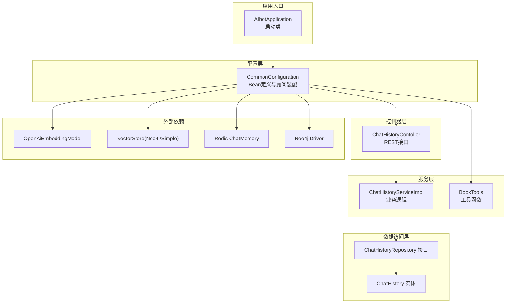
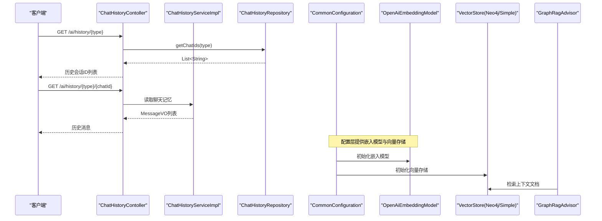
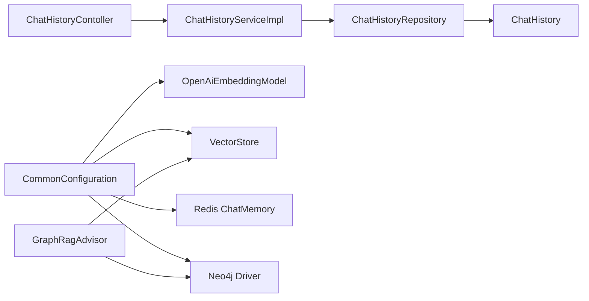

# 测试策略

<cite>
**本文引用的文件**
- [pom.xml](file://pom.xml)
- [AIbotApplication.java](file://src/main/java/com/xdu/aibot/AIbotApplication.java)
- [application.yaml](file://src/main/resources/application.yaml)
- [AIbotApplicationTests.java](file://src/test/java/com/xdu/aibot/AIbotApplicationTests.java)
- [CommonConfiguration.java](file://src/main/java/com/xdu/aibot/config/CommonConfiguration.java)
- [ChatHistoryServiceImpl.java](file://src/main/java/com/xdu/aibot/service/impl/ChatHistoryServiceImpl.java)
- [ChatHistoryContoller.java](file://src/main/java/com/xdu/aibot/controller/ChatHistoryContoller.java)
- [ChatHistoryRepository.java](file://src/main/java/com/xdu/aibot/repository/ChatHistoryRepository.java)
- [ChatHistoryService.java](file://src/main/java/com/xdu/aibot/service/ChatHistoryService.java)
- [VectorDistanceUtils.java](file://src/main/java/com/xdu/aibot/util/VectorDistanceUtils.java)
- [GraphRagAdvisor.java](file://src/main/java/com/xdu/aibot/advisor/GraphRagAdvisor.java)
- [BookTools.java](file://src/main/java/com/xdu/aibot/tools/BookTools.java)
- [ChatHistory.java](file://src/main/java/com/xdu/aibot/pojo/entity/ChatHistory.java)
</cite>

## 目录
1. [引言](#引言)
2. [项目结构](#项目结构)
3. [核心组件](#核心组件)
4. [架构总览](#架构总览)
5. [详细组件分析](#详细组件分析)
6. [依赖分析](#依赖分析)
7. [性能考虑](#性能考虑)
8. [故障排查指南](#故障排查指南)
9. [结论](#结论)
10. [附录](#附录)

## 引言
本测试策略文档面向AIbot项目，旨在建立覆盖单元测试、集成测试与端到端测试的完整测试体系。结合项目采用Spring Boot、Spring AI、Neo4j向量存储与Redis内存的架构特点，文档提供测试设计原则、用例编写指南、Mock与测试数据管理、性能与压力测试方法、覆盖率与报告分析、缺陷跟踪流程以及持续测试集成与自动化脚本建议。目标是提升代码质量、保障系统稳定性与可维护性。

## 项目结构
AIbot采用分层架构：控制器层负责HTTP接口；服务层承载业务逻辑；数据访问层通过MyBatis-Plus与数据库交互；配置层定义Spring Bean与外部依赖（向量存储、嵌入模型、聊天记忆、图RAG顾问等）。测试位于src/test目录，当前包含基于@SpringBootTest的示例测试，覆盖嵌入模型、Neo4j连接与向量距离工具的基本验证。

图表来源
- [AIbotApplication.java:1-16](file://src/main/java/com/xdu/aibot/AIbotApplication.java#L1-L16)
- [CommonConfiguration.java:1-129](file://src/main/java/com/xdu/aibot/config/CommonConfiguration.java#L1-L129)
- [ChatHistoryContoller.java:1-39](file://src/main/java/com/xdu/aibot/controller/ChatHistoryContoller.java#L1-L39)
- [ChatHistoryServiceImpl.java:1-63](file://src/main/java/com/xdu/aibot/service/impl/ChatHistoryServiceImpl.java#L1-L63)
- [ChatHistoryRepository.java:1-14](file://src/main/java/com/xdu/aibot/repository/ChatHistoryRepository.java#L1-L14)
- [ChatHistory.java:1-23](file://src/main/java/com/xdu/aibot/pojo/entity/ChatHistory.java#L1-L23)
- [BookTools.java:1-127](file://src/main/java/com/xdu/aibot/tools/BookTools.java#L1-L127)

章节来源
- [AIbotApplication.java:1-16](file://src/main/java/com/xdu/aibot/AIbotApplication.java#L1-L16)
- [CommonConfiguration.java:1-129](file://src/main/java/com/xdu/aibot/config/CommonConfiguration.java#L1-L129)
- [ChatHistoryContoller.java:1-39](file://src/main/java/com/xdu/aibot/controller/ChatHistoryContoller.java#L1-L39)
- [ChatHistoryServiceImpl.java:1-63](file://src/main/java/com/xdu/aibot/service/impl/ChatHistoryServiceImpl.java#L1-L63)
- [ChatHistoryRepository.java:1-14](file://src/main/java/com/xdu/aibot/repository/ChatHistoryRepository.java#L1-L14)
- [ChatHistory.java:1-23](file://src/main/java/com/xdu/aibot/pojo/entity/ChatHistory.java#L1-L23)
- [BookTools.java:1-127](file://src/main/java/com/xdu/aibot/tools/BookTools.java#L1-L127)

## 核心组件
- 控制器层：提供历史会话查询接口，依赖聊天记忆与仓库接口。
- 服务层：实现会话保存与查询，封装事务与日志。
- 数据访问层：实体映射与查询包装器。
- 配置层：定义向量存储、嵌入模型、聊天客户端与顾问链，以及Neo4j驱动与Redis聊天记忆。
- 工具与顾问：向量距离工具、图RAG顾问（HanLP分词+Cypher检索）、书籍工具（查询与预约）。

章节来源
- [ChatHistoryContoller.java:1-39](file://src/main/java/com/xdu/aibot/controller/ChatHistoryContoller.java#L1-L39)
- [ChatHistoryServiceImpl.java:1-63](file://src/main/java/com/xdu/aibot/service/impl/ChatHistoryServiceImpl.java#L1-L63)
- [ChatHistoryRepository.java:1-14](file://src/main/java/com/xdu/aibot/repository/ChatHistoryRepository.java#L1-L14)
- [ChatHistoryService.java:1-19](file://src/main/java/com/xdu/aibot/service/ChatHistoryService.java#L1-L19)
- [CommonConfiguration.java:1-129](file://src/main/java/com/xdu/aibot/config/CommonConfiguration.java#L1-L129)
- [VectorDistanceUtils.java:1-111](file://src/main/java/com/xdu/aibot/util/VectorDistanceUtils.java#L1-L111)
- [GraphRagAdvisor.java:1-149](file://src/main/java/com/xdu/aibot/advisor/GraphRagAdvisor.java#L1-L149)
- [BookTools.java:1-127](file://src/main/java/com/xdu/aibot/tools/BookTools.java#L1-L127)

## 架构总览
下图展示测试关注的关键交互路径：控制器接收请求，调用服务层；服务层通过仓库接口持久化；配置层提供嵌入模型、向量存储与顾问链；图RAG顾问在问答前进行图谱增强；书籍工具作为工具函数参与对话。

图表来源
- [ChatHistoryContoller.java:1-39](file://src/main/java/com/xdu/aibot/controller/ChatHistoryContoller.java#L1-L39)
- [ChatHistoryServiceImpl.java:1-63](file://src/main/java/com/xdu/aibot/service/impl/ChatHistoryServiceImpl.java#L1-L63)
- [ChatHistoryRepository.java:1-14](file://src/main/java/com/xdu/aibot/repository/ChatHistoryRepository.java#L1-L14)
- [CommonConfiguration.java:1-129](file://src/main/java/com/xdu/aibot/config/CommonConfiguration.java#L1-L129)
- [GraphRagAdvisor.java:1-149](file://src/main/java/com/xdu/aibot/advisor/GraphRagAdvisor.java#L1-L149)

## 详细组件分析

### 控制器层测试策略
- 单元测试
  - 使用MockMvc或WebTestClient对REST接口进行断言，覆盖正常路径与异常路径（如空chatId、无效type）。
  - Mock仓库接口，验证控制器仅负责参数解析与响应转换。
- 集成测试
  - 启动完整Web环境，验证从请求到响应的端到端链路，包括聊天记忆读取。
- 关键断言点
  - 返回状态码、响应体结构、消息VO映射正确性。

章节来源
- [ChatHistoryContoller.java:1-39](file://src/main/java/com/xdu/aibot/controller/ChatHistoryContoller.java#L1-L39)

### 服务层测试策略
- 单元测试
  - Mock Mapper/Repository，验证saveChat去重逻辑、按类型查询ID列表。
  - 边界条件：空chatId、重复保存、大量数据场景。
- 集成测试
  - 结合MyBatis-Plus与数据库，验证插入、查询SQL行为与事务一致性。

章节来源
- [ChatHistoryServiceImpl.java:1-63](file://src/main/java/com/xdu/aibot/service/impl/ChatHistoryServiceImpl.java#L1-L63)
- [ChatHistoryService.java:1-19](file://src/main/java/com/xdu/aibot/service/ChatHistoryService.java#L1-L19)
- [ChatHistory.java:1-23](file://src/main/java/com/xdu/aibot/pojo/entity/ChatHistory.java#L1-L23)

### 工具与顾问测试策略
- 向量距离工具
  - 单元测试：构造不同维度向量、零向量、空向量、维度不匹配等边界，验证异常抛出与数值稳定性。
  - 性能：记录耗时，评估大规模向量运算的复杂度。
- 图RAG顾问
  - 单元测试：模拟上下文文档、chatId提取、关键词过滤、Cypher查询返回，验证增强后Prompt拼接。
  - 集成测试：连接Neo4j，验证真实查询与关系抽取。
- 书籍工具
  - 单元测试：查询条件组合、库存判断、推荐逻辑、预约事务一致性与异常分支。
  - 集成测试：数据库与事务回滚验证。

章节来源
- [VectorDistanceUtils.java:1-111](file://src/main/java/com/xdu/aibot/util/VectorDistanceUtils.java#L1-L111)
- [GraphRagAdvisor.java:1-149](file://src/main/java/com/xdu/aibot/advisor/GraphRagAdvisor.java#L1-L149)
- [BookTools.java:1-127](file://src/main/java/com/xdu/aibot/tools/BookTools.java#L1-L127)

### 配置与外部依赖测试策略
- 单元测试
  - 验证Bean定义顺序与依赖注入正确性，确保顾问链顺序满足执行约束。
- 集成测试
  - 启动应用上下文，验证嵌入模型初始化、向量存储schema初始化、Neo4j驱动连接、Redis聊天记忆可用性。

章节来源
- [CommonConfiguration.java:1-129](file://src/main/java/com/xdu/aibot/config/CommonConfiguration.java#L1-L129)
- [application.yaml:1-59](file://src/main/resources/application.yaml#L1-L59)

### 当前测试现状与改进建议
- 现状
  - 存在基于@SpringBootTest的示例测试，覆盖嵌入模型、Neo4j连接与向量距离工具。
- 建议
  - 补充控制器层与服务层的Mock测试与集成测试。
  - 增加图RAG顾问与书籍工具的边界与异常场景测试。
  - 引入性能与压力测试套件。

章节来源
- [AIbotApplicationTests.java:1-104](file://src/test/java/com/xdu/aibot/AIbotApplicationTests.java#L1-L104)

## 依赖分析
- 组件耦合
  - 控制器依赖仓库接口，服务层依赖仓库接口与实体，配置层提供外部依赖Bean。
- 外部依赖
  - OpenAI嵌入模型、Neo4j向量存储、Redis聊天记忆、Neo4j驱动。
- 顾问链顺序
  - GraphRagAdvisor需在QuestionAnswerAdvisor之后执行，以确保先检索上下文再进行图谱增强。

图表来源
- [ChatHistoryContoller.java:1-39](file://src/main/java/com/xdu/aibot/controller/ChatHistoryContoller.java#L1-L39)
- [ChatHistoryServiceImpl.java:1-63](file://src/main/java/com/xdu/aibot/service/impl/ChatHistoryServiceImpl.java#L1-L63)
- [ChatHistoryRepository.java:1-14](file://src/main/java/com/xdu/aibot/repository/ChatHistoryRepository.java#L1-L14)
- [ChatHistory.java:1-23](file://src/main/java/com/xdu/aibot/pojo/entity/ChatHistory.java#L1-L23)
- [CommonConfiguration.java:1-129](file://src/main/java/com/xdu/aibot/config/CommonConfiguration.java#L1-L129)
- [GraphRagAdvisor.java:1-149](file://src/main/java/com/xdu/aibot/advisor/GraphRagAdvisor.java#L1-L149)

## 性能考虑
- 向量运算
  - 向量维度固定，距离计算复杂度为O(d)，建议对批量向量进行批处理与缓存中间结果。
- 图RAG检索
  - Cypher查询应使用索引与限制返回数量，避免全图扫描。
- 嵌入模型
  - 使用批量嵌入接口减少往返开销，合理设置批次大小与并发度。
- 缓存策略
  - 对高频查询结果与嵌入向量进行缓存，降低外部依赖压力。
- 压力测试场景
  - 场景1：高并发请求历史会话接口，观察响应时间与错误率。
  - 场景2：批量嵌入与相似度计算，评估CPU与内存占用。
  - 场景3：图RAG增强问答，监控Cypher查询耗时与Neo4j连接池使用。
- 负载测试策略
  - 逐步增加并发用户数，观察系统瓶颈（数据库、向量存储、嵌入模型API、图数据库）。
  - 关键指标：P95/P99响应时间、吞吐量、错误率、资源使用率。

## 故障排查指南
- 常见问题
  - Neo4j连接失败：检查URI、认证信息与网络连通性。
  - 向量存储初始化失败：确认数据库权限与索引配置。
  - 书籍工具异常：库存不足、JSON序列化失败、事务回滚。
- 日志与监控
  - 开启调试级别日志，定位嵌入模型、向量存储与顾问链执行路径。
- 修复流程
  - 快速定位问题模块 → 编写最小可复现用例 → 修复并回归测试 → 上线验证。

章节来源
- [application.yaml:1-59](file://src/main/resources/application.yaml#L1-L59)
- [AIbotApplicationTests.java:1-104](file://src/test/java/com/xdu/aibot/AIbotApplicationTests.java#L1-L104)

## 结论
通过完善单元、集成与端到端测试，结合Mock与测试数据管理、性能与压力测试、覆盖率与报告分析、缺陷跟踪与持续集成，AIbot项目可显著提升质量与稳定性。建议优先补齐控制器与服务层测试，强化图RAG与工具函数的边界与异常测试，并引入自动化性能与压力测试脚本。

## 附录

### 测试用例编写指南
- 命名规范
  - 功能+场景+期望结果，如“查询存在书籍返回列表”、“库存为0触发推荐逻辑”。
- 断言策略
  - 结构断言：响应体字段、状态码、头信息。
  - 行为断言：调用次数、参数匹配、异常类型。
- 测试数据管理
  - 使用测试专用数据库或内存数据库，确保隔离与可重复。
  - 对外部依赖（嵌入模型、Neo4j、Redis）使用Mock或容器化替代。

### Mock对象使用
- 控制器层：Mock仓库接口，验证参数传递与响应映射。
- 服务层：MockMapper/Repository，验证业务逻辑与事务控制。
- 外部依赖：Mock嵌入模型与向量存储，验证顾问链与工具函数。

### 测试覆盖率与报告
- 覆盖率要求
  - 单元测试：核心业务逻辑行覆盖率≥80%，分支覆盖率≥60%。
  - 集成测试：接口与关键流程覆盖率≥70%。
- 报告分析
  - 使用JaCoCo生成覆盖率报告，定期审查未覆盖路径并补充用例。

### 缺陷跟踪流程
- 发现 → 描述 → 复现步骤 → 严重性分级 → 分配开发 → 修复 → 回归测试 → 关闭。
- 与测试报告联动，追踪重复缺陷与回归风险。

### 持续测试集成与自动化
- CI流水线
  - 代码提交触发：单元测试、静态检查、覆盖率报告。
  - PR合并触发：集成测试、端到端测试、安全扫描。
- 自动化脚本
  - Maven命令：测试、覆盖率收集、报告生成。
  - Docker容器：本地快速运行Neo4j、Redis、MySQL用于集成测试。

### 测试工具推荐
- 单元测试：JUnit 5、Mockito、AssertJ。
- 集成测试：Testcontainers（Neo4j/Redis/MySQL）、RestAssured。
- 性能测试：JMeter、Gatling、Locust。
- 覆盖率：JaCoCo。
- 容器化：Docker Compose（测试环境）。