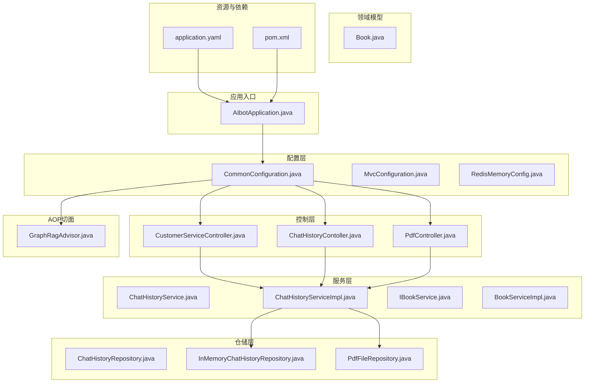
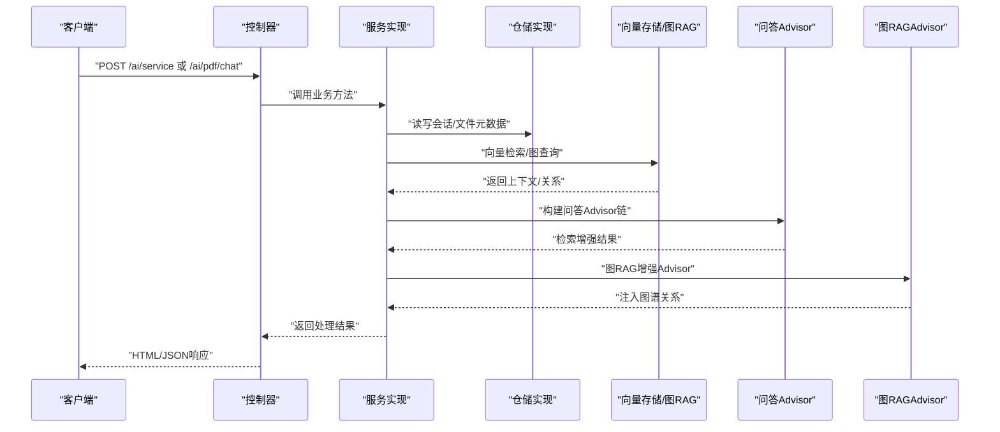
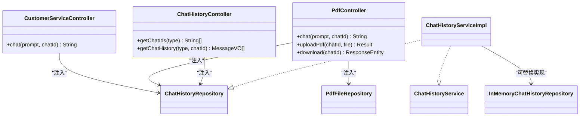
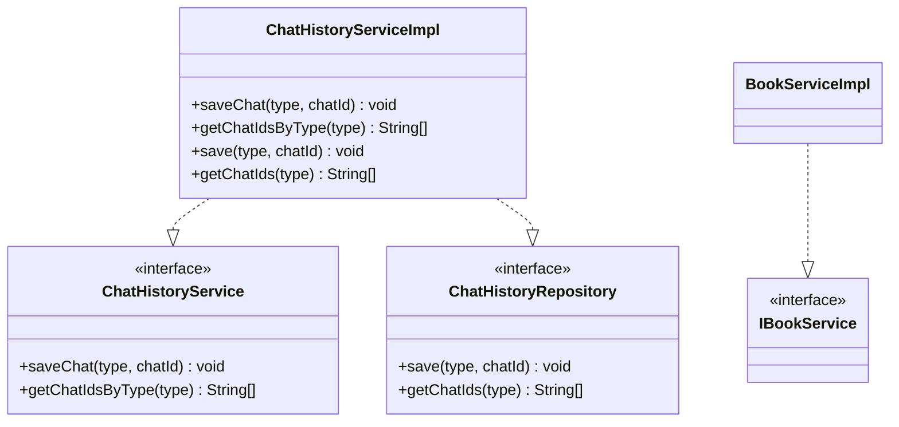
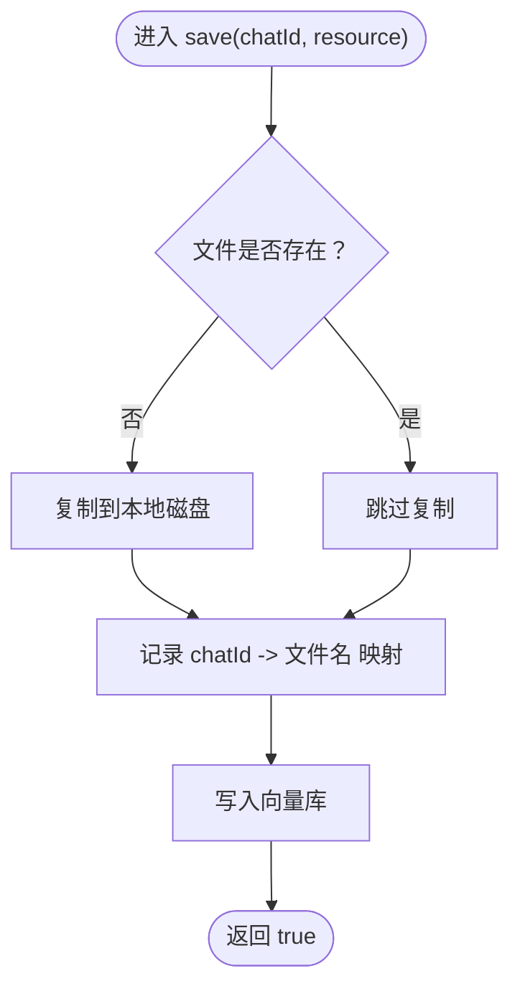
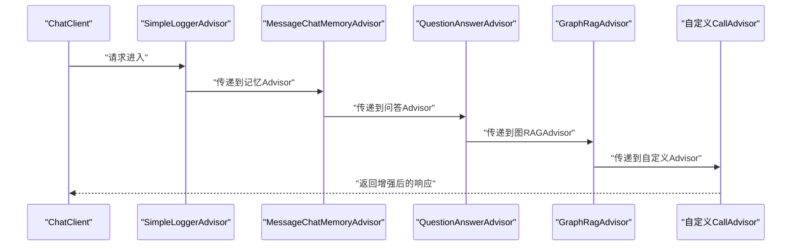
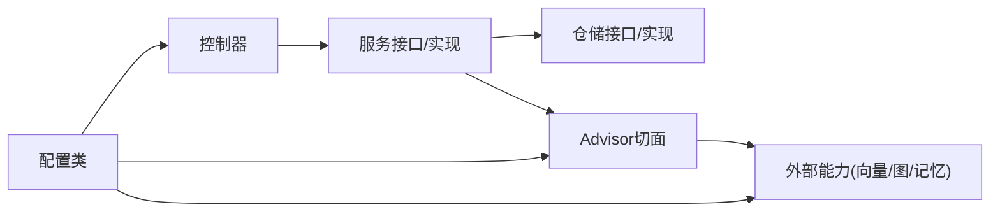

# 分层架构设计

<cite>
**本文引用的文件**
- [AIbotApplication.java](file://src/main/java/com/xdu/aibot/AIbotApplication.java)
- [CommonConfiguration.java](file://src/main/java/com/xdu/aibot/config/CommonConfiguration.java)
- [MvcConfiguration.java](file://src/main/java/com/xdu/aibot/config/MvcConfiguration.java)
- [RedisMemoryConfig.java](file://src/main/java/com/xdu/aibot/config/RedisMemoryConfig.java)
- [CustomerServiceController.java](file://src/main/java/com/xdu/aibot/controller/CustomerServiceController.java)
- [ChatHistoryContoller.java](file://src/main/java/com/xdu/aibot/controller/ChatHistoryContoller.java)
- [PdfController.java](file://src/main/java/com/xdu/aibot/controller/PdfController.java)
- [ChatHistoryService.java](file://src/main/java/com/xdu/aibot/service/ChatHistoryService.java)
- [ChatHistoryServiceImpl.java](file://src/main/java/com/xdu/aibot/service/impl/ChatHistoryServiceImpl.java)
- [IBookService.java](file://src/main/java/com/xdu/aibot/service/IBookService.java)
- [BookServiceImpl.java](file://src/main/java/com/xdu/aibot/service/impl/BookServiceImpl.java)
- [ChatHistoryRepository.java](file://src/main/java/com/xdu/aibot/repository/ChatHistoryRepository.java)
- [InMemoryChatHistoryRepository.java](file://src/main/java/com/xdu/aibot/repository/Impl/InMemoryChatHistoryRepository.java)
- [PdfFileRepository.java](file://src/main/java/com/xdu/aibot/repository/Impl/PdfFileRepository.java)
- [GraphRagAdvisor.java](file://src/main/java/com/xdu/aibot/advisor/GraphRagAdvisor.java)
- [Book.java](file://src/main/java/com/xdu/aibot/pojo/entity/Book.java)
- [application.yaml](file://src/main/resources/application.yaml)
- [pom.xml](file://pom.xml)
</cite>

## 目录
1. [引言](#引言)
2. [项目结构](#项目结构)
3. [核心组件](#核心组件)
4. [架构总览](#架构总览)
5. [详细组件分析](#详细组件分析)
6. [依赖分析](#依赖分析)
7. [性能考虑](#性能考虑)
8. [故障排查指南](#故障排查指南)
9. [结论](#结论)
10. [附录](#附录)

## 引言
本文件面向AIbot系统的分层架构设计，围绕MVC三层（Controller/Service/Repository）展开，结合AOP切面（Advisor）与依赖注入（DI）机制，系统化阐述各层职责边界、交互模式与最佳实践。通过对REST控制器、业务服务、数据访问抽象及AOP增强的深入分析，帮助读者快速理解系统的整体设计思路与落地实现。

## 项目结构
AIbot采用标准Spring Boot工程结构，按功能域划分包层次：
- config：配置类（应用、Web、缓存等）
- controller：REST控制器
- service：业务服务接口与实现
- repository：数据访问接口与实现
- advisor：AOP切面（Advisor）
- pojo：持久化实体与视图对象
- resources：配置文件与静态资源

图表来源
- [AIbotApplication.java:1-16](file://src/main/java/com/xdu/aibot/AIbotApplication.java#L1-L16)
- [CommonConfiguration.java:1-129](file://src/main/java/com/xdu/aibot/config/CommonConfiguration.java#L1-L129)
- [CustomerServiceController.java:1-35](file://src/main/java/com/xdu/aibot/controller/CustomerServiceController.java#L1-L35)
- [ChatHistoryContoller.java:1-39](file://src/main/java/com/xdu/aibot/controller/ChatHistoryContoller.java#L1-L39)
- [PdfController.java:1-98](file://src/main/java/com/xdu/aibot/controller/PdfController.java#L1-L98)
- [ChatHistoryService.java:1-19](file://src/main/java/com/xdu/aibot/service/ChatHistoryService.java#L1-L19)
- [ChatHistoryServiceImpl.java:1-63](file://src/main/java/com/xdu/aibot/service/impl/ChatHistoryServiceImpl.java#L1-L63)
- [IBookService.java:1-20](file://src/main/java/com/xdu/aibot/service/IBookService.java#L1-L20)
- [BookServiceImpl.java:1-21](file://src/main/java/com/xdu/aibot/service/impl/BookServiceImpl.java#L1-L21)
- [ChatHistoryRepository.java:1-14](file://src/main/java/com/xdu/aibot/repository/ChatHistoryRepository.java#L1-L14)
- [InMemoryChatHistoryRepository.java:1-31](file://src/main/java/com/xdu/aibot/repository/Impl/InMemoryChatHistoryRepository.java#L1-L31)
- [PdfFileRepository.java:1-109](file://src/main/java/com/xdu/aibot/repository/Impl/PdfFileRepository.java#L1-L109)
- [GraphRagAdvisor.java:1-149](file://src/main/java/com/xdu/aibot/advisor/GraphRagAdvisor.java#L1-L149)
- [Book.java:1-58](file://src/main/java/com/xdu/aibot/pojo/entity/Book.java#L1-L58)
- [application.yaml:1-59](file://src/main/resources/application.yaml#L1-L59)
- [pom.xml:1-139](file://pom.xml#L1-L139)

章节来源
- [AIbotApplication.java:1-16](file://src/main/java/com/xdu/aibot/AIbotApplication.java#L1-L16)
- [application.yaml:1-59](file://src/main/resources/application.yaml#L1-L59)
- [pom.xml:1-139](file://pom.xml#L1-L139)

## 核心组件
- 应用入口与扫描：应用启动类启用组件扫描与MyBatis Mapper扫描，统一管理Bean注册。
- 配置中心：集中定义ChatClient、VectorStore、Neo4j驱动、Redis聊天记忆仓库等基础设施Bean。
- 控制器层：提供REST接口，负责请求接入、参数校验与响应封装。
- 服务层：封装业务规则，协调仓储与外部能力（如向量检索、图RAG增强）。
- 仓储层：抽象数据访问，支持内存与持久化实现切换。
- AOP切面：对ChatClient调用进行增强（日志、记忆、问答检索、图RAG、拦截器链）。

章节来源
- [AIbotApplication.java:1-16](file://src/main/java/com/xdu/aibot/AIbotApplication.java#L1-L16)
- [CommonConfiguration.java:1-129](file://src/main/java/com/xdu/aibot/config/CommonConfiguration.java#L1-L129)
- [CustomerServiceController.java:1-35](file://src/main/java/com/xdu/aibot/controller/CustomerServiceController.java#L1-L35)
- [ChatHistoryServiceImpl.java:1-63](file://src/main/java/com/xdu/aibot/service/impl/ChatHistoryServiceImpl.java#L1-L63)
- [PdfFileRepository.java:1-109](file://src/main/java/com/xdu/aibot/repository/Impl/PdfFileRepository.java#L1-L109)
- [GraphRagAdvisor.java:1-149](file://src/main/java/com/xdu/aibot/advisor/GraphRagAdvisor.java#L1-L149)

## 架构总览
下图展示了从HTTP请求到业务处理、数据访问与AOP增强的整体流程，体现MVC与AOP的协同：

图表来源
- [CustomerServiceController.java:25-33](file://src/main/java/com/xdu/aibot/controller/CustomerServiceController.java#L25-L33)
- [PdfController.java:42-55](file://src/main/java/com/xdu/aibot/controller/PdfController.java#L42-L55)
- [ChatHistoryServiceImpl.java:23-41](file://src/main/java/com/xdu/aibot/service/impl/ChatHistoryServiceImpl.java#L23-L41)
- [PdfFileRepository.java:40-58](file://src/main/java/com/xdu/aibot/repository/Impl/PdfFileRepository.java#L40-L58)
- [CommonConfiguration.java:74-127](file://src/main/java/com/xdu/aibot/config/CommonConfiguration.java#L74-L127)
- [GraphRagAdvisor.java:38-136](file://src/main/java/com/xdu/aibot/advisor/GraphRagAdvisor.java#L38-L136)

## 详细组件分析

### 控制器层（Controller）
- 职责：暴露REST端点，接收请求参数，调用服务层，组装响应。
- 设计要点：
  - 使用@RestController统一返回体风格。
  - 通过@Autowired/@Qualifier注入具体服务或仓储实现。
  - 对外接口清晰，参数校验与异常处理在控制器层完成。
- 关键接口示例路径：
  - [CustomerServiceController.chat:25-33](file://src/main/java/com/xdu/aibot/controller/CustomerServiceController.java#L25-L33)
  - [PdfController.chat:42-55](file://src/main/java/com/xdu/aibot/controller/PdfController.java#L42-L55)
  - [PdfController.uploadPdf:60-77](file://src/main/java/com/xdu/aibot/controller/PdfController.java#L60-L77)
  - [PdfController.download:82-96](file://src/main/java/com/xdu/aibot/controller/PdfController.java#L82-L96)
  - [ChatHistoryContoller.getChatIds:25-28](file://src/main/java/com/xdu/aibot/controller/ChatHistoryContoller.java#L25-L28)
  - [ChatHistoryContoller.getChatHistory:30-37](file://src/main/java/com/xdu/aibot/controller/ChatHistoryContoller.java#L30-L37)

图表来源
- [CustomerServiceController.java:14-35](file://src/main/java/com/xdu/aibot/controller/CustomerServiceController.java#L14-L35)
- [PdfController.java:26-98](file://src/main/java/com/xdu/aibot/controller/PdfController.java#L26-L98)
- [ChatHistoryContoller.java:14-39](file://src/main/java/com/xdu/aibot/controller/ChatHistoryContoller.java#L14-L39)
- [ChatHistoryService.java:1-19](file://src/main/java/com/xdu/aibot/service/ChatHistoryService.java#L1-L19)
- [ChatHistoryRepository.java:1-14](file://src/main/java/com/xdu/aibot/repository/ChatHistoryRepository.java#L1-L14)
- [ChatHistoryServiceImpl.java:18-63](file://src/main/java/com/xdu/aibot/service/impl/ChatHistoryServiceImpl.java#L18-L63)
- [InMemoryChatHistoryRepository.java:12-31](file://src/main/java/com/xdu/aibot/repository/Impl/InMemoryChatHistoryRepository.java#L12-L31)
- [PdfFileRepository.java:28-109](file://src/main/java/com/xdu/aibot/repository/Impl/PdfFileRepository.java#L28-L109)

章节来源
- [CustomerServiceController.java:1-35](file://src/main/java/com/xdu/aibot/controller/CustomerServiceController.java#L1-L35)
- [PdfController.java:1-98](file://src/main/java/com/xdu/aibot/controller/PdfController.java#L1-L98)
- [ChatHistoryContoller.java:1-39](file://src/main/java/com/xdu/aibot/controller/ChatHistoryContoller.java#L1-L39)

### 服务层（Service）
- 职责：封装业务规则，协调仓储与外部能力；保证事务一致性与幂等性。
- 设计要点：
  - 接口与实现分离，便于替换与测试。
  - 使用MyBatis-Plus简化通用CRUD。
  - 通过依赖注入获取仓储与工具能力。
- 关键接口示例路径：
  - [ChatHistoryService.saveChat:10-13](file://src/main/java/com/xdu/aibot/service/ChatHistoryService.java#L10-L13)
  - [ChatHistoryService.getChatIdsByType:15-18](file://src/main/java/com/xdu/aibot/service/ChatHistoryService.java#L15-L18)
  - [ChatHistoryServiceImpl.saveChat:23-41](file://src/main/java/com/xdu/aibot/service/impl/ChatHistoryServiceImpl.java#L23-L41)
  - [ChatHistoryServiceImpl.getChatIdsByType:43-52](file://src/main/java/com/xdu/aibot/service/impl/ChatHistoryServiceImpl.java#L43-L52)
  - [BookServiceImpl:17-20](file://src/main/java/com/xdu/aibot/service/impl/BookServiceImpl.java#L17-L20)

图表来源
- [ChatHistoryService.java:8-19](file://src/main/java/com/xdu/aibot/service/ChatHistoryService.java#L8-L19)
- [ChatHistoryServiceImpl.java:18-63](file://src/main/java/com/xdu/aibot/service/impl/ChatHistoryServiceImpl.java#L18-L63)
- [ChatHistoryRepository.java:7-13](file://src/main/java/com/xdu/aibot/repository/ChatHistoryRepository.java#L7-L13)
- [IBookService.java:1-20](file://src/main/java/com/xdu/aibot/service/IBookService.java#L1-L20)
- [BookServiceImpl.java:17-20](file://src/main/java/com/xdu/aibot/service/impl/BookServiceImpl.java#L17-L20)

章节来源
- [ChatHistoryService.java:1-19](file://src/main/java/com/xdu/aibot/service/ChatHistoryService.java#L1-L19)
- [ChatHistoryServiceImpl.java:1-63](file://src/main/java/com/xdu/aibot/service/impl/ChatHistoryServiceImpl.java#L1-L63)
- [BookServiceImpl.java:1-21](file://src/main/java/com/xdu/aibot/service/impl/BookServiceImpl.java#L1-L21)

### 仓储层（Repository）
- 职责：抽象数据访问，屏蔽底层实现差异（内存/持久化/向量存储/文件系统）。
- 设计要点：
  - 接口定义统一契约，实现可替换。
  - 文件仓储负责PDF解析、向量化与持久化。
  - 内存仓储用于演示与测试，生产可用数据库或Redis替代。
- 关键接口示例路径：
  - [ChatHistoryRepository.save/getChatIds:9-12](file://src/main/java/com/xdu/aibot/repository/ChatHistoryRepository.java#L9-L12)
  - [InMemoryChatHistoryRepository.save/getChatIds:17-28](file://src/main/java/com/xdu/aibot/repository/Impl/InMemoryChatHistoryRepository.java#L17-L28)
  - [PdfFileRepository.save/getFile:40-63](file://src/main/java/com/xdu/aibot/repository/Impl/PdfFileRepository.java#L40-L63)

图表来源
- [PdfFileRepository.java:40-58](file://src/main/java/com/xdu/aibot/repository/Impl/PdfFileRepository.java#L40-L58)

章节来源
- [ChatHistoryRepository.java:1-14](file://src/main/java/com/xdu/aibot/repository/ChatHistoryRepository.java#L1-L14)
- [InMemoryChatHistoryRepository.java:1-31](file://src/main/java/com/xdu/aibot/repository/Impl/InMemoryChatHistoryRepository.java#L1-L31)
- [PdfFileRepository.java:1-109](file://src/main/java/com/xdu/aibot/repository/Impl/PdfFileRepository.java#L1-L109)

### AOP切面（Advisor）
- 职责：在ChatClient调用前后注入日志、记忆、问答检索与图RAG增强。
- 设计要点：
  - SimpleLoggerAdvisor：统一日志输出。
  - MessageChatMemoryAdvisor：基于Redis的对话记忆。
  - QuestionAnswerAdvisor：向量检索增强。
  - GraphRagAdvisor：基于Neo4j的知识图谱关系增强。
  - 自定义CallAdvisor：拦截最终Prompt并打印增强内容。
- 关键配置示例路径：
  - [CommonConfiguration.serviceChatClient:74-88](file://src/main/java/com/xdu/aibot/config/CommonConfiguration.java#L74-L88)
  - [CommonConfiguration.pdfChatClient:91-127](file://src/main/java/com/xdu/aibot/config/CommonConfiguration.java#L91-L127)
  - [GraphRagAdvisor.adviseCall:38-136](file://src/main/java/com/xdu/aibot/advisor/GraphRagAdvisor.java#L38-136)

图表来源
- [CommonConfiguration.java:74-127](file://src/main/java/com/xdu/aibot/config/CommonConfiguration.java#L74-L127)
- [GraphRagAdvisor.java:38-136](file://src/main/java/com/xdu/aibot/advisor/GraphRagAdvisor.java#L38-L136)

章节来源
- [CommonConfiguration.java:1-129](file://src/main/java/com/xdu/aibot/config/CommonConfiguration.java#L1-L129)
- [GraphRagAdvisor.java:1-149](file://src/main/java/com/xdu/aibot/advisor/GraphRagAdvisor.java#L1-L149)

### 数据模型
- Book实体：标准MyBatis-Plus注解，定义表名与主键策略。
- 其他实体位于pojo.entity包中，遵循相同建模规范。

章节来源
- [Book.java:1-58](file://src/main/java/com/xdu/aibot/pojo/entity/Book.java#L1-L58)

## 依赖分析
- 组件耦合与内聚：
  - 控制器仅依赖服务接口，降低对实现细节的耦合。
  - 服务层依赖仓储接口，通过构造或注入装配具体实现。
  - AOP切面通过配置注入到ChatClient，形成横切增强链。
- 外部依赖：
  - Spring AI、DashScope/OpenAI、Neo4j、Redis、MySQL、MyBatis-Plus等。
- 循环依赖：
  - 当前结构未见循环依赖迹象，接口分离与依赖注入避免了常见循环。

图表来源
- [CommonConfiguration.java:1-129](file://src/main/java/com/xdu/aibot/config/CommonConfiguration.java#L1-L129)
- [CustomerServiceController.java:1-35](file://src/main/java/com/xdu/aibot/controller/CustomerServiceController.java#L1-L35)
- [PdfController.java:1-98](file://src/main/java/com/xdu/aibot/controller/PdfController.java#L1-L98)
- [ChatHistoryServiceImpl.java:1-63](file://src/main/java/com/xdu/aibot/service/impl/ChatHistoryServiceImpl.java#L1-L63)
- [PdfFileRepository.java:1-109](file://src/main/java/com/xdu/aibot/repository/Impl/PdfFileRepository.java#L1-L109)
- [GraphRagAdvisor.java:1-149](file://src/main/java/com/xdu/aibot/advisor/GraphRagAdvisor.java#L1-L149)

章节来源
- [pom.xml:1-139](file://pom.xml#L1-L139)

## 性能考虑
- 向量检索与图查询：
  - 限制TopK与相似度阈值，减少上下文规模。
  - 批量嵌入与分页读取，避免一次性加载过多文档。
- 缓存与持久化：
  - 使用Redis作为聊天记忆后端，降低重复计算。
  - 向量存储持久化与加载，减少重启后重建成本。
- I/O优化：
  - PDF解析按页拆分，向量库写入批量提交。
  - 文件上传大小限制与流式处理，避免内存峰值。

## 故障排查指南
- 常见问题定位：
  - ChatClient未正确注入：检查配置类Bean声明与qualifier名称。
  - 图RAG无输出：确认Neo4j连接、索引初始化与关键词抽取逻辑。
  - PDF上传失败：检查文件类型校验、磁盘权限与向量库写入异常。
  - 会话历史为空：确认Redis记忆仓库可用与ChatMemory参数传递。
- 日志与调试：
  - application.yaml中开启相关包的日志级别，便于追踪调用链。
- 事务与幂等：
  - 服务层保存会话时进行存在性检查，避免重复写入。

章节来源
- [application.yaml:52-59](file://src/main/resources/application.yaml#L52-L59)
- [ChatHistoryServiceImpl.java:23-41](file://src/main/java/com/xdu/aibot/service/impl/ChatHistoryServiceImpl.java#L23-L41)
- [PdfFileRepository.java:48-57](file://src/main/java/com/xdu/aibot/repository/Impl/PdfFileRepository.java#L48-L57)
- [GraphRagAdvisor.java:82-84](file://src/main/java/com/xdu/aibot/advisor/GraphRagAdvisor.java#L82-L84)

## 结论
AIbot通过清晰的MVC分层与AOP切面，实现了关注点分离与横切能力的模块化组合。控制器负责接口与协议，服务层承载业务规则，仓储层抽象数据访问，Advisor在不侵入业务的情况下提供检索增强与图谱扩展。配合依赖注入与配置中心，系统具备良好的可维护性、可扩展性与可测试性。

## 附录
- 代码示例路径（仅列出路径，不展示具体代码）：
  - 控制器REST接口：[CustomerServiceController.chat:25-33](file://src/main/java/com/xdu/aibot/controller/CustomerServiceController.java#L25-L33)、[PdfController.chat:42-55](file://src/main/java/com/xdu/aibot/controller/PdfController.java#L42-L55)、[ChatHistoryContoller.getChatHistory:30-37](file://src/main/java/com/xdu/aibot/controller/ChatHistoryContoller.java#L30-L37)
  - 服务层业务方法：[ChatHistoryServiceImpl.saveChat:23-41](file://src/main/java/com/xdu/aibot/service/impl/ChatHistoryServiceImpl.java#L23-L41)、[ChatHistoryServiceImpl.getChatIdsByType:43-52](file://src/main/java/com/xdu/aibot/service/impl/ChatHistoryServiceImpl.java#L43-L52)
  - 仓储层数据操作：[PdfFileRepository.save:40-58](file://src/main/java/com/xdu/aibot/repository/Impl/PdfFileRepository.java#L40-L58)、[InMemoryChatHistoryRepository.save:17-24](file://src/main/java/com/xdu/aibot/repository/Impl/InMemoryChatHistoryRepository.java#L17-L24)
  - AOP增强配置：[CommonConfiguration.pdfChatClient:91-127](file://src/main/java/com/xdu/aibot/config/CommonConfiguration.java#L91-L127)、[GraphRagAdvisor.adviseCall:38-136](file://src/main/java/com/xdu/aibot/advisor/GraphRagAdvisor.java#L38-136)
- 配置与依赖：
  - 应用配置：[application.yaml:1-59](file://src/main/resources/application.yaml#L1-L59)
  - Maven依赖：[pom.xml:1-139](file://pom.xml#L1-L139)