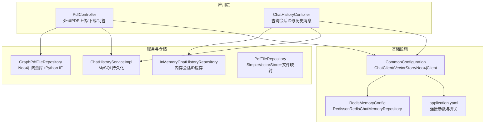
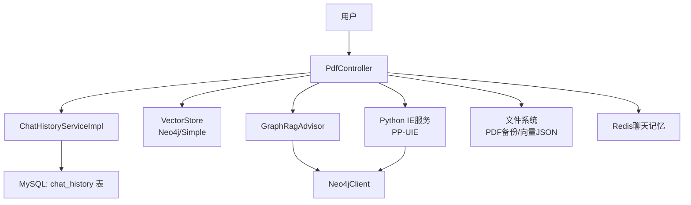
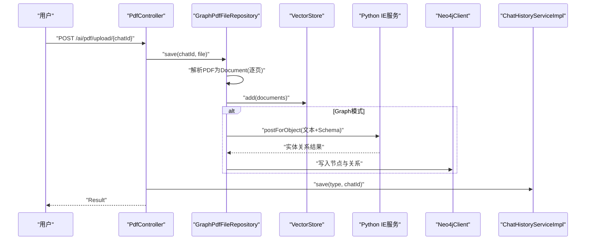
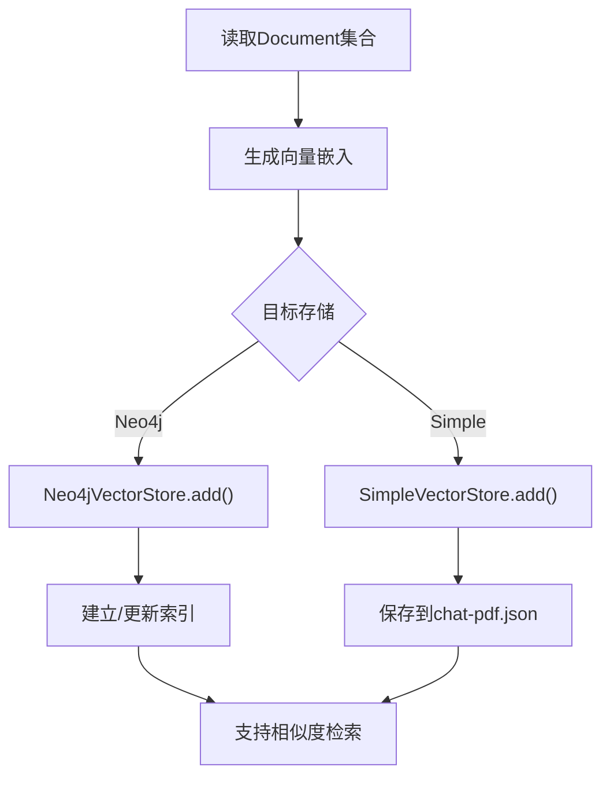
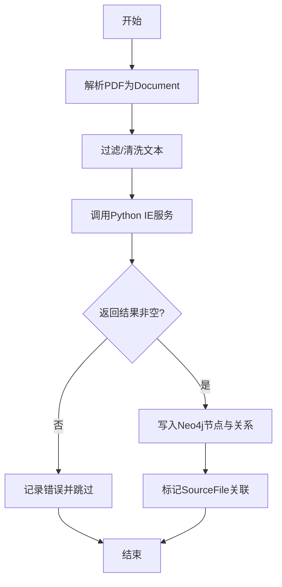
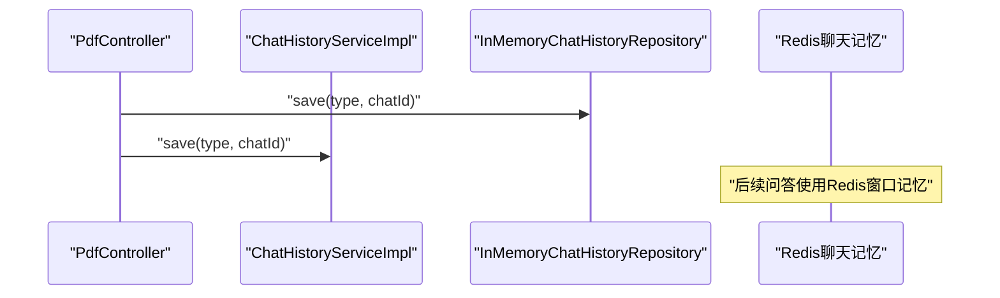
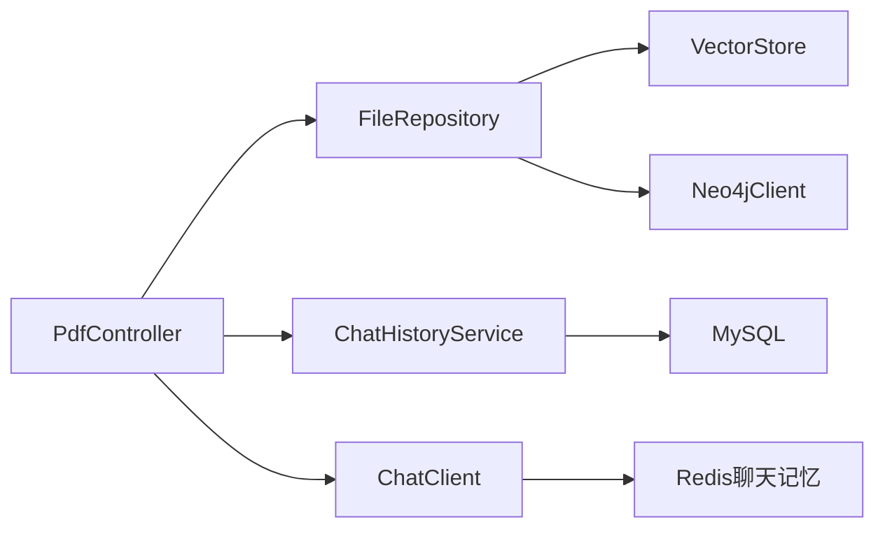
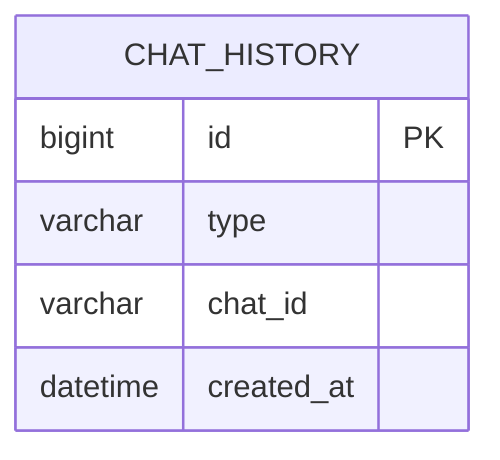

# 数据流架构

<cite>
**本文引用的文件**
- [AIbotApplication.java](file://src/main/java/com/xdu/aibot/AIbotApplication.java)
- [PdfController.java](file://src/main/java/com/xdu/aibot/controller/PdfController.java)
- [ChatHistoryContoller.java](file://src/main/java/com/xdu/aibot/controller/ChatHistoryContoller.java)
- [PdfFileRepository.java](file://src/main/java/com/xdu/aibot/repository/Impl/PdfFileRepository.java)
- [GraphPdfFileRepository.java](file://src/main/java/com/xdu/aibot/repository/Impl/GraphPdfFileRepository.java)
- [InMemoryChatHistoryRepository.java](file://src/main/java/com/xdu/aibot/repository/Impl/InMemoryChatHistoryRepository.java)
- [ChatHistoryServiceImpl.java](file://src/main/java/com/xdu/aibot/service/impl/ChatHistoryServiceImpl.java)
- [CommonConfiguration.java](file://src/main/java/com/xdu/aibot/config/CommonConfiguration.java)
- [RedisMemoryConfig.java](file://src/main/java/com/xdu/aibot/config/RedisMemoryConfig.java)
- [GraphRagAdvisor.java](file://src/main/java/com/xdu/aibot/advisor/GraphRagAdvisor.java)
- [application.yaml](file://src/main/resources/application.yaml)
- [ChatHistory.java](file://src/main/java/com/xdu/aibot/pojo/entity/ChatHistory.java)
- [chat-pdf.properties](file://chat-pdf.properties)
</cite>

## 目录
1. [简介](#简介)
2. [项目结构](#项目结构)
3. [核心组件](#核心组件)
4. [架构总览](#架构总览)
5. [详细组件分析](#详细组件分析)
6. [依赖分析](#依赖分析)
7. [性能考虑](#性能考虑)
8. [故障排查指南](#故障排查指南)
9. [结论](#结论)
10. [附录](#附录)

## 简介
本文件面向AIbot系统的数据流架构，聚焦以下主题：
- PDF文件上传后的解析与向量化流程
- 向量嵌入生成与存储机制
- 知识图谱的构建与Neo4j协同
- 对话历史的存储与检索（内存、Redis、MySQL）
- 数据在不同存储介质间的迁移与同步
- 数据一致性保障与缓存策略
- 异步与批处理实现思路
- 性能优化与监控建议

## 项目结构
系统采用Spring Boot工程，按功能分层组织：
- 控制器层：处理HTTP请求，协调业务与存储
- 仓储层：封装文件与聊天历史的持久化细节
- 服务层：提供事务与业务规则
- 配置层：定义向量库、聊天客户端、内存存储等Bean
- 实体与映射：MySQL表结构与MyBatis映射

图表来源
- [PdfController.java:1-98](file://src/main/java/com/xdu/aibot/controller/PdfController.java#L1-L98)
- [ChatHistoryContoller.java:1-39](file://src/main/java/com/xdu/aibot/controller/ChatHistoryContoller.java#L1-L39)
- [ChatHistoryServiceImpl.java:1-63](file://src/main/java/com/xdu/aibot/service/impl/ChatHistoryServiceImpl.java#L1-L63)
- [InMemoryChatHistoryRepository.java:1-31](file://src/main/java/com/xdu/aibot/repository/Impl/InMemoryChatHistoryRepository.java#L1-L31)
- [GraphPdfFileRepository.java:1-262](file://src/main/java/com/xdu/aibot/repository/Impl/GraphPdfFileRepository.java#L1-L262)
- [PdfFileRepository.java:1-109](file://src/main/java/com/xdu/aibot/repository/Impl/PdfFileRepository.java#L1-L109)
- [CommonConfiguration.java:1-129](file://src/main/java/com/xdu/aibot/config/CommonConfiguration.java#L1-L129)
- [RedisMemoryConfig.java:1-26](file://src/main/java/com/xdu/aibot/config/RedisMemoryConfig.java#L1-L26)
- [application.yaml:1-59](file://src/main/resources/application.yaml#L1-L59)

章节来源
- [AIbotApplication.java:1-16](file://src/main/java/com/xdu/aibot/AIbotApplication.java#L1-L16)
- [application.yaml:1-59](file://src/main/resources/application.yaml#L1-L59)

## 核心组件
- PDF控制器：负责上传、下载与基于PDF的问答；通过Advisor链路结合向量检索与知识图谱增强
- 文件仓储：
  - GraphPdfFileRepository：使用Neo4j向量存储，解析PDF后调用Python实体抽取服务，构建知识图谱
  - PdfFileRepository：使用SimpleVectorStore进行向量存储，同时维护chatId到文件名的映射
- 会话历史：
  - InMemoryChatHistoryRepository：内存缓存会话ID列表
  - ChatHistoryServiceImpl：MySQL持久化会话记录
- 配置：
  - CommonConfiguration：定义ChatClient、VectorStore、Neo4jClient与Advisor链
  - RedisMemoryConfig：Redis聊天记忆仓库

章节来源
- [PdfController.java:1-98](file://src/main/java/com/xdu/aibot/controller/PdfController.java#L1-L98)
- [GraphPdfFileRepository.java:1-262](file://src/main/java/com/xdu/aibot/repository/Impl/GraphPdfFileRepository.java#L1-L262)
- [PdfFileRepository.java:1-109](file://src/main/java/com/xdu/aibot/repository/Impl/PdfFileRepository.java#L1-L109)
- [InMemoryChatHistoryRepository.java:1-31](file://src/main/java/com/xdu/aibot/repository/Impl/InMemoryChatHistoryRepository.java#L1-L31)
- [ChatHistoryServiceImpl.java:1-63](file://src/main/java/com/xdu/aibot/service/impl/ChatHistoryServiceImpl.java#L1-L63)
- [CommonConfiguration.java:1-129](file://src/main/java/com/xdu/aibot/config/CommonConfiguration.java#L1-L129)
- [RedisMemoryConfig.java:1-26](file://src/main/java/com/xdu/aibot/config/RedisMemoryConfig.java#L1-L26)

## 架构总览
系统围绕“向量检索 + 知识图谱增强”的RAG流程展开，数据在多存储介质间协同：
- Redis：短期对话记忆（聊天窗口）
- MySQL：会话元数据与历史记录
- Neo4j：知识图谱与向量索引
- 文件系统：PDF本地备份与向量序列化

图表来源
- [CommonConfiguration.java:90-127](file://src/main/java/com/xdu/aibot/config/CommonConfiguration.java#L90-L127)
- [GraphRagAdvisor.java:1-149](file://src/main/java/com/xdu/aibot/advisor/GraphRagAdvisor.java#L1-L149)
- [GraphPdfFileRepository.java:39-177](file://src/main/java/com/xdu/aibot/repository/Impl/GraphPdfFileRepository.java#L39-L177)
- [PdfFileRepository.java:75-108](file://src/main/java/com/xdu/aibot/repository/Impl/PdfFileRepository.java#L75-L108)
- [ChatHistoryServiceImpl.java:23-41](file://src/main/java/com/xdu/aibot/service/impl/ChatHistoryServiceImpl.java#L23-L41)
- [application.yaml:35-45](file://src/main/resources/application.yaml#L35-L45)

## 详细组件分析

### PDF上传与解析流程
- 输入：multipart/form-data，文件类型校验
- 步骤：
  1) 校验并保存PDF至本地
  2) 解析PDF为Document（每页一个Document），附加元数据（chat_id、file_name）
  3) 写入向量库（Neo4j或SimpleVectorStore）
  4) 若使用Graph模式，调用Python IE服务抽取实体关系，写入Neo4j
  5) 记录会话ID到MySQL与内存缓存

图表来源
- [PdfController.java:60-77](file://src/main/java/com/xdu/aibot/controller/PdfController.java#L60-L77)
- [GraphPdfFileRepository.java:42-70](file://src/main/java/com/xdu/aibot/repository/Impl/GraphPdfFileRepository.java#L42-L70)
- [PdfFileRepository.java:41-58](file://src/main/java/com/xdu/aibot/repository/Impl/PdfFileRepository.java#L41-L58)
- [ChatHistoryServiceImpl.java:24-41](file://src/main/java/com/xdu/aibot/service/impl/ChatHistoryServiceImpl.java#L24-L41)

章节来源
- [PdfController.java:60-77](file://src/main/java/com/xdu/aibot/controller/PdfController.java#L60-L77)
- [GraphPdfFileRepository.java:42-177](file://src/main/java/com/xdu/aibot/repository/Impl/GraphPdfFileRepository.java#L42-L177)
- [PdfFileRepository.java:41-108](file://src/main/java/com/xdu/aibot/repository/Impl/PdfFileRepository.java#L41-L108)
- [ChatHistoryServiceImpl.java:24-41](file://src/main/java/com/xdu/aibot/service/impl/ChatHistoryServiceImpl.java#L24-L41)

### 向量嵌入生成与存储
- 生成：基于OpenAI Embedding模型（通过配置指定维度与模型）
- 存储：
  - Neo4j向量存储：自动初始化索引，支持余弦距离检索
  - SimpleVectorStore：文件序列化（chat-pdf.json），进程内持久化
- 批处理：TokenCountBatchingStrategy用于批量嵌入

图表来源
- [CommonConfiguration.java:59-70](file://src/main/java/com/xdu/aibot/config/CommonConfiguration.java#L59-L70)
- [PdfFileRepository.java:75-108](file://src/main/java/com/xdu/aibot/repository/Impl/PdfFileRepository.java#L75-L108)
- [application.yaml:26-29](file://src/main/resources/application.yaml#L26-L29)

章节来源
- [CommonConfiguration.java:47-70](file://src/main/java/com/xdu/aibot/config/CommonConfiguration.java#L47-L70)
- [application.yaml:26-29](file://src/main/resources/application.yaml#L26-L29)

### 知识图谱构建流程
- 解析：逐页PDF转Document，设置chat_id与file_name
- 抽取：调用Python IE服务（PP-UIE），传入Schema与文本
- 写入：将实体作为节点、关系作为边写入Neo4j；同时标记SourceFile
- 关系清洗：过滤无效实体，规范化关系名，避免非法字符

图表来源
- [GraphPdfFileRepository.java:85-177](file://src/main/java/com/xdu/aibot/repository/Impl/GraphPdfFileRepository.java#L85-L177)
- [GraphPdfFileRepository.java:182-252](file://src/main/java/com/xdu/aibot/repository/Impl/GraphPdfFileRepository.java#L182-L252)

章节来源
- [GraphPdfFileRepository.java:85-252](file://src/main/java/com/xdu/aibot/repository/Impl/GraphPdfFileRepository.java#L85-L252)

### 对话历史存储机制
- 内存缓存：InMemoryChatHistoryRepository按类型维护chatId列表
- MySQL持久化：ChatHistoryServiceImpl去重插入，记录创建时间
- Redis聊天记忆：通过MessageWindowChatMemory与RedissonRedisChatMemoryRepository实现短期上下文

图表来源
- [ChatHistoryContoller.java:25-37](file://src/main/java/com/xdu/aibot/controller/ChatHistoryContoller.java#L25-L37)
- [InMemoryChatHistoryRepository.java:18-24](file://src/main/java/com/xdu/aibot/repository/Impl/InMemoryChatHistoryRepository.java#L18-L24)
- [ChatHistoryServiceImpl.java:24-41](file://src/main/java/com/xdu/aibot/service/impl/ChatHistoryServiceImpl.java#L24-L41)
- [CommonConfiguration.java:74-88](file://src/main/java/com/xdu/aibot/config/CommonConfiguration.java#L74-L88)

章节来源
- [ChatHistoryContoller.java:1-39](file://src/main/java/com/xdu/aibot/controller/ChatHistoryContoller.java#L1-L39)
- [InMemoryChatHistoryRepository.java:1-31](file://src/main/java/com/xdu/aibot/repository/Impl/InMemoryChatHistoryRepository.java#L1-L31)
- [ChatHistoryServiceImpl.java:1-63](file://src/main/java/com/xdu/aibot/service/impl/ChatHistoryServiceImpl.java#L1-L63)
- [CommonConfiguration.java:74-88](file://src/main/java/com/xdu/aibot/config/CommonConfiguration.java#L74-L88)

### 数据一致性与缓存策略
- 一致性：
  - 会话记录：MySQL保证持久化；入库前去重检查
  - 向量与图谱：向量写入成功后再进行图谱构建；若图谱构建失败，不影响向量可用性
- 缓存：
  - Redis：短期对话记忆，窗口大小可控
  - 内存：会话ID列表，快速查询
  - 文件：SimpleVectorStore序列化，进程重启后恢复

章节来源
- [ChatHistoryServiceImpl.java:29-41](file://src/main/java/com/xdu/aibot/service/impl/ChatHistoryServiceImpl.java#L29-L41)
- [PdfFileRepository.java:82-92](file://src/main/java/com/xdu/aibot/repository/Impl/PdfFileRepository.java#L82-L92)
- [CommonConfiguration.java:74-100](file://src/main/java/com/xdu/aibot/config/CommonConfiguration.java#L74-L100)

### 异步与批处理
- 批处理：向量嵌入采用TokenCountBatchingStrategy，提升吞吐
- 异步：Python IE服务调用为阻塞式（RestTemplate），可在高并发场景下引入队列或异步任务框架
- 建议：对长文档分片并行处理，结合线程池与超时控制

章节来源
- [CommonConfiguration.java:68-69](file://src/main/java/com/xdu/aibot/config/CommonConfiguration.java#L68-L69)
- [GraphPdfFileRepository.java:162-175](file://src/main/java/com/xdu/aibot/repository/Impl/GraphPdfFileRepository.java#L162-L175)

## 依赖分析
- 组件耦合：
  - 控制器依赖仓储与服务；仓储依赖向量库与Neo4jClient
  - ChatClient通过Advisor链整合记忆、向量检索与图谱增强
- 外部依赖：
  - Neo4j、Redis、MySQL、DashScope/OpenAI兼容接口
- 潜在循环依赖：未见直接循环；各层职责清晰

图表来源
- [PdfController.java:32-40](file://src/main/java/com/xdu/aibot/controller/PdfController.java#L32-L40)
- [CommonConfiguration.java:90-127](file://src/main/java/com/xdu/aibot/config/CommonConfiguration.java#L90-L127)
- [ChatHistoryServiceImpl.java:1-63](file://src/main/java/com/xdu/aibot/service/impl/ChatHistoryServiceImpl.java#L1-L63)

章节来源
- [CommonConfiguration.java:1-129](file://src/main/java/com/xdu/aibot/config/CommonConfiguration.java#L1-L129)
- [application.yaml:1-59](file://src/main/resources/application.yaml#L1-L59)

## 性能考虑
- 向量检索：
  - 调整相似度阈值与topK，平衡召回与速度
  - 合理设置索引名称与距离类型，减少扫描范围
- 文本预处理：
  - 长文本分片，避免超过模型输入限制
  - 中文文本去空白合并，减少噪声
- 存储与IO：
  - SimpleVectorStore定期持久化，降低启动成本
  - PDF本地备份便于快速重放与调试
- 缓存与并发：
  - Redis连接池参数调优，避免阻塞
  - 批量嵌入策略与线程池配合，提升吞吐

## 故障排查指南
- 上传失败
  - 检查文件类型与大小限制
  - 查看文件复制与向量写入日志
- 图谱构建异常
  - 确认Python IE服务可达与返回格式正确
  - 核对Schema配置与实体清洗逻辑
- 问答无上下文
  - 检查向量检索相似度阈值与topK
  - 确认GraphRagAdvisor注入的图谱信息是否存在
- 会话历史为空
  - 核对内存缓存与MySQL查询逻辑
  - 检查Redis连接参数与聊天记忆窗口

章节来源
- [PdfController.java:60-77](file://src/main/java/com/xdu/aibot/controller/PdfController.java#L60-L77)
- [GraphPdfFileRepository.java:162-175](file://src/main/java/com/xdu/aibot/repository/Impl/GraphPdfFileRepository.java#L162-L175)
- [GraphRagAdvisor.java:88-113](file://src/main/java/com/xdu/aibot/advisor/GraphRagAdvisor.java#L88-L113)
- [ChatHistoryServiceImpl.java:44-52](file://src/main/java/com/xdu/aibot/service/impl/ChatHistoryServiceImpl.java#L44-L52)
- [application.yaml:35-45](file://src/main/resources/application.yaml#L35-L45)

## 结论
AIbot系统通过“向量检索 + 知识图谱增强”的组合实现了高质量的RAG能力。数据在Redis、MySQL与Neo4j之间形成清晰的职责边界：短期对话记忆由Redis承载，会话元数据持久化于MySQL，文档与实体关系由Neo4j管理。通过批处理与缓存策略，系统在准确性与性能之间取得平衡。建议在高并发场景下进一步完善异步化与限流策略，并持续优化实体抽取与检索阈值。

## 附录
- 数据模型（简化）
  - chat_history：type、chat_id、created_at
  - Document（Neo4j）：包含embedding、metadata（chat_id、file_name）

图表来源
- [ChatHistory.java:1-23](file://src/main/java/com/xdu/aibot/pojo/entity/ChatHistory.java#L1-L23)