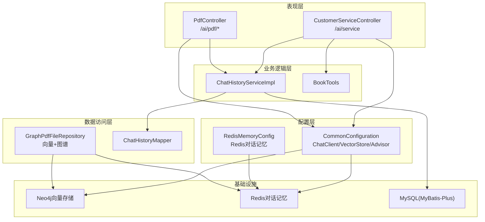
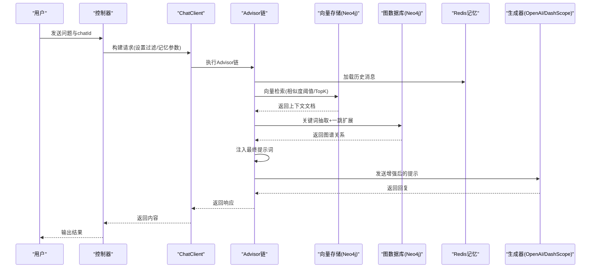
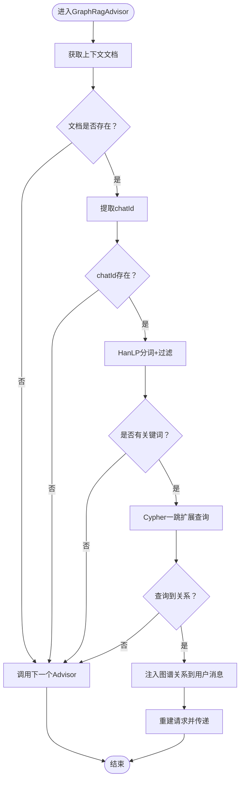
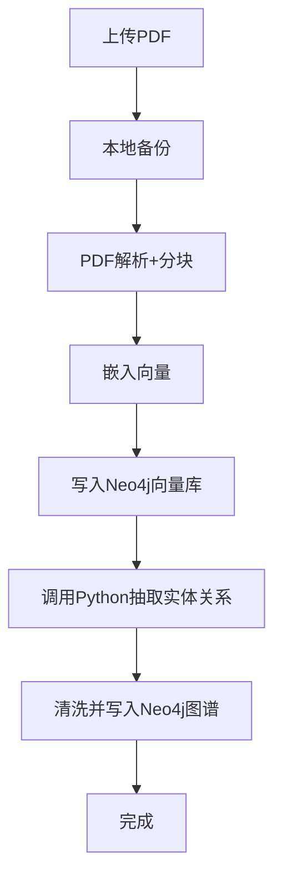
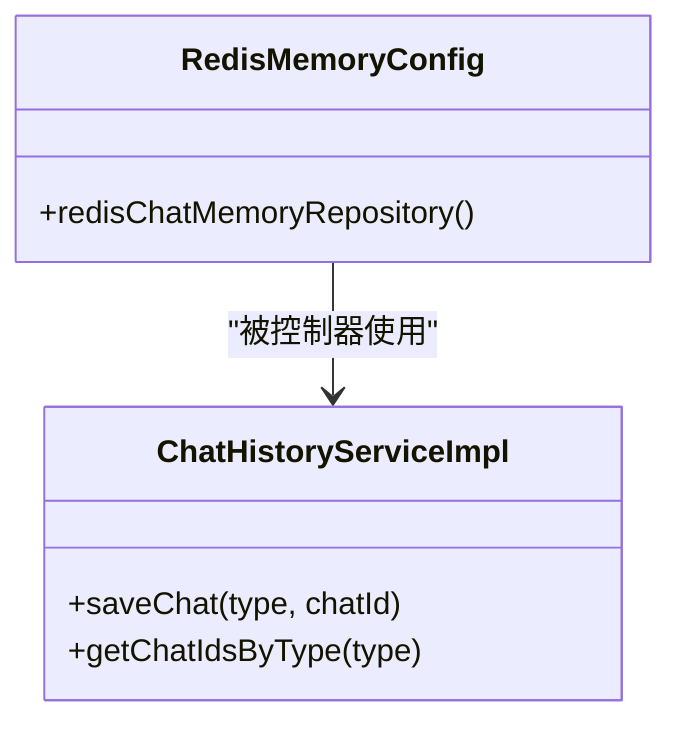
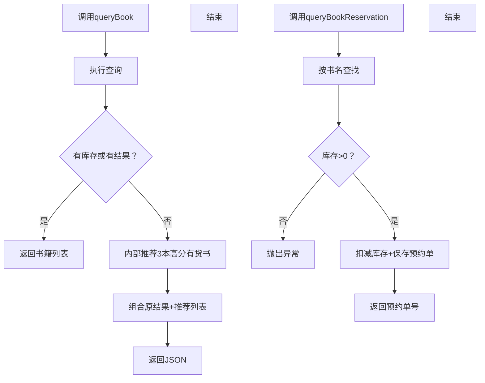
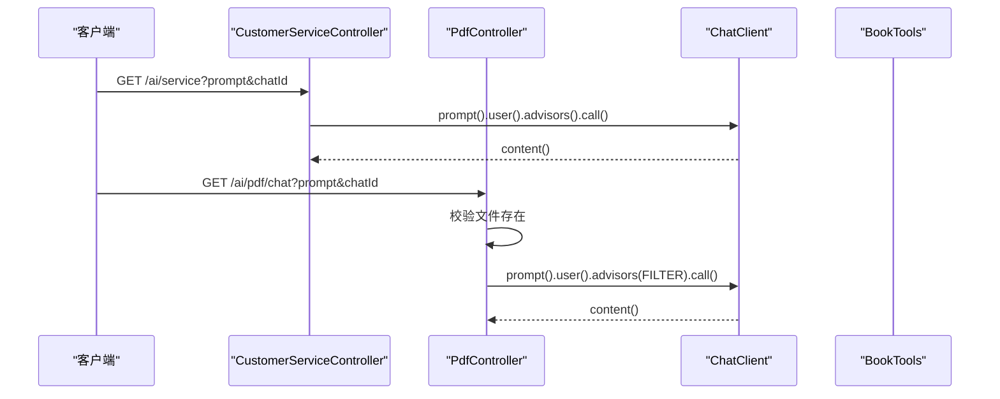
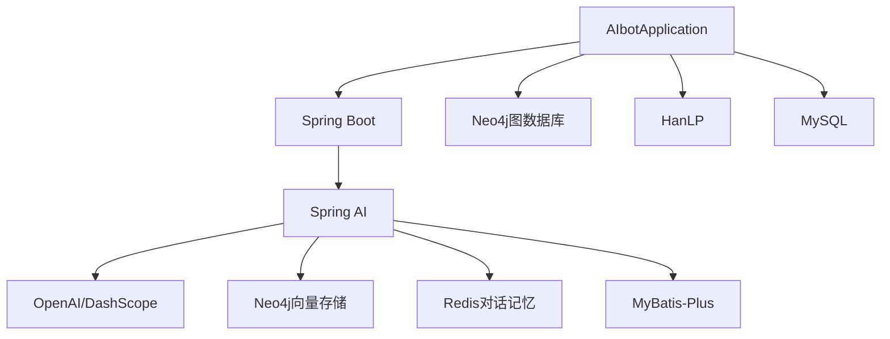

# 整体架构概览

<cite>
**本文引用的文件**
- [AIbotApplication.java](file://src/main/java/com/xdu/aibot/AIbotApplication.java)
- [pom.xml](file://pom.xml)
- [application.yaml](file://src/main/resources/application.yaml)
- [CommonConfiguration.java](file://src/main/java/com/xdu/aibot/config/CommonConfiguration.java)
- [RedisMemoryConfig.java](file://src/main/java/com/xdu/aibot/config/RedisMemoryConfig.java)
- [GraphRagAdvisor.java](file://src/main/java/com/xdu/aibot/advisor/GraphRagAdvisor.java)
- [CustomerServiceController.java](file://src/main/java/com/xdu/aibot/controller/CustomerServiceController.java)
- [PdfController.java](file://src/main/java/com/xdu/aibot/controller/PdfController.java)
- [BookTools.java](file://src/main/java/com/xdu/aibot/tools/BookTools.java)
- [ChatHistoryServiceImpl.java](file://src/main/java/com/xdu/aibot/service/impl/ChatHistoryServiceImpl.java)
- [GraphPdfFileRepository.java](file://src/main/java/com/xdu/aibot/repository/Impl/GraphPdfFileRepository.java)
- [ChatType.java](file://src/main/java/com/xdu/aibot/constant/ChatType.java)
- [VectorDistanceUtils.java](file://src/main/java/com/xdu/aibot/util/VectorDistanceUtils.java)
- [chat-pdf.properties](file://chat-pdf.properties)
</cite>

## 目录
1. [简介](#简介)
2. [项目结构](#项目结构)
3. [核心组件](#核心组件)
4. [架构总览](#架构总览)
5. [详细组件分析](#详细组件分析)
6. [依赖分析](#依赖分析)
7. [性能考量](#性能考量)
8. [故障排查指南](#故障排查指南)
9. [结论](#结论)
10. [附录](#附录)

## 简介
本项目为基于Spring Boot 3.5.10的企业级智能问答系统，采用现代化分层架构，融合RAG（检索增强生成）技术与知识图谱，提供两类核心能力：
- 通用客服问答：通过工具函数实现图书查询与预约，结合对话记忆实现连贯交互。
- PDF知识问答：支持PDF上传、解析、向量化、Neo4j图谱构建与检索增强生成，实现“向量+图谱”的双通道增强。

系统以Spring AI为核心，集成OpenAI兼容模型（DashScope）、向量存储（Neo4j向量索引）、对话记忆（Redis）与知识图谱（Neo4j），形成从表现层到数据层的完整链路。

## 项目结构
项目采用标准Spring Boot目录结构，按关注点分层组织：
- 表现层：控制器（REST接口）
- 业务逻辑层：服务与工具（含工具函数）
- 数据访问层：MyBatis-Plus映射与仓储实现
- 配置层：Spring AI客户端、内存、向量存储与图数据库配置
- 基础设施：Neo4j图数据库、Redis缓存、MySQL持久化

图表来源
- [CustomerServiceController.java:1-35](file://src/main/java/com/xdu/aibot/controller/CustomerServiceController.java#L1-L35)
- [PdfController.java:1-98](file://src/main/java/com/xdu/aibot/controller/PdfController.java#L1-L98)
- [CommonConfiguration.java:1-129](file://src/main/java/com/xdu/aibot/config/CommonConfiguration.java#L1-L129)
- [RedisMemoryConfig.java:1-26](file://src/main/java/com/xdu/aibot/config/RedisMemoryConfig.java#L1-L26)
- [ChatHistoryServiceImpl.java:1-63](file://src/main/java/com/xdu/aibot/service/impl/ChatHistoryServiceImpl.java#L1-L63)
- [GraphPdfFileRepository.java:1-262](file://src/main/java/com/xdu/aibot/repository/Impl/GraphPdfFileRepository.java#L1-L262)

章节来源
- [AIbotApplication.java:1-16](file://src/main/java/com/xdu/aibot/AIbotApplication.java#L1-L16)
- [pom.xml:1-139](file://pom.xml#L1-L139)
- [application.yaml:1-59](file://src/main/resources/application.yaml#L1-L59)

## 核心组件
- Spring AI客户端与Advisor链：统一构建ChatClient，配置日志、对话记忆、向量检索与自定义图RAG增强。
- 图RAG增强器：基于HanLP分词抽取关键词，在Neo4j中进行一跳扩展检索，将图谱关系注入最终提示词。
- PDF处理流水线：PDF解析→分块→嵌入→写入Neo4j向量索引；同时调用Python微服务抽取实体关系，构建知识图谱。
- 对话记忆：基于Redis的对话记忆仓库，支持按conversationId隔离历史消息。
- 工具函数：图书查询与预约，具备库存判断与推荐逻辑，避免无效LLM调用。
- 会话历史：记录不同类型的对话标识，便于后续审计与回溯。

章节来源
- [CommonConfiguration.java:47-127](file://src/main/java/com/xdu/aibot/config/CommonConfiguration.java#L47-L127)
- [GraphRagAdvisor.java:1-149](file://src/main/java/com/xdu/aibot/advisor/GraphRagAdvisor.java#L1-L149)
- [GraphPdfFileRepository.java:42-177](file://src/main/java/com/xdu/aibot/repository/Impl/GraphPdfFileRepository.java#L42-L177)
- [RedisMemoryConfig.java:18-25](file://src/main/java/com/xdu/aibot/config/RedisMemoryConfig.java#L18-L25)
- [BookTools.java:22-127](file://src/main/java/com/xdu/aibot/tools/BookTools.java#L22-L127)
- [ChatHistoryServiceImpl.java:23-62](file://src/main/java/com/xdu/aibot/service/impl/ChatHistoryServiceImpl.java#L23-L62)

## 架构总览
系统采用分层架构，围绕“请求-增强-生成-记忆-持久化”闭环展开：
- 控制器接收请求，注入对话ID与过滤条件，触发ChatClient。
- ChatClient按顺序执行Advisor链：日志、对话记忆、向量检索、图RAG增强、最终提示词打印。
- 生成器返回内容，控制器封装响应。
- 会话历史与文件元数据持久化至MySQL与Neo4j。

图表来源
- [CommonConfiguration.java:91-127](file://src/main/java/com/xdu/aibot/config/CommonConfiguration.java#L91-L127)
- [GraphRagAdvisor.java:38-136](file://src/main/java/com/xdu/aibot/advisor/GraphRagAdvisor.java#L38-L136)
- [PdfController.java:42-55](file://src/main/java/com/xdu/aibot/controller/PdfController.java#L42-L55)
- [CustomerServiceController.java:25-33](file://src/main/java/com/xdu/aibot/controller/CustomerServiceController.java#L25-L33)

## 详细组件分析

### 组件A：图RAG增强器（GraphRagAdvisor）
- 职责：在QuestionAnswerAdvisor返回的文档基础上，抽取用户问题关键词，查询Neo4j图谱，将一跳关系注入最终提示词。
- 关键流程：
  - 从上下文获取检索到的文档，提取chatId。
  - 使用HanLP进行分词与词性过滤，提取名词相关关键词。
  - 在Neo4j中执行Cypher查询，基于关键词与SourceFile进行一跳扩展，返回关系三元组。
  - 将关系拼接到用户消息末尾，重建请求并传递给下一个Advisor。

图表来源
- [GraphRagAdvisor.java:38-136](file://src/main/java/com/xdu/aibot/advisor/GraphRagAdvisor.java#L38-L136)

章节来源
- [GraphRagAdvisor.java:1-149](file://src/main/java/com/xdu/aibot/advisor/GraphRagAdvisor.java#L1-L149)

### 组件B：PDF知识问答流水线（GraphPdfFileRepository）
- 职责：负责PDF上传、解析、分块、嵌入、写入向量库、调用Python微服务抽取实体关系并写入Neo4j图谱。
- 关键流程：
  - 保存PDF到本地并解析为Document列表，附加chatId与文件名元数据。
  - 将文档批量写入Neo4j向量存储。
  - 调用Python IE服务（PP-UIE）抽取实体与关系，清洗后写入Neo4j。
  - 控制器通过过滤表达式限定检索范围，确保仅返回当前文件的上下文。

图表来源
- [GraphPdfFileRepository.java:42-177](file://src/main/java/com/xdu/aibot/repository/Impl/GraphPdfFileRepository.java#L42-L177)

章节来源
- [GraphPdfFileRepository.java:1-262](file://src/main/java/com/xdu/aibot/repository/Impl/GraphPdfFileRepository.java#L1-L262)
- [PdfController.java:42-55](file://src/main/java/com/xdu/aibot/controller/PdfController.java#L42-L55)

### 组件C：对话记忆与会话历史
- Redis对话记忆：通过RedissonRedisChatMemoryRepository实现，按conversationId隔离历史消息，默认最多20条。
- 会话历史：记录不同类型对话的chatId，便于后续审计与回溯。

图表来源
- [RedisMemoryConfig.java:18-25](file://src/main/java/com/xdu/aibot/config/RedisMemoryConfig.java#L18-L25)
- [ChatHistoryServiceImpl.java:18-63](file://src/main/java/com/xdu/aibot/service/impl/ChatHistoryServiceImpl.java#L18-L63)

章节来源
- [RedisMemoryConfig.java:1-26](file://src/main/java/com/xdu/aibot/config/RedisMemoryConfig.java#L1-L26)
- [ChatHistoryServiceImpl.java:1-63](file://src/main/java/com/xdu/aibot/service/impl/ChatHistoryServiceImpl.java#L1-L63)
- [ChatType.java:1-17](file://src/main/java/com/xdu/aibot/constant/ChatType.java#L1-L17)

### 组件D：工具函数（BookTools）
- 图书查询：支持多条件组合查询，若无库存或无结果则返回推荐列表，避免无效LLM调用。
- 预约下单：校验库存后扣减并生成预约单号，事务保证一致性。

图表来源
- [BookTools.java:32-125](file://src/main/java/com/xdu/aibot/tools/BookTools.java#L32-L125)

章节来源
- [BookTools.java:1-127](file://src/main/java/com/xdu/aibot/tools/BookTools.java#L1-L127)

### 组件E：控制器与客户端配置
- 客服控制器：面向通用问答，注入工具函数与对话记忆，返回纯文本内容。
- PDF控制器：面向知识问答，先校验文件是否存在，再进行向量检索与图谱增强。
- 客户端配置：统一构建ChatClient，设置默认系统提示、Advisor链与工具函数。

图表来源
- [CustomerServiceController.java:25-33](file://src/main/java/com/xdu/aibot/controller/CustomerServiceController.java#L25-L33)
- [PdfController.java:42-55](file://src/main/java/com/xdu/aibot/controller/PdfController.java#L42-L55)
- [CommonConfiguration.java:74-127](file://src/main/java/com/xdu/aibot/config/CommonConfiguration.java#L74-L127)

章节来源
- [CustomerServiceController.java:1-35](file://src/main/java/com/xdu/aibot/controller/CustomerServiceController.java#L1-L35)
- [PdfController.java:1-98](file://src/main/java/com/xdu/aibot/controller/PdfController.java#L1-L98)
- [CommonConfiguration.java:1-129](file://src/main/java/com/xdu/aibot/config/CommonConfiguration.java#L1-L129)

## 依赖分析
系统技术栈与外部依赖：
- Spring Boot 3.5.10：应用启动与自动配置
- Spring AI 1.1.2：ChatClient、Advisor、向量存储、嵌入模型、工具函数
- OpenAI兼容模型（DashScope）：qwen-flash（聊天）、text-embedding-v4（嵌入）
- Neo4j：向量存储与图数据库，支持Cosine距离与自定义索引
- Redis：对话记忆与连接池配置
- MyBatis-Plus：数据库访问与ORM
- HanLP：中文分词与词性过滤
- MySQL：持久化会话历史

图表来源
- [pom.xml:33-116](file://pom.xml#L33-L116)
- [application.yaml:1-59](file://src/main/resources/application.yaml#L1-L59)

章节来源
- [pom.xml:1-139](file://pom.xml#L1-L139)
- [application.yaml:1-59](file://src/main/resources/application.yaml#L1-L59)

## 性能考量
- 向量检索参数：相似度阈值与TopK控制召回质量与性能平衡；建议根据业务场景动态调整。
- 批量嵌入策略：TokenCountBatchingStrategy减少API调用次数，提升吞吐。
- 图谱查询限制：Cypher查询限制返回数量，避免大图扫描带来的延迟。
- Redis连接池：合理配置最大活跃/空闲连接与空闲回收周期，避免资源争用。
- PDF解析分页：按页切分降低单次处理压力，结合分块策略提升检索精度。
- 工具函数内推荐：在Java侧完成推荐，减少LLM调用成本。

## 故障排查指南
- 未上传PDF即提问：控制器会抛出异常提示先上传文件，检查文件是否成功保存。
- 无检索结果或图谱为空：确认向量索引初始化、嵌入维度与距离类型配置一致；检查Python IE服务可用性。
- 对话记忆失效：检查Redis连接参数与密码，确认按conversationId正确注入。
- 图RAG增强未生效：确认Advisor顺序，GraphRagAdvisor需在QuestionAnswerAdvisor之后执行；检查关键词抽取与Cypher查询。
- 会话历史缺失：确认ChatType与chatId传入正确，控制器调用后应触发保存逻辑。

章节来源
- [PdfController.java:45-47](file://src/main/java/com/xdu/aibot/controller/PdfController.java#L45-L47)
- [GraphRagAdvisor.java:33-36](file://src/main/java/com/xdu/aibot/advisor/GraphRagAdvisor.java#L33-L36)
- [RedisMemoryConfig.java:18-25](file://src/main/java/com/xdu/aibot/config/RedisMemoryConfig.java#L18-L25)
- [ChatHistoryServiceImpl.java:23-41](file://src/main/java/com/xdu/aibot/service/impl/ChatHistoryServiceImpl.java#L23-L41)

## 结论
本系统以Spring AI为核心，结合Neo4j向量存储与图数据库，实现了“向量检索+图谱增强”的双通道RAG方案。通过Redis对话记忆与MyBatis-Plus持久化，形成完整的智能问答闭环。整体架构清晰、模块职责明确，具备良好的扩展性与可维护性，适合在企业级场景中持续演进。

## 附录
- 配置要点
  - 向量存储：数据库名、索引名、嵌入维度、距离类型需与模型一致。
  - OpenAI/DashScope：Base URL与API Key需正确配置，模型参数按需调整。
  - Redis：连接参数与池配置需满足并发需求。
  - 日志级别：开启Spring AI与Neo4j调试日志便于定位问题。
- 扩展建议
  - 引入缓存中间层（如Redis缓存检索结果）进一步降低延迟。
  - 增加指标监控与链路追踪，覆盖Advisor链与向量/图谱查询耗时。
  - 支持多模态输入（图片/表格）与多语言嵌入模型，提升覆盖面。
  - 将Python IE服务容器化并引入熔断降级策略，提高稳定性。