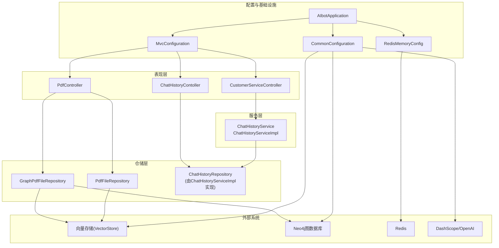
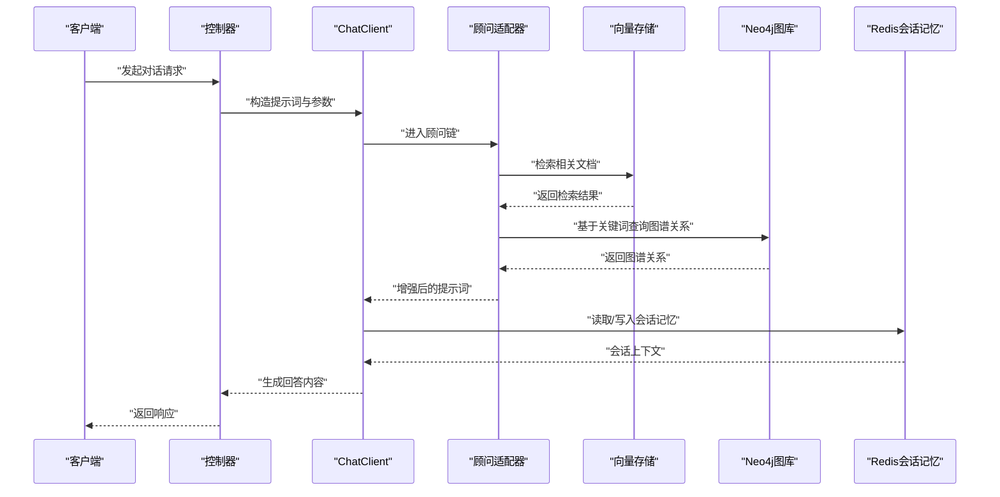
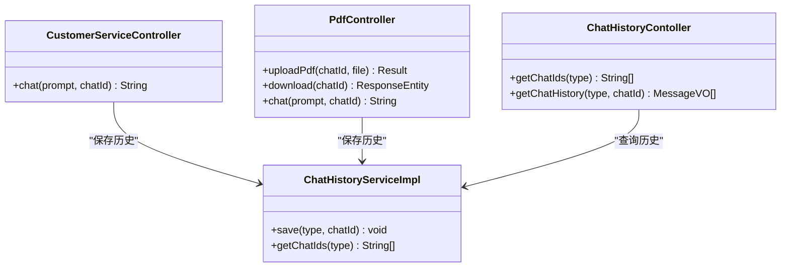
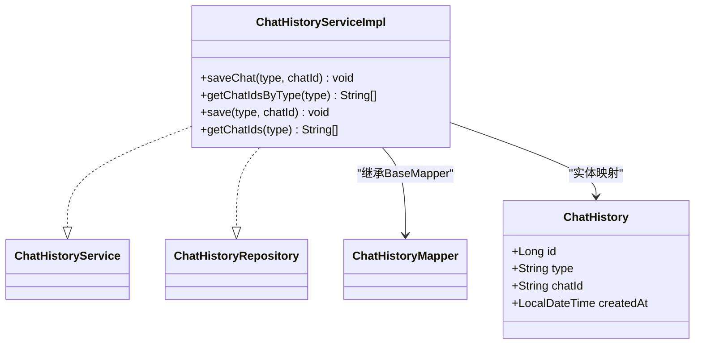
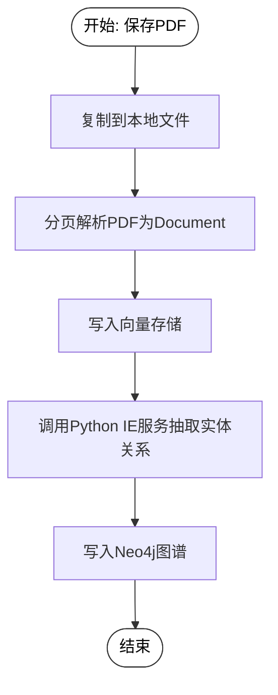
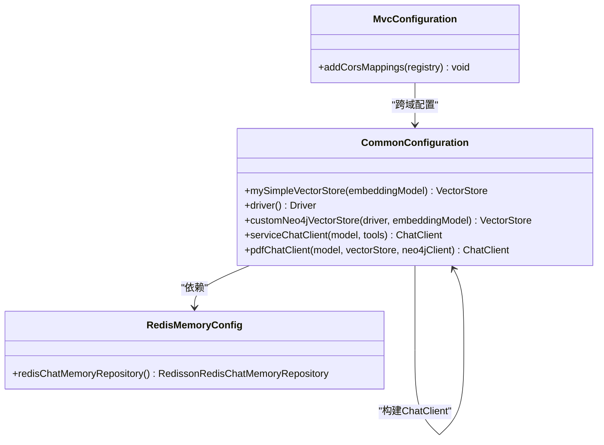
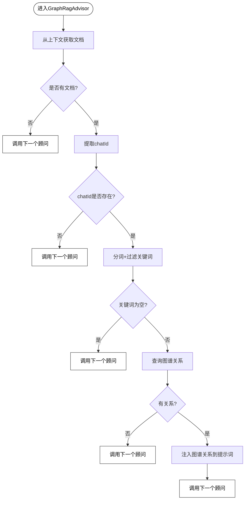
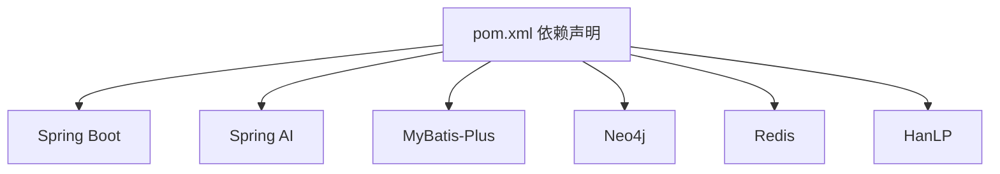

# 系统架构设计

<cite>
**本文引用的文件**
- [AIbotApplication.java](file://src/main/java/com/xdu/aibot/AIbotApplication.java)
- [GraphRagAdvisor.java](file://src/main/java/com/xdu/aibot/advisor/GraphRagAdvisor.java)
- [CommonConfiguration.java](file://src/main/java/com/xdu/aibot/config/CommonConfiguration.java)
- [MvcConfiguration.java](file://src/main/java/com/xdu/aibot/config/MvcConfiguration.java)
- [RedisMemoryConfig.java](file://src/main/java/com/xdu/aibot/config/RedisMemoryConfig.java)
- [CustomerServiceController.java](file://src/main/java/com/xdu/aibot/controller/CustomerServiceController.java)
- [PdfController.java](file://src/main/java/com/xdu/aibot/controller/PdfController.java)
- [ChatHistoryContoller.java](file://src/main/java/com/xdu/aibot/controller/ChatHistoryContoller.java)
- [GraphPdfFileRepository.java](file://src/main/java/com/xdu/aibot/repository/Impl/GraphPdfFileRepository.java)
- [PdfFileRepository.java](file://src/main/java/com/xdu/aibot/repository/Impl/PdfFileRepository.java)
- [ChatHistoryServiceImpl.java](file://src/main/java/com/xdu/aibot/service/impl/ChatHistoryServiceImpl.java)
- [ChatHistory.java](file://src/main/java/com/xdu/aibot/pojo/entity/ChatHistory.java)
- [ChatHistoryMapper.java](file://src/main/java/com/xdu/aibot/mapper/ChatHistoryMapper.java)
- [application.yaml](file://src/main/resources/application.yaml)
- [pom.xml](file://pom.xml)
</cite>

## 目录
1. [简介](#简介)
2. [项目结构](#项目结构)
3. [核心组件](#核心组件)
4. [架构总览](#架构总览)
5. [详细组件分析](#详细组件分析)
6. [依赖关系分析](#依赖关系分析)
7. [性能考量](#性能考量)
8. [故障排查指南](#故障排查指南)
9. [结论](#结论)
10. [附录](#附录)

## 简介
本系统是一个基于Spring Boot的AI增强对话应用，采用分层架构设计，结合Spring AI与向量存储、知识图谱以及Redis会话记忆能力，提供两类核心能力：
- 通用客服对话：通过工具函数与消息记忆实现上下文管理与工具调用。
- PDF问答对话：通过向量检索与图谱增强实现更精准的知识召回与回答。

系统通过控制器(Controller)接收请求，服务(Service)编排业务流程，仓储层(Repository)对接向量库与图数据库，配置类(Config)集中管理Bean与外部依赖，形成清晰的职责分离与可扩展的模块化结构。

## 项目结构
项目采用按功能域分层的组织方式，主要目录与职责如下：
- config：Spring配置与Bean装配，包括跨域、内存、向量存储、图数据库连接等。
- controller：HTTP接口层，暴露REST端点供前端或客户端调用。
- service：业务服务层，封装业务规则与流程编排。
- repository：数据访问层，抽象文件与聊天历史的持久化与检索。
- advisor：Spring AI顾问适配器，用于在对话链路中插入图谱增强与日志记录等横切逻辑。
- pojo/entity/mapper：数据模型与MyBatis映射，支撑聊天历史的持久化。
- resources：配置文件与静态资源。

图表来源
- [AIbotApplication.java:1-16](file://src/main/java/com/xdu/aibot/AIbotApplication.java#L1-L16)
- [CommonConfiguration.java:34-129](file://src/main/java/com/xdu/aibot/config/CommonConfiguration.java#L34-L129)
- [RedisMemoryConfig.java:8-26](file://src/main/java/com/xdu/aibot/config/RedisMemoryConfig.java#L8-L26)
- [MvcConfiguration.java:8-19](file://src/main/java/com/xdu/aibot/config/MvcConfiguration.java#L8-L19)
- [CustomerServiceController.java:14-35](file://src/main/java/com/xdu/aibot/controller/CustomerServiceController.java#L14-L35)
- [PdfController.java:26-98](file://src/main/java/com/xdu/aibot/controller/PdfController.java#L26-L98)
- [ChatHistoryContoller.java:14-39](file://src/main/java/com/xdu/aibot/controller/ChatHistoryContoller.java#L14-L39)
- [GraphPdfFileRepository.java:27-262](file://src/main/java/com/xdu/aibot/repository/Impl/GraphPdfFileRepository.java#L27-L262)
- [PdfFileRepository.java:28-109](file://src/main/java/com/xdu/aibot/repository/Impl/PdfFileRepository.java#L28-L109)
- [ChatHistoryServiceImpl.java:18-63](file://src/main/java/com/xdu/aibot/service/impl/ChatHistoryServiceImpl.java#L18-L63)

章节来源
- [AIbotApplication.java:1-16](file://src/main/java/com/xdu/aibot/AIbotApplication.java#L1-L16)
- [application.yaml:1-59](file://src/main/resources/application.yaml#L1-L59)
- [pom.xml:1-139](file://pom.xml#L1-L139)

## 核心组件
- 应用入口与扫描
  - 启动类启用自动装配与MyBatis Mapper扫描，作为Spring容器启动入口。
- 控制器层
  - 客服对话控制器：提供通用对话能力，支持工具函数与消息记忆。
  - PDF对话控制器：提供PDF上传、下载与问答能力，支持向量检索与图谱增强。
  - 历史记录控制器：提供会话ID与消息历史查询。
- 服务层
  - 聊天历史服务：基于MyBatis-Plus实现，负责会话记录的增删查。
- 仓储层
  - 图谱增强PDF仓储：对接向量库与Neo4j，负责PDF解析、嵌入、知识抽取与图谱构建。
  - 简易PDF仓储：对接简单向量存储，负责PDF解析与嵌入。
- 配置与基础设施
  - 通用配置：构建ChatClient、向量存储、Neo4j连接、Redis会话记忆等。
  - Redis会话记忆配置：提供Redis连接参数并注册会话记忆仓库。
  - MVC配置：全局跨域设置。
- Spring AI顾问适配器
  - 图谱增强顾问：在对话链路中抽取关键词、查询图谱、拼接关系信息并注入到最终提示词。

章节来源
- [AIbotApplication.java:7-16](file://src/main/java/com/xdu/aibot/AIbotApplication.java#L7-L16)
- [CustomerServiceController.java:18-35](file://src/main/java/com/xdu/aibot/controller/CustomerServiceController.java#L18-L35)
- [PdfController.java:32-98](file://src/main/java/com/xdu/aibot/controller/PdfController.java#L32-L98)
- [ChatHistoryContoller.java:18-39](file://src/main/java/com/xdu/aibot/controller/ChatHistoryContoller.java#L18-L39)
- [ChatHistoryServiceImpl.java:18-63](file://src/main/java/com/xdu/aibot/service/impl/ChatHistoryServiceImpl.java#L18-L63)
- [GraphPdfFileRepository.java:27-262](file://src/main/java/com/xdu/aibot/repository/Impl/GraphPdfFileRepository.java#L27-L262)
- [PdfFileRepository.java:28-109](file://src/main/java/com/xdu/aibot/repository/Impl/PdfFileRepository.java#L28-L109)
- [CommonConfiguration.java:34-129](file://src/main/java/com/xdu/aibot/config/CommonConfiguration.java#L34-L129)
- [RedisMemoryConfig.java:8-26](file://src/main/java/com/xdu/aibot/config/RedisMemoryConfig.java#L8-L26)
- [MvcConfiguration.java:8-19](file://src/main/java/com/xdu/aibot/config/MvcConfiguration.java#L8-L19)
- [GraphRagAdvisor.java:18-149](file://src/main/java/com/xdu/aibot/advisor/GraphRagAdvisor.java#L18-L149)

## 架构总览
系统采用经典的三层架构（Controller-Service-Repository），并引入Spring AI的顾问适配器模式在对话链路中进行横切增强。整体交互流程如下：

图表来源
- [CommonConfiguration.java:74-127](file://src/main/java/com/xdu/aibot/config/CommonConfiguration.java#L74-L127)
- [GraphRagAdvisor.java:38-136](file://src/main/java/com/xdu/aibot/advisor/GraphRagAdvisor.java#L38-L136)
- [GraphPdfFileRepository.java:115-177](file://src/main/java/com/xdu/aibot/repository/Impl/GraphPdfFileRepository.java#L115-L177)
- [PdfController.java:42-55](file://src/main/java/com/xdu/aibot/controller/PdfController.java#L42-L55)

## 详细组件分析

### 控制器层
- 客服对话控制器
  - 注入通用ChatClient与聊天历史仓储，支持通过参数传递会话ID，将对话类型与会话ID写入历史。
  - 通过顾问参数注入会话ID，实现消息记忆与上下文保持。
- PDF对话控制器
  - 注入图谱增强PDF仓储与聊天历史仓储；提供上传、下载与问答接口。
  - 在问答时动态设置过滤表达式，限定仅检索当前文件的内容。
- 历史记录控制器
  - 提供按类型查询会话ID列表与按类型+会话ID查询消息历史。

图表来源
- [CustomerServiceController.java:18-35](file://src/main/java/com/xdu/aibot/controller/CustomerServiceController.java#L18-L35)
- [PdfController.java:32-98](file://src/main/java/com/xdu/aibot/controller/PdfController.java#L32-L98)
- [ChatHistoryContoller.java:18-39](file://src/main/java/com/xdu/aibot/controller/ChatHistoryContoller.java#L18-L39)
- [ChatHistoryServiceImpl.java:18-63](file://src/main/java/com/xdu/aibot/service/impl/ChatHistoryServiceImpl.java#L18-L63)

章节来源
- [CustomerServiceController.java:18-35](file://src/main/java/com/xdu/aibot/controller/CustomerServiceController.java#L18-L35)
- [PdfController.java:32-98](file://src/main/java/com/xdu/aibot/controller/PdfController.java#L32-L98)
- [ChatHistoryContoller.java:18-39](file://src/main/java/com/xdu/aibot/controller/ChatHistoryContoller.java#L18-L39)

### 服务层
- 聊天历史服务
  - 基于MyBatis-Plus的ServiceImpl，实现按类型查询会话ID列表与保存会话记录。
  - 使用Lambda查询包装器进行条件查询，避免重复SQL。

图表来源
- [ChatHistoryServiceImpl.java:18-63](file://src/main/java/com/xdu/aibot/service/impl/ChatHistoryServiceImpl.java#L18-L63)
- [ChatHistoryMapper.java:1-10](file://src/main/java/com/xdu/aibot/mapper/ChatHistoryMapper.java#L1-L10)
- [ChatHistory.java:8-23](file://src/main/java/com/xdu/aibot/pojo/entity/ChatHistory.java#L8-L23)

章节来源
- [ChatHistoryServiceImpl.java:18-63](file://src/main/java/com/xdu/aibot/service/impl/ChatHistoryServiceImpl.java#L18-L63)
- [ChatHistoryMapper.java:1-10](file://src/main/java/com/xdu/aibot/mapper/ChatHistoryMapper.java#L1-L10)
- [ChatHistory.java:8-23](file://src/main/java/com/xdu/aibot/pojo/entity/ChatHistory.java#L8-L23)

### 仓储层
- 图谱增强PDF仓储
  - 负责PDF本地备份、分页解析、向量嵌入写入、调用Python微服务抽取实体关系、写入Neo4j图谱。
  - 通过RestTemplate调用外部IE服务，解析返回并写入图数据库，同时维护SourceFile与实体节点及关系。
- 简易PDF仓储
  - 负责PDF本地备份、分页解析、向量嵌入写入，并在应用启动时从JSON恢复向量存储，在销毁时持久化。

图表来源
- [GraphPdfFileRepository.java:42-177](file://src/main/java/com/xdu/aibot/repository/Impl/GraphPdfFileRepository.java#L42-L177)

章节来源
- [GraphPdfFileRepository.java:27-262](file://src/main/java/com/xdu/aibot/repository/Impl/GraphPdfFileRepository.java#L27-L262)
- [PdfFileRepository.java:28-109](file://src/main/java/com/xdu/aibot/repository/Impl/PdfFileRepository.java#L28-L109)

### 配置与基础设施
- 通用配置
  - 构建向量存储（Simple与Neo4j）、Neo4j驱动、ChatClient（含默认顾问：日志、消息记忆、工具、图谱增强等）。
  - 注入Redis会话记忆仓库，限制消息窗口大小。
- Redis会话记忆配置
  - 从配置文件读取Redis连接参数，构建会话记忆仓库。
- MVC配置
  - 全局跨域设置，允许所有来源与方法。

图表来源
- [CommonConfiguration.java:34-129](file://src/main/java/com/xdu/aibot/config/CommonConfiguration.java#L34-L129)
- [RedisMemoryConfig.java:8-26](file://src/main/java/com/xdu/aibot/config/RedisMemoryConfig.java#L8-L26)
- [MvcConfiguration.java:8-19](file://src/main/java/com/xdu/aibot/config/MvcConfiguration.java#L8-L19)

章节来源
- [CommonConfiguration.java:34-129](file://src/main/java/com/xdu/aibot/config/CommonConfiguration.java#L34-L129)
- [RedisMemoryConfig.java:8-26](file://src/main/java/com/xdu/aibot/config/RedisMemoryConfig.java#L8-L26)
- [MvcConfiguration.java:8-19](file://src/main/java/com/xdu/aibot/config/MvcConfiguration.java#L8-L19)

### Spring AI顾问适配器
- 图谱增强顾问
  - 在对话请求进入后，从上下文获取检索到的文档，提取chatId与用户问题。
  - 使用中文分词与词性过滤提取关键词，查询Neo4j图谱，拼接关系信息并注入最终提示词。
  - 设置执行顺序，确保在QuestionAnswerAdvisor之后执行，且在自定义拦截器之前。

图表来源
- [GraphRagAdvisor.java:38-136](file://src/main/java/com/xdu/aibot/advisor/GraphRagAdvisor.java#L38-L136)

章节来源
- [GraphRagAdvisor.java:18-149](file://src/main/java/com/xdu/aibot/advisor/GraphRagAdvisor.java#L18-L149)

## 依赖关系分析
系统依赖关系围绕Spring Boot、Spring AI、MyBatis-Plus、Neo4j与Redis展开，关键依赖如下：
- Spring Boot Starter：Web、Redis、MySQL驱动、测试。
- Spring AI：OpenAI/DashScope模型、向量存储、PDF文档读取、顾问适配器、Neo4j向量存储。
- MyBatis-Plus：简化数据库操作。
- Neo4j：图数据库与Java驱动。
- HanLP：中文分词与词性标注。

图表来源
- [pom.xml:33-116](file://pom.xml#L33-L116)

章节来源
- [pom.xml:1-139](file://pom.xml#L1-L139)

## 性能考量
- 向量检索与图谱查询
  - 通过限制相似度阈值与TopK数量控制召回规模，减少LLM推理负担。
  - 图谱查询限制返回条数，避免过长的关系列表影响性能。
- 文档分页与批处理
  - PDF按页拆分，降低单次嵌入维度与LLM输入长度。
  - 向量存储支持批处理策略，提升写入效率。
- 会话记忆窗口
  - 限制消息窗口大小，避免上下文过长导致延迟与成本上升。
- 缓存与持久化
  - Redis会话记忆减少重复检索，简易向量存储在应用重启时持久化/恢复，保证可用性。

## 故障排查指南
- PDF上传失败
  - 检查文件类型是否为PDF，确认文件路径与权限；查看向量存储写入异常日志。
- 图谱构建失败
  - 检查Python IE服务地址与连通性，确认返回数据结构；查看Neo4j写入异常日志。
- 会话历史查询为空
  - 确认会话ID是否正确传入，检查数据库中是否存在对应记录。
- 跨域问题
  - 检查全局跨域配置是否生效，确认请求头与方法是否在允许范围内。

章节来源
- [PdfController.java:60-98](file://src/main/java/com/xdu/aibot/controller/PdfController.java#L60-L98)
- [GraphPdfFileRepository.java:115-177](file://src/main/java/com/xdu/aibot/repository/Impl/GraphPdfFileRepository.java#L115-L177)
- [ChatHistoryServiceImpl.java:24-41](file://src/main/java/com/xdu/aibot/service/impl/ChatHistoryServiceImpl.java#L24-L41)
- [MvcConfiguration.java:11-17](file://src/main/java/com/xdu/aibot/config/MvcConfiguration.java#L11-L17)

## 结论
本系统通过清晰的分层架构与Spring AI顾问适配器模式，实现了从PDF解析、向量检索到图谱增强的完整RAG流程，并结合Redis会话记忆与MyBatis-Plus实现高效的历史管理。配置类集中管理外部依赖，控制器层提供简洁的REST接口，具备良好的可扩展性与可维护性。未来可在以下方面持续优化：引入异步任务处理大文档、增加缓存层减少重复计算、完善监控与告警体系。

## 附录
- 系统边界
  - 内部：Spring Boot应用、Spring AI、MyBatis-Plus、Redis、MySQL。
  - 外部：DashScope/OpenAI、Neo4j、Python IE服务、浏览器/客户端。
- 关键Bean与作用
  - ChatClient（服务型与PDF型）：统一对话入口，内置顾问链。
  - VectorStore（Simple与Neo4j）：文档嵌入与检索。
  - Redis会话记忆：上下文持久化与复用。
  - GraphRagAdvisor：图谱增强与提示词注入。