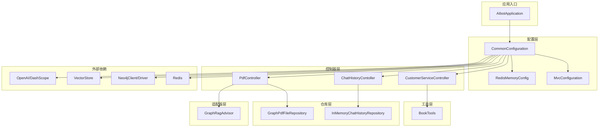
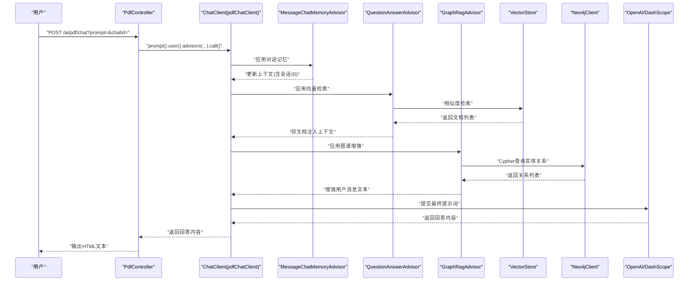
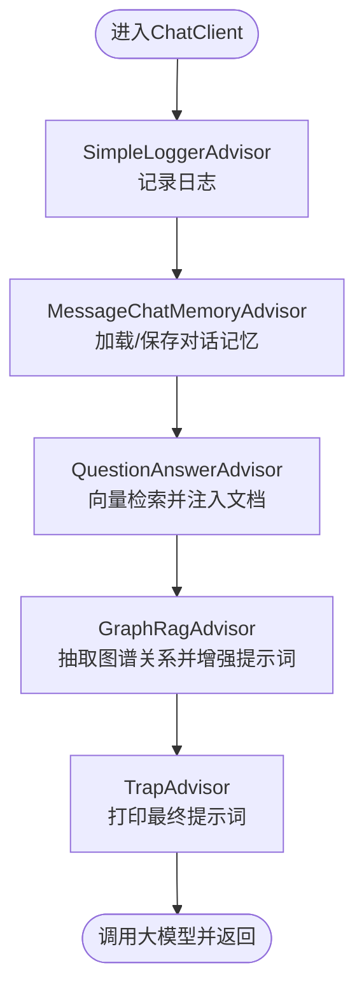
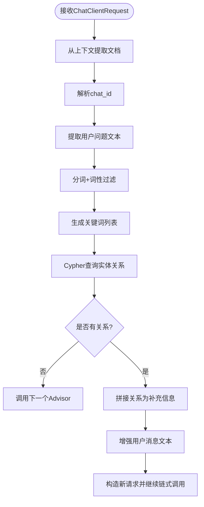
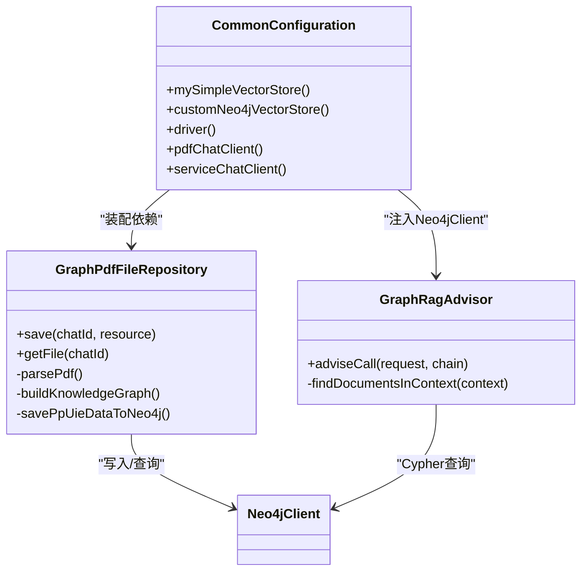
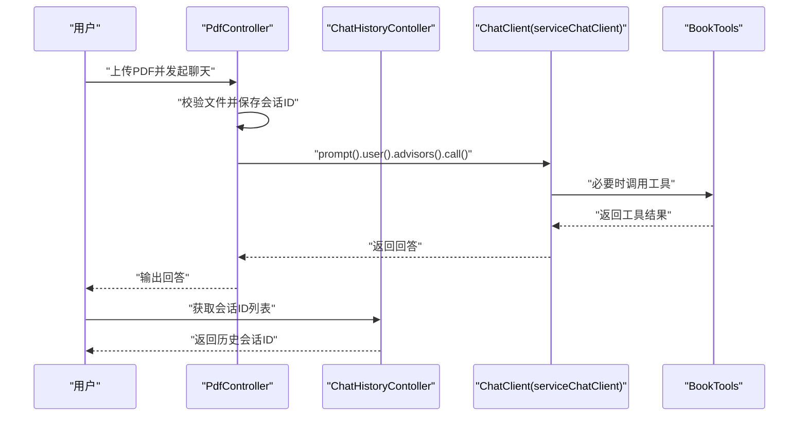
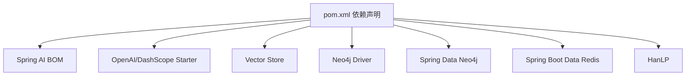

# 组件交互关系

<cite>
**本文引用的文件**
- [AIbotApplication.java](file://src/main/java/com/xdu/aibot/AIbotApplication.java)
- [CommonConfiguration.java](file://src/main/java/com/xdu/aibot/config/CommonConfiguration.java)
- [RedisMemoryConfig.java](file://src/main/java/com/xdu/aibot/config/RedisMemoryConfig.java)
- [MvcConfiguration.java](file://src/main/java/com/xdu/aibot/config/MvcConfiguration.java)
- [GraphRagAdvisor.java](file://src/main/java/com/xdu/aibot/advisor/GraphRagAdvisor.java)
- [BookTools.java](file://src/main/java/com/xdu/aibot/tools/BookTools.java)
- [PdfController.java](file://src/main/java/com/xdu/aibot/controller/PdfController.java)
- [CustomerServiceController.java](file://src/main/java/com/xdu/aibot/controller/CustomerServiceController.java)
- [ChatHistoryContoller.java](file://src/main/java/com/xdu/aibot/controller/ChatHistoryContoller.java)
- [GraphPdfFileRepository.java](file://src/main/java/com/xdu/aibot/repository/Impl/GraphPdfFileRepository.java)
- [InMemoryChatHistoryRepository.java](file://src/main/java/com/xdu/aibot/repository/Impl/InMemoryChatHistoryRepository.java)
- [ChatType.java](file://src/main/java/com/xdu/aibot/constant/ChatType.java)
- [application.yaml](file://src/main/resources/application.yaml)
- [pom.xml](file://pom.xml)
</cite>

## 目录
1. [简介](#简介)
2. [项目结构](#项目结构)
3. [核心组件](#核心组件)
4. [架构总览](#架构总览)
5. [详细组件分析](#详细组件分析)
6. [依赖分析](#依赖分析)
7. [性能考虑](#性能考虑)
8. [故障排查指南](#故障排查指南)
9. [结论](#结论)
10. [附录](#附录)

## 简介
本文件聚焦于AIbot系统中组件的交互关系与协作机制，重点覆盖以下方面：
- ChatClient及其Advisor链式调用顺序与职责分工
- GraphRagAdvisor与QuestionAnswerAdvisor、MessageChatMemoryAdvisor的协同
- VectorStore与Neo4jClient在检索增强与知识图谱增强中的角色
- 依赖注入关系与生命周期管理
- 数据在组件间的流转过程与时序图
- 组件扩展与自定义的指导原则

## 项目结构
AIbot采用Spring Boot工程，按功能域分层组织，核心模块包括：
- 配置层：CommonConfiguration、RedisMemoryConfig、MvcConfiguration
- 控制器层：PdfController、CustomerServiceController、ChatHistoryContoller
- 适配器层：GraphRagAdvisor
- 工具层：BookTools
- 仓库层：GraphPdfFileRepository、InMemoryChatHistoryRepository
- 常量与资源：ChatType、application.yaml
- 应用入口：AIbotApplication

图表来源
- [AIbotApplication.java:1-16](file://src/main/java/com/xdu/aibot/AIbotApplication.java#L1-L16)
- [CommonConfiguration.java:34-128](file://src/main/java/com/xdu/aibot/config/CommonConfiguration.java#L34-L128)
- [RedisMemoryConfig.java:8-26](file://src/main/java/com/xdu/aibot/config/RedisMemoryConfig.java#L8-L26)
- [MvcConfiguration.java:8-18](file://src/main/java/com/xdu/aibot/config/MvcConfiguration.java#L8-L18)
- [PdfController.java:26-55](file://src/main/java/com/xdu/aibot/controller/PdfController.java#L26-L55)
- [CustomerServiceController.java:14-35](file://src/main/java/com/xdu/aibot/controller/CustomerServiceController.java#L14-L35)
- [ChatHistoryContoller.java:14-39](file://src/main/java/com/xdu/aibot/controller/ChatHistoryContoller.java#L14-L39)
- [GraphPdfFileRepository.java:27-262](file://src/main/java/com/xdu/aibot/repository/Impl/GraphPdfFileRepository.java#L27-L262)
- [GraphRagAdvisor.java:18-149](file://src/main/java/com/xdu/aibot/advisor/GraphRagAdvisor.java#L18-L149)
- [BookTools.java:22-127](file://src/main/java/com/xdu/aibot/tools/BookTools.java#L22-L127)
- [InMemoryChatHistoryRepository.java:12-30](file://src/main/java/com/xdu/aibot/repository/Impl/InMemoryChatHistoryRepository.java#L12-L30)

章节来源
- [AIbotApplication.java:1-16](file://src/main/java/com/xdu/aibot/AIbotApplication.java#L1-L16)
- [CommonConfiguration.java:34-128](file://src/main/java/com/xdu/aibot/config/CommonConfiguration.java#L34-L128)
- [application.yaml:1-59](file://src/main/resources/application.yaml#L1-L59)

## 核心组件
- ChatClient：统一的对话客户端，负责组装提示词、应用Advisor链、调用大模型并返回结果。
- MessageChatMemoryAdvisor：维护对话记忆，基于Redis存储，控制消息窗口大小。
- QuestionAnswerAdvisor：基于VectorStore进行相似度检索，将检索到的文档注入上下文。
- GraphRagAdvisor：在QuestionAnswerAdvisor之后执行，利用Neo4jClient从知识图谱抽取关系，增强用户问题文本后继续链式调用。
- VectorStore：向量检索存储，支持Neo4j向量索引与简单内存向量存储。
- Neo4jClient/Driver：连接Neo4j数据库，执行Cypher查询与Schema初始化。
- RedissonRedisChatMemoryRepository：Redis聊天记忆仓库实现。
- GraphPdfFileRepository：PDF解析、向量入库、调用Python微服务抽取实体关系并写入Neo4j。
- BookTools：面向图书查询与预约的工具集，用于服务场景的工具调用。

章节来源
- [CommonConfiguration.java:74-127](file://src/main/java/com/xdu/aibot/config/CommonConfiguration.java#L74-L127)
- [GraphRagAdvisor.java:18-149](file://src/main/java/com/xdu/aibot/advisor/GraphRagAdvisor.java#L18-L149)
- [GraphPdfFileRepository.java:27-262](file://src/main/java/com/xdu/aibot/repository/Impl/GraphPdfFileRepository.java#L27-L262)
- [BookTools.java:22-127](file://src/main/java/com/xdu/aibot/tools/BookTools.java#L22-L127)

## 架构总览
AIbot通过配置类装配多个ChatClient实例，分别服务于“服务咨询”和“PDF问答”两大场景。每个ChatClient默认绑定若干Advisor，形成链式调用。PDF问答场景下，Advisor链包含日志、记忆、向量检索、图谱增强等步骤；服务咨询场景下，使用工具（BookTools）增强对话能力。

图表来源
- [PdfController.java:42-55](file://src/main/java/com/xdu/aibot/controller/PdfController.java#L42-L55)
- [CommonConfiguration.java:90-127](file://src/main/java/com/xdu/aibot/config/CommonConfiguration.java#L90-L127)
- [GraphRagAdvisor.java:38-136](file://src/main/java/com/xdu/aibot/advisor/GraphRagAdvisor.java#L38-L136)

## 详细组件分析

### ChatClient与Advisor链式调用
- 默认Advisor顺序（以pdfChatClient为例）：
  1) SimpleLoggerAdvisor：记录请求/响应日志
  2) MessageChatMemoryAdvisor：从Redis加载/保存对话记忆，限制消息数量
  3) QuestionAnswerAdvisor：基于VectorStore检索文档，注入上下文
  4) GraphRagAdvisor：基于Neo4jClient抽取图谱关系，增强用户消息
  5) 自定义TrapAdvisor：打印最终增强后的提示词
- 执行顺序由Advisor的order决定，GraphRagAdvisor必须在QuestionAnswerAdvisor之后执行，以确保其能读取到检索到的文档上下文。

图表来源
- [CommonConfiguration.java:96-125](file://src/main/java/com/xdu/aibot/config/CommonConfiguration.java#L96-L125)
- [GraphRagAdvisor.java:32-36](file://src/main/java/com/xdu/aibot/advisor/GraphRagAdvisor.java#L32-L36)

章节来源
- [CommonConfiguration.java:74-127](file://src/main/java/com/xdu/aibot/config/CommonConfiguration.java#L74-L127)
- [GraphRagAdvisor.java:18-149](file://src/main/java/com/xdu/aibot/advisor/GraphRagAdvisor.java#L18-L149)

### GraphRagAdvisor工作机制
- 输入：ChatClientRequest（包含Prompt与上下文）
- 关键步骤：
  1) 从上下文中提取文档（兼容多种Key）
  2) 从文档元数据中解析chat_id
  3) 对用户问题进行分词与关键词过滤（保留名词相关词汇）
  4) Cypher查询：基于SourceFile与关键词锚点，抽取一跳邻居关系
  5) 将关系拼接为补充信息，追加到用户消息末尾
  6) 构造新的ChatClientRequest并传递给下一个Advisor
- 依赖：Neo4jClient、HanLP分词库

图表来源
- [GraphRagAdvisor.java:38-136](file://src/main/java/com/xdu/aibot/advisor/GraphRagAdvisor.java#L38-L136)

章节来源
- [GraphRagAdvisor.java:18-149](file://src/main/java/com/xdu/aibot/advisor/GraphRagAdvisor.java#L18-L149)

### VectorStore与Neo4jClient集成
- VectorStore装配：
  - mySimpleVectorStore：基于OpenAiEmbeddingModel的内存向量存储
  - customNeo4jVectorStore：Neo4j向量索引，支持Cosine距离、自定义索引名、批处理策略等
- Neo4jClient/Driver：
  - 通过CommonConfiguration创建Driver与Neo4jClient
  - GraphPdfFileRepository负责将PDF解析为Document并写入Neo4j向量存储
  - GraphRagAdvisor使用Neo4jClient执行Cypher查询，抽取图谱关系

图表来源
- [CommonConfiguration.java:47-70](file://src/main/java/com/xdu/aibot/config/CommonConfiguration.java#L47-L70)
- [GraphPdfFileRepository.java:31-36](file://src/main/java/com/xdu/aibot/repository/Impl/GraphPdfFileRepository.java#L31-L36)
- [GraphRagAdvisor.java:21-25](file://src/main/java/com/xdu/aibot/advisor/GraphRagAdvisor.java#L21-L25)

章节来源
- [CommonConfiguration.java:47-70](file://src/main/java/com/xdu/aibot/config/CommonConfiguration.java#L47-L70)
- [GraphPdfFileRepository.java:27-262](file://src/main/java/com/xdu/aibot/repository/Impl/GraphPdfFileRepository.java#L27-L262)

### 控制器与组件交互
- PdfController：
  - 校验文件存在性，保存会话历史，调用pdfChatClient进行问答
  - 支持动态过滤表达式（按文件名过滤）
- CustomerServiceController：
  - 调用serviceChatClient，内置BookTools工具
- ChatHistoryContoller：
  - 通过ChatMemory获取历史消息，结合InMemoryChatHistoryRepository记录会话ID

图表来源
- [PdfController.java:42-55](file://src/main/java/com/xdu/aibot/controller/PdfController.java#L42-L55)
- [CustomerServiceController.java:25-33](file://src/main/java/com/xdu/aibot/controller/CustomerServiceController.java#L25-L33)
- [ChatHistoryContoller.java:25-37](file://src/main/java/com/xdu/aibot/controller/ChatHistoryContoller.java#L25-L37)
- [BookTools.java:22-127](file://src/main/java/com/xdu/aibot/tools/BookTools.java#L22-L127)

章节来源
- [PdfController.java:26-98](file://src/main/java/com/xdu/aibot/controller/PdfController.java#L26-L98)
- [CustomerServiceController.java:14-35](file://src/main/java/com/xdu/aibot/controller/CustomerServiceController.java#L14-L35)
- [ChatHistoryContoller.java:14-39](file://src/main/java/com/xdu/aibot/controller/ChatHistoryContoller.java#L14-L39)

### 组件扩展与自定义指导
- 新增Advisor：
  - 实现CallAdvisor接口，设置合适的order，避免破坏现有顺序
  - 在CommonConfiguration中注册到目标ChatClient的defaultAdvisors
- 替换/扩展VectorStore：
  - 可替换为其他实现（如自定义Neo4j向量存储），保持SearchRequest参数一致
  - 更新GraphRagAdvisor中对上下文Key的兼容逻辑
- 图谱增强策略：
  - 可调整Cypher查询与关键词过滤规则，提升关系抽取质量
  - 结合业务Schema定制标签与关系命名
- 工具扩展：
  - 通过@Tool注解声明工具方法，注入到ChatClient的defaultTools
  - 工具内部可组合业务服务，实现复杂流程

章节来源
- [CommonConfiguration.java:90-127](file://src/main/java/com/xdu/aibot/config/CommonConfiguration.java#L90-L127)
- [GraphRagAdvisor.java:32-36](file://src/main/java/com/xdu/aibot/advisor/GraphRagAdvisor.java#L32-L36)
- [BookTools.java:22-127](file://src/main/java/com/xdu/aibot/tools/BookTools.java#L22-L127)

## 依赖分析
- 外部依赖：
  - Spring AI（OpenAI/DashScope模型、向量存储、Advisor链）
  - Neo4j（驱动与Spring Data Neo4j）
  - Redis（会话记忆）
  - HanLP（中文分词）
- 内部依赖：
  - ChatClient依赖Advisor、VectorStore、Neo4jClient、Redis仓库
  - GraphPdfFileRepository依赖VectorStore与Neo4jClient
  - 控制器依赖ChatClient与仓库层

图表来源
- [pom.xml:33-116](file://pom.xml#L33-L116)

章节来源
- [pom.xml:1-139](file://pom.xml#L1-L139)

## 性能考虑
- 向量检索：
  - 调整SimilarityThreshold与TopK，平衡召回与性能
  - 使用TokenCountBatchingStrategy减少嵌入调用次数
- 图谱查询：
  - Cypher查询限制返回条数，避免过长关系列表
  - 关键词过滤减少无关实体匹配
- 记忆管理：
  - 控制MessageWindowChatMemory的最大消息数，降低上下文长度
- 缓存与并发：
  - Redis连接池参数需结合实际负载调优
  - PDF解析与图谱构建可异步化，避免阻塞请求线程

## 故障排查指南
- 无法加载PDF或无回答：
  - 检查文件上传与GraphPdfFileRepository写入是否成功
  - 确认向量库索引初始化与数据写入
- 图谱增强无效：
  - 检查GraphRagAdvisor上下文Key是否存在
  - 核对chat_id与SourceFile节点是否建立
- 记忆丢失：
  - 检查Redis连接参数与会话ID传递
  - 确认MessageChatMemoryAdvisor的会话ID参数是否正确传入
- 日志定位：
  - 开启Spring AI与Neo4j驱动的日志级别，观察Advisor链执行情况

章节来源
- [GraphPdfFileRepository.java:41-70](file://src/main/java/com/xdu/aibot/repository/Impl/GraphPdfFileRepository.java#L41-L70)
- [GraphRagAdvisor.java:138-148](file://src/main/java/com/xdu/aibot/advisor/GraphRagAdvisor.java#L138-L148)
- [application.yaml:52-59](file://src/main/resources/application.yaml#L52-L59)

## 结论
AIbot通过可插拔的Advisor链实现了灵活的检索增强与知识图谱增强，结合Redis记忆与工具调用，满足多场景对话需求。GraphRagAdvisor在QuestionAnswerAdvisor之后执行，确保图谱增强基于真实检索结果，提升了回答的准确性与可解释性。通过合理的依赖注入与配置管理，系统具备良好的扩展性与可维护性。

## 附录
- 环境与配置要点：
  - OpenAI/DashScope模型与嵌入维度配置
  - Neo4j连接参数与向量索引初始化
  - Redis连接参数与会话记忆仓库
- 常见问题：
  - API密钥与代理配置
  - PDF解析与Python微服务通信
  - CORS跨域与静态资源访问

章节来源
- [application.yaml:1-59](file://src/main/resources/application.yaml#L1-L59)
- [MvcConfiguration.java:8-18](file://src/main/java/com/xdu/aibot/config/MvcConfiguration.java#L8-L18)