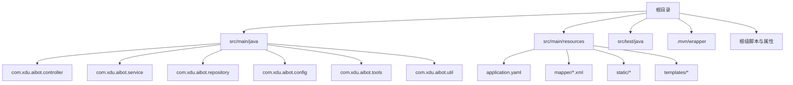
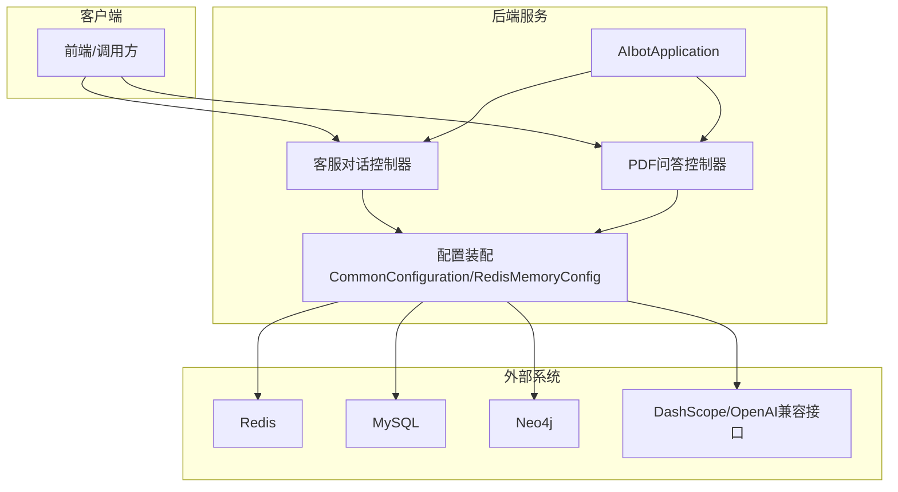
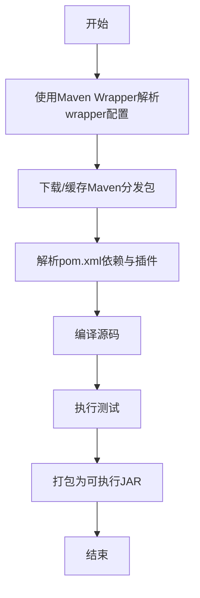
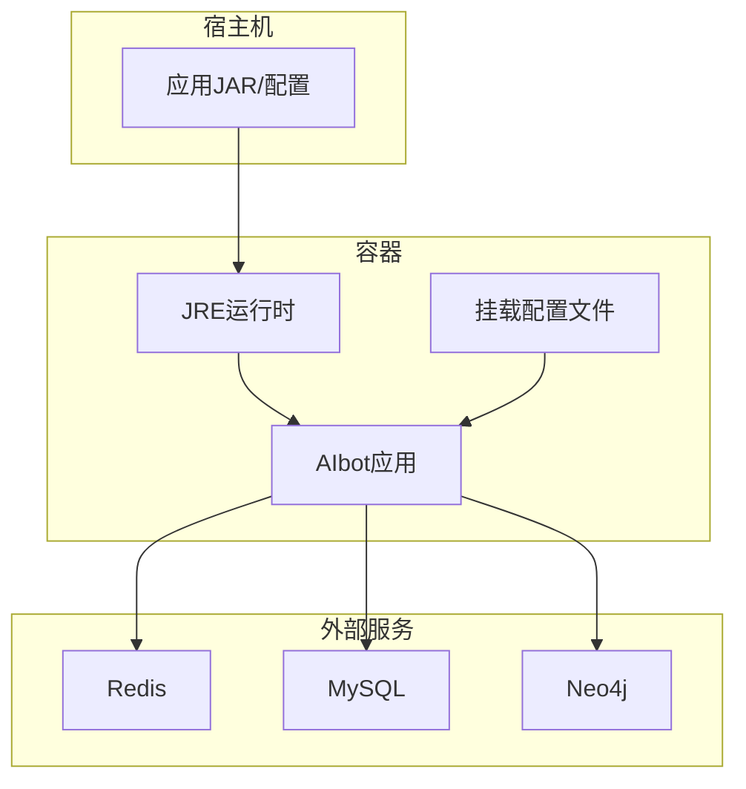

# 构建与部署

<cite>
**本文引用的文件**
- [pom.xml](file://pom.xml)
- [mvnw.cmd](file://mvnw.cmd)
- [.mvn/wrapper/maven-wrapper.properties](file://.mvn/wrapper/maven-wrapper.properties)
- [AIbotApplication.java](file://src/main/java/com/xdu/aibot/AIbotApplication.java)
- [application.yaml](file://src/main/resources/application.yaml)
- [CommonConfiguration.java](file://src/main/java/com/xdu/aibot/config/CommonConfiguration.java)
- [RedisMemoryConfig.java](file://src/main/java/com/xdu/aibot/config/RedisMemoryConfig.java)
- [CustomerServiceController.java](file://src/main/java/com/xdu/aibot/controller/CustomerServiceController.java)
- [PdfController.java](file://src/main/java/com/xdu/aibot/controller/PdfController.java)
- [AIbotApplicationTests.java](file://src/test/java/com/xdu/aibot/AIbotApplicationTests.java)
- [.gitignore](file://.gitignore)
- [chat-pdf.properties](file://chat-pdf.properties)
</cite>

## 目录
1. [简介](#简介)
2. [项目结构](#项目结构)
3. [核心组件](#核心组件)
4. [架构总览](#架构总览)
5. [详细组件分析](#详细组件分析)
6. [依赖分析](#依赖分析)
7. [性能考虑](#性能考虑)
8. [故障排查指南](#故障排查指南)
9. [结论](#结论)
10. [附录](#附录)

## 简介
本文件面向AIbot项目的构建与部署，覆盖以下主题：
- Maven构建流程：依赖下载、编译打包、测试执行
- 本地开发环境启动、热部署与调试模式
- 容器化部署：Dockerfile与docker-compose.yml建议
- 云平台部署：阿里云、AWS等平台的部署思路与CI/CD流水线建议
- 版本管理与发布流程规范

## 项目结构
AIbot是一个基于Spring Boot 3.x与Spring AI的RAG应用，采用模块化分层设计，主要目录与职责如下：
- src/main/java：后端源码，按功能域划分包（controller、service、repository、config、tools、util）
- src/main/resources：配置文件与静态资源
- src/test/java：单元与集成测试
- .mvn/wrapper：Maven Wrapper配置，确保团队统一构建工具版本
- 根目录：构建脚本与属性文件

图表来源
- [AIbotApplication.java:1-16](file://src/main/java/com/xdu/aibot/AIbotApplication.java#L1-L16)
- [application.yaml:1-59](file://src/main/resources/application.yaml#L1-L59)

章节来源
- [AIbotApplication.java:1-16](file://src/main/java/com/xdu/aibot/AIbotApplication.java#L1-L16)
- [application.yaml:1-59](file://src/main/resources/application.yaml#L1-L59)

## 核心组件
- 应用入口：Spring Boot启动类负责扫描组件与启动Web容器
- 配置层：统一在application.yaml中定义数据库、缓存、AI服务、日志级别等
- 控制器层：对外提供REST接口，分别支持客服对话与PDF问答
- 配置装配：通过CommonConfiguration与RedisMemoryConfig注入AI客户端、向量存储与聊天记忆

章节来源
- [AIbotApplication.java:1-16](file://src/main/java/com/xdu/aibot/AIbotApplication.java#L1-L16)
- [application.yaml:1-59](file://src/main/resources/application.yaml#L1-L59)
- [CommonConfiguration.java:1-129](file://src/main/java/com/xdu/aibot/config/CommonConfiguration.java#L1-L129)
- [RedisMemoryConfig.java:1-26](file://src/main/java/com/xdu/aibot/config/RedisMemoryConfig.java#L1-L26)
- [CustomerServiceController.java:1-35](file://src/main/java/com/xdu/aibot/controller/CustomerServiceController.java#L1-L35)
- [PdfController.java:1-98](file://src/main/java/com/xdu/aibot/controller/PdfController.java#L1-L98)

## 架构总览
AIbot采用“Spring Boot + Spring AI + 向量存储 + 图数据库 + 缓存”的技术栈，核心交互链路如下：

图表来源
- [application.yaml:1-59](file://src/main/resources/application.yaml#L1-L59)
- [CommonConfiguration.java:1-129](file://src/main/java/com/xdu/aibot/config/CommonConfiguration.java#L1-L129)
- [RedisMemoryConfig.java:1-26](file://src/main/java/com/xdu/aibot/config/RedisMemoryConfig.java#L1-L26)
- [CustomerServiceController.java:1-35](file://src/main/java/com/xdu/aibot/controller/CustomerServiceController.java#L1-L35)
- [PdfController.java:1-98](file://src/main/java/com/xdu/aibot/controller/PdfController.java#L1-L98)

## 详细组件分析

### Maven构建流程
- 依赖下载：使用Maven Wrapper自动下载并缓存指定版本的Maven分发包，避免团队成员手工安装
- 编译打包：通过Spring Boot Maven插件生成可执行JAR
- 测试执行：运行JUnit测试套件，覆盖嵌入式向量计算、Neo4j连通性与OpenAI模型调用

图表来源
- [mvnw.cmd:59-189](file://mvnw.cmd#L59-L189)
- [.mvn/wrapper/maven-wrapper.properties:1-4](file://.mvn/wrapper/maven-wrapper.properties#L1-L4)
- [pom.xml:129-136](file://pom.xml#L129-L136)
- [AIbotApplicationTests.java:1-104](file://src/test/java/com/xdu/aibot/AIbotApplicationTests.java#L1-L104)

章节来源
- [mvnw.cmd:59-189](file://mvnw.cmd#L59-L189)
- [.mvn/wrapper/maven-wrapper.properties:1-4](file://.mvn/wrapper/maven-wrapper.properties#L1-L4)
- [pom.xml:129-136](file://pom.xml#L129-L136)
- [AIbotApplicationTests.java:1-104](file://src/test/java/com/xdu/aibot/AIbotApplicationTests.java#L1-L104)

### 本地开发环境启动
- 启动方式：直接运行Spring Boot主类或使用Maven Wrapper执行打包后的JAR
- 环境变量：通过配置文件中的占位符注入API密钥与数据库连接信息
- 日志级别：已在配置中开启调试级别，便于定位AI与数据库交互问题

章节来源
- [AIbotApplication.java:1-16](file://src/main/java/com/xdu/aibot/AIbotApplication.java#L1-L16)
- [application.yaml:1-59](file://src/main/resources/application.yaml#L1-L59)

### 热部署与调试模式
- 热部署：可在IDE中启用开发者工具或使用Spring Boot DevTools以实现类变更自动重启
- 调试模式：通过IDE远程调试或在启动参数中添加调试选项进行断点调试

[本节为通用实践说明，不直接分析具体文件]

### Docker容器化部署（建议）
以下为容器化部署的参考方案，需结合实际环境调整镜像基础、端口映射与卷挂载。

说明
- 基础镜像：建议使用官方JRE镜像作为基础
- 挂载策略：将application.yaml与静态资源挂载到容器内对应路径
- 端口暴露：根据实际监听端口进行映射
- 环境变量：通过容器环境变量注入敏感配置（如API密钥）

[本图为概念性容器化示意，不直接映射到具体源文件]

### 云平台部署与CI/CD（建议）
- 阿里云：可使用云效流水线，结合镜像仓库与ACK/K8s进行部署；或使用ECS+Docker Compose
- AWS：可使用CodePipeline/CodeBuild构建，配合ECR与EKS部署
- 关键步骤：构建镜像 → 推送镜像 → 部署到目标环境 → 健康检查

[本节为通用部署建议，不直接分析具体文件]

## 依赖分析
- 运行时依赖：Spring Web、MyBatis Plus、Spring AI（OpenAI/DashScope）、Neo4j驱动与Spring Data Neo4j、Redisson Redis内存、Lombok
- 构建插件：Spring Boot Maven插件用于打包

```mermaid
graph TB
POM["pom.xml"] --> SB["spring-boot-starter-web"]
POM --> MP["mybatis-plus-spring-boot3-starter"]
POM --> SA["spring-ai-starter-model-openai"]
POM --> SD["spring-ai-advisors-vector-store"]
POM --> PDF["spring-ai-pdf-document-reader"]
POM --> ALI["spring-ai-alibaba-agent-framework"]
POM --> DSK["spring-ai-alibaba-starter-dashscope"]
POM --> RDS["spring-ai-alibaba-starter-memory-redis"]
POM --> N4J["spring-ai-neo4j-store"]
POM --> N4JD["spring-boot-starter-data-neo4j"]
POM --> ND["neo4j-java-driver"]
POM --> LOMBOK["lombok"]
POM --> HAN["hanlp"]
POM --> SBT["spring-boot-maven-plugin"]
```

图表来源
- [pom.xml:33-116](file://pom.xml#L33-L116)
- [pom.xml:129-136](file://pom.xml#L129-L136)

章节来源
- [pom.xml:33-116](file://pom.xml#L33-L116)
- [pom.xml:129-136](file://pom.xml#L129-L136)

## 性能考虑
- 向量检索：合理设置相似度阈值与TopK，避免过多无关片段参与上下文
- 批处理策略：使用Token计数批处理策略减少API调用次数
- 缓存与连接池：合理配置Redis连接池参数与数据库连接池参数
- 日志级别：生产环境建议降低调试级别，避免I/O开销

[本节为通用性能建议，不直接分析具体文件]

## 故障排查指南
- 数据库连接失败：检查MySQL连接串、用户名与密码
- Redis连接失败：确认Redis地址、端口与密码
- Neo4j连接失败：验证URI、认证信息与网络可达性
- AI模型调用异常：检查DashScope/OpenAI兼容接口的API密钥与模型参数
- 文件上传限制：确认multipart大小限制与文件类型校验

章节来源
- [application.yaml:30-49](file://src/main/resources/application.yaml#L30-L49)
- [AIbotApplicationTests.java:76-101](file://src/test/java/com/xdu/aibot/AIbotApplicationTests.java#L76-L101)

## 结论
本文件提供了AIbot项目的构建与部署全景视图，涵盖Maven流程、本地开发、容器化与云平台部署建议，并给出版本管理与发布流程的规范建议。建议在实际落地时结合团队与平台的具体约束进行细化与优化。

## 附录

### A. Maven命令速查
- 清理并打包：使用Maven Wrapper执行清理与打包命令
- 运行应用：使用Maven Wrapper执行运行命令
- 执行测试：使用Maven Wrapper执行测试命令

章节来源
- [mvnw.cmd:59-189](file://mvnw.cmd#L59-L189)

### B. 本地开发清单
- Java版本：17
- IDE：建议使用IntelliJ IDEA或Eclipse
- 插件：Lombok注解处理器
- 启动顺序：先启动外部依赖（MySQL、Redis、Neo4j），再启动应用

章节来源
- [pom.xml:29-32](file://pom.xml#L29-L32)
- [application.yaml:1-59](file://src/main/resources/application.yaml#L1-L59)

### C. 配置文件与属性
- application.yaml：集中管理数据库、缓存、AI服务与日志
- chat-pdf.properties：记录PDF文件映射信息

章节来源
- [application.yaml:1-59](file://src/main/resources/application.yaml#L1-L59)
- [chat-pdf.properties:1-4](file://chat-pdf.properties#L1-L4)

### D. API接口示例（基于控制器）
- 客服对话：POST /ai/service
- PDF问答：POST /ai/pdf/chat
- PDF上传：POST /ai/pdf/upload/{chatId}
- PDF下载：GET /ai/pdf/file/{chatId}

章节来源
- [CustomerServiceController.java:25-33](file://src/main/java/com/xdu/aibot/controller/CustomerServiceController.java#L25-L33)
- [PdfController.java:42-55](file://src/main/java/com/xdu/aibot/controller/PdfController.java#L42-L55)
- [PdfController.java:60-77](file://src/main/java/com/xdu/aibot/controller/PdfController.java#L60-L77)
- [PdfController.java:82-96](file://src/main/java/com/xdu/aibot/controller/PdfController.java#L82-L96)