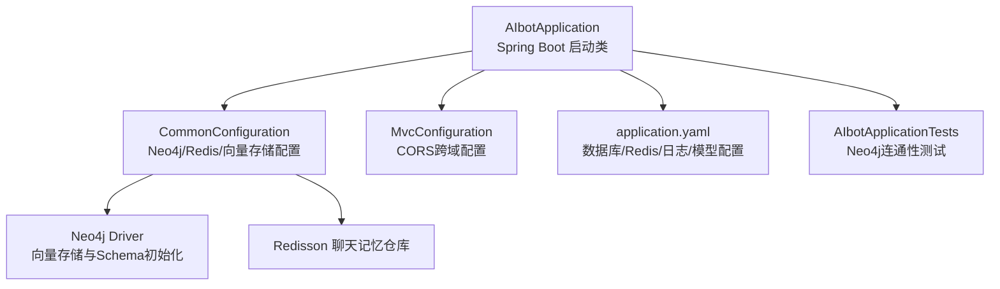
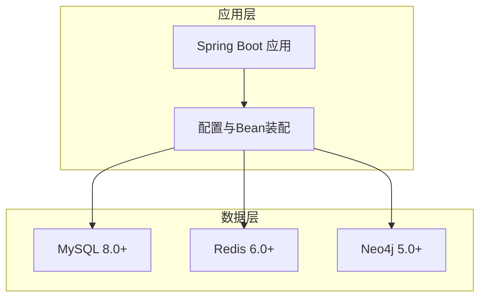
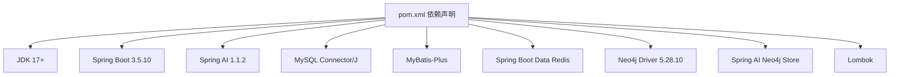

# 环境准备

<cite>
**本文引用的文件列表**
- [pom.xml](file://pom.xml)
- [application.yaml](file://src/main/resources/application.yaml)
- [AIbotApplication.java](file://src/main/java/com/xdu/aibot/AIbotApplication.java)
- [CommonConfiguration.java](file://src/main/java/com/xdu/aibot/config/CommonConfiguration.java)
- [RedisMemoryConfig.java](file://src/main/java/com/xdu/aibot/config/RedisMemoryConfig.java)
- [MvcConfiguration.java](file://src/main/java/com/xdu/aibot/config/MvcConfiguration.java)
- [AIbotApplicationTests.java](file://src/test/java/com/xdu/aibot/AIbotApplicationTests.java)
- [chat-pdf.properties](file://chat-pdf.properties)
- [mvnw.cmd](file://mvnw.cmd)
- [.mvn/wrapper/maven-wrapper.properties](file://.mvn/wrapper/maven-wrapper.properties)
</cite>

## 目录
1. [简介](#简介)
2. [项目结构](#项目结构)
3. [核心组件](#核心组件)
4. [架构总览](#架构总览)
5. [详细组件分析](#详细组件分析)
6. [依赖分析](#依赖分析)
7. [性能考虑](#性能考虑)
8. [故障排查指南](#故障排查指南)
9. [结论](#结论)
10. [附录](#附录)

## 简介
本文件面向AIbot项目的开发与生产环境准备，聚焦以下系统要求与配置要点：
- JDK 17+
- MySQL 8.0+
- Redis 6.0+
- Neo4j 5.0+
同时提供操作系统兼容性、网络与防火墙要求、环境变量与系统资源限制、性能基准建议、以及环境验证脚本与依赖检查清单，帮助确保各组件正确安装与配置。

## 项目结构
AIbot是一个基于Spring Boot 3.5.10与Spring AI 1.1.2的RAG应用，采用Maven管理依赖，主要模块包括：
- 应用入口与扫描：Spring Boot启动类负责扫描Mapper包并启动Web服务
- 配置层：Neo4j、Redis、数据源、日志等配置通过YAML与Java配置类完成
- 控制器与业务：聊天历史、客服、PDF处理等控制器与服务
- 向量存储与图检索：基于Neo4j向量索引与GraphRAG增强问答链路
- 文件读取与嵌入：PDF解析与嵌入模型集成

图表来源
- [AIbotApplication.java:1-16](file://src/main/java/com/xdu/aibot/AIbotApplication.java#L1-L16)
- [CommonConfiguration.java:1-129](file://src/main/java/com/xdu/aibot/config/CommonConfiguration.java#L1-L129)
- [RedisMemoryConfig.java:1-26](file://src/main/java/com/xdu/aibot/config/RedisMemoryConfig.java#L1-L26)
- [MvcConfiguration.java:1-18](file://src/main/java/com/xdu/aibot/config/MvcConfiguration.java#L1-L18)
- [application.yaml:1-59](file://src/main/resources/application.yaml#L1-L59)
- [AIbotApplicationTests.java:76-103](file://src/test/java/com/xdu/aibot/IAIbotApplicationTests.java#L76-L103)

章节来源
- [AIbotApplication.java:1-16](file://src/main/java/com/xdu/aibot/AIbotApplication.java#L1-L16)
- [application.yaml:1-59](file://src/main/resources/application.yaml#L1-L59)

## 核心组件
- JDK版本：项目属性中明确指定为17
- Spring Boot版本：3.5.10
- Spring AI版本：1.1.2（通过BOM统一管理）
- 数据库：MySQL Connector/J驱动，MyBatis-Plus集成
- 图数据库：Neo4j Java Driver 5.28.10，Spring AI Neo4j向量存储
- 缓存：Redis（Lettuce连接池配置），Redisson聊天记忆仓库
- 模型与嵌入：OpenAI兼容接口（DashScope），嵌入维度1536，距离类型余弦
- 日志：调试级别开启，便于问题定位

章节来源
- [pom.xml:29-32](file://pom.xml#L29-L32)
- [pom.xml:117-127](file://pom.xml#L117-L127)
- [application.yaml:1-59](file://src/main/resources/application.yaml#L1-L59)
- [CommonConfiguration.java:58-70](file://src/main/java/com/xdu/aibot/config/CommonConfiguration.java#L58-L70)
- [RedisMemoryConfig.java:18-25](file://src/main/java/com/xdu/aibot/config/RedisMemoryConfig.java#L18-L25)

## 架构总览
AIbot的运行时依赖如下外部组件，需在开发与生产环境中分别准备与校验：
- 应用服务器：Spring Boot内嵌Web容器（默认端口由应用配置决定）
- 数据库：MySQL 8.0+（用于持久化业务数据）
- 缓存：Redis 6.0+（用于聊天记忆与会话状态）
- 图数据库：Neo4j 5.0+（用于向量索引与图RAG检索）

图表来源
- [pom.xml:44-110](file://pom.xml#L44-L110)
- [application.yaml:30-45](file://src/main/resources/application.yaml#L30-L45)
- [CommonConfiguration.java:52-70](file://src/main/java/com/xdu/aibot/config/CommonConfiguration.java#L52-L70)
- [RedisMemoryConfig.java:18-25](file://src/main/java/com/xdu/aibot/config/RedisMemoryConfig.java#L18-L25)

## 详细组件分析

### JDK 17+ 安装与验证
- 版本要求：项目属性中明确java.version为17
- 安装方式：官方JDK 17下载与环境变量配置
- 验证方法：使用java -version确认版本；使用mvnw或mvn验证Maven与JDK版本匹配

章节来源
- [pom.xml:30](file://pom.xml#L30)
- [mvnw.cmd:1-96](file://mvnw.cmd#L1-L96)
- [.mvn/wrapper/maven-wrapper.properties:1-4](file://.mvn/wrapper/maven-wrapper.properties#L1-L4)

### MySQL 8.0+ 安装与配置
- 驱动与依赖：mysql-connector-j在运行时生效
- 连接参数：application.yaml中定义了驱动类名、URL、用户名与密码
- 建议配置：
  - 开启SSL参数（示例中已禁用SSL以便快速验证，生产建议启用）
  - 设置时区与时区参数
  - 允许公钥检索（示例中允许，生产建议按安全策略调整）
- 初始化：应用启动时可结合MyBatis-Plus进行表结构初始化（如启用自动建表）

章节来源
- [pom.xml:44-47](file://pom.xml#L44-L47)
- [application.yaml:30-34](file://src/main/resources/application.yaml#L30-L34)

### Redis 6.0+ 安装与配置
- 依赖：spring-boot-starter-data-redis与spring-ai-alibaba-starter-memory-redis
- 连接参数：host、port、password与Lettuce连接池参数在application.yaml中配置
- 聊天记忆：RedissonRedisChatMemoryRepository用于会话记忆
- 建议配置：
  - 生产环境建议开启认证与TLS
  - 合理设置连接池大小以满足并发请求
  - 使用哨兵或集群模式提升可用性

章节来源
- [pom.xml:91-84](file://pom.xml#L91-L84)
- [application.yaml:35-45](file://src/main/resources/application.yaml#L35-L45)
- [RedisMemoryConfig.java:18-25](file://src/main/java/com/xdu/aibot/config/RedisMemoryConfig.java#L18-L25)

### Neo4j 5.0+ 安装与配置
- 依赖：spring-ai-neo4j-store与spring-boot-starter-data-neo4j，Neo4j Java Driver 5.28.10
- 连接参数：application.yaml中的uri、用户名与密码
- 向量存储：Custom Neo4j VectorStore，数据库名、索引名、嵌入维度与距离类型均在配置中指定
- Schema初始化：initialize-schema设为true，首次启动会自动创建索引与Schema
- 测试验证：单元测试中使用GraphDatabase.driver进行连通性验证与简单查询

章节来源
- [pom.xml:98-110](file://pom.xml#L98-L110)
- [application.yaml:4-16](file://src/main/resources/application.yaml#L4-L16)
- [CommonConfiguration.java:58-70](file://src/main/java/com/xdu/aibot/config/CommonConfiguration.java#L58-L70)
- [AIbotApplicationTests.java:76-103](file://src/test/java/com/xdu/aibot/IAIbotApplicationTests.java#L76-L103)

### 操作系统兼容性
- Windows：支持，注意路径分隔符与换行符差异；Maven Wrapper脚本已适配
- Linux：支持，建议使用发行版自带包管理器安装JDK与数据库
- macOS：支持，注意Homebrew安装的JDK版本与系统权限

章节来源
- [mvnw.cmd:1-96](file://mvnw.cmd#L1-L96)
- [.mvn/wrapper/maven-wrapper.properties:1-4](file://.mvn/wrapper/maven-wrapper.properties#L1-L4)

### 网络配置与防火墙
- 应用端口：由Spring Boot配置决定，默认通常为8080，可在application.yaml中设置server.port
- 数据库访问：MySQL默认3306端口；生产环境建议仅开放内网访问或通过VPN
- Redis访问：默认6379端口；建议绑定内网IP并开启认证
- Neo4j访问：默认7687端口；建议使用加密传输（neo4j+s）并限制来源IP
- 防火墙规则：仅放行必要的端口，关闭不必要的入站连接

章节来源
- [application.yaml:30-34](file://src/main/resources/application.yaml#L30-L34)
- [application.yaml:35-45](file://src/main/resources/application.yaml#L35-L45)
- [application.yaml:4-8](file://src/main/resources/application.yaml#L4-L8)

### 环境变量与系统资源限制
- 环境变量：
  - DASHSCOPE_API_KEY：用于DashScope/OpenAI兼容接口的API密钥
  - 可通过-D或系统环境变量注入，确保应用启动时可用
- 系统资源：
  - JVM堆内存：建议至少2GB起步，根据并发与向量嵌入规模适当调优
  - 文件上传：multipart最大文件与请求大小已在application.yaml中设置
  - Redis连接池：根据并发与延迟目标调整最大活跃连接数与空闲连接数

章节来源
- [application.yaml:17-21](file://src/main/resources/application.yaml#L17-L21)
- [application.yaml:46-49](file://src/main/resources/application.yaml#L46-L49)
- [application.yaml:40-45](file://src/main/resources/application.yaml#L40-L45)

### 性能基准要求
- 嵌入维度：1536（cosine距离）
- 向量检索：相似度阈值与TopK在配置中设定，可根据召回率与响应时间权衡
- 并发与缓存：合理设置Redis连接池与消息窗口长度，避免频繁I/O
- 数据库：MySQL连接池与慢查询监控，确保高并发下的稳定性

章节来源
- [application.yaml:13-28](file://src/main/resources/application.yaml#L13-L28)
- [CommonConfiguration.java:102-108](file://src/main/java/com/xdu/aibot/config/CommonConfiguration.java#L102-L108)

## 依赖分析
AIbot对外部组件的依赖关系如下：

图表来源
- [pom.xml:33-116](file://pom.xml#L33-L116)

章节来源
- [pom.xml:33-116](file://pom.xml#L33-L116)

## 性能考虑
- 嵌入与检索：选择合适的相似度阈值与TopK，平衡准确率与延迟
- 缓存策略：Redis连接池参数与聊天记忆窗口长度直接影响用户体验
- 数据库优化：合理设置连接池大小与超时，监控慢查询
- 日志级别：调试级别有助于问题定位，但会影响性能，建议在生产环境降低日志级别

章节来源
- [application.yaml:52-59](file://src/main/resources/application.yaml#L52-L59)
- [CommonConfiguration.java:102-108](file://src/main/java/com/xdu/aibot/config/CommonConfiguration.java#L102-L108)

## 故障排查指南
- Neo4j连通性测试：单元测试展示了如何使用GraphDatabase.driver建立连接并执行简单查询，可用于验证Neo4j服务可用性
- 日志定位：application.yaml中开启了多组件的调试日志，便于定位问题
- CORS跨域：MvcConfiguration中配置了宽松的跨域策略，便于前端联调，生产环境应收紧

章节来源
- [AIbotApplicationTests.java:76-103](file://src/test/java/com/xdu/aibot/IAIbotApplicationTests.java#L76-L103)
- [application.yaml:52-59](file://src/main/resources/application.yaml#L52-L59)
- [MvcConfiguration.java:8-18](file://src/main/java/com/xdu/aibot/config/MvcConfiguration.java#L8-L18)

## 结论
AIbot项目对JDK 17+、MySQL 8.0+、Redis 6.0+与Neo4j 5.0+有明确依赖。通过本指南提供的安装配置步骤、网络与防火墙要求、环境变量与资源限制建议，以及环境验证脚本与检查清单，可确保开发与生产环境的稳定运行。

## 附录

### 环境验证脚本与检查清单
- JDK验证
  - 执行命令：java -version
  - 确认输出显示JDK 17或更高版本
- Maven验证
  - 执行命令：mvn -v 或 ./mvnw -v
  - 确认Maven与JDK版本匹配
- MySQL验证
  - 使用数据库客户端连接到application.yaml中配置的URL与凭据
  - 确认能够执行基本查询
- Redis验证
  - 使用redis-cli连接到application.yaml中配置的host与port
  - 执行ping命令确认连通性
- Neo4j验证
  - 使用Neo4j Desktop或浏览器访问application.yaml中配置的uri
  - 执行简单Cypher查询确认连通性
- 应用启动验证
  - 启动AIbotApplication，观察控制台日志
  - 访问健康检查端点（如有）或默认首页，确认服务正常

章节来源
- [application.yaml:30-45](file://src/main/resources/application.yaml#L30-L45)
- [AIbotApplicationTests.java:76-103](file://src/test/java/com/xdu/aibot/IAIbotApplicationTests.java#L76-L103)