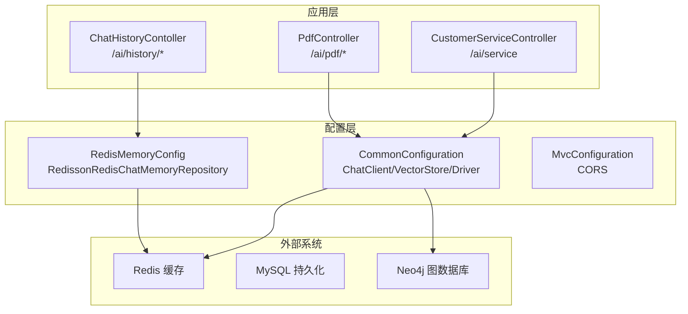
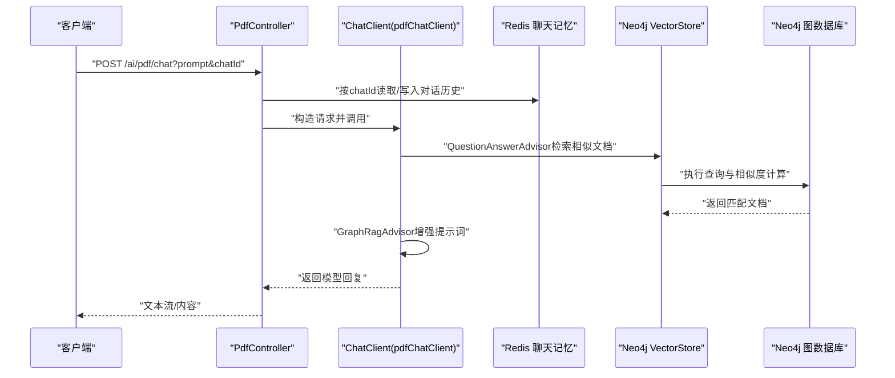
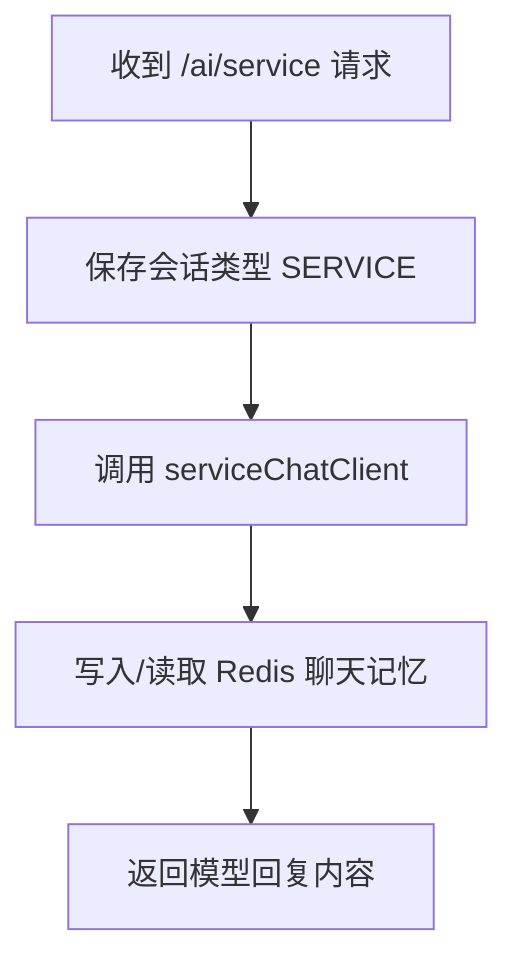
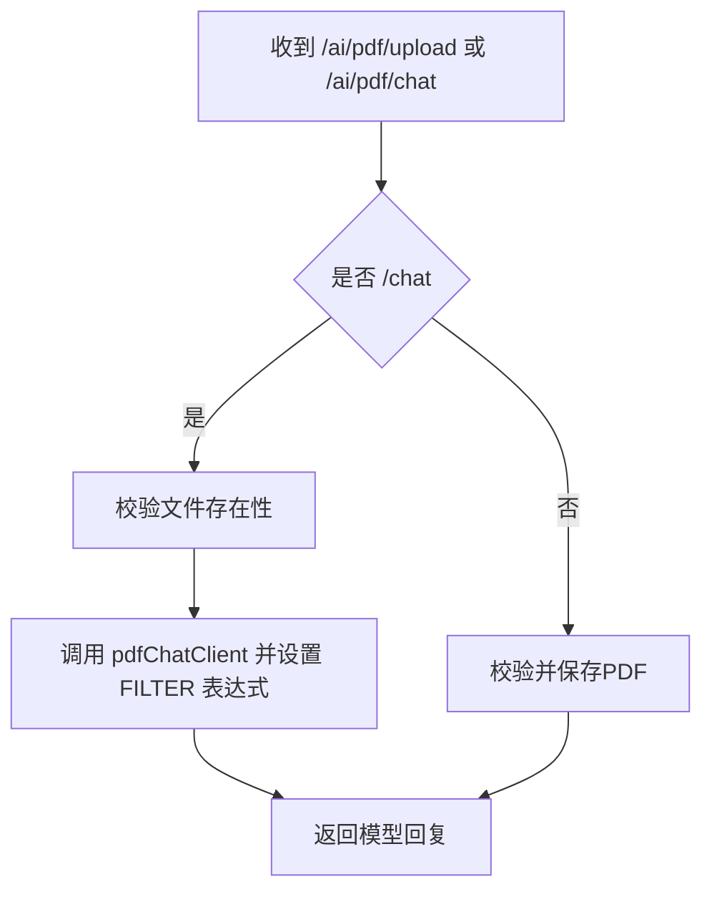
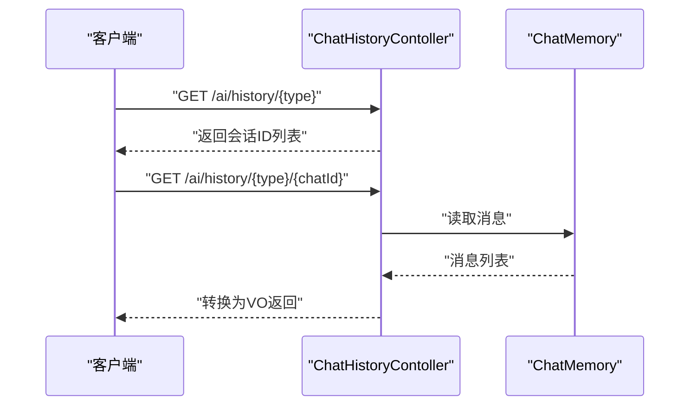
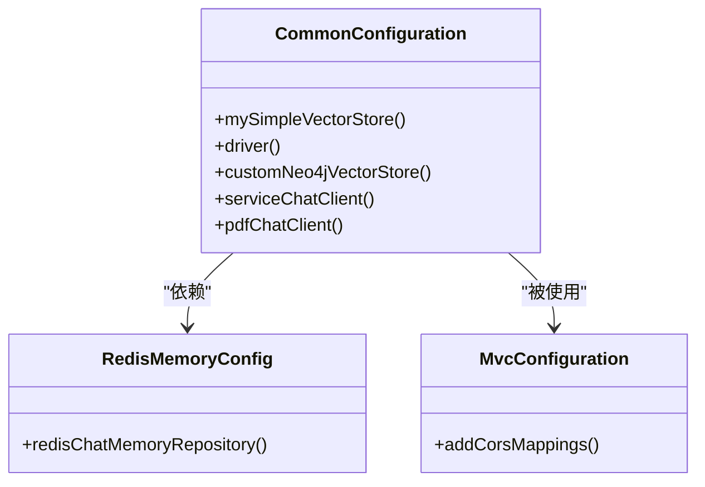
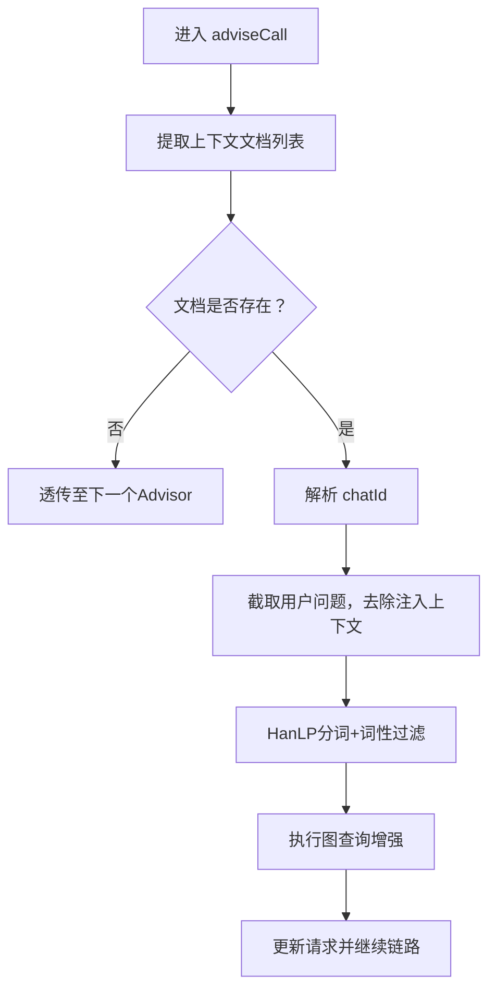
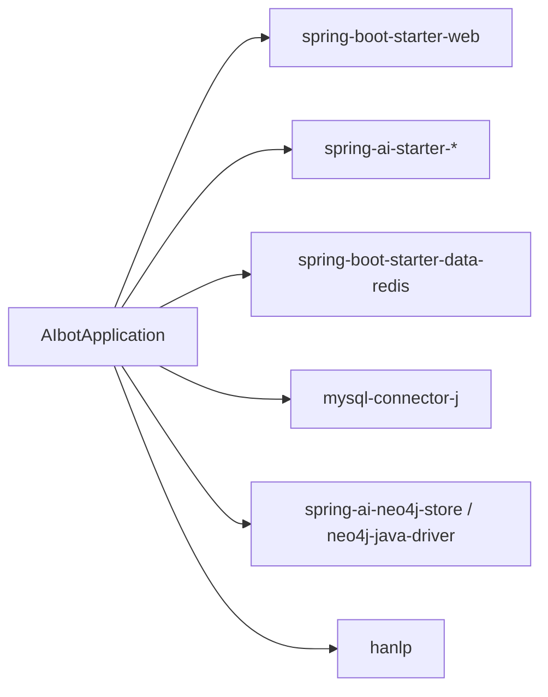

# 监控与运维

<cite>
**本文引用的文件**   
- [application.yaml](file://src/main/resources/application.yaml)
- [pom.xml](file://pom.xml)
- [AIbotApplication.java](file://src/main/java/com/xdu/aibot/AIbotApplication.java)
- [CommonConfiguration.java](file://src/main/java/com/xdu/aibot/config/CommonConfiguration.java)
- [RedisMemoryConfig.java](file://src/main/java/com/xdu/aibot/config/RedisMemoryConfig.java)
- [CustomerServiceController.java](file://src/main/java/com/xdu/aibot/controller/CustomerServiceController.java)
- [PdfController.java](file://src/main/java/com/xdu/aibot/controller/PdfController.java)
- [ChatHistoryContoller.java](file://src/main/java/com/xdu/aibot/controller/ChatHistoryContoller.java)
- [GraphRagAdvisor.java](file://src/main/java/com/xdu/aibot/advisor/GraphRagAdvisor.java)
- [mvcConfiguration.java](file://src/main/java/com/xdu/aibot/config/MvcConfiguration.java)
- [mvnw.cmd](file://mvnw.cmd)
- [chat-pdf.properties](file://chat-pdf.properties)
</cite>

## 目录
1. [简介](#简介)
2. [项目结构](#项目结构)
3. [核心组件](#核心组件)
4. [架构总览](#架构总览)
5. [详细组件分析](#详细组件分析)
6. [依赖分析](#依赖分析)
7. [性能考虑](#性能考虑)
8. [故障排查指南](#故障排查指南)
9. [结论](#结论)
10. [附录](#附录)

## 简介
本文件面向AIbot项目的监控与运维，围绕应用性能监控（APM）、数据库性能监控、Redis缓存监控、日志管理策略、健康检查与故障自动恢复、告警通知配置、性能调优与资源优化、容量规划以及运维自动化脚本、备份恢复与灾难恢复计划进行系统化说明。文档基于仓库现有配置与代码进行分析，并提供可落地的实践建议。

## 项目结构
AIbot采用Spring Boot工程，主要模块包括：
- 配置层：application.yaml集中管理外部化配置；多个@Configuration类负责Bean装配与外部服务集成。
- 控制器层：对外提供REST接口，分别支持客服对话、PDF问答与历史记录查询。
- 适配器与内存：通过Redis存储对话记忆，结合向量检索与图RAG增强问答链路。
- 数据源与缓存：MySQL用于持久化，Redis用于会话记忆，Neo4j作为向量索引与图谱支撑。

图表来源
- [CommonConfiguration.java:34-128](file://src/main/java/com/xdu/aibot/config/CommonConfiguration.java#L34-L128)
- [RedisMemoryConfig.java:8-26](file://src/main/java/com/xdu/aibot/config/RedisMemoryConfig.java#L8-L26)
- [CustomerServiceController.java:14-35](file://src/main/java/com/xdu/aibot/controller/CustomerServiceController.java#L14-L35)
- [PdfController.java:26-98](file://src/main/java/com/xdu/aibot/controller/PdfController.java#L26-L98)
- [ChatHistoryContoller.java:14-39](file://src/main/java/com/xdu/aibot/controller/ChatHistoryContoller.java#L14-L39)

章节来源
- [AIbotApplication.java:7-15](file://src/main/java/com/xdu/aibot/AIbotApplication.java#L7-L15)
- [application.yaml:1-59](file://src/main/resources/application.yaml#L1-L59)
- [pom.xml:33-116](file://pom.xml#L33-L116)

## 核心组件
- 应用启动与扫描：主入口启用Spring Boot并扫描Mapper包。
- 配置装配：统一装配ChatClient、VectorStore、Neo4j Driver与Redis聊天记忆仓库。
- 控制器接口：提供客服对话、PDF问答、历史查询等REST端点。
- 日志级别：集中配置了多模块调试级别，便于问题定位。

章节来源
- [AIbotApplication.java:7-15](file://src/main/java/com/xdu/aibot/AIbotApplication.java#L7-L15)
- [CommonConfiguration.java:34-128](file://src/main/java/com/xdu/aibot/config/CommonConfiguration.java#L34-L128)
- [RedisMemoryConfig.java:8-26](file://src/main/java/com/xdu/aibot/config/RedisMemoryConfig.java#L8-L26)
- [application.yaml:52-59](file://src/main/resources/application.yaml#L52-L59)

## 架构总览
AIbot的运行时架构以Spring Boot为核心，通过ChatClient构建对话链路，结合Redis进行会话记忆、Neo4j进行向量检索与图RAG增强，最终调用大模型完成问答。控制器层暴露HTTP接口，配合CORS配置实现跨域访问。

图表来源
- [PdfController.java:42-55](file://src/main/java/com/xdu/aibot/controller/PdfController.java#L42-L55)
- [CommonConfiguration.java:90-127](file://src/main/java/com/xdu/aibot/config/CommonConfiguration.java#L90-L127)
- [GraphRagAdvisor.java:18-36](file://src/main/java/com/xdu/aibot/advisor/GraphRagAdvisor.java#L18-L36)

## 详细组件分析

### 客服对话组件（CustomerServiceController）
- 功能：接收用户输入与会话ID，调用服务型ChatClient生成回复。
- 关键点：通过参数注入会话ID，结合消息窗口记忆控制长度。
- 监控关注：接口耗时、错误率、会话ID一致性、内存占用。

图表来源
- [CustomerServiceController.java:25-33](file://src/main/java/com/xdu/aibot/controller/CustomerServiceController.java#L25-L33)
- [CommonConfiguration.java:73-88](file://src/main/java/com/xdu/aibot/config/CommonConfiguration.java#L73-L88)

章节来源
- [CustomerServiceController.java:14-35](file://src/main/java/com/xdu/aibot/controller/CustomerServiceController.java#L14-L35)

### PDF问答组件（PdfController）
- 功能：上传PDF、下载PDF、基于PDF内容问答。
- 关键点：上传校验PDF类型；问答前校验文件是否存在；通过过滤表达式限定文档范围。
- 监控关注：文件大小限制、上传/下载吞吐、向量检索命中率、图RAG增强效果。

图表来源
- [PdfController.java:57-96](file://src/main/java/com/xdu/aibot/controller/PdfController.java#L57-L96)
- [CommonConfiguration.java:90-127](file://src/main/java/com/xdu/aibot/config/CommonConfiguration.java#L90-L127)

章节来源
- [PdfController.java:26-98](file://src/main/java/com/xdu/aibot/controller/PdfController.java#L26-L98)

### 历史记录组件（ChatHistoryContoller）
- 功能：按类型列出会话ID，按类型与会话ID获取消息历史。
- 关键点：直接从ChatMemory读取消息，为空时返回空列表。
- 监控关注：历史消息数量、内存占用、会话清理策略。

图表来源
- [ChatHistoryContoller.java:25-37](file://src/main/java/com/xdu/aibot/controller/ChatHistoryContoller.java#L25-L37)

章节来源
- [ChatHistoryContoller.java:14-39](file://src/main/java/com/xdu/aibot/controller/ChatHistoryContoller.java#L14-L39)

### 配置与外部系统集成
- ChatClient装配：统一配置日志Advisor、消息窗口记忆、工具与系统提示词。
- VectorStore与Neo4j：自定义索引名称、距离类型、维度与初始化策略。
- Redis聊天记忆：通过Redisson仓库连接本地Redis实例。
- CORS：允许任意来源与方法，暴露Content-Disposition头。

图表来源
- [CommonConfiguration.java:34-128](file://src/main/java/com/xdu/aibot/config/CommonConfiguration.java#L34-L128)
- [RedisMemoryConfig.java:8-26](file://src/main/java/com/xdu/aibot/config/RedisMemoryConfig.java#L8-L26)
- [mvcConfiguration.java:8-18](file://src/main/java/com/xdu/aibot/config/MvcConfiguration.java#L8-L18)

章节来源
- [CommonConfiguration.java:34-128](file://src/main/java/com/xdu/aibot/config/CommonConfiguration.java#L34-L128)
- [RedisMemoryConfig.java:8-26](file://src/main/java/com/xdu/aibot/config/RedisMemoryConfig.java#L8-L26)
- [mvcConfiguration.java:8-18](file://src/main/java/com/xdu/aibot/config/MvcConfiguration.java#L8-L18)

### 图RAG增强适配器（GraphRagAdvisor）
- 功能：在问答链路中提取关键词，基于图谱进行上下文增强。
- 关键点：从上下文文档中解析chatId，利用HanLP分词与关键词过滤，再通过Neo4jClient查询增强信息。
- 监控关注：关键词提取质量、图查询耗时、增强后提示词长度。

图表来源
- [GraphRagAdvisor.java:18-73](file://src/main/java/com/xdu/aibot/advisor/GraphRagAdvisor.java#L18-L73)

章节来源
- [GraphRagAdvisor.java:1-73](file://src/main/java/com/xdu/aibot/advisor/GraphRagAdvisor.java#L1-L73)

## 依赖分析
- 外部依赖：Spring Boot Web、MyBatis Plus、Spring AI（OpenAI/DashScope、Agent框架、Memory-Redis、Neo4j Store）、Neo4j Java Driver、Redisson、HanLP。
- 配置依赖：application.yaml集中管理数据源、Redis、Neo4j、日志级别等。

图表来源
- [pom.xml:33-116](file://pom.xml#L33-L116)
- [application.yaml:1-59](file://src/main/resources/application.yaml#L1-L59)

章节来源
- [pom.xml:33-116](file://pom.xml#L33-L116)
- [application.yaml:1-59](file://src/main/resources/application.yaml#L1-L59)

## 性能考虑
- 接口限流与超时：建议在网关或Web层增加限流与超时配置，避免突发流量导致内存与线程池压力。
- 向量检索阈值与TopK：当前相似度阈值与TopK已配置，建议结合业务反馈动态调整以平衡召回与延迟。
- Redis连接池：当前连接池参数较小，建议根据并发与QPS评估扩容，避免阻塞与超时。
- Neo4j查询优化：图RAG增强涉及分词与图查询，建议对高频查询建立索引与缓存热点。
- 序列化与内存：消息窗口长度与JSON序列化策略需与内存占用平衡，定期清理过期会话。
- 文件上传限制：multipart大小限制已在配置中设定，建议结合磁盘与网络带宽做容量规划。

章节来源
- [application.yaml:30-49](file://src/main/resources/application.yaml#L30-L49)
- [CommonConfiguration.java:90-127](file://src/main/java/com/xdu/aibot/config/CommonConfiguration.java#L90-L127)
- [RedisMemoryConfig.java:18-25](file://src/main/java/com/xdu/aibot/config/RedisMemoryConfig.java#L18-L25)

## 故障排查指南
- 日志级别：当前已开启多模块调试级别，便于定位Spring AI、Neo4j、MyBatis等模块问题。
- 常见问题定位路径：
  - 客户端无法跨域：检查CORS配置是否生效。
  - PDF上传失败：确认文件类型与大小限制，查看控制器日志。
  - 问答无结果：检查向量检索阈值与TopK、图RAG增强是否触发、Neo4j连接状态。
  - Redis连接异常：核对主机、端口、密码与连接池配置。
- 健康检查建议：新增/health端点返回应用、数据库、Redis、Neo4j连通性状态。

章节来源
- [application.yaml:52-59](file://src/main/resources/application.yaml#L52-L59)
- [mvcConfiguration.java:8-18](file://src/main/java/com/xdu/aibot/config/MvcConfiguration.java#L8-L18)
- [PdfController.java:57-96](file://src/main/java/com/xdu/aibot/controller/PdfController.java#L57-L96)
- [CommonConfiguration.java:52-70](file://src/main/java/com/xdu/aibot/config/CommonConfiguration.java#L52-L70)
- [RedisMemoryConfig.java:18-25](file://src/main/java/com/xdu/aibot/config/RedisMemoryConfig.java#L18-L25)

## 结论
AIbot当前具备完善的外部系统集成与基础监控配置，建议在现有基础上补充统一APM埋点、数据库与Redis性能指标采集、集中式日志与告警体系，并完善健康检查与自动恢复机制，以满足生产环境的稳定性与可观测性要求。

## 附录

### 监控指标建议清单
- 应用性能监控（APM）
  - 接口级：请求量、成功率、平均/95分位响应时间、错误码分布。
  - 资源级：CPU、内存、线程数、GC频率与停顿。
  - 依赖级：Redis连接池使用率、数据库连接池使用率、Neo4j查询耗时与慢查询。
- 数据库性能监控
  - 查询QPS、慢查询、锁等待、连接数、缓冲池命中率。
- Redis缓存监控
  - 命中率、内存使用、淘汰策略、慢命令、连接数。

### 日志管理策略
- 日志级别：生产环境建议调整为info或warn为主，调试日志仅在问题定位时临时提升。
- 日志轮转：按大小与时间滚动，保留7-30天，敏感信息脱敏。
- 集中式日志：接入日志收集平台，统一采集、检索与告警。

### 健康检查与自动恢复
- 健康检查：/health返回应用、数据库、Redis、Neo4j连通性与关键指标阈值。
- 自动恢复：容器编排层面设置重启策略与探针，异常时自动拉起。

### 告警通知配置
- 告警规则：接口错误率、响应时间、依赖可用性、资源使用率阈值。
- 通知渠道：邮件、IM、电话，分级告警。

### 性能调优与容量规划
- 调优方向：连接池参数、线程池大小、缓存命中率、查询索引与分区。
- 容量规划：基于峰值QPS与RT，预留20%-30%冗余，分阶段扩容。

### 运维自动化与备份恢复
- 自动化脚本：打包、部署、回滚、扩缩容、健康检查脚本。
- 备份恢复：数据库定时全备与增量备份、Redis快照、Neo4j图数据备份。
- 灾难恢复：异地多活、故障切换演练、RTO/RPO目标明确。