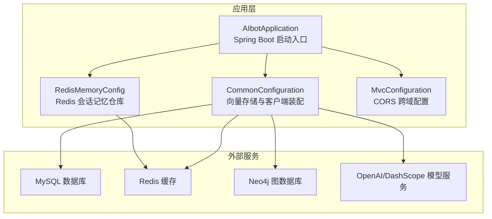
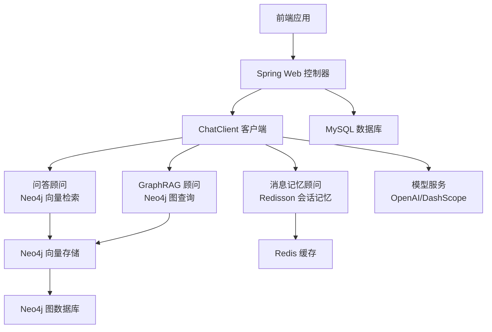
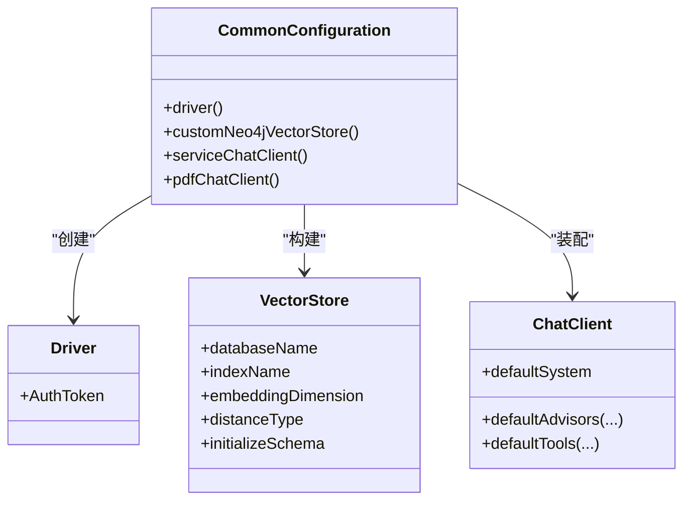
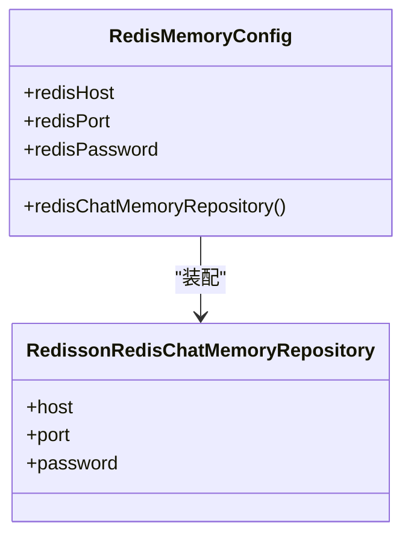
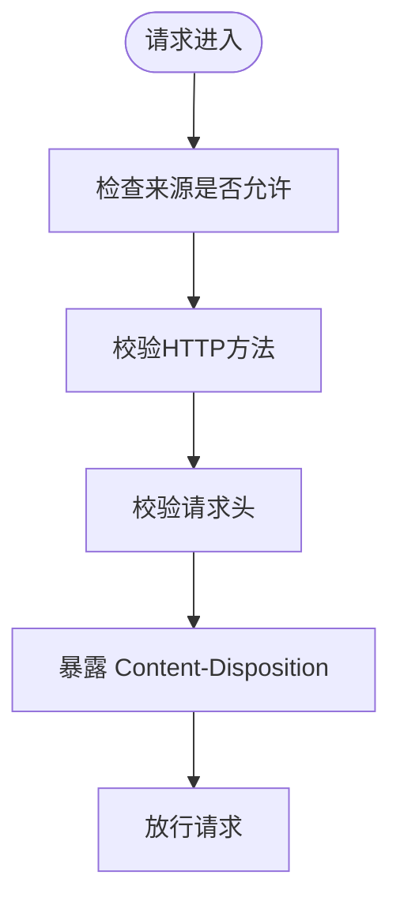
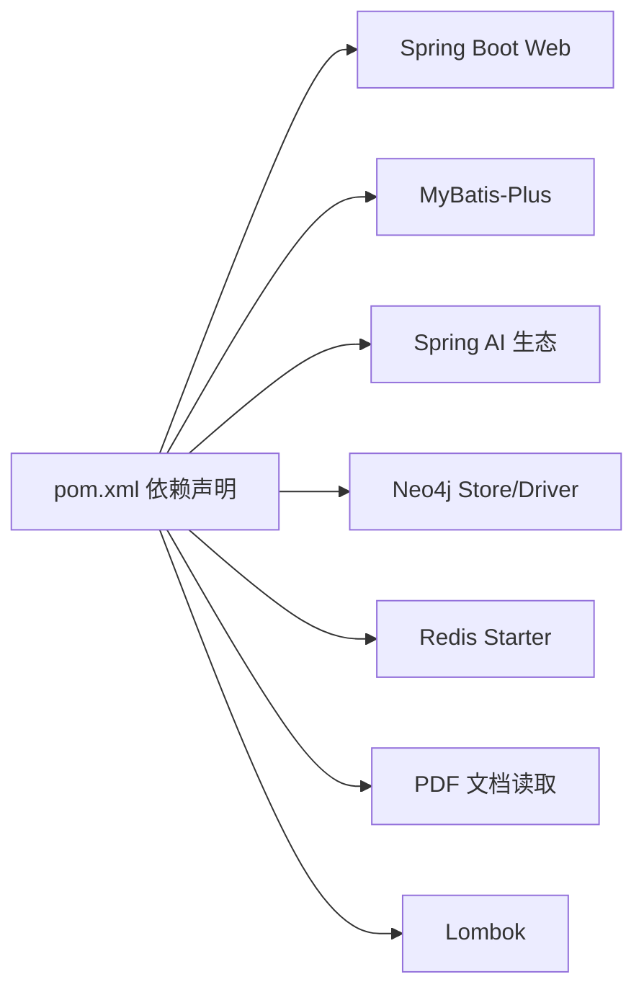

# 部署与运维

<cite>
**本文引用的文件**
- [pom.xml](file://pom.xml)
- [application.yaml](file://src/main/resources/application.yaml)
- [AIbotApplication.java](file://src/main/java/com/xdu/aibot/AIbotApplication.java)
- [CommonConfiguration.java](file://src/main/java/com/xdu/aibot/config/CommonConfiguration.java)
- [MvcConfiguration.java](file://src/main/java/com/xdu/aibot/config/MvcConfiguration.java)
- [RedisMemoryConfig.java](file://src/main/java/com/xdu/aibot/config/RedisMemoryConfig.java)
- [chat-pdf.properties](file://chat-pdf.properties)
- [.mvn/wrapper/maven-wrapper.properties](file://.mvn/wrapper/maven-wrapper.properties)
</cite>

## 目录
1. [简介](#简介)
2. [项目结构](#项目结构)
3. [核心组件](#核心组件)
4. [架构总览](#架构总览)
5. [详细组件分析](#详细组件分析)
6. [依赖分析](#依赖分析)
7. [性能考虑](#性能考虑)
8. [故障排查指南](#故障排查指南)
9. [结论](#结论)
10. [附录](#附录)

## 简介
本文件面向AIbot项目的部署与运维团队，提供从环境准备到上线运行、从监控告警到故障恢复的全生命周期指导。内容覆盖JDK、数据库、Redis与Neo4j的安装配置；Maven构建与Spring Boot打包；容器化与云平台部署要点；系统监控指标与日志策略；性能调优建议；故障诊断、备份恢复与灾备计划；负载均衡、安全加固与合规性要求；以及运维自动化与最佳实践。

## 项目结构
AIbot为基于Spring Boot 3.5.10与Java 17的后端应用，采用Spring AI生态进行向量检索与对话增强，并通过MySQL存储业务数据、Redis缓存会话记忆、Neo4j进行图谱检索增强。项目使用Maven进行依赖与构建管理，支持多模型适配（OpenAI兼容与DashScope）。

图表来源
- [AIbotApplication.java:1-16](file://src/main/java/com/xdu/aibot/AIbotApplication.java#L1-L16)
- [CommonConfiguration.java:1-129](file://src/main/java/com/xdu/aibot/config/CommonConfiguration.java#L1-L129)
- [RedisMemoryConfig.java:1-26](file://src/main/java/com/xdu/aibot/config/RedisMemoryConfig.java#L1-L26)
- [MvcConfiguration.java:1-19](file://src/main/java/com/xdu/aibot/config/MvcConfiguration.java#L1-L19)

章节来源
- [AIbotApplication.java:1-16](file://src/main/java/com/xdu/aibot/AIbotApplication.java#L1-L16)
- [pom.xml:1-139](file://pom.xml#L1-L139)
- [application.yaml:1-59](file://src/main/resources/application.yaml#L1-L59)

## 核心组件
- 应用启动器：负责扫描Mapper包并启动Spring Boot应用。
- 配置装配：
  - 向量存储与客户端：构建Neo4j向量存储、OpenAI聊天客户端、消息记忆顾问链等。
  - Redis会话记忆：基于Redisson的聊天记忆仓库。
  - MVC跨域：开放全局CORS以支持前端直连。
- 外部依赖：
  - MySQL：业务数据持久化。
  - Redis：会话记忆缓存。
  - Neo4j：向量索引与图RAG增强。
  - OpenAI/DashScope：文本生成与嵌入模型。

章节来源
- [AIbotApplication.java:1-16](file://src/main/java/com/xdu/aibot/AIbotApplication.java#L1-L16)
- [CommonConfiguration.java:1-129](file://src/main/java/com/xdu/aibot/config/CommonConfiguration.java#L1-L129)
- [RedisMemoryConfig.java:1-26](file://src/main/java/com/xdu/aibot/config/RedisMemoryConfig.java#L1-L26)
- [MvcConfiguration.java:1-19](file://src/main/java/com/xdu/aibot/config/MvcConfiguration.java#L1-L19)

## 架构总览
AIbot采用“Web控制器 + Spring AI 客户端 + 向量存储/图增强 + 外部服务”的分层架构。应用通过ChatClient组合工具、记忆与顾问链实现问答增强；向量检索由Neo4j向量存储提供；会话记忆通过Redis持久化；业务数据由MySQL承载；模型服务可切换至DashScope或OpenAI兼容接口。

图表来源
- [CommonConfiguration.java:74-127](file://src/main/java/com/xdu/aibot/config/CommonConfiguration.java#L74-L127)
- [RedisMemoryConfig.java:18-25](file://src/main/java/com/xdu/aibot/config/RedisMemoryConfig.java#L18-L25)
- [application.yaml:1-59](file://src/main/resources/application.yaml#L1-L59)

## 详细组件分析

### 向量存储与客户端装配（Neo4j + OpenAI）
- 构建Neo4j向量存储：指定数据库名、距离类型、索引名、嵌入维度与初始化模式。
- 构建ChatClient：
  - 默认系统提示与顾问链：日志顾问、消息记忆顾问、问答顾问、GraphRAG顾问、自定义拦截顾问。
  - 工具注册：业务工具集成。
- OpenAI/DashScope配置：通过环境变量注入API密钥，支持聊天与嵌入选项。

图表来源
- [CommonConfiguration.java:34-129](file://src/main/java/com/xdu/aibot/config/CommonConfiguration.java#L34-L129)

章节来源
- [CommonConfiguration.java:34-129](file://src/main/java/com/xdu/aibot/config/CommonConfiguration.java#L34-L129)
- [application.yaml:9-30](file://src/main/resources/application.yaml#L9-L30)

### Redis会话记忆配置
- 从配置读取Redis主机、端口与密码，构建Redisson会话记忆仓库，供消息记忆顾问使用。

图表来源
- [RedisMemoryConfig.java:1-26](file://src/main/java/com/xdu/aibot/config/RedisMemoryConfig.java#L1-L26)

章节来源
- [RedisMemoryConfig.java:1-26](file://src/main/java/com/xdu/aibot/config/RedisMemoryConfig.java#L1-L26)
- [application.yaml:36-45](file://src/main/resources/application.yaml#L36-L45)

### MVC跨域配置
- 允许任意来源、方法与头，暴露下载响应头，便于前端直接访问后端资源。

图表来源
- [MvcConfiguration.java:10-17](file://src/main/java/com/xdu/aibot/config/MvcConfiguration.java#L10-L17)

章节来源
- [MvcConfiguration.java:1-19](file://src/main/java/com/xdu/aibot/config/MvcConfiguration.java#L1-L19)

### 应用启动入口
- 扫描Mapper包并启动Spring Boot应用。

章节来源
- [AIbotApplication.java:1-16](file://src/main/java/com/xdu/aibot/AIbotApplication.java#L1-L16)

## 依赖分析
- 运行时依赖：Spring Boot Web、MyBatis-Plus、Spring AI（OpenAI/DashScope、向量存储、PDF读取）、Neo4j Store与Driver、Redis Starter、Lombok。
- 构建插件：Spring Boot Maven Plugin用于打包可执行JAR。
- Java版本：17；Spring AI版本属性在POM中统一管理。

图表来源
- [pom.xml:33-116](file://pom.xml#L33-L116)

章节来源
- [pom.xml:1-139](file://pom.xml#L1-L139)

## 性能考虑
- 向量检索参数：相似度阈值与TopK需结合业务调优，避免过多召回导致延迟上升。
- 嵌入维度与距离类型：与模型输出一致，确保索引命中率与检索质量平衡。
- Redis连接池：合理设置最大活跃数、空闲数与驱逐间隔，避免连接争用。
- 文件上传限制：控制单文件与请求总大小，防止内存压力。
- 日志级别：生产环境建议调整为INFO或WARN，避免调试日志对IO的影响。

章节来源
- [CommonConfiguration.java:102-108](file://src/main/java/com/xdu/aibot/config/CommonConfiguration.java#L102-L108)
- [application.yaml:36-49](file://src/main/resources/application.yaml#L36-L49)
- [application.yaml:52-59](file://src/main/resources/application.yaml#L52-L59)

## 故障排查指南
- 启动失败
  - 检查JDK版本与Spring Boot版本兼容性。
  - 确认Maven本地仓库可用，必要时清理并重试。
- 数据库连接异常
  - 校验MySQL地址、端口、用户名与密码；确认网络连通与防火墙策略。
- Redis连接异常
  - 校验主机、端口与密码；确认Redis服务状态与ACL策略。
- Neo4j连接异常
  - 校验URI、用户名与密码；确认网络可达与证书策略（如使用加密URI）。
- 模型服务异常
  - 校验API密钥与模型名称；确认网络代理与超时设置。
- 文件上传失败
  - 对照最大文件与请求大小限制，调整配置并观察日志。
- 日志定位
  - 关注应用包、Spring AI、Neo4j驱动与MyBatis相关日志级别。

章节来源
- [application.yaml:30-59](file://src/main/resources/application.yaml#L30-L59)
- [CommonConfiguration.java:53-56](file://src/main/java/com/xdu/aibot/config/CommonConfiguration.java#L53-L56)
- [RedisMemoryConfig.java:11-16](file://src/main/java/com/xdu/aibot/config/RedisMemoryConfig.java#L11-L16)

## 结论
AIbot的部署与运维围绕“Spring Boot + Spring AI + MySQL/Redis/Neo4j”的技术栈展开。通过合理的环境准备、配置管理、监控与日志策略、性能调优与故障排查流程，可实现稳定高效的线上运行。建议在生产环境中进一步完善容器化、自动化部署与安全加固措施。

## 附录

### 环境搭建指南
- JDK
  - 使用Java 17，确保与Spring Boot与Spring AI版本兼容。
- 数据库（MySQL）
  - 准备MySQL实例，创建数据库与用户，授予相应权限。
  - 在配置中填写正确的URL、用户名与密码。
- 缓存（Redis）
  - 准备Redis实例，配置主机、端口与密码。
  - 调整连接池参数以匹配并发场景。
- 图数据库（Neo4j）
  - 准备Neo4j实例（本地或云托管），配置URI、用户名与密码。
  - 确保网络可达与加密连接策略符合要求。

章节来源
- [application.yaml:30-45](file://src/main/resources/application.yaml#L30-L45)
- [application.yaml:4-8](file://src/main/resources/application.yaml#L4-L8)

### Maven构建与打包
- 使用Maven Wrapper进行构建，确保团队环境一致性。
- 构建产物为可执行JAR，可通过Spring Boot Maven Plugin生成。

章节来源
- [.mvn/wrapper/maven-wrapper.properties:1-4](file://.mvn/wrapper/maven-wrapper.properties#L1-L4)
- [pom.xml:129-136](file://pom.xml#L129-L136)

### Docker容器化部署（通用步骤）
- 基础镜像：选择官方JRE镜像作为基础。
- 拷贝构建产物：将Maven构建得到的可执行JAR复制到镜像内。
- 环境变量：通过环境变量注入数据库、Redis与模型服务的凭据。
- 健康检查：添加HTTP健康检查端点，便于编排系统探测。
- 端口映射：对外暴露应用监听端口。
- 建议：将敏感配置放入只读挂载卷或密钥管理服务。

[本节为通用容器化建议，不直接对应具体源码文件]

### 云平台部署方案（通用步骤）
- 容器编排：使用Kubernetes部署，配置Deployment、Service与Ingress。
- 配置管理：使用ConfigMap与Secret管理非敏感与敏感配置。
- 存储：持久化MySQL与Redis（云托管或自管集群）。
- 监控与日志：对接云原生日志与指标平台。
- 自动扩缩容：基于CPU/内存或自定义指标设置HPA。

[本节为通用云平台建议，不直接对应具体源码文件]

### 系统监控指标与日志策略
- 指标
  - 应用：启动耗时、线程数、GC次数与停顿时间、HTTP请求QPS与延迟。
  - 数据库：连接数、慢查询、锁等待、事务回滚率。
  - 缓存：命中率、过期与驱逐数量、连接池使用率。
  - 图数据库：查询耗时分布、索引扫描量、写放大。
  - 模型服务：请求成功率、平均耗时、Token用量。
- 日志
  - 分层采集：应用、网关、数据库、缓存与图数据库。
  - 结构化：统一字段与JSON格式，便于检索与分析。
  - 保留策略：按级别与容量轮转，定期归档。

[本节为通用监控与日志建议，不直接对应具体源码文件]

### 性能调优建议
- 向量检索：调整相似度阈值与TopK，优化索引与嵌入维度。
- 缓存：提升连接池上限与空闲阈值，减少阻塞。
- 数据库：开启连接池、慢查询日志与分区/索引优化。
- 模型：合理设置温度与上下文长度，避免过度生成。
- 文件处理：限制上传大小与并发，启用流式处理。

[本节为通用性能建议，不直接对应具体源码文件]

### 故障诊断方法
- 快速定位：结合日志级别与错误栈，优先检查网络与认证。
- 依赖链路：逐层验证数据库、缓存、图数据库与模型服务连通性。
- 回归测试：在变更后执行关键路径回归，确保功能与性能稳定。

[本节为通用诊断方法，不直接对应具体源码文件]

### 备份恢复与灾备计划
- 数据备份
  - MySQL：定时逻辑备份与增量备份，验证恢复流程。
  - Redis：RDB快照与AOF持久化策略，异地容灾。
  - Neo4j：图数据快照与WAL备份，验证一致性。
- 恢复演练：定期进行故障演练，评估RTO/RPO目标。
- 灾备：跨可用区或多区域部署，自动切换与数据同步。

[本节为通用备份与灾备建议，不直接对应具体源码文件]

### 负载均衡与高可用
- 前端：CDN与全局负载均衡，静态资源就近分发。
- 应用：多副本部署，健康检查与自动重启。
- 数据：主从复制、只读分离与读写分离；缓存多副本。
- 图数据库：集群部署与分片策略，避免热点。

[本节为通用高可用建议，不直接对应具体源码文件]

### 安全加固与合规
- 访问控制：最小权限原则，严格区分开发/测试/生产环境凭据。
- 传输安全：TLS加密、证书校验与中间人防护。
- 输入校验：参数过滤与白名单策略，防范注入与越权。
- 审计日志：记录关键操作与异常事件，满足合规审计。
- 依赖安全：定期扫描第三方依赖漏洞，及时升级。

[本节为通用安全与合规建议，不直接对应具体源码文件]

### 运维自动化与最佳实践
- 自动化
  - CI/CD流水线：代码提交触发构建、测试与部署。
  - 基础设施即代码：使用Terraform/Helm/K8s清单管理资源。
  - 告警：基于阈值与趋势的智能告警，减少误报。
- 最佳实践
  - 配置外置化：环境差异通过环境变量与配置中心管理。
  - 版本化：依赖与镜像版本固定，可追溯可回滚。
  - 可观测性：三样一体（日志、指标、链路追踪）全面覆盖。

[本节为通用自动化与最佳实践建议，不直接对应具体源码文件]