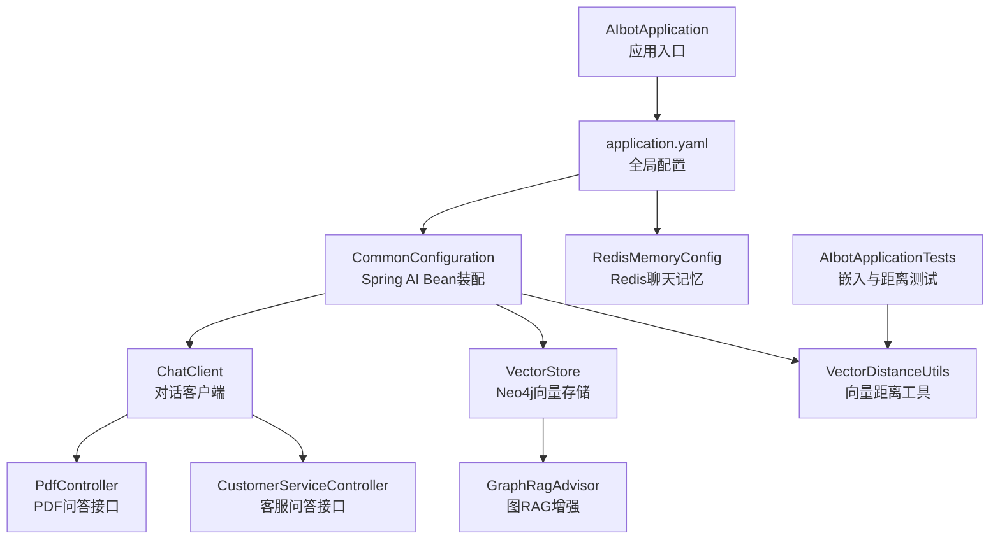
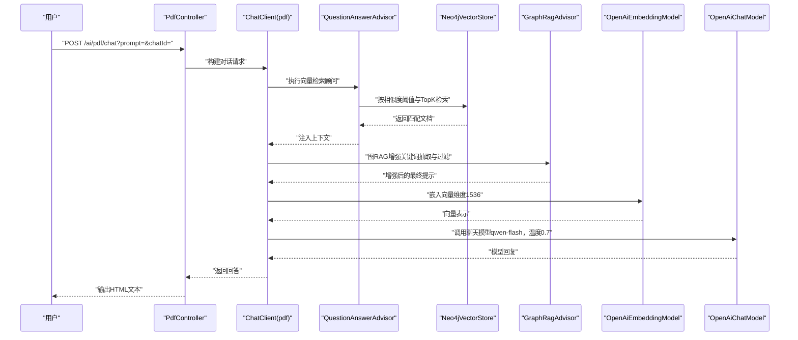
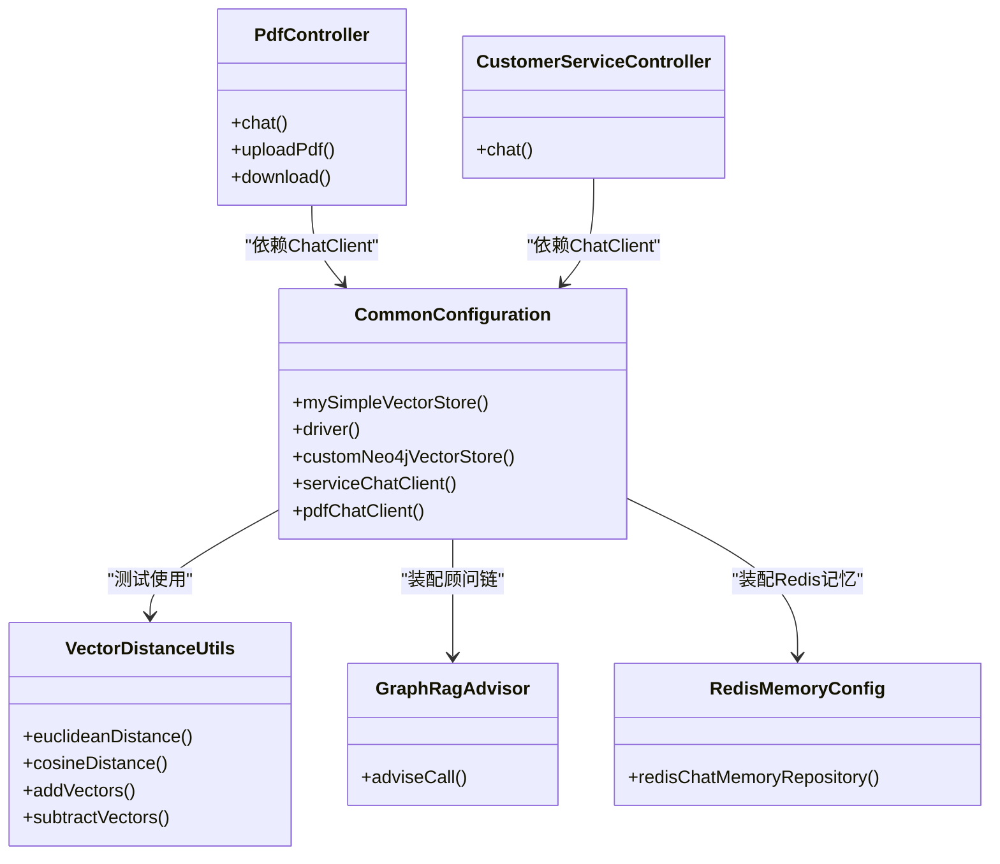
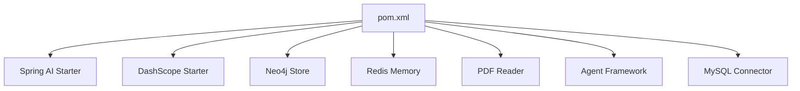

# AI模型配置

<cite>
**本文引用的文件**
- [application.yaml](file://src/main/resources/application.yaml)
- [CommonConfiguration.java](file://src/main/java/com/xdu/aibot/config/CommonConfiguration.java)
- [RedisMemoryConfig.java](file://src/main/java/com/xdu/aibot/config/RedisMemoryConfig.java)
- [VectorDistanceUtils.java](file://src/main/java/com/xdu/aibot/util/VectorDistanceUtils.java)
- [pom.xml](file://pom.xml)
- [AIbotApplication.java](file://src/main/java/com/xdu/aibot/AIbotApplication.java)
- [PdfController.java](file://src/main/java/com/xdu/aibot/controller/PdfController.java)
- [CustomerServiceController.java](file://src/main/java/com/xdu/aibot/controller/CustomerServiceController.java)
- [SystemConstants.java](file://src/main/java/com/xdu/aibot/constant/SystemConstants.java)
- [GraphRagAdvisor.java](file://src/main/java/com/xdu/aibot/advisor/GraphRagAdvisor.java)
- [AIbotApplicationTests.java](file://src/test/java/com/xdu/aibot/AIbotApplicationTests.java)
- [chat-pdf.properties](file://chat-pdf.properties)
</cite>

## 目录
1. [简介](#简介)
2. [项目结构](#项目结构)
3. [核心组件](#核心组件)
4. [架构总览](#架构总览)
5. [详细组件分析](#详细组件分析)
6. [依赖分析](#依赖分析)
7. [性能考虑](#性能考虑)
8. [故障排查指南](#故障排查指南)
9. [结论](#结论)
10. [附录](#附录)

## 简介
本文件面向AI模型配置与管理，围绕DashScope与OpenAI模型在Spring AI框架中的集成方式，系统梳理API密钥设置、模型选择、温度参数、嵌入维度配置，以及向量存储（Neo4j向量索引）的索引名称、距离类型与嵌入维度设置。文档还提供Spring Boot应用启动、控制器与客户端装配、内存与日志配置、以及基于测试用例的向量距离计算实践，帮助读者完成从配置到调优的全链路落地。

## 项目结构
项目采用Spring Boot标准目录结构，核心配置集中在资源目录下的application.yaml，业务配置通过Java配置类注入，控制器负责对外接口，工具类提供向量距离计算能力。

图表来源
- [AIbotApplication.java:1-16](file://src/main/java/com/xdu/aibot/AIbotApplication.java#L1-L16)
- [application.yaml:1-59](file://src/main/resources/application.yaml#L1-L59)
- [CommonConfiguration.java:34-129](file://src/main/java/com/xdu/aibot/config/CommonConfiguration.java#L34-L129)
- [RedisMemoryConfig.java:1-26](file://src/main/java/com/xdu/aibot/config/RedisMemoryConfig.java#L1-L26)
- [PdfController.java:1-98](file://src/main/java/com/xdu/aibot/controller/PdfController.java#L1-L98)
- [CustomerServiceController.java:1-35](file://src/main/java/com/xdu/aibot/controller/CustomerServiceController.java#L1-L35)
- [GraphRagAdvisor.java:41-73](file://src/main/java/com/xdu/aibot/advisor/GraphRagAdvisor.java#L41-L73)
- [VectorDistanceUtils.java:1-111](file://src/main/java/com/xdu/aibot/util/VectorDistanceUtils.java#L1-L111)
- [AIbotApplicationTests.java:1-74](file://src/test/java/com/xdu/aibot/AIbotApplicationTests.java#L1-L74)

章节来源
- [AIbotApplication.java:1-16](file://src/main/java/com/xdu/aibot/AIbotApplication.java#L1-L16)
- [application.yaml:1-59](file://src/main/resources/application.yaml#L1-L59)

## 核心组件
- Spring AI配置与模型参数
  - OpenAI兼容模式：通过基础URL指向DashScope兼容端点，使用DashScope API密钥；聊天模型与嵌入模型分别配置模型名与温度、维度等参数。
  - DashScope集成：通过Alibaba Cloud AI Starter引入DashScope支持。
- 向量存储配置
  - Neo4j向量索引：索引名称、距离类型（余弦）、嵌入维度、标签与属性、初始化Schema等。
- 聊天客户端与顾问
  - ChatClient装配：默认系统提示、日志顾问、消息窗口记忆、工具、以及针对PDF问答的“基于向量检索”的顾问链。
- 内存与日志
  - Redis聊天记忆仓库；日志级别对Spring AI、Neo4j、MyBatis等模块开启调试。

章节来源
- [application.yaml:9-30](file://src/main/resources/application.yaml#L9-L30)
- [CommonConfiguration.java:47-129](file://src/main/java/com/xdu/aibot/config/CommonConfiguration.java#L47-L129)
- [RedisMemoryConfig.java:18-25](file://src/main/java/com/xdu/aibot/config/RedisMemoryConfig.java#L18-L25)
- [SystemConstants.java:4-30](file://src/main/java/com/xdu/aibot/constant/SystemConstants.java#L4-L30)

## 架构总览
下图展示了从HTTP请求到模型推理与向量检索的整体流程，包括DashScope/OpenAI兼容模式、嵌入维度、Neo4j向量索引与图RAG增强。

图表来源
- [PdfController.java:42-55](file://src/main/java/com/xdu/aibot/controller/PdfController.java#L42-L55)
- [CommonConfiguration.java:90-127](file://src/main/java/com/xdu/aibot/config/CommonConfiguration.java#L90-L127)
- [application.yaml:17-29](file://src/main/resources/application.yaml#L17-L29)
- [VectorDistanceUtils.java:18-62](file://src/main/java/com/xdu/aibot/util/VectorDistanceUtils.java#L18-L62)

## 详细组件分析

### DashScope与OpenAI模型配置
- API密钥设置
  - OpenAI基础URL指向DashScope兼容端点，使用环境变量注入的DashScope API密钥。
- 模型选择与参数
  - 聊天模型：模型名、温度参数。
  - 嵌入模型：模型名、维度（1536）。
- Spring AI集成
  - 通过依赖管理引入Spring AI与DashScope Starter，实现OpenAI兼容模式下的DashScope接入。

章节来源
- [application.yaml:17-29](file://src/main/resources/application.yaml#L17-L29)
- [pom.xml:39-84](file://pom.xml#L39-L84)

### 向量存储配置（Neo4j）
- 索引名称与距离类型
  - 索引名称自定义；距离类型为余弦距离。
- 嵌入维度设置
  - 统一设置为1536，与嵌入模型维度一致。
- Schema初始化
  - 初始化Schema，自动创建所需索引与约束。
- 标签与属性
  - 文档标签与嵌入属性可配置，便于后续检索与可视化。
- 批处理策略
  - 使用Token计数批处理策略，提升批量写入效率。

章节来源
- [application.yaml:10-16](file://src/main/resources/application.yaml#L10-L16)
- [CommonConfiguration.java:58-70](file://src/main/java/com/xdu/aibot/config/CommonConfiguration.java#L58-L70)

### Spring AI客户端与顾问链
- 客户端装配
  - 默认系统提示、日志顾问、消息窗口记忆（Redis），并注册工具。
- PDF问答顾问链
  - 日志顾问 → 消息记忆顾问 → 基于向量检索的问答顾问（相似度阈值、TopK） → 图RAG顾问 → 自定义拦截顾问。
- 检索参数
  - 相似度阈值与TopK在顾问中集中配置，便于调参。

章节来源
- [CommonConfiguration.java:73-127](file://src/main/java/com/xdu/aibot/config/CommonConfiguration.java#L73-L127)
- [SystemConstants.java:4-30](file://src/main/java/com/xdu/aibot/constant/SystemConstants.java#L4-L30)

### 控制器与接口
- PDF问答接口
  - 上传PDF、下载PDF、基于向量检索的问答。
  - 过滤表达式限制仅检索当前文件的文档。
- 客服问答接口
  - 基于系统提示与工具的问答流。

章节来源
- [PdfController.java:26-98](file://src/main/java/com/xdu/aibot/controller/PdfController.java#L26-L98)
- [CustomerServiceController.java:16-35](file://src/main/java/com/xdu/aibot/controller/CustomerServiceController.java#L16-L35)

### 向量距离工具与测试
- 工具能力
  - 欧氏距离、余弦距离、向量加减法，含参数校验与零向量异常处理。
- 测试验证
  - 通过嵌入模型生成向量，结合工具计算距离，验证维度一致性与距离函数正确性。

章节来源
- [VectorDistanceUtils.java:1-111](file://src/main/java/com/xdu/aibot/util/VectorDistanceUtils.java#L1-L111)
- [AIbotApplicationTests.java:25-74](file://src/test/java/com/xdu/aibot/AIbotApplicationTests.java#L25-L74)

### 类关系与装配

图表来源
- [CommonConfiguration.java:34-129](file://src/main/java/com/xdu/aibot/config/CommonConfiguration.java#L34-L129)
- [RedisMemoryConfig.java:1-26](file://src/main/java/com/xdu/aibot/config/RedisMemoryConfig.java#L1-L26)
- [PdfController.java:1-98](file://src/main/java/com/xdu/aibot/controller/PdfController.java#L1-L98)
- [CustomerServiceController.java:1-35](file://src/main/java/com/xdu/aibot/controller/CustomerServiceController.java#L1-L35)
- [VectorDistanceUtils.java:1-111](file://src/main/java/com/xdu/aibot/util/VectorDistanceUtils.java#L1-L111)
- [GraphRagAdvisor.java:41-73](file://src/main/java/com/xdu/aibot/advisor/GraphRagAdvisor.java#L41-L73)

## 依赖分析
- Spring AI与DashScope集成
  - 通过依赖管理引入Spring AI BOM与Alibaba Cloud AI Starter，确保版本兼容与功能可用。
- 数据与存储
  - Neo4j驱动与Spring Data Neo4j用于图数据库访问；Redis用于聊天记忆；MySQL用于历史记录等持久化。
- 日志与监控
  - 对Spring AI、Neo4j、MyBatis等模块开启调试日志，便于定位问题。

图表来源
- [pom.xml:39-115](file://pom.xml#L39-L115)

章节来源
- [pom.xml:117-127](file://pom.xml#L117-L127)
- [application.yaml:52-59](file://src/main/resources/application.yaml#L52-L59)

## 性能考虑
- 嵌入维度与相似度阈值
  - 维度固定为1536，需与嵌入模型一致；相似度阈值与TopK影响召回与速度，建议在生产环境通过A/B实验确定最优值。
- 批处理策略
  - 使用Token计数批处理策略，减少网络往返与写入开销。
- 检索过滤
  - 通过文件名过滤表达式缩小检索范围，降低无关文档干扰。
- 缓存与持久化
  - Redis缓存会话与消息，减少重复计算；向量存储持久化至Neo4j，保障重启后可用。

章节来源
- [CommonConfiguration.java:58-70](file://src/main/java/com/xdu/aibot/config/CommonConfiguration.java#L58-L70)
- [PdfController.java:52-54](file://src/main/java/com/xdu/aibot/controller/PdfController.java#L52-L54)
- [RedisMemoryConfig.java:18-25](file://src/main/java/com/xdu/aibot/config/RedisMemoryConfig.java#L18-L25)

## 故障排查指南
- API密钥与URL
  - 确认环境变量已正确注入DashScope API密钥；OpenAI基础URL指向DashScope兼容端点。
- 嵌入维度不一致
  - 若向量维度与嵌入模型不一致，会导致检索异常；检查配置与测试用例输出的一致性。
- Neo4j连接与Schema
  - 检查Neo4j认证信息与网络连通性；若首次运行，确保Schema初始化成功。
- 控制器参数
  - PDF问答需提供有效的chatId与已上传的文件；否则会触发未找到文件的异常。
- 日志定位
  - 开启Spring AI与Neo4j调试日志，观察顾问链与检索过程的详细输出。

章节来源
- [application.yaml:17-21](file://src/main/resources/application.yaml#L17-L21)
- [application.yaml:4-8](file://src/main/resources/application.yaml#L4-L8)
- [PdfController.java:45-47](file://src/main/java/com/xdu/aibot/controller/PdfController.java#L45-L47)
- [application.yaml:52-59](file://src/main/resources/application.yaml#L52-L59)

## 结论
本项目通过Spring AI与DashScope/OpenAI兼容模式实现了稳定的对话与嵌入能力，并以Neo4j作为向量存储后端，结合图RAG增强与Redis记忆，形成完整的RAG问答链路。配置上强调了API密钥注入、模型参数与嵌入维度一致性、向量索引与距离类型的合理设置，并提供了测试用例与日志定位手段，便于在实际环境中进行参数调优与性能优化。

## 附录

### 配置清单与建议
- API密钥管理
  - 使用环境变量注入DashScope API密钥，避免硬编码。
- 模型参数调优
  - 温度参数影响创造性与稳定性，建议在0.3~0.9区间内评估；模型名与维度需与嵌入模型一致。
- 向量存储配置
  - 索引名称与距离类型按业务需求设定；初始化Schema确保索引存在；标签与属性便于后续治理。
- 检索参数
  - 相似度阈值与TopK需结合数据规模与召回率目标调整；可通过测试用例验证距离函数与维度一致性。
- 安全与版本控制
  - 密钥轮换与最小权限原则；模型版本与索引版本分离管理，避免升级带来的不兼容风险。

章节来源
- [application.yaml:17-29](file://src/main/resources/application.yaml#L17-L29)
- [application.yaml:10-16](file://src/main/resources/application.yaml#L10-L16)
- [CommonConfiguration.java:58-70](file://src/main/java/com/xdu/aibot/config/CommonConfiguration.java#L58-L70)
- [AIbotApplicationTests.java:25-74](file://src/test/java/com/xdu/aibot/AIbotApplicationTests.java#L25-L74)