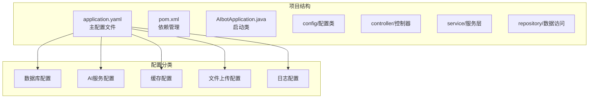
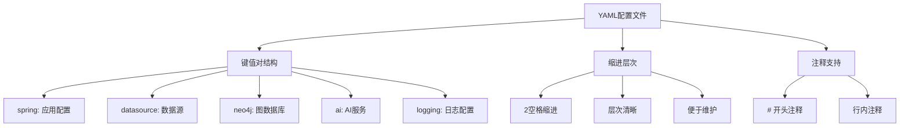
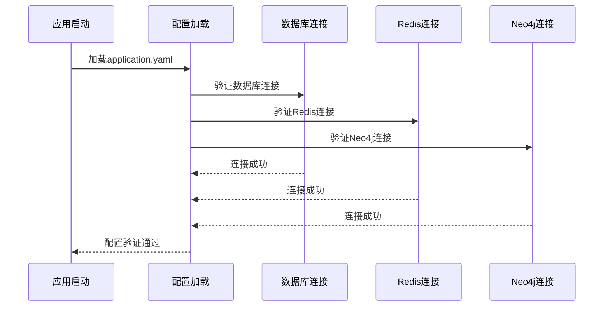
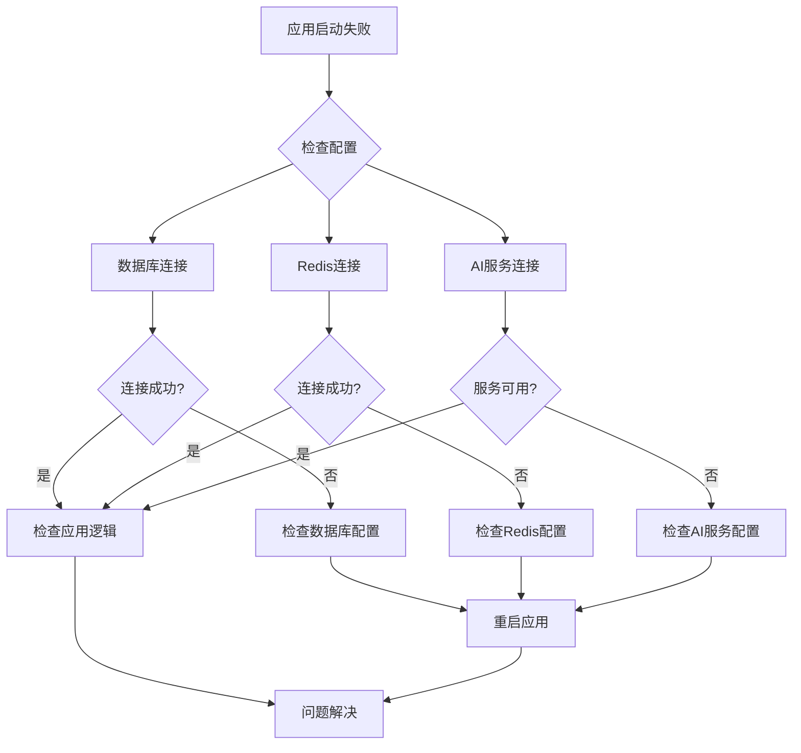

# 应用配置详解

<cite>
**本文档引用的文件**
- [application.yaml](file://src/main/resources/application.yaml)
- [pom.xml](file://pom.xml)
- [AIbotApplication.java](file://src/main/java/com/xdu/aibot/AIbotApplication.java)
- [CommonConfiguration.java](file://src/main/java/com/xdu/aibot/config/CommonConfiguration.java)
- [MvcConfiguration.java](file://src/main/java/com/xdu/aibot/config/MvcConfiguration.java)
- [RedisMemoryConfig.java](file://src/main/java/com/xdu/aibot/config/RedisMemoryConfig.java)
- [chat-pdf.properties](file://chat-pdf.properties)
</cite>

## 目录
1. [简介](#简介)
2. [项目结构概览](#项目结构概览)
3. [核心配置参数详解](#核心配置参数详解)
4. [配置文件结构与语法](#配置文件结构与语法)
5. [配置优先级与覆盖规则](#配置优先级与覆盖规则)
6. [配置验证方法](#配置验证方法)
7. [常见配置错误排查](#常见配置错误排查)
8. [环境配置差异对比](#环境配置差异对比)
9. [最佳实践建议](#最佳实践建议)
10. [故障排除指南](#故障排除指南)

## 简介

AIbot应用是一个基于Spring Boot构建的AI增强应用，集成了向量存储、知识图谱查询和PDF文档问答功能。本文件详细解析了application.yaml配置文件中的各项配置参数，帮助开发者理解和优化应用配置。

## 项目结构概览

AIbot应用采用标准的Spring Boot项目结构，配置文件位于`src/main/resources/`目录下：



**图表来源**
- [application.yaml:1-59](file://src/main/resources/application.yaml#L1-L59)
- [pom.xml:1-139](file://pom.xml#L1-L139)

**章节来源**
- [application.yaml:1-59](file://src/main/resources/application.yaml#L1-L59)
- [pom.xml:1-139](file://pom.xml#L1-L139)

## 核心配置参数详解

### Spring应用基本信息

**应用名称配置**
- 配置路径：`spring.application.name`
- 当前值：AIbot
- 作用：定义Spring应用的显示名称，用于监控和日志标识

**章节来源**
- [application.yaml:2-3](file://src/main/resources/application.yaml#L2-L3)

### 数据库连接配置

**MySQL数据库配置**
- 配置路径：`datasource`
- 驱动类名：`com.mysql.cj.jdbc.Driver`
- 连接URL：`jdbc:mysql://localhost:3306/aibot?useSSL=false&serverTimezone=UTC&allowPublicKeyRetrieval=true`
- 用户名：`root`
- 密码：`1234`

**MyBatis-Plus集成**
- 版本：3.5.10.1
- 作用：提供ORM映射和数据库操作支持

**章节来源**
- [application.yaml:30-34](file://src/main/resources/application.yaml#L30-L34)
- [pom.xml:48-52](file://pom.xml#L48-L52)

### Neo4j图数据库配置

**连接配置**
- URI：`neo4j+s://64e77422.databases.neo4j.io`
- 用户名：`neo4j`
- 密码：`a1k4DzQOZA7TPJa_KoYh8vdXnQdkS3N3QLcYDThQGVM`

**向量存储配置**
- 初始化模式：`initialize-schema: true`
- 数据库名称：`neo4j`
- 索引名称：`custom-index`
- 嵌入维度：`1536`
- 距离类型：`cosine`

**章节来源**
- [application.yaml:4-16](file://src/main/resources/application.yaml#L4-L16)
- [CommonConfiguration.java:58-70](file://src/main/java/com/xdu/aibot/config/CommonConfiguration.java#L58-L70)

### AI服务配置

**DashScope配置**
- API密钥：`${DASHSCOPE_API_KEY}` (环境变量)
- 作用：阿里云通义千问大模型服务

**OpenAI兼容配置**
- 基础URL：`https://dashscope.aliyuncs.com/compatible-mode/`
- API密钥：`${DASHSCOPE_API_KEY}` (环境变量)
- 聊天模型：`qwen-flash`
- 温度参数：`0.7`
- 嵌入模型：`text-embedding-v4`
- 维度：`1536`

**章节来源**
- [application.yaml:17-29](file://src/main/resources/application.yaml#L17-L29)

### Redis缓存配置

**连接配置**
- 主机：`127.0.0.1`
- 端口：`6379`
- 密码：`243345`

**连接池配置**
- 最大活跃连接：`10`
- 最大空闲连接：`10`
- 最小空闲连接：`1`
- 连接回收间隔：`10s`

**章节来源**
- [application.yaml:35-45](file://src/main/resources/application.yaml#L35-L45)
- [RedisMemoryConfig.java:11-24](file://src/main/java/com/xdu/aibot/config/RedisMemoryConfig.java#L11-L24)

### 文件上传配置

**大小限制**
- 单文件最大：`30MB`
- 请求总最大：`40MB`

**章节来源**
- [application.yaml:46-49](file://src/main/resources/application.yaml#L46-L49)

### JSON序列化配置

**属性过滤**
- 配置：`default-property-inclusion: non_null`
- 作用：在JSON处理时忽略空值字段

**章节来源**
- [application.yaml:50-51](file://src/main/resources/application.yaml#L50-L51)

### 日志级别配置

**调试级别设置**
- Spring AI框架：`debug`
- Spring Data Neo4j：`debug`
- 应用包：`debug`
- Neo4j驱动：`debug`
- MyBatis Plus：`debug`
- MyBatis：`debug`

**章节来源**
- [application.yaml:52-59](file://src/main/resources/application.yaml#L52-L59)

## 配置文件结构与语法

### YAML语法规范

application.yaml采用标准的YAML格式，具有以下特点：



**图表来源**
- [application.yaml:1-59](file://src/main/resources/application.yaml#L1-L59)

### 配置分组说明

配置文件按照功能模块进行分组：

1. **应用基础配置** (`spring.application`)
2. **数据库配置** (`datasource`)
3. **图数据库配置** (`neo4j`)
4. **AI服务配置** (`ai`)
5. **缓存配置** (`data.redis`)
6. **文件上传配置** (`servlet.multipart`)
7. **序列化配置** (`jackson`)
8. **日志配置** (`logging.level`)

**章节来源**
- [application.yaml:1-59](file://src/main/resources/application.yaml#L1-L59)

## 配置优先级与覆盖规则

### Spring Boot配置优先级

Spring Boot遵循特定的配置优先级顺序，从最高到最低：

```mermaid
graph TB
subgraph "配置优先级顺序"
A[命令行参数<br/>最高优先级]
B[系统环境变量]
C[JVM系统属性]
D[application-{profile}.yaml]
E[application.yaml<br/>最低优先级]
end
A --> B
B --> C
C --> D
D --> E
```

**图表来源**
- [application.yaml:17-21](file://src/main/resources/application.yaml#L17-L21)

### 环境变量覆盖机制

配置文件中使用了环境变量占位符：

- `${DASHSCOPE_API_KEY}` - DashScope API密钥
- `${SPRING_PROFILES_ACTIVE}` - 激活的配置文件

**章节来源**
- [application.yaml:17-21](file://src/main/resources/application.yaml#L17-L21)

## 配置验证方法

### 启动时验证

应用启动时会自动验证配置的有效性：



**图表来源**
- [CommonConfiguration.java:52-56](file://src/main/java/com/xdu/aibot/config/CommonConfiguration.java#L52-L56)
- [RedisMemoryConfig.java:19-24](file://src/main/java/com/xdu/aibot/config/RedisMemoryConfig.java#L19-L24)

### 手动验证步骤

1. **检查配置文件语法**
   - 使用在线YAML验证器
   - 确保缩进正确（2空格）

2. **验证数据库连接**
   ```bash
   # 检查MySQL服务状态
   mysql -u root -p
   
   # 验证连接字符串
   telnet localhost 3306
   ```

3. **验证Redis连接**
   ```bash
   # 检查Redis服务
   redis-cli ping
   
   # 验证连接信息
   redis-cli info
   ```

4. **验证Neo4j连接**
   ```bash
   # 使用浏览器访问Neo4j浏览器
   # 或使用Neo4j Desktop
   ```

**章节来源**
- [CommonConfiguration.java:52-56](file://src/main/java/com/xdu/aibot/config/CommonConfiguration.java#L52-L56)
- [RedisMemoryConfig.java:19-24](file://src/main/java/com/xdu/aibot/config/RedisMemoryConfig.java#L19-L24)

## 常见配置错误排查

### 数据库连接问题

**问题症状**
- 应用启动失败
- 数据库连接超时
- SQL执行异常

**排查步骤**
1. 验证MySQL服务是否运行
2. 检查连接URL格式
3. 确认用户名密码正确
4. 验证数据库是否存在

**解决方案**
```yaml
# 示例：修正数据库配置
datasource:
  driver-class-name: com.mysql.cj.jdbc.Driver
  url: jdbc:mysql://localhost:3306/aibot?useSSL=false&serverTimezone=UTC&allowPublicKeyRetrieval=true
  username: root
  password: your_password
```

### Redis连接问题

**问题症状**
- 缓存操作失败
- 会话存储异常
- 性能下降

**排查步骤**
1. 检查Redis服务状态
2. 验证网络连通性
3. 确认密码正确
4. 检查防火墙设置

**解决方案**
```yaml
# 示例：修正Redis配置
data:
  redis:
    host: 127.0.0.1
    port: 6379
    password: your_redis_password
    lettuce:
      pool:
        max-active: 20
        max-idle: 10
        min-idle: 1
        time-between-eviction-runs: 30s
```

### AI服务配置问题

**问题症状**
- API调用失败
- 模型响应异常
- 认证错误

**排查步骤**
1. 验证API密钥有效性
2. 检查网络连接
3. 确认模型可用性
4. 查看API限流状态

**解决方案**
```yaml
# 示例：修正AI配置
ai:
  dashscope:
    api-key: ${DASHSCOPE_API_KEY}
  openai:
    base-url: https://dashscope.aliyuncs.com/compatible-mode/
    api-key: ${DASHSCOPE_API_KEY}
    chat:
      options:
        model: qwen-flash
        temperature: 0.7
    embedding:
      options:
        model: text-embedding-v4
        dimensions: 1536
```

### 文件上传问题

**问题症状**
- 文件上传失败
- 内存溢出
- 上传超时

**排查步骤**
1. 检查磁盘空间
2. 验证文件大小限制
3. 确认临时目录权限
4. 检查网络稳定性

**解决方案**
```yaml
# 示例：调整文件上传限制
servlet:
  multipart:
    max-file-size: 50MB
    max-request-size: 100MB
```

**章节来源**
- [application.yaml:30-49](file://src/main/resources/application.yaml#L30-L49)

## 环境配置差异对比

### 开发环境配置

开发环境注重调试和快速迭代：

```yaml
# 开发环境示例
spring:
  application:
    name: AIbot-dev
  datasource:
    url: jdbc:mysql://localhost:3306/aibot_dev
    username: dev_user
    password: dev_password
  logging:
    level:
      com.xdu.aibot: debug
      org.springframework: debug
```

### 测试环境配置

测试环境强调稳定性和一致性：

```yaml
# 测试环境示例
spring:
  application:
    name: AIbot-test
  datasource:
    url: jdbc:mysql://test-db:3306/aibot_test
    username: test_user
    password: test_password
  logging:
    level:
      com.xdu.aibot: info
      org.springframework: warn
```

### 生产环境配置

生产环境关注性能和安全性：

```yaml
# 生产环境示例
spring:
  application:
    name: AIbot-prod
  datasource:
    url: jdbc:mysql://prod-db:3306/aibot_prod
    username: prod_user
    password: ${DB_PASSWORD}
    hikari:
      maximum-pool-size: 20
      connection-timeout: 30000
  logging:
    level:
      com.xdu.aibot: warn
      org.springframework: error
  ai:
    dashscope:
      api-key: ${DASHSCOPE_API_KEY}
```

### 环境切换机制

使用Spring Profiles实现环境隔离：

```yaml
# application-dev.yaml
spring:
  profiles:
    active: dev
```

**章节来源**
- [application.yaml:17-21](file://src/main/resources/application.yaml#L17-L21)

## 最佳实践建议

### 安全配置建议

1. **敏感信息保护**
   - 使用环境变量存储API密钥
   - 不要在代码库中提交敏感配置
   - 定期轮换API密钥

2. **数据库安全**
   - 使用专用数据库用户
   - 实施连接池安全配置
   - 启用SSL连接

3. **网络配置**
   - 限制数据库访问IP
   - 配置防火墙规则
   - 使用VPN访问生产数据库

### 性能优化建议

1. **连接池配置**
   - 根据并发需求调整连接数
   - 设置合理的超时时间
   - 启用连接健康检查

2. **缓存策略**
   - 合理设置缓存过期时间
   - 实施缓存预热机制
   - 监控缓存命中率

3. **日志管理**
   - 生产环境使用info级别
   - 配置日志轮转
   - 分离应用日志和访问日志

### 监控和维护

1. **健康检查**
   - 实现自定义健康检查端点
   - 监控数据库连接状态
   - 跟踪AI服务调用统计

2. **备份策略**
   - 定期备份数据库
   - 备份重要配置文件
   - 测试恢复流程

3. **版本管理**
   - 使用Git管理配置变更
   - 记录重要的配置修改
   - 实施配置回滚机制

## 故障排除指南

### 常见问题诊断流程



### 诊断工具和命令

1. **数据库诊断**
   ```bash
   # MySQL连接测试
   mysql -h localhost -P 3306 -u root -p
   
   # 检查数据库状态
   mysqladmin -u root -p status
   
   # 查看连接数
   mysqladmin -u root -p processlist
   ```

2. **Redis诊断**
   ```bash
   # Redis连接测试
   redis-cli -h localhost -p 6379 ping
   
   # 检查Redis状态
   redis-cli info
   
   # 查看内存使用
   redis-cli info memory
   ```

3. **Neo4j诊断**
   ```bash
   # Neo4j连接测试
   # 使用浏览器访问Neo4j浏览器
   
   # 检查数据库状态
   curl -u neo4j:password http://localhost:7474/db/neo4j/_status
   ```

### 性能问题排查

1. **慢查询分析**
   - 启用MySQL慢查询日志
   - 分析查询执行计划
   - 优化索引设计

2. **内存使用分析**
   - 监控JVM内存使用
   - 分析GC行为
   - 调整堆大小参数

3. **网络延迟分析**
   - 使用ping测试延迟
   - 使用traceroute跟踪路由
   - 分析DNS解析时间

### 配置回滚策略

当配置修改导致问题时，实施快速回滚：

1. **备份当前配置**
   ```bash
   cp application.yaml application.yaml.backup
   ```

2. **恢复到上一个版本**
   ```bash
   git checkout HEAD~1 -- application.yaml
   ```

3. **验证回滚结果**
   ```bash
   ./mvnw spring-boot:run
   ```

### 监控和告警

建立完善的监控体系：

1. **应用监控**
   - JVM指标监控
   - 应用健康检查
   - 错误率统计

2. **基础设施监控**
   - 数据库性能指标
   - Redis连接状态
   - 网络延迟监控

3. **业务监控**
   - AI服务调用统计
   - 用户行为分析
   - 业务指标追踪

**章节来源**
- [CommonConfiguration.java:52-56](file://src/main/java/com/xdu/aibot/config/CommonConfiguration.java#L52-L56)
- [RedisMemoryConfig.java:19-24](file://src/main/java/com/xdu/aibot/config/RedisMemoryConfig.java#L19-L24)

## 结论

AIbot应用的配置系统采用了现代化的Spring Boot配置方式，通过application.yaml实现了集中化的配置管理。本文档详细解析了各个配置参数的作用、语法规范、优先级规则以及故障排除方法。

关键要点：
- 配置文件采用YAML格式，具有良好的可读性和维护性
- 支持多环境配置，通过Profiles实现环境隔离
- 敏感信息通过环境变量管理，提高了安全性
- 提供了完整的配置验证和故障排除指南

建议在实际部署中：
- 建立配置变更管理制度
- 实施配置备份和回滚机制
- 建立监控告警体系
- 定期审查和优化配置参数

通过遵循本文档的最佳实践，可以确保AIbot应用在各种环境下都能稳定运行，并为后续的功能扩展提供良好的配置基础。