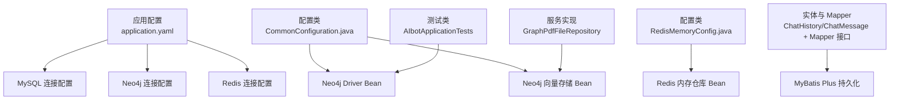
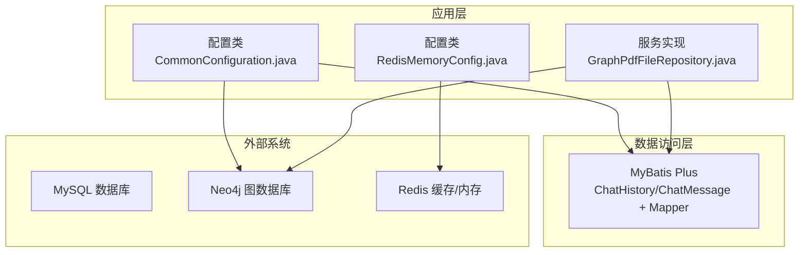
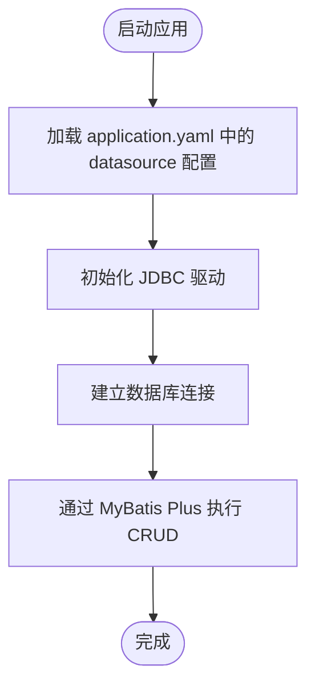
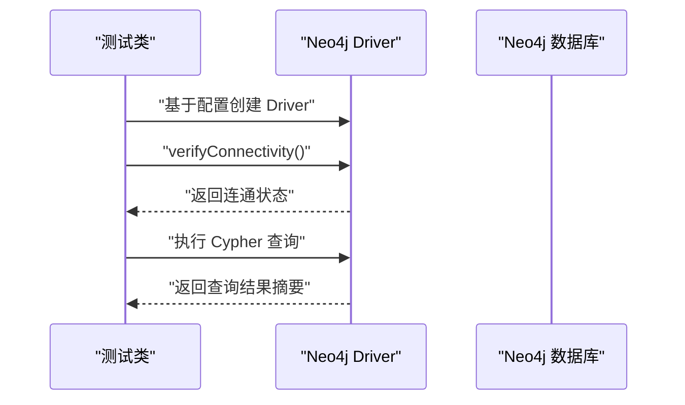
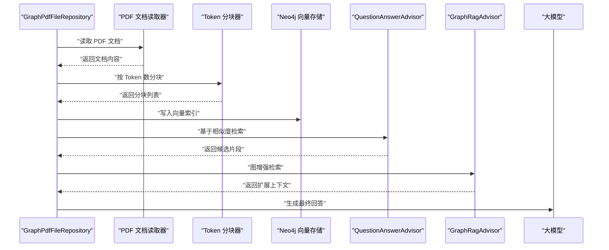
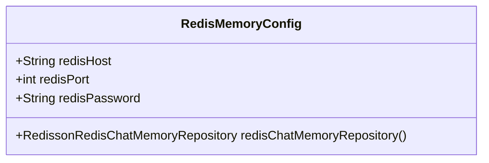
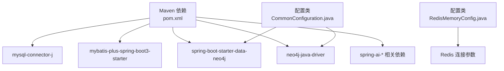

# 数据库配置

<cite>
**本文引用的文件**
- [application.yaml](file://src/main/resources/application.yaml)
- [CommonConfiguration.java](file://src/main/java/com/xdu/aibot/config/CommonConfiguration.java)
- [RedisMemoryConfig.java](file://src/main/java/com/xdu/aibot/config/RedisMemoryConfig.java)
- [ChatHistory.java](file://src/main/java/com/xdu/aibot/pojo/entity/ChatHistory.java)
- [ChatMessage.java](file://src/main/java/com/xdu/aibot/pojo/entity/ChatMessage.java)
- [ChatHistoryMapper.java](file://src/main/java/com/xdu/aibot/mapper/ChatHistoryMapper.java)
- [GraphPdfFileRepository.java](file://src/main/java/com/xdu/aibot/repository/Impl/GraphPdfFileRepository.java)
- [AIbotApplicationTests.java](file://src/test/java/com/xdu/aibot/AIbotApplicationTests.java)
- [pom.xml](file://pom.xml)
</cite>

## 目录
1. [简介](#简介)
2. [项目结构](#项目结构)
3. [核心组件](#核心组件)
4. [架构总览](#架构总览)
5. [详细组件分析](#详细组件分析)
6. [依赖分析](#依赖分析)
7. [性能考虑](#性能考虑)
8. [故障排除指南](#故障排除指南)
9. [结论](#结论)
10. [附录](#附录)

## 简介
本文件系统性梳理本项目的数据库配置与管理方案，覆盖以下方面：
- MySQL 数据库连接配置：连接 URL、驱动程序、用户名与密码设置
- MyBatis Plus 配置要点与数据库连接池设置
- Neo4j 图数据库配置：连接 URI、认证信息与向量存储配置
- 向量检索与图增强检索的协同工作流
- 最佳实践、性能优化建议与常见故障排除方法
- 不同环境下的配置差异与迁移策略

## 项目结构
项目采用 Spring Boot 标准目录组织，数据库相关配置集中在资源文件与配置类中：
- application.yaml：集中式配置，包含 MySQL、Neo4j、Redis、日志等
- CommonConfiguration.java：Neo4j Driver 与自定义向量存储 Bean 的装配
- RedisMemoryConfig.java：Redis 连接与内存仓库装配
- MyBatis Plus 实体与 Mapper：ChatHistory、ChatMessage 及其 Mapper 接口
- GraphPdfFileRepository：PDF 文档读取、分块与写入 Neo4j 向量索引
- AIbotApplicationTests：Neo4j 连通性与基础查询验证

图表来源
- [application.yaml:1-59](file://src/main/resources/application.yaml#L1-L59)
- [CommonConfiguration.java:34-128](file://src/main/java/com/xdu/aibot/config/CommonConfiguration.java#L34-L128)
- [RedisMemoryConfig.java:8-26](file://src/main/java/com/xdu/aibot/config/RedisMemoryConfig.java#L8-L26)
- [ChatHistory.java:8-23](file://src/main/java/com/xdu/aibot/pojo/entity/ChatHistory.java#L8-L23)
- [ChatMessage.java:8-27](file://src/main/java/com/xdu/aibot/pojo/entity/ChatMessage.java#L8-L27)
- [ChatHistoryMapper.java:1-10](file://src/main/java/com/xdu/aibot/mapper/ChatHistoryMapper.java#L1-L10)
- [GraphPdfFileRepository.java:26-36](file://src/main/java/com/xdu/aibot/repository/Impl/GraphPdfFileRepository.java#L26-L36)
- [AIbotApplicationTests.java:18-103](file://src/test/java/com/xdu/aibot/AIbotApplicationTests.java#L18-L103)

章节来源
- [application.yaml:1-59](file://src/main/resources/application.yaml#L1-L59)
- [CommonConfiguration.java:34-128](file://src/main/java/com/xdu/aibot/config/CommonConfiguration.java#L34-L128)
- [RedisMemoryConfig.java:8-26](file://src/main/java/com/xdu/aibot/config/RedisMemoryConfig.java#L8-L26)
- [ChatHistory.java:8-23](file://src/main/java/com/xdu/aibot/pojo/entity/ChatHistory.java#L8-L23)
- [ChatMessage.java:8-27](file://src/main/java/com/xdu/aibot/pojo/entity/ChatMessage.java#L8-L27)
- [ChatHistoryMapper.java:1-10](file://src/main/java/com/xdu/aibot/mapper/ChatHistoryMapper.java#L1-L10)
- [GraphPdfFileRepository.java:26-36](file://src/main/java/com/xdu/aibot/repository/Impl/GraphPdfFileRepository.java#L26-L36)
- [AIbotApplicationTests.java:18-103](file://src/test/java/com/xdu/aibot/AIbotApplicationTests.java#L18-L103)

## 核心组件
- MySQL 连接配置
  - 驱动类名：由依赖声明提供
  - 连接 URL：包含主机、端口、数据库名及必要参数
  - 用户名与密码：用于数据库认证
- MyBatis Plus
  - 使用注解映射实体与表，配合 Mapper 接口进行 CRUD
- Neo4j
  - 连接 URI、认证信息通过配置文件提供
  - 自定义向量存储 Bean，支持指定数据库名、索引名、嵌入维度与距离类型
  - 提供原生 Java Driver Bean，便于直接执行 Cypher 查询
- Redis
  - Redis 连接参数与连接池配置
  - Redisson 内存仓库 Bean，用于聊天记忆持久化

章节来源
- [application.yaml:30-45](file://src/main/resources/application.yaml#L30-L45)
- [ChatHistory.java:8-23](file://src/main/java/com/xdu/aibot/pojo/entity/ChatHistory.java#L8-L23)
- [ChatMessage.java:8-27](file://src/main/java/com/xdu/aibot/pojo/entity/ChatMessage.java#L8-L27)
- [ChatHistoryMapper.java:1-10](file://src/main/java/com/xdu/aibot/mapper/ChatHistoryMapper.java#L1-L10)
- [CommonConfiguration.java:37-70](file://src/main/java/com/xdu/aibot/config/CommonConfiguration.java#L37-L70)
- [RedisMemoryConfig.java:11-24](file://src/main/java/com/xdu/aibot/config/RedisMemoryConfig.java#L11-L24)

## 架构总览
下图展示数据库层在系统中的位置与交互关系：

图表来源
- [CommonConfiguration.java:34-128](file://src/main/java/com/xdu/aibot/config/CommonConfiguration.java#L34-L128)
- [RedisMemoryConfig.java:8-26](file://src/main/java/com/xdu/aibot/config/RedisMemoryConfig.java#L8-L26)
- [GraphPdfFileRepository.java:26-36](file://src/main/java/com/xdu/aibot/repository/Impl/GraphPdfFileRepository.java#L26-L36)
- [ChatHistory.java:8-23](file://src/main/java/com/xdu/aibot/pojo/entity/ChatHistory.java#L8-L23)
- [ChatMessage.java:8-27](file://src/main/java/com/xdu/aibot/pojo/entity/ChatMessage.java#L8-L27)
- [ChatHistoryMapper.java:1-10](file://src/main/java/com/xdu/aibot/mapper/ChatHistoryMapper.java#L1-L10)

## 详细组件分析

### MySQL 数据库连接配置
- 连接 URL
  - 来源：配置文件中的数据源 URL
  - 关键参数：主机、端口、数据库名、SSL、时区与公钥检索策略
- 驱动程序
  - 由 Maven 依赖提供，确保运行时可用
- 用户名与密码
  - 从配置文件读取，用于数据库认证
- MyBatis Plus 集成
  - 实体类通过注解映射到表
  - Mapper 接口继承基础接口以获得通用 CRUD 能力
- 连接池设置
  - 当前未在配置文件中显式声明连接池参数；如需优化可参考 Spring Boot 默认行为或引入连接池依赖后进行定制

图表来源
- [application.yaml:30-34](file://src/main/resources/application.yaml#L30-L34)
- [ChatHistory.java:8-23](file://src/main/java/com/xdu/aibot/pojo/entity/ChatHistory.java#L8-L23)
- [ChatMessage.java:8-27](file://src/main/java/com/xdu/aibot/pojo/entity/ChatMessage.java#L8-L27)
- [ChatHistoryMapper.java:1-10](file://src/main/java/com/xdu/aibot/mapper/ChatHistoryMapper.java#L1-L10)

章节来源
- [application.yaml:30-34](file://src/main/resources/application.yaml#L30-L34)
- [ChatHistory.java:8-23](file://src/main/java/com/xdu/aibot/pojo/entity/ChatHistory.java#L8-L23)
- [ChatMessage.java:8-27](file://src/main/java/com/xdu/aibot/pojo/entity/ChatMessage.java#L8-L27)
- [ChatHistoryMapper.java:1-10](file://src/main/java/com/xdu/aibot/mapper/ChatHistoryMapper.java#L1-L10)
- [pom.xml:43-52](file://pom.xml#L43-L52)

### Neo4j 图数据库配置与向量存储
- 连接 URI 与认证
  - 从配置文件读取，用于构建原生 Driver 与向量存储
- 向量存储配置
  - 数据库名、索引名、嵌入维度、距离类型、标签与属性名、是否初始化模式、批处理策略等
- 测试验证
  - 单元测试中直接使用原生 Driver 进行连通性检查与简单查询，验证配置正确性

图表来源
- [CommonConfiguration.java:52-56](file://src/main/java/com/xdu/aibot/config/CommonConfiguration.java#L52-L56)
- [AIbotApplicationTests.java:76-103](file://src/test/java/com/xdu/aibot/AIbotApplicationTests.java#L76-L103)

章节来源
- [application.yaml:4-8](file://src/main/resources/application.yaml#L4-L8)
- [application.yaml:10-16](file://src/main/resources/application.yaml#L10-L16)
- [CommonConfiguration.java:37-70](file://src/main/java/com/xdu/aibot/config/CommonConfiguration.java#L37-L70)
- [AIbotApplicationTests.java:76-103](file://src/test/java/com/xdu/aibot/AIbotApplicationTests.java#L76-L103)

### 向量检索与图增强检索工作流
- PDF 文档处理
  - 使用文档读取器提取文本，按 Token 数进行分块
  - 将分块后的文档写入 Neo4j 向量存储
- 检索流程
  - 通过向量相似度检索获取上下文
  - 结合图增强 Advisor 进行上下文扩展
  - 将最终提示交给大模型生成回答

图表来源
- [GraphPdfFileRepository.java:26-36](file://src/main/java/com/xdu/aibot/repository/Impl/GraphPdfFileRepository.java#L26-L36)
- [CommonConfiguration.java:90-127](file://src/main/java/com/xdu/aibot/config/CommonConfiguration.java#L90-L127)

章节来源
- [GraphPdfFileRepository.java:26-36](file://src/main/java/com/xdu/aibot/repository/Impl/GraphPdfFileRepository.java#L26-L36)
- [CommonConfiguration.java:90-127](file://src/main/java/com/xdu/aibot/config/CommonConfiguration.java#L90-L127)

### Redis 连接与内存仓库
- Redis 连接参数
  - 主机、端口、密码等从配置文件读取
- 连接池配置
  - 最大活跃数、最大空闲、最小空闲、驱逐间隔等
- 内存仓库
  - 使用 Redisson 构建聊天记忆仓库，供消息窗口记忆使用

图表来源
- [RedisMemoryConfig.java:8-26](file://src/main/java/com/xdu/aibot/config/RedisMemoryConfig.java#L8-L26)
- [application.yaml:35-45](file://src/main/resources/application.yaml#L35-L45)

章节来源
- [RedisMemoryConfig.java:8-26](file://src/main/java/com/xdu/aibot/config/RedisMemoryConfig.java#L8-L26)
- [application.yaml:35-45](file://src/main/resources/application.yaml#L35-L45)

## 依赖分析
- Maven 依赖
  - MySQL 驱动：用于 JDBC 连接
  - MyBatis Plus Starter：简化 ORM 与 Mapper 配置
  - Neo4j 相关依赖：原生 Driver 与 Spring Data Neo4j Starter
  - Spring AI 向量存储与 PDF 读取相关依赖
- 配置文件与代码耦合
  - 配置类通过 @Value 注解读取 application.yaml 中的 Neo4j 与 Redis 参数
  - 向量存储 Bean 明确指定数据库名、索引名、嵌入维度与距离类型

图表来源
- [pom.xml:33-116](file://pom.xml#L33-L116)
- [CommonConfiguration.java:34-128](file://src/main/java/com/xdu/aibot/config/CommonConfiguration.java#L34-L128)
- [RedisMemoryConfig.java:8-26](file://src/main/java/com/xdu/aibot/config/RedisMemoryConfig.java#L8-L26)

章节来源
- [pom.xml:33-116](file://pom.xml#L33-L116)
- [CommonConfiguration.java:34-128](file://src/main/java/com/xdu/aibot/config/CommonConfiguration.java#L34-L128)
- [RedisMemoryConfig.java:8-26](file://src/main/java/com/xdu/aibot/config/RedisMemoryConfig.java#L8-L26)

## 性能考虑
- 连接池与超时
  - MySQL：如未显式配置连接池参数，建议结合业务并发与数据库承载能力进行调优
  - Neo4j：Driver 连接池默认行为满足一般场景，高并发时可评估连接数与超时参数
- 向量检索参数
  - 相似度阈值与 topK 影响召回质量与性能，应结合业务需求迭代调整
- 分块策略
  - Token 分块大小影响向量索引规模与检索效率，建议按文档特性与模型维度进行权衡
- 日志级别
  - 开发阶段可开启调试日志以便定位问题，生产环境建议降低日志级别以减少开销

## 故障排除指南
- Neo4j 连接失败
  - 检查连接 URI 与认证信息是否正确
  - 使用测试类中的连通性验证逻辑快速定位问题
- 向量存储初始化
  - 确认初始化开关与索引名、嵌入维度、距离类型配置一致
  - 若索引不存在，确保具备相应权限并允许初始化
- MySQL 连接异常
  - 核对驱动类名、URL、用户名与密码
  - 检查数据库服务状态与网络连通性
- Redis 连接问题
  - 校验主机、端口与密码
  - 关注连接池参数是否合理，避免过多/过少的连接导致性能问题

章节来源
- [AIbotApplicationTests.java:76-103](file://src/test/java/com/xdu/aibot/AIbotApplicationTests.java#L76-L103)
- [application.yaml:4-8](file://src/main/resources/application.yaml#L4-L8)
- [application.yaml:30-34](file://src/main/resources/application.yaml#L30-L34)
- [application.yaml:35-45](file://src/main/resources/application.yaml#L35-L45)
- [CommonConfiguration.java:58-70](file://src/main/java/com/xdu/aibot/config/CommonConfiguration.java#L58-L70)

## 结论
本项目在数据库配置上实现了清晰的职责分离：MySQL 通过 MyBatis Plus 简化持久化，Neo4j 通过原生 Driver 与向量存储实现 RAG 场景，Redis 用于聊天记忆。建议在生产环境中进一步完善连接池参数、监控与日志策略，并结合业务负载持续优化向量检索与图增强策略。

## 附录
- 不同环境下的配置差异与迁移策略
  - 开发环境：本地 MySQL 与 Neo4j，较低的日志级别
  - 测试环境：与开发环境类似，但可启用更严格的日志与断言
  - 生产环境：使用外部托管数据库与图数据库，严格区分密钥与连接参数，启用连接池与健康检查
  - 迁移策略：优先保证向量索引结构与数据一致性，逐步切换流量并进行回归验证