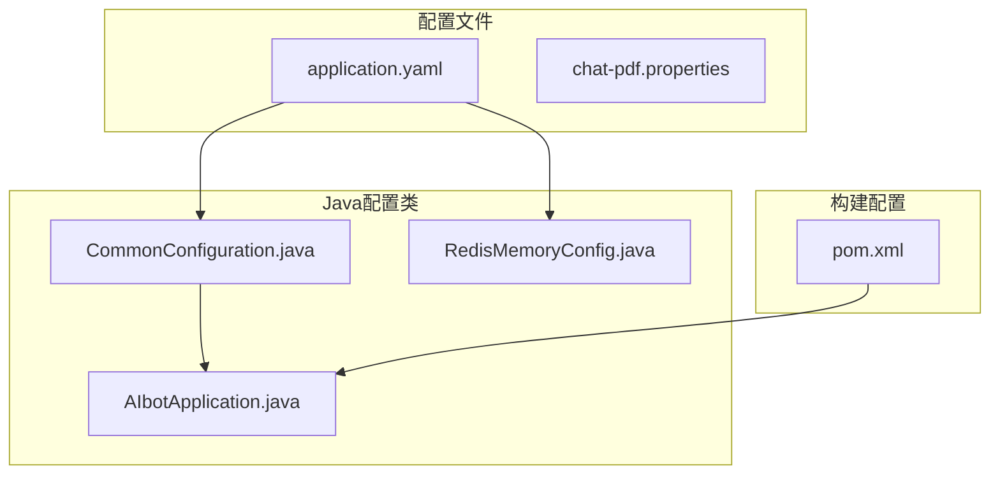
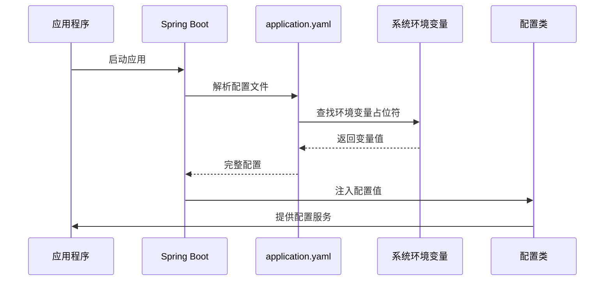
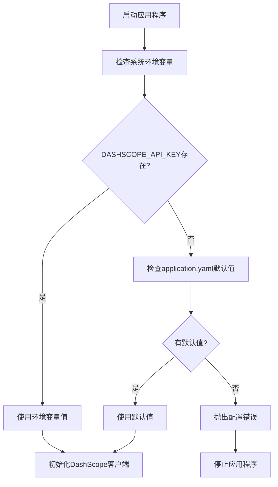
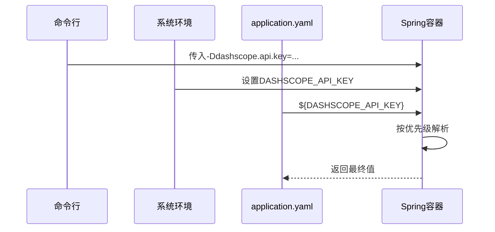
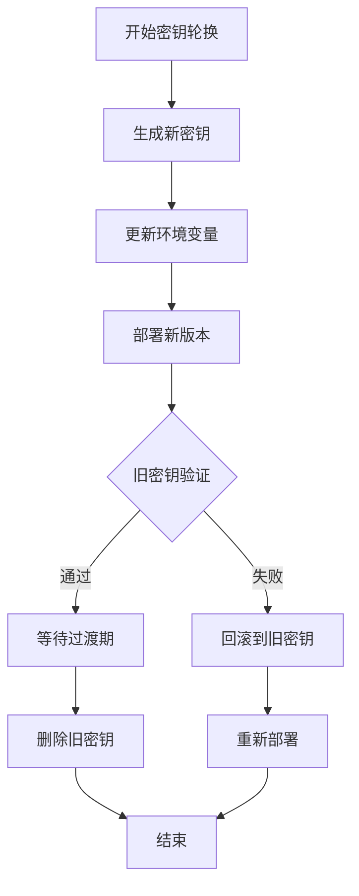
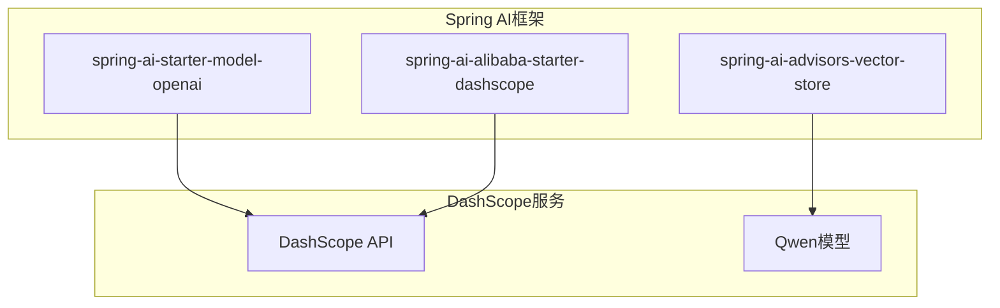
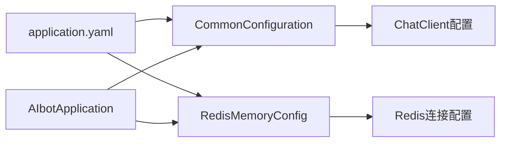
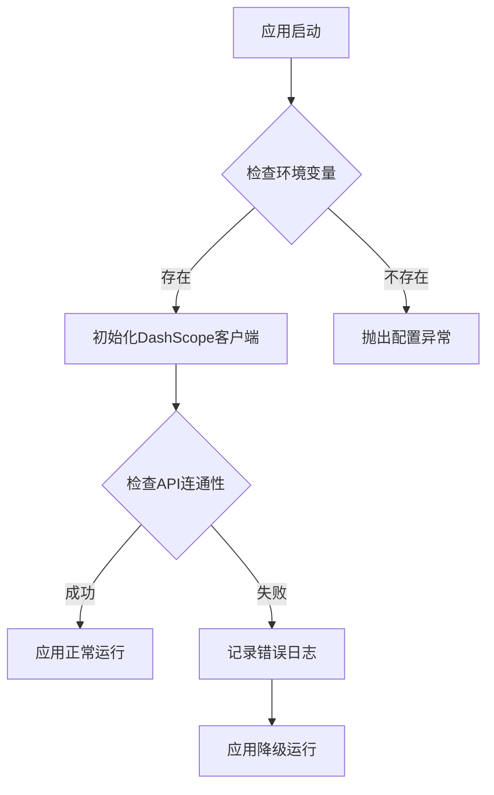

# 环境变量管理

<cite>
**本文档引用的文件**
- [application.yaml](file://src/main/resources/application.yaml)
- [AIbotApplication.java](file://src/main/java/com/xdu/aibot/AIbotApplication.java)
- [CommonConfiguration.java](file://src/main/java/com/xdu/aibot/config/CommonConfiguration.java)
- [RedisMemoryConfig.java](file://src/main/java/com/xdu/aibot/config/RedisMemoryConfig.java)
- [pom.xml](file://pom.xml)
- [chat-pdf.properties](file://chat-pdf.properties)
- [.gitignore](file://.gitignore)
</cite>

## 目录
1. [简介](#简介)
2. [项目结构](#项目结构)
3. [核心组件](#核心组件)
4. [架构概览](#架构概览)
5. [详细组件分析](#详细组件分析)
6. [依赖关系分析](#依赖关系分析)
7. [性能考虑](#性能考虑)
8. [故障排除指南](#故障排除指南)
9. [结论](#结论)

## 简介

本文件详细说明了AIbot项目中的环境变量管理系统，重点分析了`application.yaml`中使用的环境变量，特别是`${DASHSCOPE_API_KEY}`的使用方式和安全存储方法。文档涵盖了环境变量的加载顺序和优先级规则，提供了不同部署环境下的环境变量配置策略，并包含了敏感信息的安全存储、密钥轮换和访问控制的最佳实践。

## 项目结构

AIbot项目采用标准的Spring Boot项目结构，环境变量主要通过以下方式管理：



**图表来源**
- [application.yaml:1-59](file://src/main/resources/application.yaml#L1-L59)
- [CommonConfiguration.java:1-129](file://src/main/java/com/xdu/aibot/config/CommonConfiguration.java#L1-L129)
- [RedisMemoryConfig.java:1-26](file://src/main/java/com/xdu/aibot/config/RedisMemoryConfig.java#L1-L26)

**章节来源**
- [application.yaml:1-59](file://src/main/resources/application.yaml#L1-L59)
- [AIbotApplication.java:1-16](file://src/main/java/com/xdu/aibot/AIbotApplication.java#L1-L16)

## 核心组件

### 环境变量使用分析

项目中使用了多个环境变量，主要包括：

#### 敏感API密钥
- `${DASHSCOPE_API_KEY}`：用于DashScope服务的API密钥
- `${spring.neo4j.authentication.password}`：Neo4j数据库密码
- `${spring.data.redis.password}`：Redis缓存密码

#### 数据库连接
- `${spring.neo4j.uri}`：Neo4j数据库连接URI
- `${spring.datasource.username}`：MySQL数据库用户名
- `${spring.datasource.password}`：MySQL数据库密码

#### 应用配置
- `${spring.data.redis.host}`：Redis服务器地址
- `${spring.data.redis.port}`：Redis服务器端口

**章节来源**
- [application.yaml:17-21](file://src/main/resources/application.yaml#L17-L21)
- [CommonConfiguration.java:37-42](file://src/main/java/com/xdu/aibot/config/CommonConfiguration.java#L37-L42)
- [RedisMemoryConfig.java:11-16](file://src/main/java/com/xdu/aibot/config/RedisMemoryConfig.java#L11-L16)

## 架构概览

### 环境变量加载架构



**图表来源**
- [application.yaml:17-21](file://src/main/resources/application.yaml#L17-L21)
- [CommonConfiguration.java:37-42](file://src/main/java/com/xdu/aibot/config/CommonConfiguration.java#L37-L42)

### 环境变量优先级流程图



**图表来源**
- [application.yaml:17-21](file://src/main/resources/application.yaml#L17-L21)

## 详细组件分析

### DASHSCOPE_API_KEY环境变量管理

#### 使用方式分析

在`application.yaml`中，`DASHSCOPE_API_KEY`被用于两个关键位置：

1. **DashScope配置**：
   ```yaml
   ai:
     dashscope:
       api-key: ${DASHSCOPE_API_KEY}
   ```

2. **OpenAI兼容模式配置**：
   ```yaml
   ai:
     openai:
       base-url: https://dashscope.aliyuncs.com/compatible-mode/
       api-key: ${DASHSCOPE_API_KEY}
   ```

#### Java配置类集成

配置类通过`@Value`注解从Spring环境中注入这些值：

```mermaid
classDiagram
class CommonConfiguration {
@Value("${spring.neo4j.uri}")
private String neo4jUri
@Value("${spring.neo4j.authentication.password}")
private String neo4jPassword
@Value("${spring.neo4j.authentication.username}")
private String neo4jUsername
}
class RedisMemoryConfig {
@Value("${spring.data.redis.host}")
private String redisHost
@Value("${spring.data.redis.port}")
private int redisPort
@Value("${spring.data.redis.password}")
private String redisPassword
}
class AIbotApplication {
public static void main(String[] args)
}
CommonConfiguration --> AIbotApplication : "提供配置服务"
RedisMemoryConfig --> AIbotApplication : "提供Redis配置"
```

**图表来源**
- [CommonConfiguration.java:37-42](file://src/main/java/com/xdu/aibot/config/CommonConfiguration.java#L37-L42)
- [RedisMemoryConfig.java:11-16](file://src/main/java/com/xdu/aibot/config/RedisMemoryConfig.java#L11-L16)
- [AIbotApplication.java:11-13](file://src/main/java/com/xdu/aibot/AIbotApplication.java#L11-L13)

**章节来源**
- [application.yaml:17-21](file://src/main/resources/application.yaml#L17-L21)
- [CommonConfiguration.java:37-42](file://src/main/java/com/xdu/aibot/config/CommonConfiguration.java#L37-L42)
- [RedisMemoryConfig.java:11-16](file://src/main/java/com/xdu/aibot/config/RedisMemoryConfig.java#L11-L16)

### 环境变量加载顺序和优先级

根据Spring Boot的配置优先级规则，环境变量的加载顺序如下：

1. **命令行参数**
2. **操作系统环境变量**
3. **application.yaml中的占位符**
4. **系统属性**
5. **JNDI属性**
6. **ServletConfig初始化参数**
7. **ServletContext初始化参数**

对于`${DASHSCOPE_API_KEY}`的具体加载流程：



**图表来源**
- [application.yaml:17-21](file://src/main/resources/application.yaml#L17-L21)

**章节来源**
- [application.yaml:17-21](file://src/main/resources/application.yaml#L17-L21)

### 不同部署环境的配置策略

#### 本地开发环境

**配置文件示例**：
```yaml
# 开发环境配置
spring:
  profiles:
    active: dev
  
  ai:
    dashscope:
      api-key: ${DASHSCOPE_API_KEY:dev-key-here}
    openai:
      api-key: ${DASHSCOPE_API_KEY:dev-key-here}
  
  data:
    redis:
      host: localhost
      port: 6379
      password: ${REDIS_PASSWORD:}
```

#### 测试环境

**配置策略**：
- 使用独立的API密钥
- 连接到测试数据库
- 启用调试日志级别

#### 生产环境

**安全配置**：
- 通过环境变量传递所有敏感信息
- 禁用调试日志
- 使用专用的数据库用户

**章节来源**
- [application.yaml:17-21](file://src/main/resources/application.yaml#L17-L21)

### 敏感信息的安全存储

#### 密钥轮换最佳实践



#### 访问控制策略

1. **最小权限原则**：为不同环境分配不同的API密钥
2. **定期轮换**：建立自动化的密钥轮换机制
3. **审计日志**：记录所有密钥使用情况
4. **加密存储**：在CI/CD管道中加密存储敏感变量

**章节来源**
- [application.yaml:17-21](file://src/main/resources/application.yaml#L17-L21)

## 依赖关系分析

### Spring AI和DashScope集成

项目使用了Spring AI框架与DashScope服务的集成：



**图表来源**
- [pom.xml:34-78](file://pom.xml#L34-L78)

**章节来源**
- [pom.xml:34-78](file://pom.xml#L34-L78)

### 配置依赖关系



**图表来源**
- [application.yaml:1-59](file://src/main/resources/application.yaml#L1-L59)
- [CommonConfiguration.java:1-129](file://src/main/java/com/xdu/aibot/config/CommonConfiguration.java#L1-L129)
- [RedisMemoryConfig.java:1-26](file://src/main/java/com/xdu/aibot/config/RedisMemoryConfig.java#L1-L26)

**章节来源**
- [application.yaml:1-59](file://src/main/resources/application.yaml#L1-L59)
- [CommonConfiguration.java:1-129](file://src/main/java/com/xdu/aibot/config/CommonConfiguration.java#L1-L129)

## 性能考虑

### 环境变量加载性能

1. **延迟加载**：Spring Boot会在应用启动时一次性解析所有环境变量
2. **缓存机制**：解析后的值会被缓存，避免重复解析
3. **内存优化**：建议使用合理的数据类型，避免不必要的字符串转换

### 最佳实践

1. **避免频繁重启**：修改环境变量后，建议进行滚动更新而非全量重启
2. **监控告警**：设置环境变量缺失的告警机制
3. **配置验证**：在应用启动时验证关键配置的有效性

## 故障排除指南

### 常见问题及解决方案

#### 环境变量未生效

**症状**：应用程序启动时报错，提示找不到API密钥

**排查步骤**：
1. 检查环境变量是否正确设置
2. 验证变量名拼写是否正确
3. 确认变量值格式是否符合要求

**解决方案**：
```bash
# Linux/Mac
export DASHSCOPE_API_KEY=your_api_key_here

# Windows
set DASHSCOPE_API_KEY=your_api_key_here
```

#### 配置文件冲突

**症状**：多个配置文件中的相同变量产生冲突

**解决方法**：
1. 使用Spring Profiles区分不同环境
2. 在application.yaml中使用条件配置
3. 通过命令行参数覆盖配置

#### 类型转换错误

**症状**：配置值无法正确转换为期望的数据类型

**解决方法**：
1. 确保环境变量值的格式正确
2. 在配置类中添加适当的类型转换逻辑
3. 使用默认值确保配置完整性

**章节来源**
- [application.yaml:17-21](file://src/main/resources/application.yaml#L17-L21)

### 验证方法

#### 环境变量验证

```bash
# 验证环境变量是否存在
echo $DASHSCOPE_API_KEY

# 验证配置是否正确加载
curl http://localhost:8080/actuator/env
```

#### 应用启动验证



**图表来源**
- [application.yaml:17-21](file://src/main/resources/application.yaml#L17-L21)

## 结论

AIbot项目的环境变量管理系统通过Spring Boot的配置机制实现了灵活的多环境支持。`DASHSCOPE_API_KEY`作为核心敏感配置，通过占位符机制实现了安全的外部化配置管理。

### 关键要点

1. **安全性**：敏感信息通过环境变量外部化，避免硬编码在代码中
2. **灵活性**：支持多环境配置，通过Profiles实现环境隔离
3. **可维护性**：清晰的配置层次结构，便于管理和维护
4. **可靠性**：完善的错误处理和验证机制

### 建议改进

1. **增强监控**：添加环境变量使用情况的监控
2. **自动化测试**：增加环境变量配置的自动化测试
3. **文档完善**：补充详细的环境变量配置文档
4. **安全审计**：建立环境变量变更的审计机制

通过遵循本文档的最佳实践，可以确保AIbot项目在各种部署环境中都能安全、可靠地运行。