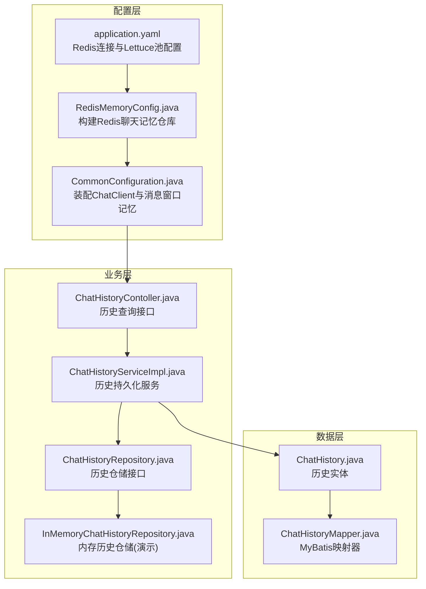
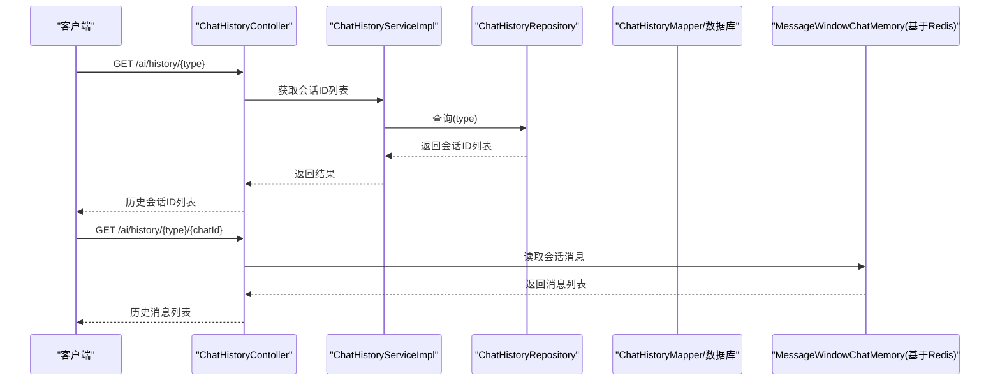
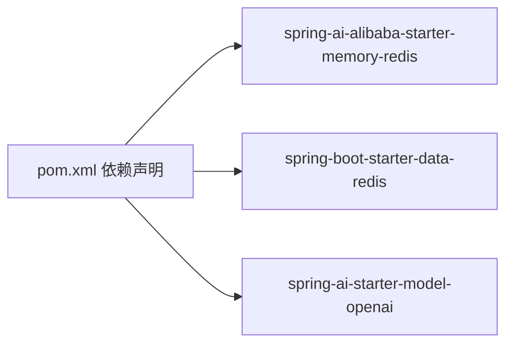
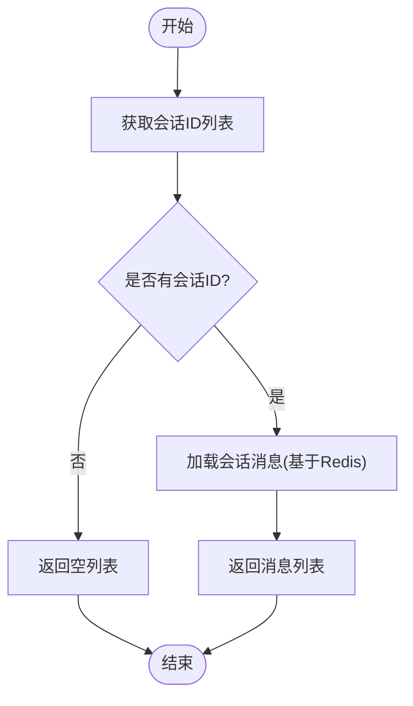

# 缓存配置

<cite>
**本文引用的文件**
- [application.yaml](file://src/main/resources/application.yaml)
- [RedisMemoryConfig.java](file://src/main/java/com/xdu/aibot/config/RedisMemoryConfig.java)
- [CommonConfiguration.java](file://src/main/java/com/xdu/aibot/config/CommonConfiguration.java)
- [ChatHistoryContoller.java](file://src/main/java/com/xdu/aibot/controller/ChatHistoryContoller.java)
- [ChatHistoryServiceImpl.java](file://src/main/java/com/xdu/aibot/service/impl/ChatHistoryServiceImpl.java)
- [ChatHistory.java](file://src/main/java/com/xdu/aibot/pojo/entity/ChatHistory.java)
- [ChatHistoryMapper.java](file://src/main/java/com/xdu/aibot/mapper/ChatHistoryMapper.java)
- [InMemoryChatHistoryRepository.java](file://src/main/java/com/xdu/aibot/repository/Impl/InMemoryChatHistoryRepository.java)
- [pom.xml](file://pom.xml)
</cite>

## 目录
1. [简介](#简介)
2. [项目结构](#项目结构)
3. [核心组件](#核心组件)
4. [架构总览](#架构总览)
5. [详细组件分析](#详细组件分析)
6. [依赖分析](#依赖分析)
7. [性能考虑](#性能考虑)
8. [故障排查指南](#故障排查指南)
9. [结论](#结论)
10. [附录](#附录)

## 简介
本文件聚焦于AIbot项目中的Redis缓存配置与应用，围绕以下目标展开：
- 详细说明Redis连接配置：主机地址、端口、密码与连接池设置
- 解释Lettuce连接池的关键参数：最大连接数、空闲连接数、连接超时等
- 阐述Redis在项目中的实际应用场景：对话历史缓存、会话状态管理、临时数据存储
- 提供缓存配置优化建议、性能调优参数与缓存失效策略
- 给出Redis监控与故障处理方法

## 项目结构
AIbot采用Spring Boot工程，Redis相关配置集中在配置文件与配置类中，并通过Spring AI的聊天记忆模块进行会话状态管理。

图表来源
- [application.yaml:36-45](file://src/main/resources/application.yaml#L36-L45)
- [RedisMemoryConfig.java:11-24](file://src/main/java/com/xdu/aibot/config/RedisMemoryConfig.java#L11-L24)
- [CommonConfiguration.java:81-84](file://src/main/java/com/xdu/aibot/config/CommonConfiguration.java#L81-L84)
- [ChatHistoryContoller.java:25-37](file://src/main/java/com/xdu/aibot/controller/ChatHistoryContoller.java#L25-L37)
- [ChatHistoryServiceImpl.java:24-52](file://src/main/java/com/xdu/aibot/service/impl/ChatHistoryServiceImpl.java#L24-L52)
- [ChatHistory.java:10-22](file://src/main/java/com/xdu/aibot/pojo/entity/ChatHistory.java#L10-L22)
- [ChatHistoryMapper.java:8-9](file://src/main/java/com/xdu/aibot/mapper/ChatHistoryMapper.java#L8-L9)
- [InMemoryChatHistoryRepository.java:13-29](file://src/main/java/com/xdu/aibot/repository/Impl/InMemoryChatHistoryRepository.java#L13-L29)

章节来源
- [application.yaml:36-45](file://src/main/resources/application.yaml#L36-L45)
- [RedisMemoryConfig.java:11-24](file://src/main/java/com/xdu/aibot/config/RedisMemoryConfig.java#L11-L24)
- [CommonConfiguration.java:81-84](file://src/main/java/com/xdu/aibot/config/CommonConfiguration.java#L81-L84)
- [ChatHistoryContoller.java:25-37](file://src/main/java/com/xdu/aibot/controller/ChatHistoryContoller.java#L25-L37)
- [ChatHistoryServiceImpl.java:24-52](file://src/main/java/com/xdu/aibot/service/impl/ChatHistoryServiceImpl.java#L24-L52)
- [ChatHistory.java:10-22](file://src/main/java/com/xdu/aibot/pojo/entity/ChatHistory.java#L10-L22)
- [ChatHistoryMapper.java:8-9](file://src/main/java/com/xdu/aibot/mapper/ChatHistoryMapper.java#L8-L9)
- [InMemoryChatHistoryRepository.java:13-29](file://src/main/java/com/xdu/aibot/repository/Impl/InMemoryChatHistoryRepository.java#L13-L29)

## 核心组件
- Redis连接与Lettuce连接池配置
  - 主机地址、端口、密码来自配置文件
  - Lettuce连接池参数：最大活跃连接、最大空闲连接、最小空闲连接、空闲驱逐周期
- Redis聊天记忆仓库
  - 通过配置类装配，注入到消息窗口记忆中，用于会话状态管理
- 控制器与服务层
  - 对话历史查询接口与历史持久化服务，结合消息窗口记忆实现会话状态缓存
- 数据访问层
  - 历史实体与映射器，支持将会话ID列表持久化至数据库

章节来源
- [application.yaml:36-45](file://src/main/resources/application.yaml#L36-L45)
- [RedisMemoryConfig.java:11-24](file://src/main/java/com/xdu/aibot/config/RedisMemoryConfig.java#L11-L24)
- [CommonConfiguration.java:81-84](file://src/main/java/com/xdu/aibot/config/CommonConfiguration.java#L81-L84)
- [ChatHistoryContoller.java:25-37](file://src/main/java/com/xdu/aibot/controller/ChatHistoryContoller.java#L25-L37)
- [ChatHistoryServiceImpl.java:24-52](file://src/main/java/com/xdu/aibot/service/impl/ChatHistoryServiceImpl.java#L24-L52)
- [ChatHistory.java:10-22](file://src/main/java/com/xdu/aibot/pojo/entity/ChatHistory.java#L10-L22)
- [ChatHistoryMapper.java:8-9](file://src/main/java/com/xdu/aibot/mapper/ChatHistoryMapper.java#L8-L9)

## 架构总览
AIbot通过Spring AI的聊天客户端与消息窗口记忆，将会话状态存储在Redis中；同时，控制器负责对外提供历史查询接口，服务层负责历史的持久化与检索。

图表来源
- [ChatHistoryContoller.java:25-37](file://src/main/java/com/xdu/aibot/controller/ChatHistoryContoller.java#L25-L37)
- [ChatHistoryServiceImpl.java:44-52](file://src/main/java/com/xdu/aibot/service/impl/ChatHistoryServiceImpl.java#L44-L52)
- [ChatHistory.java:10-22](file://src/main/java/com/xdu/aibot/pojo/entity/ChatHistory.java#L10-L22)
- [ChatHistoryMapper.java:8-9](file://src/main/java/com/xdu/aibot/mapper/ChatHistoryMapper.java#L8-L9)
- [CommonConfiguration.java:81-84](file://src/main/java/com/xdu/aibot/config/CommonConfiguration.java#L81-L84)

## 详细组件分析

### Redis连接与Lettuce连接池配置
- 连接参数
  - 主机地址、端口、密码均来源于配置文件
- Lettuce连接池参数
  - 最大活跃连接、最大空闲连接、最小空闲连接、空闲驱逐周期
- 配置文件位置与参数路径
  - 配置项位于“data.redis”下，Lettuce池参数位于“data.redis.lettuce.pool”

章节来源
- [application.yaml:36-45](file://src/main/resources/application.yaml#L36-L45)

### Redis聊天记忆仓库装配
- 配置类从配置文件读取Redis连接信息
- 构建Redis聊天记忆仓库并注入到消息窗口记忆中
- 该仓库作为会话状态的后端存储

章节来源
- [RedisMemoryConfig.java:11-24](file://src/main/java/com/xdu/aibot/config/RedisMemoryConfig.java#L11-L24)
- [CommonConfiguration.java:81-84](file://src/main/java/com/xdu/aibot/config/CommonConfiguration.java#L81-L84)

### 对话历史缓存与会话状态管理
- 控制器提供历史查询接口，支持按类型获取会话ID列表与按会话ID获取消息列表
- 会话消息由消息窗口记忆提供，底层使用Redis存储
- 历史ID列表可持久化至数据库，便于后续检索

章节来源
- [ChatHistoryContoller.java:25-37](file://src/main/java/com/xdu/aibot/controller/ChatHistoryContoller.java#L25-L37)
- [ChatHistoryServiceImpl.java:24-52](file://src/main/java/com/xdu/aibot/service/impl/ChatHistoryServiceImpl.java#L24-L52)
- [ChatHistory.java:10-22](file://src/main/java/com/xdu/aibot/pojo/entity/ChatHistory.java#L10-L22)
- [ChatHistoryMapper.java:8-9](file://src/main/java/com/xdu/aibot/mapper/ChatHistoryMapper.java#L8-L9)

### 临时数据存储
- 项目中存在内存历史仓储示例，展示如何在不使用Redis时进行临时数据存储
- 实际生产环境应优先使用Redis以获得更好的一致性与持久性

章节来源
- [InMemoryChatHistoryRepository.java:13-29](file://src/main/java/com/xdu/aibot/repository/Impl/InMemoryChatHistoryRepository.java#L13-L29)

### 依赖与集成点
- 项目引入了Spring AI的Alibaba Agent Framework与Memory Redis模块，以及Spring Boot Data Redis
- 通过这些依赖，项目能够使用Redis作为聊天记忆的后端存储

章节来源
- [pom.xml:80-92](file://pom.xml#L80-L92)

## 依赖分析
AIbot对Redis的依赖主要体现在配置与装配上，核心依赖如下：
- Spring AI Alibaba Memory Redis：提供基于Redis的聊天记忆仓库
- Spring Boot Starter Data Redis：提供Redis自动配置与连接池能力
- Spring AI Chat Client：与消息窗口记忆配合，实现会话状态管理

图表来源
- [pom.xml:80-92](file://pom.xml#L80-L92)

章节来源
- [pom.xml:80-92](file://pom.xml#L80-L92)

## 性能考虑
- 连接池参数调优
  - 最大活跃连接与最大空闲连接应根据并发请求数量与峰值流量合理设置，避免连接不足或资源浪费
  - 最小空闲连接用于保证热连接数量，降低连接建立开销
  - 空闲驱逐周期用于回收长时间未使用的连接，减少资源占用
- 会话状态缓存
  - 使用消息窗口记忆限制会话长度，避免无限增长导致内存压力
  - 结合数据库持久化会话ID列表，平衡内存与持久化成本
- 监控与日志
  - 启用相关调试日志，观察连接池使用情况与会话状态变化
  - 在生产环境中建议接入Redis监控工具，关注连接数、命中率、延迟等指标

[本节为通用性能建议，无需特定文件引用]

## 故障排查指南
- 连接失败
  - 检查主机地址、端口与密码是否正确
  - 确认Redis服务器可达且防火墙放行
- 连接池耗尽
  - 观察最大活跃连接与最大空闲连接设置是否过低
  - 检查是否存在连接泄漏或长时间占用
- 会话状态异常
  - 确认消息窗口记忆的最大消息条数设置是否合理
  - 检查Redis键空间是否被外部清理策略影响
- 历史查询为空
  - 确认会话ID是否已持久化至数据库
  - 检查控制器与服务层的查询逻辑是否正确

[本节为通用故障排查建议，无需特定文件引用]

## 结论
AIbot项目通过Spring AI与Spring Boot Data Redis实现了以Redis为核心的会话状态管理与历史缓存。配置层提供了清晰的连接与连接池参数，业务层通过控制器与服务层完成历史查询与持久化。建议在生产环境中结合监控工具持续优化连接池参数与会话状态策略，确保系统稳定与高性能。

[本节为总结性内容，无需特定文件引用]

## 附录

### Redis连接与Lettuce连接池参数对照表
- 参数名称
  - 最大活跃连接
  - 最大空闲连接
  - 最小空闲连接
  - 空闲驱逐周期
- 配置路径
  - data.redis.lettuce.pool.{max-active,max-idle,min-idle,time-between-eviction-runs}

章节来源
- [application.yaml:40-45](file://src/main/resources/application.yaml#L40-L45)

### 会话状态管理流程图

图表来源
- [ChatHistoryContoller.java:25-37](file://src/main/java/com/xdu/aibot/controller/ChatHistoryContoller.java#L25-L37)
- [CommonConfiguration.java:81-84](file://src/main/java/com/xdu/aibot/config/CommonConfiguration.java#L81-L84)