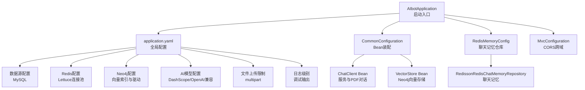
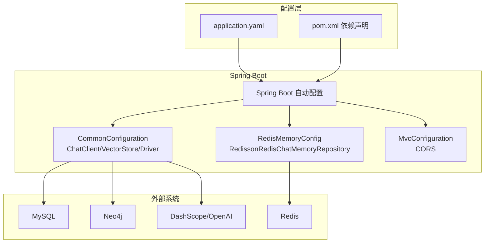
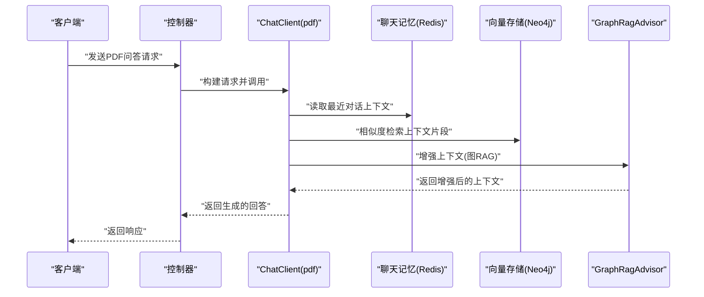
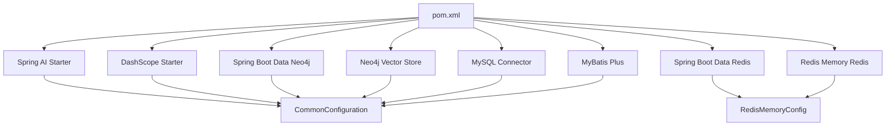

# 配置管理

<cite>
**本文引用的文件**
- [application.yaml](file://src/main/resources/application.yaml)
- [AIbotApplication.java](file://src/main/java/com/xdu/aibot/AIbotApplication.java)
- [CommonConfiguration.java](file://src/main/java/com/xdu/aibot/config/CommonConfiguration.java)
- [RedisMemoryConfig.java](file://src/main/java/com/xdu/aibot/config/RedisMemoryConfig.java)
- [MvcConfiguration.java](file://src/main/java/com/xdu/aibot/config/MvcConfiguration.java)
- [pom.xml](file://pom.xml)
- [SystemConstants.java](file://src/main/java/com/xdu/aibot/constant/SystemConstants.java)
- [ChatType.java](file://src/main/java/com/xdu/aibot/constant/ChatType.java)
- [GraphRagAdvisor.java](file://src/main/java/com/xdu/aibot/advisor/GraphRagAdvisor.java)
- [AIbotApplicationTests.java](file://src/test/java/com/xdu/aibot/AIbotApplicationTests.java)
- [chat-pdf.properties](file://chat-pdf.properties)
</cite>

## 目录
1. [简介](#简介)
2. [项目结构](#项目结构)
3. [核心组件](#核心组件)
4. [架构总览](#架构总览)
5. [详细组件分析](#详细组件分析)
6. [依赖分析](#依赖分析)
7. [性能考虑](#性能考虑)
8. [故障排除指南](#故障排除指南)
9. [结论](#结论)
10. [附录](#附录)

## 简介
本文件面向AIbot项目的配置管理，系统化梳理application.yaml中的各项配置项，解释其在数据库连接、Redis缓存、AI模型参数与系统行为方面的作用；说明Spring Boot自动配置与自定义配置类的协作机制；覆盖环境变量管理、配置文件优先级与动态配置更新的实践；并提供生产环境最佳实践、安全配置建议、性能调优参数、配置验证方法、故障排除指南以及配置迁移策略。

## 项目结构
AIbot采用Spring Boot标准目录结构，配置集中在resources目录下的application.yaml中，业务配置通过多个@Configuration类在Java代码中完成装配。

图表来源
- [AIbotApplication.java:1-16](file://src/main/java/com/xdu/aibot/AIbotApplication.java#L1-L16)
- [application.yaml:1-59](file://src/main/resources/application.yaml#L1-L59)
- [CommonConfiguration.java:1-129](file://src/main/java/com/xdu/aibot/config/CommonConfiguration.java#L1-L129)
- [RedisMemoryConfig.java:1-26](file://src/main/java/com/xdu/aibot/config/RedisMemoryConfig.java#L1-L26)
- [MvcConfiguration.java:1-19](file://src/main/java/com/xdu/aibot/config/MvcConfiguration.java#L1-L19)

章节来源
- [AIbotApplication.java:1-16](file://src/main/java/com/xdu/aibot/AIbotApplication.java#L1-L16)
- [application.yaml:1-59](file://src/main/resources/application.yaml#L1-L59)

## 核心组件
本节对application.yaml中的关键配置进行逐项解读，并说明其在系统中的作用与影响范围。

- 应用元信息
  - spring.application.name：应用名称，用于日志与监控标识。
- Neo4j向量存储与图数据库
  - spring.neo4j.uri：Neo4j数据库连接地址（加密协议）。
  - spring.neo4j.authentication.username/password：认证凭据。
  - spring.ai.vectorstore.neo4j.*：向量索引初始化、数据库名、索引名、嵌入维度、距离类型等。
- AI模型与推理
  - spring.ai.dashscope.api-key：DashScope API密钥（从环境变量读取）。
  - spring.ai.openai.base-url：OpenAI兼容接口地址（指向DashScope）。
  - spring.ai.openai.api-key：OpenAI兼容接口密钥（从环境变量读取）。
  - spring.ai.openai.chat.options.model/temperature：聊天模型与温度系数。
  - spring.ai.openai.embedding.options.model/dimensions：嵌入模型与维度。
- 数据源（MySQL）
  - spring.datasource.driver-class-name：JDBC驱动类名。
  - spring.datasource.url：数据库连接URL（含时区与SSL参数）。
  - spring.datasource.username/password：数据库用户名与密码。
- 缓存（Redis）
  - spring.data.redis.host/port/password：Redis连接参数。
  - spring.data.redis.lettuce.pool.*：Lettuce连接池参数（最大活跃、最大空闲、最小空闲、驱逐间隔）。
- 文件上传
  - spring.servlet.multipart.max-file-size/max-request-size：单文件与请求总大小限制。
- JSON序列化
  - spring.jackson.default-property-inclusion：忽略非空字段。
- 日志
  - logging.level.*：开启Spring AI、Neo4j、MyBatis等框架的调试日志。

章节来源
- [application.yaml:1-59](file://src/main/resources/application.yaml#L1-L59)

## 架构总览
下图展示了配置在系统中的装配与运行时交互：

图表来源
- [application.yaml:1-59](file://src/main/resources/application.yaml#L1-L59)
- [pom.xml:1-139](file://pom.xml#L1-L139)
- [CommonConfiguration.java:1-129](file://src/main/java/com/xdu/aibot/config/CommonConfiguration.java#L1-L129)
- [RedisMemoryConfig.java:1-26](file://src/main/java/com/xdu/aibot/config/RedisMemoryConfig.java#L1-L26)
- [MvcConfiguration.java:1-19](file://src/main/java/com/xdu/aibot/config/MvcConfiguration.java#L1-L19)

## 详细组件分析

### 数据库连接配置（MySQL）
- 关键点
  - JDBC驱动类名与URL参数包含时区与时钟设置，确保与应用时区一致。
  - 用户名与密码在配置文件中明文存在，需通过环境变量或外部化配置替换。
- 影响范围
  - MyBatis Plus与数据库交互的基础能力。
- 调优建议
  - 生产环境启用SSL与连接池参数优化（最大连接数、空闲超时、连接生命周期）。
  - 使用只读副本与主从分离降低写压力。

章节来源
- [application.yaml:30-34](file://src/main/resources/application.yaml#L30-L34)

### Redis缓存配置（Lettuce连接池）
- 关键点
  - host/port/password用于连接本地或远端Redis实例。
  - Lettuce连接池参数控制并发与资源回收。
- 影响范围
  - 聊天记忆（RedissonRedisChatMemoryRepository）依赖该配置。
- 调优建议
  - 根据QPS调整max-active与max-idle，合理设置time-between-eviction-runs避免频繁驱逐。
  - 开启密码认证与网络隔离，生产环境建议使用TLS。

章节来源
- [application.yaml:35-45](file://src/main/resources/application.yaml#L35-L45)
- [RedisMemoryConfig.java:1-26](file://src/main/java/com/xdu/aibot/config/RedisMemoryConfig.java#L1-L26)

### Neo4j向量存储与图数据库
- 关键点
  - Neo4j驱动通过spring.neo4j.*读取URI与认证。
  - 向量存储配置包括initialize-schema、database-name、index-name、embedding-dimension、distance-type。
- 影响范围
  - ChatClient在PDF模式下使用QuestionAnswerAdvisor与Neo4j向量存储检索上下文。
- 调优建议
  - embedding-dimension与模型输出维度保持一致；cosine距离适合文本相似度。
  - initialize-schema仅首次初始化使用，生产环境谨慎开启。

章节来源
- [application.yaml:4-16](file://src/main/resources/application.yaml#L4-L16)
- [CommonConfiguration.java:52-70](file://src/main/java/com/xdu/aibot/config/CommonConfiguration.java#L52-L70)

### AI模型参数与推理
- 关键点
  - DashScope API密钥通过${DASHSCOPE_API_KEY}从环境变量注入。
  - OpenAI兼容接口base-url指向DashScope，便于切换模型与供应商。
  - 聊天与嵌入模型及温度、维度参数集中配置。
- 影响范围
  - ChatClient在服务与PDF两种模式下分别使用不同的默认系统提示与顾问链。
- 调优建议
  - 温度与top-p等参数按场景调优；高创造性任务提高温度，高确定性任务降低温度。
  - 模型维度与向量存储维度保持一致，避免检索失败。

章节来源
- [application.yaml:17-29](file://src/main/resources/application.yaml#L17-L29)
- [CommonConfiguration.java:74-88](file://src/main/java/com/xdu/aibot/config/CommonConfiguration.java#L74-L88)
- [CommonConfiguration.java:90-127](file://src/main/java/com/xdu/aibot/config/CommonConfiguration.java#L90-L127)

### 文件上传与JSON序列化
- 关键点
  - multipart限制单文件与请求总大小，防止内存溢出。
  - Jackson默认忽略非空字段，减少冗余传输。
- 影响范围
  - PDF上传与解析流程的输入约束。
- 调优建议
  - 根据业务场景调整max-file-size与max-request-size。
  - 对于大对象响应，谨慎使用非空过滤，必要时在控制器层面覆盖。

章节来源
- [application.yaml:46-51](file://src/main/resources/application.yaml#L46-L51)

### 日志与可观测性
- 关键点
  - 开启Spring AI、Neo4j、MyBatis等框架的调试日志，便于问题定位。
- 影响范围
  - 开发与测试阶段的诊断能力。
- 调优建议
  - 生产环境建议降级到INFO或WARN，避免日志风暴。

章节来源
- [application.yaml:52-59](file://src/main/resources/application.yaml#L52-L59)

### CORS跨域配置
- 关键点
  - 允许任意来源、方法与头，暴露Content-Disposition。
- 影响范围
  - 前端跨域访问后端接口的能力。
- 安全建议
  - 生产环境限定allowedOrigins与allowedMethods，避免*带来的安全风险。

章节来源
- [MvcConfiguration.java:1-19](file://src/main/java/com/xdu/aibot/config/MvcConfiguration.java#L1-L19)

### Spring Boot自动配置与自定义配置类
- 自动配置
  - Spring Boot基于starter与条件注解自动装配Web、Redis、Neo4j、MyBatis Plus等组件。
- 自定义配置
  - CommonConfiguration：装配ChatClient、VectorStore、Neo4j Driver等Bean。
  - RedisMemoryConfig：装配RedissonRedisChatMemoryRepository。
  - MvcConfiguration：注册CORS映射。
- 交互流程（以PDF对话为例）

图表来源
- [CommonConfiguration.java:90-127](file://src/main/java/com/xdu/aibot/config/CommonConfiguration.java#L90-L127)
- [RedisMemoryConfig.java:18-25](file://src/main/java/com/xdu/aibot/config/RedisMemoryConfig.java#L18-L25)
- [GraphRagAdvisor.java:41-73](file://src/main/java/com/xdu/aibot/advisor/GraphRagAdvisor.java#L41-L73)

章节来源
- [CommonConfiguration.java:1-129](file://src/main/java/com/xdu/aibot/config/CommonConfiguration.java#L1-L129)
- [RedisMemoryConfig.java:1-26](file://src/main/java/com/xdu/aibot/config/RedisMemoryConfig.java#L1-L26)
- [MvcConfiguration.java:1-19](file://src/main/java/com/xdu/aibot/config/MvcConfiguration.java#L1-L19)

## 依赖分析
- 依赖层次
  - application.yaml提供基础配置，pom.xml声明Spring AI、DashScope、Redis、Neo4j、MyBatis Plus等依赖。
  - 自动配置与自定义配置共同决定Bean装配顺序与行为。
- 关键依赖与配置映射
  - spring-ai-starter-model-openai 与 spring-ai-alibaba-starter-dashscope：支持OpenAI兼容与DashScope。
  - spring-boot-starter-data-redis 与 spring-ai-alibaba-starter-memory-redis：Redis聊天记忆。
  - spring-boot-starter-data-neo4j 与 spring-ai-neo4j-store：Neo4j向量存储。
  - mysql-connector-j 与 mybatis-plus-spring-boot3-starter：MySQL与ORM。

图表来源
- [pom.xml:33-116](file://pom.xml#L33-L116)
- [CommonConfiguration.java:1-129](file://src/main/java/com/xdu/aibot/config/CommonConfiguration.java#L1-L129)
- [RedisMemoryConfig.java:1-26](file://src/main/java/com/xdu/aibot/config/RedisMemoryConfig.java#L1-L26)

章节来源
- [pom.xml:1-139](file://pom.xml#L1-L139)

## 性能考虑
- 数据库
  - 合理设置连接池大小与超时；启用SSL与只读副本；对热点表建立合适索引。
- Redis
  - 根据QPS调整连接池参数；开启持久化与主从复制；使用命名空间隔离。
- Neo4j
  - 确保索引与schema初始化在受控环境下执行；批量插入使用事务与批处理策略。
- AI推理
  - 控制temperature与top-k；对高频请求引入缓存与限流；异步化长耗时任务。
- 文件上传
  - 合理设置multipart限制；对大文件采用分片上传与断点续传。

## 故障排除指南
- 连接失败
  - MySQL：检查URL、用户名与密码；确认防火墙与SSL配置；查看连接池状态。
  - Redis：确认host/port/password；检查ACL与TLS；验证连接池参数。
  - Neo4j：验证URI与认证；使用测试用例验证连通性。
- AI模型不可用
  - 检查DASHSCOPE_API_KEY是否正确注入；确认base-url与模型名称；查看日志异常堆栈。
- 聊天记忆异常
  - 确认Redis可用性与权限；检查聊天记忆Bean是否成功装配。
- CORS问题
  - 生产环境避免使用*，限定允许的来源与方法；检查代理与网关配置。
- 配置验证
  - 使用单元测试验证Neo4j连通性与基础查询；在集成测试中验证ChatClient工作流。

章节来源
- [AIbotApplicationTests.java:76-103](file://src/test/java/com/xdu/aibot/AIbotApplicationTests.java#L76-L103)

## 结论
AIbot的配置体系以application.yaml为核心，结合Spring Boot自动配置与自定义配置类实现数据库、缓存、图数据库与AI模型的统一装配。通过合理的参数设计与调优，可在开发、测试与生产环境中获得稳定可靠的运行表现。建议在生产环境强化安全与性能治理，持续完善配置验证与故障排除流程。

## 附录

### 环境变量管理与配置文件优先级
- 环境变量
  - DASHSCOPE_API_KEY：用于注入DashScope/OpenAI兼容接口的API密钥。
- 配置文件优先级（简述）
  - 命令行参数 > 环境变量 > application.yaml > 默认值。
- 动态配置更新
  - 对于不涉及Bean重建的配置（如日志级别、限流阈值），可通过Actuator或外部化配置中心热更新；涉及Bean重建的配置需重启生效。

章节来源
- [application.yaml:17-21](file://src/main/resources/application.yaml#L17-L21)

### 生产环境配置最佳实践
- 安全
  - 密钥与敏感信息使用环境变量或Vault管理；禁用*跨域；启用TLS与网络隔离。
- 可靠性
  - 连接池参数与超时设置合理化；监控与告警覆盖关键指标。
- 性能
  - 模型与向量维度匹配；批量写入与事务优化；缓存与限流策略。
- 可运维
  - 明确配置变更流程与回滚策略；定期进行配置审计与压测。

### 配置迁移策略
- 版本升级
  - 逐步替换旧配置键；保留兼容期并输出迁移指引。
- 多环境
  - 使用profiles或外部化配置区分dev/staging/prod；模板化配置文件。
- 回滚
  - 记录每次变更；支持一键回滚至上一个稳定版本。

### 不同部署环境下的配置差异与注意事项
- 开发环境
  - 使用本地Redis与MySQL；开启调试日志；允许宽松的CORS。
- 测试环境
  - 使用独立数据库与缓存实例；模拟限流与异常场景。
- 生产环境
  - 强化安全与性能；启用监控与日志聚合；严格控制变更。