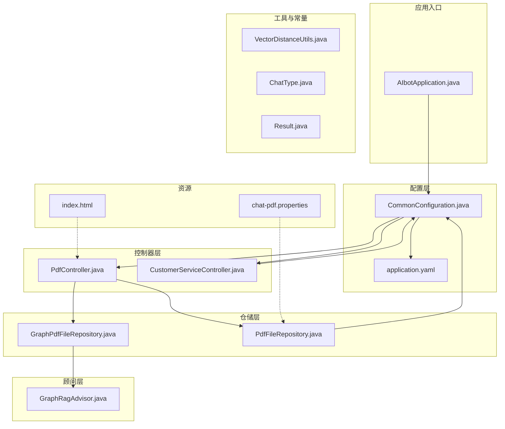
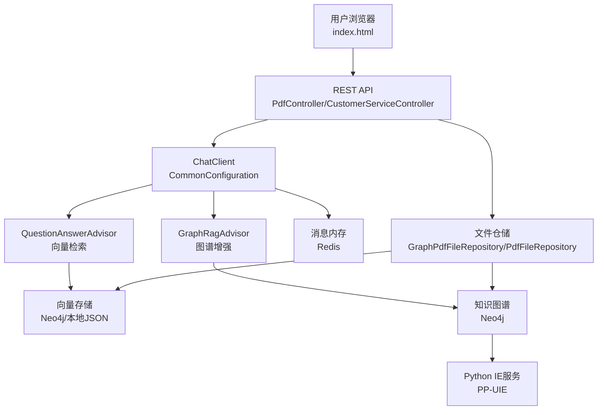
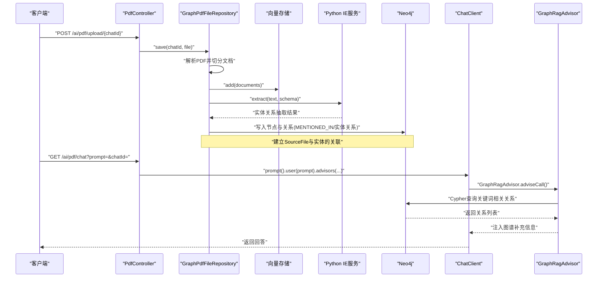
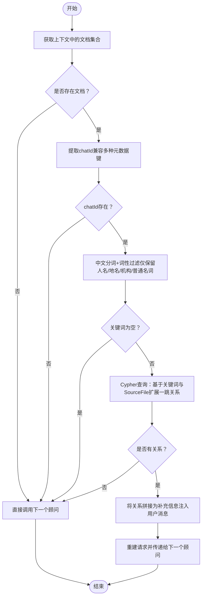
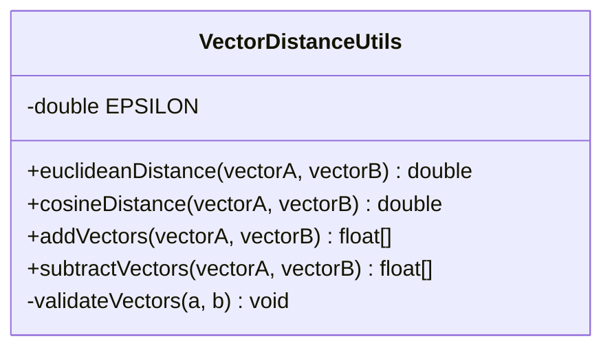
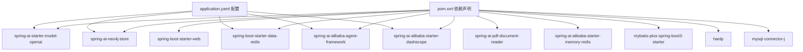

# 项目概述

<cite>
**本文引用的文件**
- [AIbotApplication.java](file://src/main/java/com/xdu/aibot/AIbotApplication.java)
- [pom.xml](file://pom.xml)
- [application.yaml](file://src/main/resources/application.yaml)
- [chat-pdf.properties](file://chat-pdf.properties)
- [GraphRagAdvisor.java](file://src/main/java/com/xdu/aibot/advisor/GraphRagAdvisor.java)
- [CommonConfiguration.java](file://src/main/java/com/xdu/aibot/config/CommonConfiguration.java)
- [CustomerServiceController.java](file://src/main/java/com/xdu/aibot/controller/CustomerServiceController.java)
- [PdfController.java](file://src/main/java/com/xdu/aibot/controller/PdfController.java)
- [GraphPdfFileRepository.java](file://src/main/java/com/xdu/aibot/repository/Impl/GraphPdfFileRepository.java)
- [PdfFileRepository.java](file://src/main/java/com/xdu/aibot/repository/Impl/PdfFileRepository.java)
- [ChatType.java](file://src/main/java/com/xdu/aibot/constant/ChatType.java)
- [Result.java](file://src/main/java/com/xdu/aibot/pojo/vo/Result.java)
- [VectorDistanceUtils.java](file://src/main/java/com/xdu/aibot/util/VectorDistanceUtils.java)
- [index.html](file://src/main/resources/static/index.html)
</cite>

## 目录
1. [简介](#简介)
2. [项目结构](#项目结构)
3. [核心组件](#核心组件)
4. [架构总览](#架构总览)
5. [详细组件分析](#详细组件分析)
6. [依赖分析](#依赖分析)
7. [性能考虑](#性能考虑)
8. [故障排除指南](#故障排除指南)
9. [结论](#结论)
10. [附录](#附录)

## 简介
AIbot智能问答系统是一个基于RAG（检索增强生成）技术的综合型智能应用，旨在通过大语言模型与向量数据库、知识图谱相结合的方式，实现对PDF文档的智能问答、多轮对话记忆以及业务场景（如图书预约）的辅助服务。系统采用Spring Boot + Spring AI生态，结合Neo4j向量索引、DashScope/OpenAI兼容接口、Redis内存与HanLP中文分词，形成从文档解析、知识抽取、向量化存储、图谱增强到最终回答生成的完整链路。

本项目的开发动机在于：
- 将传统PDF文档转化为可检索、可推理的知识源，提升信息利用效率；
- 通过知识图谱增强问答质量，解决纯向量检索的“黑盒”局限；
- 提供多模态对话管理能力，支持PDF问答与客服对话两条主线；
- 以模块化设计降低学习成本，便于扩展至更多业务场景。

核心价值主张：
- 低门槛接入：提供Web端入口与REST接口，支持文件上传与在线问答；
- 高质量回答：结合向量检索与知识图谱关系，提升准确性与可解释性；
- 可扩展架构：模块化组件与配置化参数，便于接入不同模型与存储后端；
- 中文优化：集成HanLP进行中文分词与关键词抽取，适配中文场景。

## 项目结构
项目采用Spring Boot标准目录结构，按功能域划分包，核心层次如下：
- config：配置类，定义向量库、聊天客户端、内存与工具等Bean；
- controller：对外HTTP接口，提供PDF问答与客服对话入口；
- advisor：调用顾问（Advisor），用于在对话前注入上下文（如图谱关系）；
- repository：文件与历史记录仓储层，负责PDF解析、向量入库与图谱构建；
- service：业务服务（当前示例中以仓储替代）；
- util：工具类，如向量距离计算；
- constant：常量枚举；
- pojo/vo：数据传输对象；
- resources：静态页面、MyBatis XML映射、应用配置；
- src/test：单元测试入口。

图表来源
- [AIbotApplication.java:1-16](file://src/main/java/com/xdu/aibot/AIbotApplication.java#L1-L16)
- [CommonConfiguration.java:1-129](file://src/main/java/com/xdu/aibot/config/CommonConfiguration.java#L1-L129)
- [PdfController.java:1-98](file://src/main/java/com/xdu/aibot/controller/PdfController.java#L1-L98)
- [CustomerServiceController.java:1-35](file://src/main/java/com/xdu/aibot/controller/CustomerServiceController.java#L1-L35)
- [GraphPdfFileRepository.java:1-262](file://src/main/java/com/xdu/aibot/repository/Impl/GraphPdfFileRepository.java#L1-L262)
- [PdfFileRepository.java:1-109](file://src/main/java/com/xdu/aibot/repository/Impl/PdfFileRepository.java#L1-L109)
- [GraphRagAdvisor.java:1-149](file://src/main/java/com/xdu/aibot/advisor/GraphRagAdvisor.java#L1-L149)
- [VectorDistanceUtils.java:1-111](file://src/main/java/com/xdu/aibot/util/VectorDistanceUtils.java#L1-L111)
- [ChatType.java:1-17](file://src/main/java/com/xdu/aibot/constant/ChatType.java#L1-L17)
- [Result.java:1-24](file://src/main/java/com/xdu/aibot/pojo/vo/Result.java#L1-L24)
- [application.yaml:1-59](file://src/main/resources/application.yaml#L1-L59)
- [index.html:1-246](file://src/main/resources/static/index.html#L1-L246)
- [chat-pdf.properties:1-4](file://chat-pdf.properties#L1-L4)

章节来源
- [AIbotApplication.java:1-16](file://src/main/java/com/xdu/aibot/AIbotApplication.java#L1-L16)
- [pom.xml:1-139](file://pom.xml#L1-L139)
- [application.yaml:1-59](file://src/main/resources/application.yaml#L1-L59)
- [index.html:1-246](file://src/main/resources/static/index.html#L1-L246)

## 核心组件
- 应用启动器：负责扫描Mapper与启动Spring Boot应用。
- 配置中心：集中定义向量存储、聊天客户端、内存与工具Bean；配置DashScope/OpenAI兼容接口、Neo4j向量索引、Redis内存等。
- 控制器层：
  - PDF问答控制器：提供上传、下载、问答接口，支持按会话过滤向量检索与图谱增强。
  - 客服对话控制器：提供多轮对话与历史记录管理。
- 仓储层：
  - 图谱增强PDF仓储：解析PDF、写入向量库、调用Python微服务抽取实体关系、构建Neo4j知识图谱。
  - 简易PDF仓储：解析PDF并写入本地JSON向量库，用于演示与对比。
- 顾问层：在问答前从上下文中提取关键词，查询Neo4j图谱，将关系作为补充信息注入最终提示词。
- 工具与常量：向量距离计算、会话类型枚举、统一返回体封装。

章节来源
- [CommonConfiguration.java:1-129](file://src/main/java/com/xdu/aibot/config/CommonConfiguration.java#L1-L129)
- [PdfController.java:1-98](file://src/main/java/com/xdu/aibot/controller/PdfController.java#L1-L98)
- [CustomerServiceController.java:1-35](file://src/main/java/com/xdu/aibot/controller/CustomerServiceController.java#L1-L35)
- [GraphPdfFileRepository.java:1-262](file://src/main/java/com/xdu/aibot/repository/Impl/GraphPdfFileRepository.java#L1-L262)
- [PdfFileRepository.java:1-109](file://src/main/java/com/xdu/aibot/repository/Impl/PdfFileRepository.java#L1-L109)
- [GraphRagAdvisor.java:1-149](file://src/main/java/com/xdu/aibot/advisor/GraphRagAdvisor.java#L1-L149)
- [VectorDistanceUtils.java:1-111](file://src/main/java/com/xdu/aibot/util/VectorDistanceUtils.java#L1-L111)
- [ChatType.java:1-17](file://src/main/java/com/xdu/aibot/constant/ChatType.java#L1-L17)
- [Result.java:1-24](file://src/main/java/com/xdu/aibot/pojo/vo/Result.java#L1-L24)

## 架构总览
系统采用“控制器-服务/仓储-向量库/图谱”的分层架构，结合Spring AI的ChatClient与Advisor机制，在问答前自动注入检索结果与图谱关系，提升回答质量与可解释性。

图表来源
- [CommonConfiguration.java:91-127](file://src/main/java/com/xdu/aibot/config/CommonConfiguration.java#L91-L127)
- [PdfController.java:36-55](file://src/main/java/com/xdu/aibot/controller/PdfController.java#L36-L55)
- [CustomerServiceController.java:18-33](file://src/main/java/com/xdu/aibot/controller/CustomerServiceController.java#L18-L33)
- [GraphPdfFileRepository.java:37-67](file://src/main/java/com/xdu/aibot/repository/Impl/GraphPdfFileRepository.java#L37-L67)
- [GraphRagAdvisor.java:39-136](file://src/main/java/com/xdu/aibot/advisor/GraphRagAdvisor.java#L39-L136)
- [application.yaml:17-30](file://src/main/resources/application.yaml#L17-L30)

## 详细组件分析

### 组件A：图谱增强问答流程（PDF）
该流程涵盖PDF上传、解析、向量化、知识抽取与图谱构建，并在问答阶段注入图谱关系以增强回答。

图表来源
- [PdfController.java:42-55](file://src/main/java/com/xdu/aibot/controller/PdfController.java#L42-L55)
- [GraphPdfFileRepository.java:41-70](file://src/main/java/com/xdu/aibot/repository/Impl/GraphPdfFileRepository.java#L41-L70)
- [GraphPdfFileRepository.java:115-177](file://src/main/java/com/xdu/aibot/repository/Impl/GraphPdfFileRepository.java#L115-L177)
- [GraphRagAdvisor.java:39-136](file://src/main/java/com/xdu/aibot/advisor/GraphRagAdvisor.java#L39-L136)
- [CommonConfiguration.java:91-127](file://src/main/java/com/xdu/aibot/config/CommonConfiguration.java#L91-L127)

章节来源
- [PdfController.java:1-98](file://src/main/java/com/xdu/aibot/controller/PdfController.java#L1-L98)
- [GraphPdfFileRepository.java:1-262](file://src/main/java/com/xdu/aibot/repository/Impl/GraphPdfFileRepository.java#L1-L262)
- [GraphRagAdvisor.java:1-149](file://src/main/java/com/xdu/aibot/advisor/GraphRagAdvisor.java#L1-L149)
- [CommonConfiguration.java:91-127](file://src/main/java/com/xdu/aibot/config/CommonConfiguration.java#L91-L127)

### 组件B：中文关键词抽取与图谱注入
该流程展示如何从用户问题中抽取关键词，并在问答前注入图谱中的实体关系，提升回答准确性。

图表来源
- [GraphRagAdvisor.java:39-136](file://src/main/java/com/xdu/aibot/advisor/GraphRagAdvisor.java#L39-L136)

章节来源
- [GraphRagAdvisor.java:1-149](file://src/main/java/com/xdu/aibot/advisor/GraphRagAdvisor.java#L1-L149)

### 组件C：向量距离计算工具
提供向量加减、欧氏距离与余弦距离计算，用于向量相似度评估与调试。

图表来源
- [VectorDistanceUtils.java:1-111](file://src/main/java/com/xdu/aibot/util/VectorDistanceUtils.java#L1-L111)

章节来源
- [VectorDistanceUtils.java:1-111](file://src/main/java/com/xdu/aibot/util/VectorDistanceUtils.java#L1-L111)

### 组件D：统一返回体与会话类型
- Result：统一的接口返回体，包含成功状态与消息。
- ChatType：会话类型枚举（PDF、SERVICE），用于历史记录分类与后续扩展。

章节来源
- [Result.java:1-24](file://src/main/java/com/xdu/aibot/pojo/vo/Result.java#L1-L24)
- [ChatType.java:1-17](file://src/main/java/com/xdu/aibot/constant/ChatType.java#L1-L17)

## 依赖分析
系统依赖以Spring Boot为核心，结合Spring AI、Neo4j、Redis、DashScope/OpenAI兼容接口与中文分词库，形成完整的RAG生态。

图表来源
- [pom.xml:33-116](file://pom.xml#L33-L116)
- [application.yaml:17-30](file://src/main/resources/application.yaml#L17-L30)

章节来源
- [pom.xml:1-139](file://pom.xml#L1-L139)
- [application.yaml:1-59](file://src/main/resources/application.yaml#L1-L59)

## 性能考虑
- 向量检索参数：相似度阈值与TopK需结合业务调优，避免召回过多噪声或召回不足。
- 文档切分策略：按页切分有助于控制嵌入维度与检索粒度，但需平衡信息完整性。
- 图谱查询限制：Cypher查询中限制返回数量，避免过长的关系列表影响LLM上下文。
- 缓存与内存：Redis聊天内存可减少重复上下文传输，提高响应速度。
- 模型与嵌入：选择合适的嵌入维度与距离类型（余弦）以匹配向量存储索引。
- IO与并发：文件上传大小限制与向量批量写入批处理策略，避免阻塞与内存溢出。

## 故障排除指南
- 上传文件非PDF：接口会拒绝非PDF类型，检查文件ContentType与后缀。
- 未上传文件即问答：若文件不存在会抛出异常，确保先上传再提问。
- 向量库写入失败：检查向量存储初始化与网络连接，确认索引名称与维度一致。
- 图谱构建失败：检查Python IE服务可用性与返回格式，确认Neo4j写入权限。
- 图谱增强无结果：确认关键词抽取是否为空、chatId是否正确、Cypher查询是否命中。
- 日志级别：可通过配置开启Spring AI与Neo4j调试日志，定位问题。

章节来源
- [PdfController.java:60-77](file://src/main/java/com/xdu/aibot/controller/PdfController.java#L60-L77)
- [PdfController.java:42-55](file://src/main/java/com/xdu/aibot/controller/PdfController.java#L42-L55)
- [GraphPdfFileRepository.java:59-64](file://src/main/java/com/xdu/aibot/repository/Impl/GraphPdfFileRepository.java#L59-L64)
- [GraphPdfFileRepository.java:162-175](file://src/main/java/com/xdu/aibot/repository/Impl/GraphPdfFileRepository.java#L162-L175)
- [application.yaml:52-59](file://src/main/resources/application.yaml#L52-L59)

## 结论
AIbot智能问答系统通过RAG与知识图谱的融合，实现了从PDF文档到可解释问答的闭环。其模块化设计与配置化参数，既满足初学者快速上手的需求，也为有经验的开发者提供了扩展空间。未来方向可包括：引入更丰富的Schema、优化图谱查询与召回策略、支持多模态输入（图片/表格）、以及将工具调用与业务流程深度整合。

## 附录
- Web首页入口：提供标准版与高级版入口，展示核心功能与特性。
- 会话历史：通过chatId区分PDF与客服两类会话，便于后续扩展业务能力。

章节来源
- [index.html:196-242](file://src/main/resources/static/index.html#L196-L242)
- [ChatType.java:1-17](file://src/main/java/com/xdu/aibot/constant/ChatType.java#L1-L17)
- [chat-pdf.properties:1-4](file://chat-pdf.properties#L1-L4)